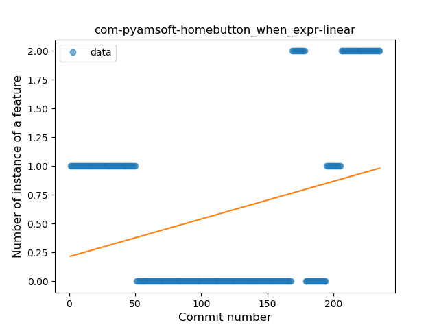
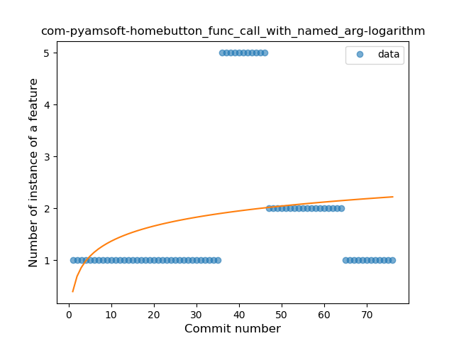
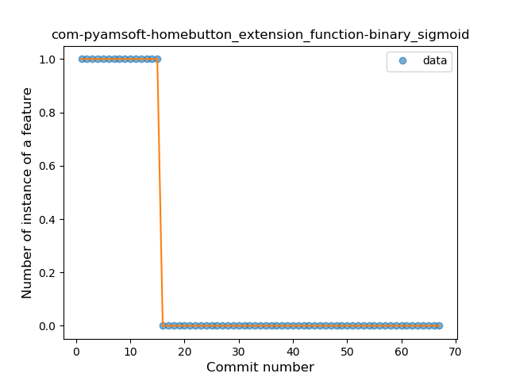

## com-pyamsoft-homebutton
----
#### Metrics provided by Detekt
* Number of lines of code 1096
* Number of Kotlin files: 17
* Cyclomatic complexity: 58
* Cyclomatic complexity by thousands of lines: 147 

----
**13** features analyzed

*	<a href="#type_inference">Type Inference</a> 
*	<a href="#lambda">Lambda</a> 
*	<a href="#safe_call">Safe Call</a> 
*	<a href="#when_expr">When expression</a> 
*	<a href="#unsafe_call">Unsafe Call</a> 
*	<a href="#companion_object">Companion Object</a> 
*	<a href="#singleton">Singleton</a> 
*	<a href="#smart_cast">Smart Cast</a> 
*	<a href="#data_class">Data Class</a> 
*	<a href="#func_call_with_named_arg">Function call with Named Argument</a> 
*	<a href="#extension_function">Extension Function</a> 
*	<a href="#property_delegation">Property Delegation</a> 
*	<a href="#sealed_class">Sealed Class</a> 

### <a name="type_inference">Type Inference</a>
----
#### Functions
* **Sudden Rise - Exponential:** 
    * **R_Squared:** 0.82061756
* **Constant Rise - Linear:** 
    * **R_Squared:** 0.76038223
* **Sudden Rise Plateau - Logarithm:** 
    * **R_Squared:** 0.43961967

**Plots** :chart_with_upwards_trend:
-----

### <a name="lambda">Lambda</a>
----
#### Functions
* **Constant Rise - Linear:** 
    * **R_Squared:** 0.90090865
* **Sudden Rise Plateau - Logarithm:** 
    * **R_Squared:** 0.50680604
* **Plateau Gradual Rise - Sigmoid:** 
    * **R_Squared:** 0.09885864

**Plots** :chart_with_upwards_trend:
-----

### <a name="safe_call">Safe Call</a>
----
#### Functions
* **Plateau Gradual Rise - Sigmoid:** 
    * **R_Squared:** 0.73789277
* **Sudden Rise - Exponential:** 
    * **R_Squared:** 0.53369517
* **Constant Rise - Linear:** 
    * **R_Squared:** 0.44152111
* **Sudden Rise Plateau - Logarithm:** 
    * **R_Squared:** 0.29314303

**Plots** :chart_with_upwards_trend:
-----

### <a name="when_expr">When expression</a>
----
#### Functions
* **Sudden Rise - Exponential:** 
    * **R_Squared:** 0.44246278
* **Constant Rise - Linear:** 
    * **R_Squared:** 0.08480887
* **Sudden Rise Plateau - Logarithm:** 
    * **R_Squared:** 0.00022935

**Plots** :chart_with_upwards_trend:
-----

### <a name="unsafe_call">Unsafe Call</a>
----
#### Functions
* **Sudden Decline - Exponential:** 
    * **R_Squared:** 0.87776072
* **Plateau Gradual Decline - Sigmoid:** 
    * **R_Squared:** 0.88375494
* **Constant Decline - Linear:** 
    * **R_Squared:** 0.61726767
* **Sudden Rise Plateau - Logarithm:** 
    * **R_Squared:** -0.0

**Plots** :chart_with_upwards_trend:
-----

### <a name="companion_object">Companion Object</a>
----
#### Functions
* **Plateau Gradual Rise - Sigmoid:** 
    * **R_Squared:** 0.81268553
* **Constant Rise - Linear:** 
    * **R_Squared:** 0.66071836
* **Sudden Rise Plateau - Logarithm:** 
    * **R_Squared:** 0.60981955

**Plots** :chart_with_upwards_trend:
-----

### <a name="singleton">Singleton</a>
----
#### Functions
* **Plateau Sudden Decline - Binary Sigmoid:** 
    * **R_Squared:** 0.51599587
* **Sudden Decline - Exponential:** 
    * **R_Squared:** 0.36349452
* **Constant Decline - Linear:** 
    * **R_Squared:** 0.17519975
* **Sudden Rise Plateau - Logarithm:** 
    * **R_Squared:** -0.0

**Plots** :chart_with_upwards_trend:
-----

### <a name="smart_cast">Smart Cast</a>
----
#### Functions
* **Plateau Gradual Rise - Sigmoid:** 
    * **R_Squared:** 0.69750561
* **Sudden Rise - Exponential:** 
    * **R_Squared:** 0.65076263
* **Constant Rise - Linear:** 
    * **R_Squared:** 0.4808526
* **Sudden Rise Plateau - Logarithm:** 
    * **R_Squared:** 0.25740489

**Plots** :chart_with_upwards_trend:
-----

### <a name="data_class">Data Class</a>
----
#### Functions
* **Instability - Polinomial 3:** )
    * **R_Squared:** 0.46733735
* **Constant Rise - Linear:** 
    * **R_Squared:** 0.32537464
* **Sudden Rise Plateau - Logarithm:** 
    * **R_Squared:** 0.24888445

**Plots** :chart_with_upwards_trend:
-----

### <a name="func_call_with_named_arg">Function call with Named Argument</a>
----
#### Functions
* **Sudden Rise Plateau - Logarithm:** 
    * **R_Squared:** 0.07784699
* **Constant Rise - Linear:** 
    * **R_Squared:** 0.03299054

**Plots** :chart_with_upwards_trend:
-----

### <a name="extension_function">Extension Function</a>
----
#### Functions
* **Plateau Sudden Decline - Binary Sigmoid:** 
    * **R_Squared:** 1.0
* **Sudden Decline - Exponential:** 
    * **R_Squared:** 0.77495832
* **Constant Decline - Linear:** 
    * **R_Squared:** 0.52139037
* **Sudden Rise Plateau - Logarithm:** 
    * **R_Squared:** 0.0

**Plots** :chart_with_upwards_trend:
-----

### <a name="property_delegation">Property Delegation</a>
----
#### Functions
* **Plateau Gradual Rise - Sigmoid:** 
    * **R_Squared:** 0.98189496
* **Constant Rise - Linear:** 
    * **R_Squared:** 0.82777747
* **Sudden Rise - Exponential:** 
    * **R_Squared:** 0.83384379
* **Sudden Rise Plateau - Logarithm:** 
    * **R_Squared:** 0.42859141

**Plots** :chart_with_upwards_trend:
-----

### <a name="sealed_class">Sealed Class</a>
----
#### Functions
* **Instability - Polinomial 3:** )
    * **R_Squared:** 0.76655206
* **Sudden Rise - Exponential:** 
    * **R_Squared:** 0.28685823
* **Constant Rise - Linear:** 
    * **R_Squared:** 0.22589542
* **Sudden Rise Plateau - Logarithm:** 
    * **R_Squared:** 0.0340011

**Plots** :chart_with_upwards_trend:
-----

