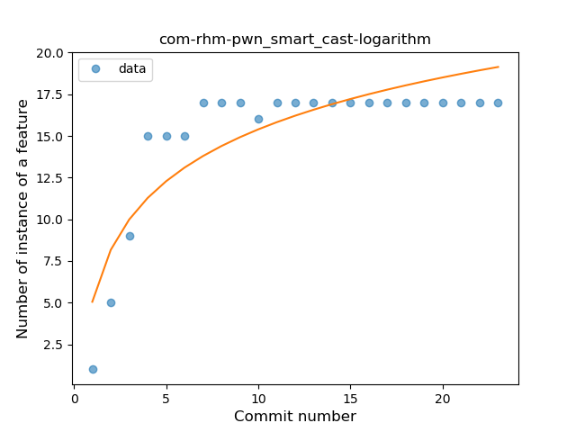

## com-rhm-pwn
----
#### Metrics provided by Detekt
* Number of lines of code 1495
* Number of Kotlin files: 23
* Cyclomatic complexity: 191
* Cyclomatic complexity by thousands of lines: 232 

----
**13** features analyzed

*	<a href="#type_inference">Type Inference</a> 
*	<a href="#lambda">Lambda</a> 
*	<a href="#safe_call">Safe Call</a> 
*	<a href="#when_expr">When expression</a> 
*	<a href="#unsafe_call">Unsafe Call</a> 
*	<a href="#companion_object">Companion Object</a> 
*	<a href="#string_template">String Template</a> 
*	<a href="#func_with_default_value">Function with Default Value</a> 
*	<a href="#singleton">Singleton</a> 
*	<a href="#smart_cast">Smart Cast</a> 
*	<a href="#data_class">Data Class</a> 
*	<a href="#func_call_with_named_arg">Function call with Named Argument</a> 
*	<a href="#sealed_class">Sealed Class</a> 

### <a name="type_inference">Type Inference</a>
----
#### Functions
* **Plateau Gradual Rise - Sigmoid:** 
    * **R_Squared:** 0.9622561
* **Instability - Polinomial 3:** )
    * **R_Squared:** 0.94137425
* **Instability - Polinomial 4:** 
    * **R_Squared:** 0.94428388
* **Constant Rise - Linear:** 
    * **R_Squared:** 0.83922187
* **Sudden Rise - Exponential:** 
    * **R_Squared:** 0.84240907
* **Sudden Rise Plateau - Logarithm:** 
    * **R_Squared:** 0.3980543

**Plots** :chart_with_upwards_trend:
-----

### <a name="lambda">Lambda</a>
----
#### Functions
* **Plateau Gradual Rise - Sigmoid:** 
    * **R_Squared:** 0.99315738
* **Instability - Polinomial 3:** )
    * **R_Squared:** 0.9408097
* **Constant Rise - Linear:** 
    * **R_Squared:** 0.8324569
* **Sudden Rise - Exponential:** 
    * **R_Squared:** 0.83424075
* **Sudden Rise Plateau - Logarithm:** 
    * **R_Squared:** 0.41451493

**Plots** :chart_with_upwards_trend:
-----

### <a name="safe_call">Safe Call</a>
----
#### Functions
* **Plateau Gradual Rise - Sigmoid:** 
    * **R_Squared:** 0.96095783
* **Instability - Polinomial 4:** 
    * **R_Squared:** 0.85627118
* **Sudden Rise Plateau - Logarithm:** 
    * **R_Squared:** 0.7149634
* **Constant Rise - Linear:** 
    * **R_Squared:** 0.63204309

**Plots** :chart_with_upwards_trend:
-----

### <a name="when_expr">When expression</a>
----
#### Functions
* **Plateau Gradual Rise - Sigmoid:** 
    * **R_Squared:** 0.98921433
* **Instability - Polinomial 3:** )
    * **R_Squared:** 0.9178756
* **Sudden Rise - Exponential:** 
    * **R_Squared:** 0.82218235
* **Constant Rise - Linear:** 
    * **R_Squared:** 0.81192507
* **Sudden Rise Plateau - Logarithm:** 
    * **R_Squared:** 0.44074833

**Plots** :chart_with_upwards_trend:
-----

### <a name="unsafe_call">Unsafe Call</a>
----
#### Functions
* **Instability - Polinomial 3:** )
    * **R_Squared:** 0.81728875
* **Sudden Rise Plateau - Logarithm:** 
    * **R_Squared:** 0.65044764
* **Constant Rise - Linear:** 
    * **R_Squared:** 0.37912088

**Plots** :chart_with_upwards_trend:
-----

### <a name="companion_object">Companion Object</a>
----
#### Functions
* **Plateau Gradual Rise - Sigmoid:** 
    * **R_Squared:** 0.9912083
* **Instability - Polinomial 3:** )
    * **R_Squared:** 0.91059333
* **Constant Rise - Linear:** 
    * **R_Squared:** 0.79920322
* **Sudden Rise Plateau - Logarithm:** 
    * **R_Squared:** 0.45760337

**Plots** :chart_with_upwards_trend:
-----

### <a name="string_template">String Template</a>
----
#### Functions
* **Plateau Gradual Rise - Sigmoid:** 
    * **R_Squared:** 0.96836023
* **Instability - Polinomial 4:** 
    * **R_Squared:** 0.96095198
* **Sudden Rise - Exponential:** 
    * **R_Squared:** 0.87856506
* **Constant Rise - Linear:** 
    * **R_Squared:** 0.8316474
* **Sudden Rise Plateau - Logarithm:** 
    * **R_Squared:** 0.39869338

**Plots** :chart_with_upwards_trend:
-----

### <a name="func_with_default_value">Function with Default Value</a>
----
#### Functions
* **Plateau Gradual Rise - Sigmoid:** 
    * **R_Squared:** 0.97409963
* **Instability - Polinomial 3:** )
    * **R_Squared:** 0.90517485
* **Constant Rise - Linear:** 
    * **R_Squared:** 0.77595465
* **Sudden Rise Plateau - Logarithm:** 
    * **R_Squared:** 0.53127221

**Plots** :chart_with_upwards_trend:
-----

### <a name="singleton">Singleton</a>
----
#### Functions
* **Instability - Polinomial 4:** 
    * **R_Squared:** 0.94583593
* **Instability - Polinomial 3:** )
    * **R_Squared:** 0.73612561
* **Sudden Rise Plateau - Logarithm:** 
    * **R_Squared:** 0.24356082
* **Constant Rise - Linear:** 
    * **R_Squared:** 0.03952569

**Plots** :chart_with_upwards_trend:
-----

### <a name="smart_cast">Smart Cast</a>
----
#### Functions
* **Instability - Polinomial 4:** 
    * **R_Squared:** 0.97277758
* **Instability - Polinomial 3:** )
    * **R_Squared:** 0.92786592
* **Sudden Rise Plateau - Logarithm:** 
    * **R_Squared:** 0.76447769
* **Constant Rise - Linear:** 
    * **R_Squared:** 0.42291364

**Plots** :chart_with_upwards_trend:
-----

### <a name="data_class">Data Class</a>
----
#### Functions
* **Plateau Gradual Rise - Sigmoid:** 
    * **R_Squared:** 0.99715684
* **Instability - Polinomial 4:** 
    * **R_Squared:** 0.91336941
* **Instability - Polinomial 3:** )
    * **R_Squared:** 0.89457034
* **Sudden Rise - Exponential:** 
    * **R_Squared:** 0.794289
* **Constant Rise - Linear:** 
    * **R_Squared:** 0.78091067
* **Sudden Rise Plateau - Logarithm:** 
    * **R_Squared:** 0.35237582

**Plots** :chart_with_upwards_trend:
-----

### <a name="func_call_with_named_arg">Function call with Named Argument</a>
----
#### Functions
* **Instability - Polinomial 4:** 
    * **R_Squared:** 0.93710768
* **Instability - Polinomial 3:** )
    * **R_Squared:** 0.90957778
* **Sudden Rise Plateau - Logarithm:** 
    * **R_Squared:** 0.7985124
* **Constant Rise - Linear:** 
    * **R_Squared:** 0.48513736

**Plots** :chart_with_upwards_trend:
-----

### <a name="sealed_class">Sealed Class</a>
----
#### Functions
* **Instability - Polinomial 3:** )
    * **R_Squared:** 0.85059652
* **Sudden Rise Plateau - Logarithm:** 
    * **R_Squared:** 0.83015134
* **Constant Rise - Linear:** 
    * **R_Squared:** 0.54617751

**Plots** :chart_with_upwards_trend:
-----

