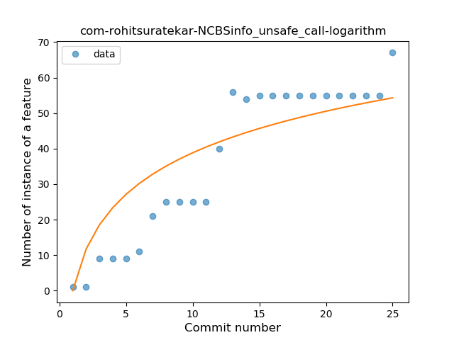
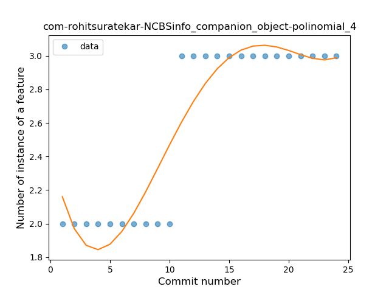
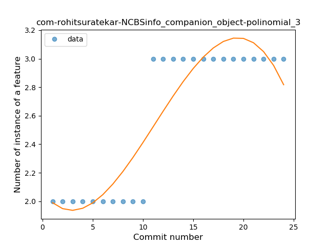
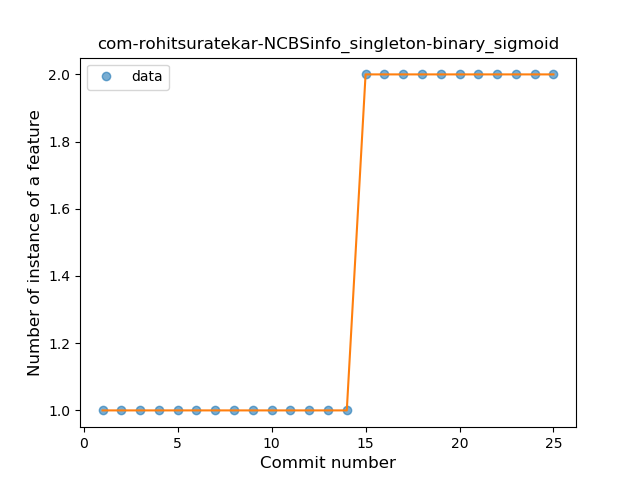
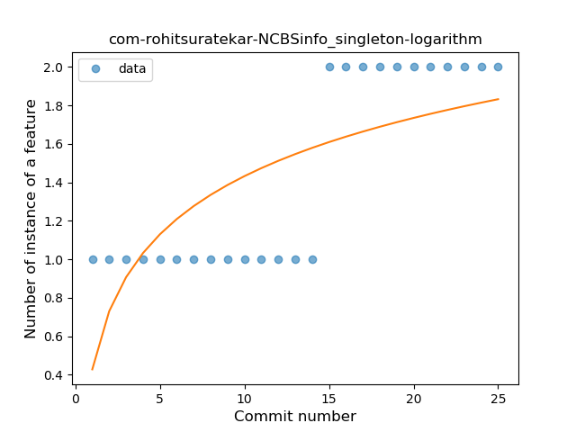
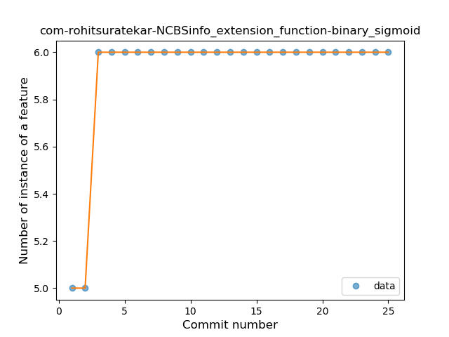

## com-rohitsuratekar-NCBSinfo
----
#### Metrics provided by Detekt
* Number of lines of code 7178
* Number of Kotlin files: 82
* Cyclomatic complexity: 977
* Cyclomatic complexity by thousands of lines: 238 

----
**13** features analyzed

*	<a href="#type_inference">Type Inference</a> 
*	<a href="#lambda">Lambda</a> 
*	<a href="#safe_call">Safe Call</a> 
*	<a href="#when_expr">When expression</a> 
*	<a href="#unsafe_call">Unsafe Call</a> 
*	<a href="#companion_object">Companion Object</a> 
*	<a href="#string_template">String Template</a> 
*	<a href="#func_with_default_value">Function with Default Value</a> 
*	<a href="#singleton">Singleton</a> 
*	<a href="#range_expr">Range Expression</a> 
*	<a href="#smart_cast">Smart Cast</a> 
*	<a href="#data_class">Data Class</a> 
*	<a href="#extension_function">Extension Function</a> 

### <a name="type_inference">Type Inference</a>
----
#### Functions
* **Constant Rise - Linear:** 
    * **R_Squared:** 0.90126728
* **Sudden Rise Plateau - Logarithm:** 
    * **R_Squared:** 0.85059414

**Plots** :chart_with_upwards_trend:
-----

### <a name="lambda">Lambda</a>
----
#### Functions
* **Instability - Polinomial 4:** 
    * **R_Squared:** 0.98132381
* **Constant Rise - Linear:** 
    * **R_Squared:** 0.89753682
* **Sudden Rise Plateau - Logarithm:** 
    * **R_Squared:** 0.75998416

**Plots** :chart_with_upwards_trend:
-----

### <a name="safe_call">Safe Call</a>
----
#### Functions
* **Instability - Polinomial 4:** 
    * **R_Squared:** 0.96475439
* **Constant Rise - Linear:** 
    * **R_Squared:** 0.87446445
* **Sudden Rise Plateau - Logarithm:** 
    * **R_Squared:** 0.79703779

**Plots** :chart_with_upwards_trend:
-----

### <a name="when_expr">When expression</a>
----
#### Functions
* **Instability - Polinomial 4:** 
    * **R_Squared:** 0.97111123
* **Constant Rise - Linear:** 
    * **R_Squared:** 0.89129098
* **Sudden Rise Plateau - Logarithm:** 
    * **R_Squared:** 0.75275506
* **Plateau Sudden Rise - Binary Sigmoid:** 
    * **R_Squared:** 0.44447531

**Plots** :chart_with_upwards_trend:
-----

### <a name="unsafe_call">Unsafe Call</a>
----
#### Functions
* **Constant Rise - Linear:** 
    * **R_Squared:** 0.87335038
* **Sudden Rise Plateau - Logarithm:** 
    * **R_Squared:** 0.76285536

**Plots** :chart_with_upwards_trend:
-----

### <a name="companion_object">Companion Object</a>
----
#### Functions
* **Plateau Sudden Rise - Binary Sigmoid:** 
    * **R_Squared:** 1.0
* **Instability - Polinomial 4:** 
    * **R_Squared:** 0.8747245
* **Instability - Polinomial 3:** )
    * **R_Squared:** 0.84399176
* **Constant Rise - Linear:** 
    * **R_Squared:** 0.73043478
* **Sudden Rise Plateau - Logarithm:** 
    * **R_Squared:** 0.64450298

**Plots** :chart_with_upwards_trend:
-----

### <a name="string_template">String Template</a>
----
#### Functions
* **Instability - Polinomial 4:** 
    * **R_Squared:** 0.92758373
* **Constant Rise - Linear:** 
    * **R_Squared:** 0.80817133
* **Sudden Rise Plateau - Logarithm:** 
    * **R_Squared:** 0.80080817

**Plots** :chart_with_upwards_trend:
-----

### <a name="func_with_default_value">Function with Default Value</a>
----
#### Functions
* **Plateau Sudden Rise - Binary Sigmoid:** 
    * **R_Squared:** 1.0
* **Instability - Polinomial 3:** )
    * **R_Squared:** 0.8229566
* **Sudden Rise Plateau - Logarithm:** 
    * **R_Squared:** 0.64936939
* **Constant Rise - Linear:** 
    * **R_Squared:** 0.38345865

**Plots** :chart_with_upwards_trend:
-----

### <a name="singleton">Singleton</a>
----
#### Functions
* **Plateau Sudden Rise - Binary Sigmoid:** 
    * **R_Squared:** 1.0
* **Instability - Polinomial 3:** )
    * **R_Squared:** 0.85191379
* **Sudden Rise - Exponential:** 
    * **R_Squared:** 0.7524815
* **Constant Rise - Linear:** 
    * **R_Squared:** 0.74038462
* **Sudden Rise Plateau - Logarithm:** 
    * **R_Squared:** 0.51658721

**Plots** :chart_with_upwards_trend:
-----

### <a name="range_expr">Range Expression</a>
----
#### Functions
* **Plateau Gradual Rise - Sigmoid:** 
    * **R_Squared:** 0.97985724
* **Instability - Polinomial 4:** 
    * **R_Squared:** 0.91793636
* **Constant Rise - Linear:** 
    * **R_Squared:** 0.79653866
* **Sudden Rise Plateau - Logarithm:** 
    * **R_Squared:** 0.70030111

**Plots** :chart_with_upwards_trend:
-----

### <a name="smart_cast">Smart Cast</a>
----
#### Functions
* **Plateau Gradual Rise - Sigmoid:** 
    * **R_Squared:** 0.89423845
* **Instability - Polinomial 4:** 
    * **R_Squared:** 0.88409325
* **Sudden Rise Plateau - Logarithm:** 
    * **R_Squared:** 0.78506129
* **Constant Rise - Linear:** 
    * **R_Squared:** 0.69338352

**Plots** :chart_with_upwards_trend:
-----

### <a name="data_class">Data Class</a>
----
#### Functions
* **Instability - Polinomial 4:** 
    * **R_Squared:** 0.96272004
* **Plateau Gradual Rise - Sigmoid:** 
    * **R_Squared:** 0.94157227
* **Instability - Polinomial 3:** )
    * **R_Squared:** 0.90622051
* **Constant Rise - Linear:** 
    * **R_Squared:** 0.84795529
* **Sudden Rise Plateau - Logarithm:** 
    * **R_Squared:** 0.67790293

**Plots** :chart_with_upwards_trend:
-----

### <a name="extension_function">Extension Function</a>
----
#### Functions
* **Plateau Sudden Rise - Binary Sigmoid:** 
    * **R_Squared:** 1.0
* **Instability - Polinomial 4:** 
    * **R_Squared:** 0.8135868
* **Instability - Polinomial 3:** )
    * **R_Squared:** 0.69444444
* **Sudden Rise Plateau - Logarithm:** 
    * **R_Squared:** 0.50689939
* **Constant Rise - Linear:** 
    * **R_Squared:** 0.22115385

**Plots** :chart_with_upwards_trend:
-----

