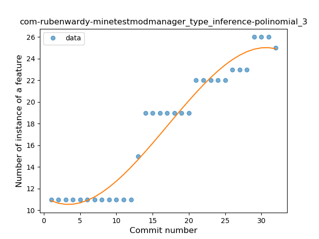
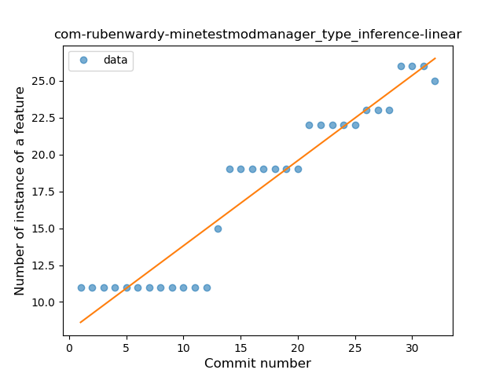
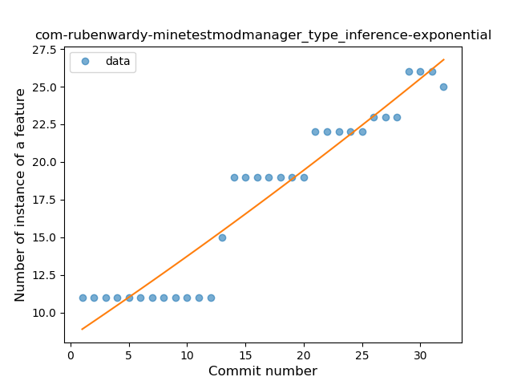
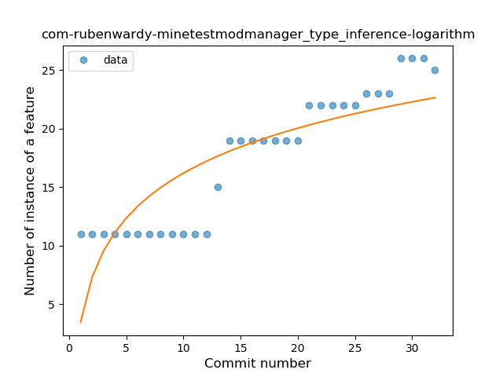
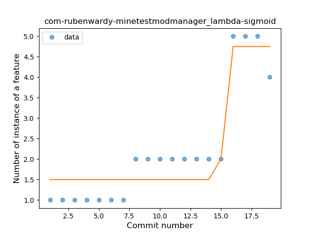
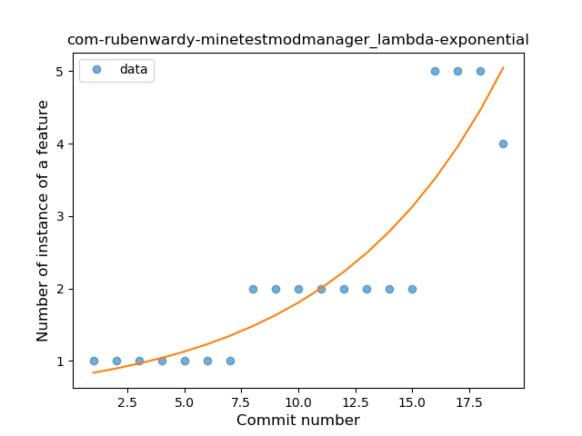
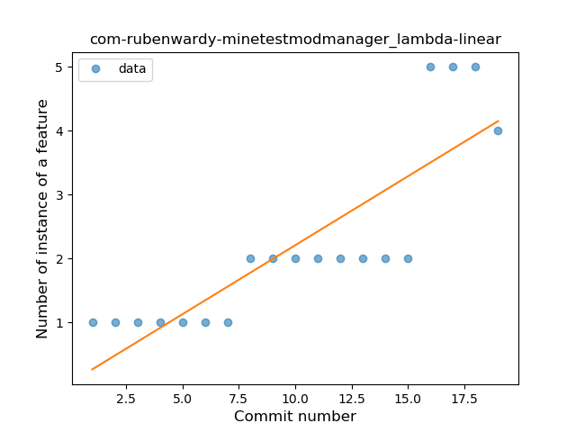
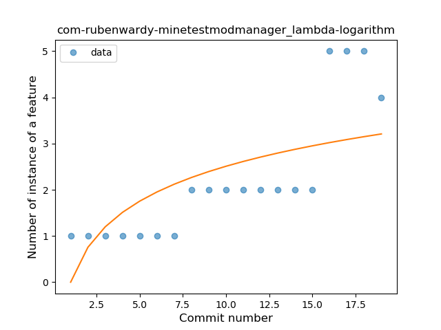
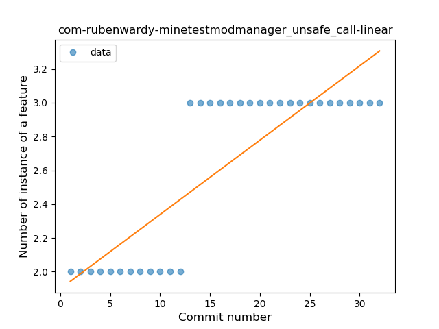
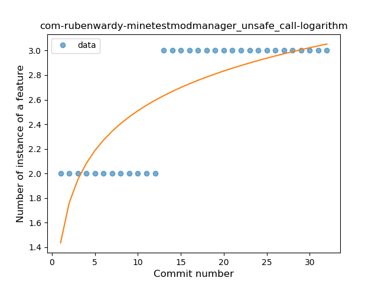

## com-rubenwardy-minetestmodmanager
----
#### Metrics provided by Detekt
* Number of lines of code 305
* Number of Kotlin files: 5
* Cyclomatic complexity: 54
* Cyclomatic complexity by thousands of lines: 335 

----
**3** features analyzed

*	<a href="#type_inference">Type Inference</a> 
*	<a href="#lambda">Lambda</a> 
*	<a href="#unsafe_call">Unsafe Call</a> 

### <a name="type_inference">Type Inference</a>
----
#### Functions
* **Instability - Polinomial 3:** )
    * **R_Squared:** 0.93952943
* **Constant Rise - Linear:** 
    * **R_Squared:** 0.91376248
* **Sudden Rise - Exponential:** 
    * **R_Squared:** 0.91449887
* **Sudden Rise Plateau - Logarithm:** 
    * **R_Squared:** 0.70171652

**Plots** :chart_with_upwards_trend:
-----

### <a name="lambda">Lambda</a>
----
#### Functions
* **Plateau Gradual Rise - Sigmoid:** 
    * **R_Squared:** 0.88562323
* **Sudden Rise - Exponential:** 
    * **R_Squared:** 0.79737749
* **Constant Rise - Linear:** 
    * **R_Squared:** 0.71430595
* **Sudden Rise Plateau - Logarithm:** 
    * **R_Squared:** 0.4784512

**Plots** :chart_with_upwards_trend:
-----

### <a name="unsafe_call">Unsafe Call</a>
----
#### Functions
* **Plateau Sudden Rise - Binary Sigmoid:** 
    * **R_Squared:** 1.0
* **Constant Rise - Linear:** 
    * **R_Squared:** 0.70381232
* **Sudden Rise Plateau - Logarithm:** 
    * **R_Squared:** 0.65939568

**Plots** :chart_with_upwards_trend:
-----

