## com-ruuvi-station
----
#### Metrics provided by Detekt
* Number of lines of code 1986
* Number of Kotlin files: 18
* Cyclomatic complexity: 291
* Cyclomatic complexity by thousands of lines: 251 

----
**7** features analyzed

*	<a href="#type_inference">Type Inference</a> 
*	<a href="#lambda">Lambda</a> 
*	<a href="#safe_call">Safe Call</a> 
*	<a href="#when_expr">When expression</a> 
*	<a href="#unsafe_call">Unsafe Call</a> 
*	<a href="#companion_object">Companion Object</a> 
*	<a href="#range_expr">Range Expression</a> 

### <a name="type_inference">Type Inference</a>
----
#### Functions
* **Constant Rise - Linear:** 
    * **R_Squared:** 0.96637608
* **Sudden Rise - Exponential:** 
    * **R_Squared:** 0.96663005
* **Sudden Rise Plateau - Logarithm:** 
    * **R_Squared:** 0.44305715
* **Plateau Sudden Rise - Binary Sigmoid:** 
    * **R_Squared:** 0.34706426

**Plots** :chart_with_upwards_trend:
-----

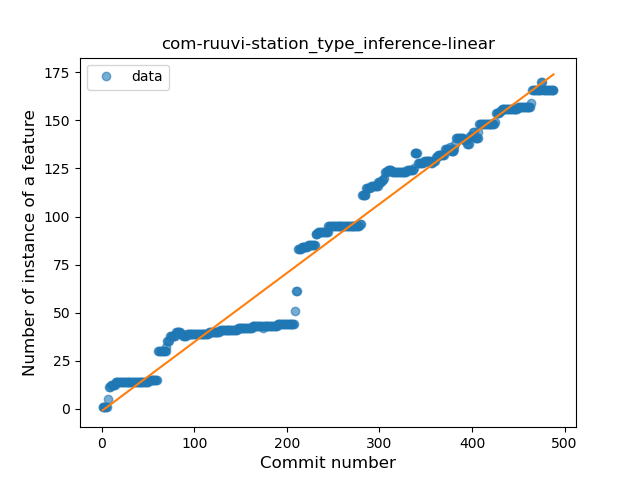
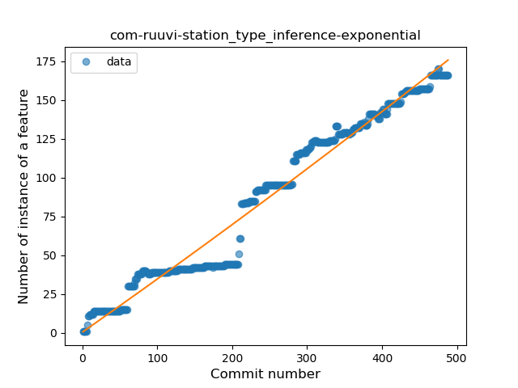
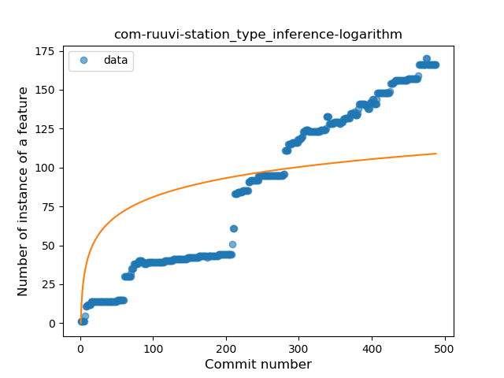
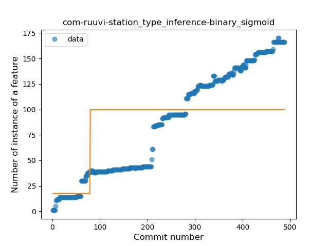
### <a name="lambda">Lambda</a>
----
#### Functions
* **Constant Rise - Linear:** 
    * **R_Squared:** 0.90679046
* **Sudden Rise Plateau - Logarithm:** 
    * **R_Squared:** 0.37700267
* **Plateau Sudden Rise - Binary Sigmoid:** 
    * **R_Squared:** 0.11961875

**Plots** :chart_with_upwards_trend:
-----

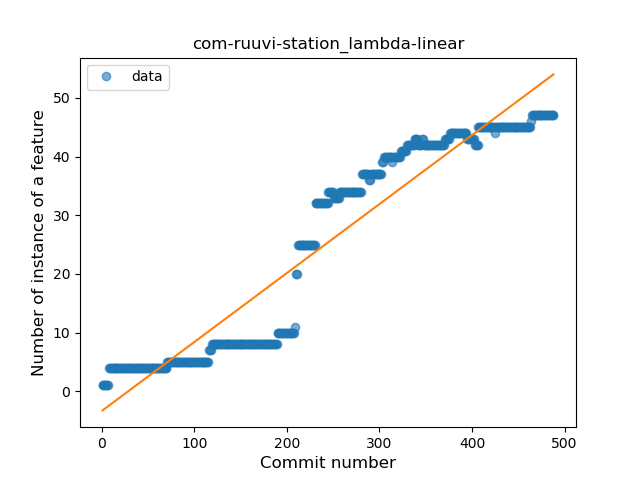
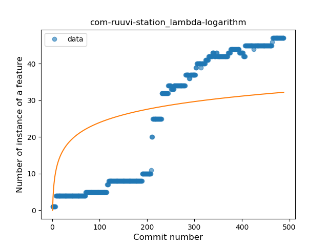
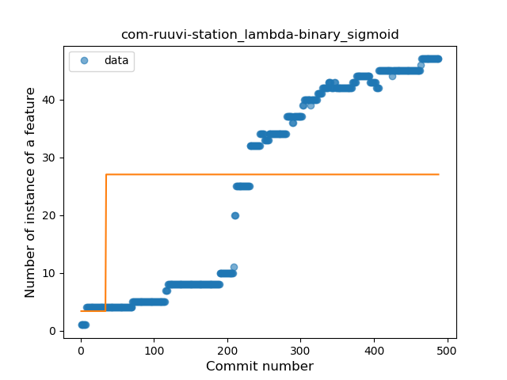
### <a name="safe_call">Safe Call</a>
----
#### Functions
* **Constant Rise - Linear:** 
    * **R_Squared:** 0.61636272
* **Sudden Rise Plateau - Logarithm:** 
    * **R_Squared:** 0.36671439

**Plots** :chart_with_upwards_trend:
-----

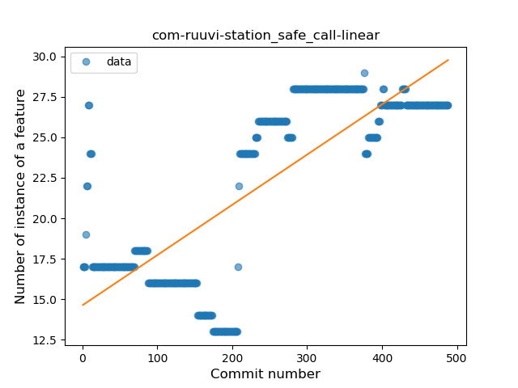
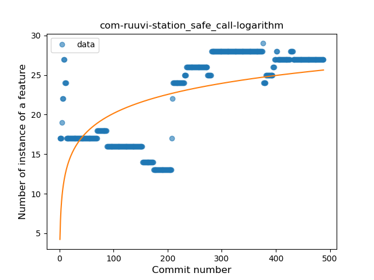
### <a name="when_expr">When expression</a>
----
#### Functions
* **Sudden Rise - Exponential:** 
    * **R_Squared:** 0.95068611
* **Plateau Gradual Rise - Sigmoid:** 
    * **R_Squared:** 0.95589288
* **Constant Rise - Linear:** 
    * **R_Squared:** 0.88915464
* **Sudden Rise Plateau - Logarithm:** 
    * **R_Squared:** 0.37954543

**Plots** :chart_with_upwards_trend:
-----

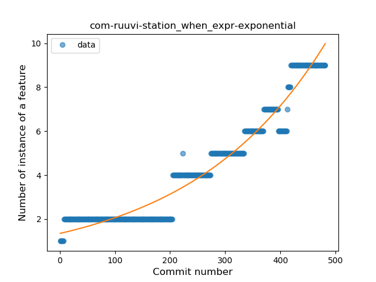
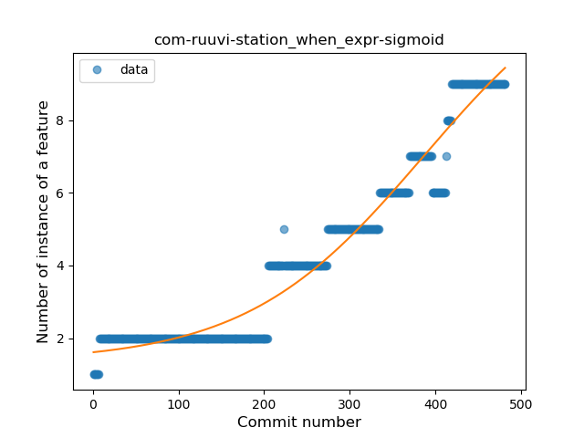
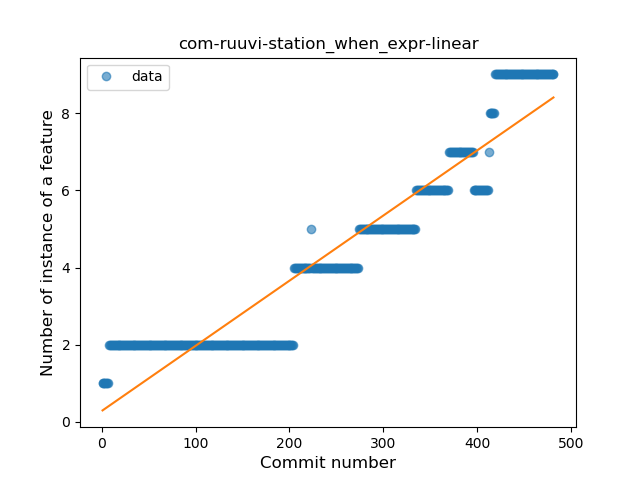
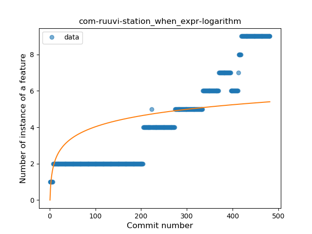
### <a name="unsafe_call">Unsafe Call</a>
----
#### Functions
* **Constant Rise - Linear:** 
    * **R_Squared:** 0.89439231
* **Sudden Rise Plateau - Logarithm:** 
    * **R_Squared:** 0.72882973
* **Plateau Sudden Rise - Binary Sigmoid:** 
    * **R_Squared:** 0.08978947

**Plots** :chart_with_upwards_trend:
-----

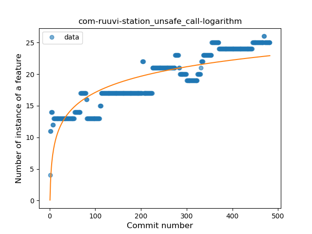
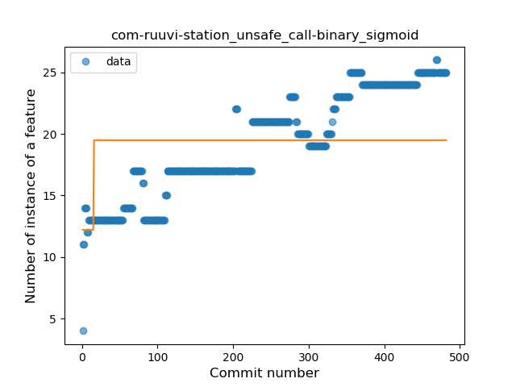
### <a name="companion_object">Companion Object</a>
----
#### Functions
* **Plateau Gradual Rise - Sigmoid:** 
    * **R_Squared:** 0.97549384
* **Sudden Rise - Exponential:** 
    * **R_Squared:** 0.8956754
* **Constant Rise - Linear:** 
    * **R_Squared:** 0.87937083
* **Sudden Rise Plateau - Logarithm:** 
    * **R_Squared:** 0.36296578

**Plots** :chart_with_upwards_trend:
-----

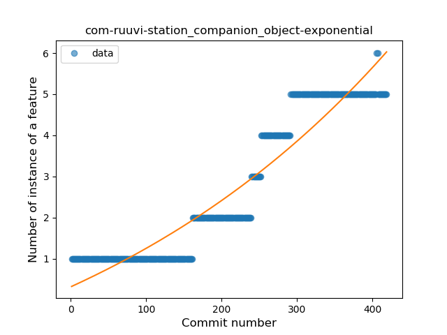
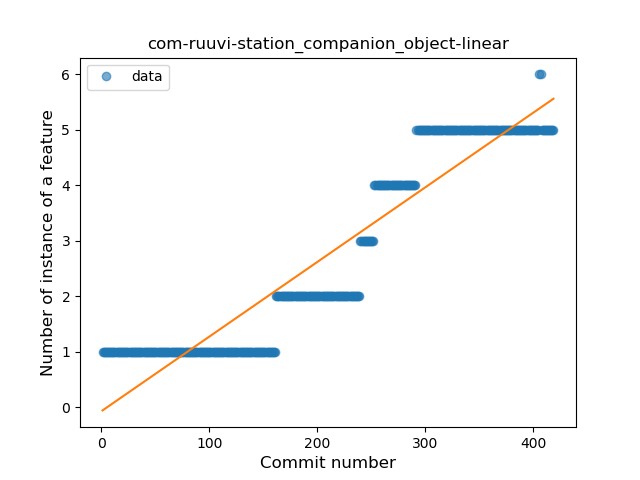
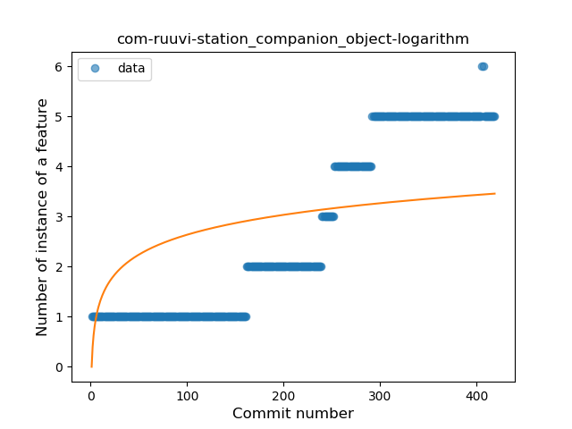
### <a name="range_expr">Range Expression</a>
----
#### Functions
* **Plateau Sudden Rise - Binary Sigmoid:** 
    * **R_Squared:** 1.0
* **Sudden Rise Plateau - Logarithm:** 
    * **R_Squared:** 0.66085798
* **Constant Rise - Linear:** 
    * **R_Squared:** 0.44526902

**Plots** :chart_with_upwards_trend:
-----

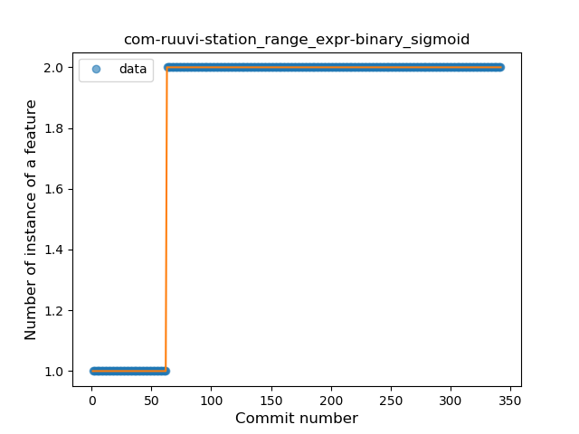
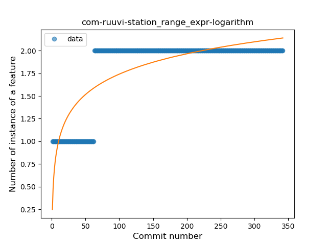
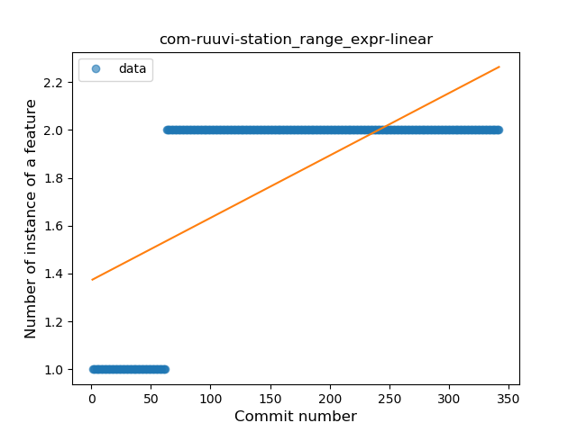
