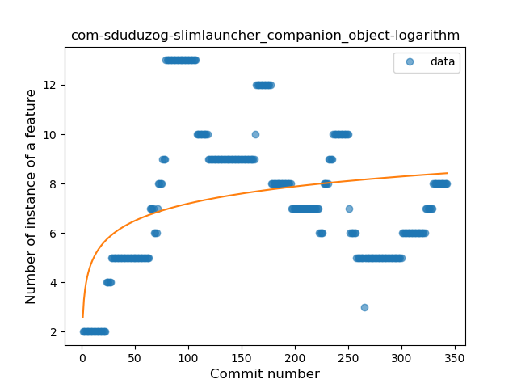
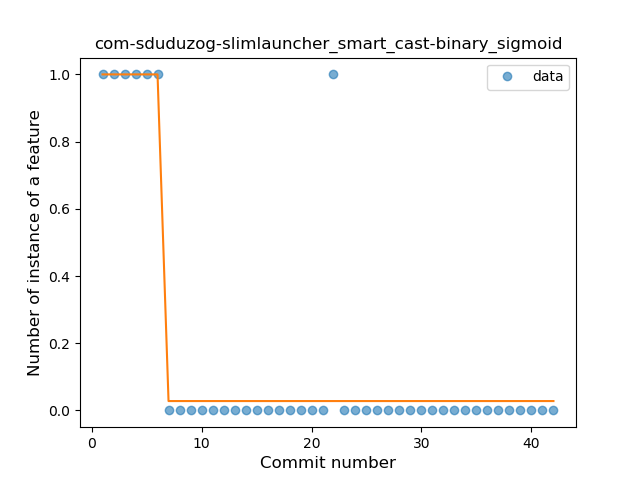
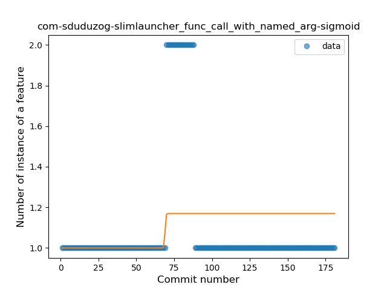
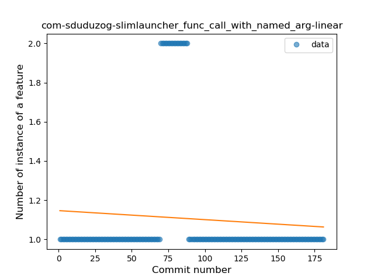
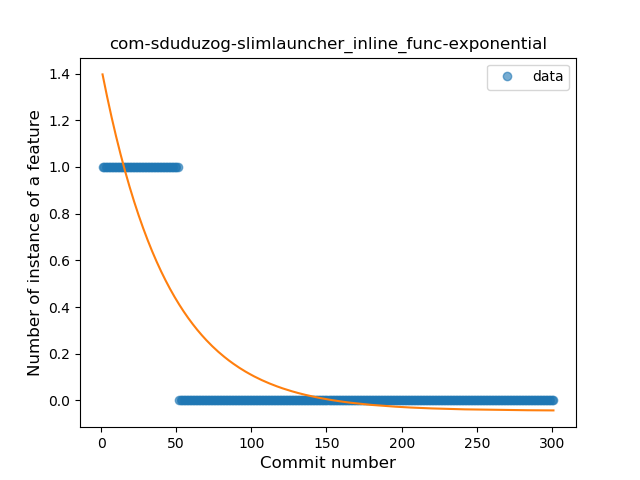

## com-sduduzog-slimlauncher
----
#### Metrics provided by Detekt
* Number of lines of code 1789
* Number of Kotlin files: 40
* Cyclomatic complexity: 230
* Cyclomatic complexity by thousands of lines: 269 

----
**14** features analyzed

*	<a href="#type_inference">Type Inference</a> 
*	<a href="#lambda">Lambda</a> 
*	<a href="#safe_call">Safe Call</a> 
*	<a href="#when_expr">When expression</a> 
*	<a href="#unsafe_call">Unsafe Call</a> 
*	<a href="#companion_object">Companion Object</a> 
*	<a href="#string_template">String Template</a> 
*	<a href="#func_with_default_value">Function with Default Value</a> 
*	<a href="#singleton">Singleton</a> 
*	<a href="#range_expr">Range Expression</a> 
*	<a href="#smart_cast">Smart Cast</a> 
*	<a href="#data_class">Data Class</a> 
*	<a href="#func_call_with_named_arg">Function call with Named Argument</a> 
*	<a href="#inline_func">Inline Function</a> 

### <a name="type_inference">Type Inference</a>
----
#### Functions
* **Plateau Sudden Rise - Binary Sigmoid:** 
    * **R_Squared:** 0.4679746
* **Sudden Rise Plateau - Logarithm:** 
    * **R_Squared:** 0.28059411
* **Constant Rise - Linear:** 
    * **R_Squared:** 0.07364355

**Plots** :chart_with_upwards_trend:
-----

### <a name="lambda">Lambda</a>
----
#### Functions
* **Sudden Rise Plateau - Logarithm:** 
    * **R_Squared:** 0.45962116
* **Constant Rise - Linear:** 
    * **R_Squared:** 0.31981683
* **Plateau Sudden Rise - Binary Sigmoid:** 
    * **R_Squared:** 0.29182766

**Plots** :chart_with_upwards_trend:
-----

### <a name="safe_call">Safe Call</a>
----
#### Functions
* **Plateau Sudden Rise - Binary Sigmoid:** 
    * **R_Squared:** 0.57090066
* **Constant Rise - Linear:** 
    * **R_Squared:** 0.40830174
* **Sudden Rise Plateau - Logarithm:** 
    * **R_Squared:** 0.23833774

**Plots** :chart_with_upwards_trend:
-----

### <a name="when_expr">When expression</a>
----
#### Functions
* **Plateau Gradual Rise - Sigmoid:** 
    * **R_Squared:** 0.42003007
* **Sudden Rise Plateau - Logarithm:** 
    * **R_Squared:** 0.23363915
* **Constant Rise - Linear:** 
    * **R_Squared:** 0.04513548

**Plots** :chart_with_upwards_trend:
-----

### <a name="unsafe_call">Unsafe Call</a>
----
#### Functions
* **Sudden Rise Plateau - Logarithm:** 
    * **R_Squared:** 0.36545583
* **Constant Rise - Linear:** 
    * **R_Squared:** 0.15640498

**Plots** :chart_with_upwards_trend:
-----

### <a name="companion_object">Companion Object</a>
----
#### Functions
* **Sudden Rise Plateau - Logarithm:** 
    * **R_Squared:** 0.11534645
* **Constant Rise - Linear:** 
    * **R_Squared:** 0.00103867
* **Sudden Rise - Exponential:** 
    * **R_Squared:** 0.00042765

**Plots** :chart_with_upwards_trend:
-----

### <a name="string_template">String Template</a>
----
#### Functions
* **Plateau Gradual Rise - Sigmoid:** 
    * **R_Squared:** 0.34445407
* **Sudden Rise Plateau - Logarithm:** 
    * **R_Squared:** 0.24076662
* **Constant Rise - Linear:** 
    * **R_Squared:** 0.22961895

**Plots** :chart_with_upwards_trend:
-----

### <a name="func_with_default_value">Function with Default Value</a>
----
#### Functions
* **Constant Rise - Linear:** 
    * **R_Squared:** 0.69865615
* **Sudden Rise - Exponential:** 
    * **R_Squared:** 0.70137573
* **Sudden Rise Plateau - Logarithm:** 
    * **R_Squared:** 0.23183726

**Plots** :chart_with_upwards_trend:
-----

### <a name="singleton">Singleton</a>
----
#### Functions
* **Plateau Sudden Decline - Binary Sigmoid:** 
    * **R_Squared:** 1.0
* **Sudden Decline - Exponential:** 
    * **R_Squared:** 0.77289857
* **Constant Decline - Linear:** 
    * **R_Squared:** 0.53634439
* **Sudden Rise Plateau - Logarithm:** 
    * **R_Squared:** -0.0

**Plots** :chart_with_upwards_trend:
-----

### <a name="range_expr">Range Expression</a>
----
#### Functions
* **Sudden Rise - Exponential:** 
    * **R_Squared:** 0.16960509
* **Constant Rise - Linear:** 
    * **R_Squared:** 0.08789934
* **Sudden Rise Plateau - Logarithm:** 
    * **R_Squared:** 0.00078036

**Plots** :chart_with_upwards_trend:
-----

### <a name="smart_cast">Smart Cast</a>
----
#### Functions
* **Plateau Sudden Decline - Binary Sigmoid:** 
    * **R_Squared:** 0.83333333
* **Sudden Decline - Exponential:** 
    * **R_Squared:** 0.64656236
* **Instability - Polinomial 3:** )
    * **R_Squared:** 0.64631328
* **Constant Decline - Linear:** 
    * **R_Squared:** 0.32105525
* **Sudden Rise Plateau - Logarithm:** 
    * **R_Squared:** -0.0

**Plots** :chart_with_upwards_trend:
-----

### <a name="data_class">Data Class</a>
----
#### Functions
* **Plateau Gradual Rise - Sigmoid:** 
    * **R_Squared:** 0.66572805
* **Sudden Rise Plateau - Logarithm:** 
    * **R_Squared:** 0.29368312
* **Constant Rise - Linear:** 
    * **R_Squared:** 0.17487332

**Plots** :chart_with_upwards_trend:
-----

### <a name="func_call_with_named_arg">Function call with Named Argument</a>
----
#### Functions
* **Plateau Gradual Rise - Sigmoid:** 
    * **R_Squared:** 0.07149816
* **Constant Decline - Linear:** 
    * **R_Squared:** 0.00618641
* **Sudden Rise Plateau - Logarithm:** 
    * **R_Squared:** 0.00289697

**Plots** :chart_with_upwards_trend:
-----

### <a name="inline_func">Inline Function</a>
----
#### Functions
* **Plateau Sudden Decline - Binary Sigmoid:** 
    * **R_Squared:** 1.0
* **Sudden Decline - Exponential:** 
    * **R_Squared:** 0.78399354
* **Constant Decline - Linear:** 
    * **R_Squared:** 0.42218543
* **Sudden Rise Plateau - Logarithm:** 
    * **R_Squared:** -0.0

**Plots** :chart_with_upwards_trend:
-----

