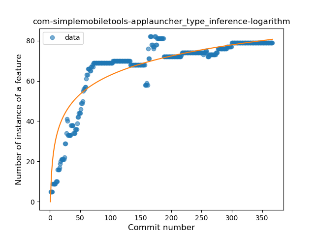
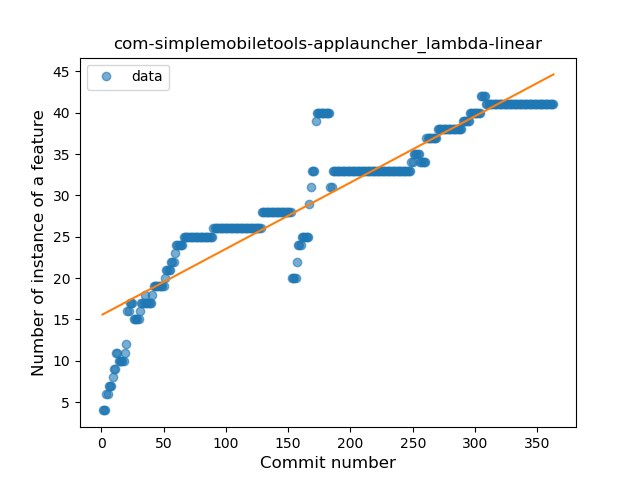
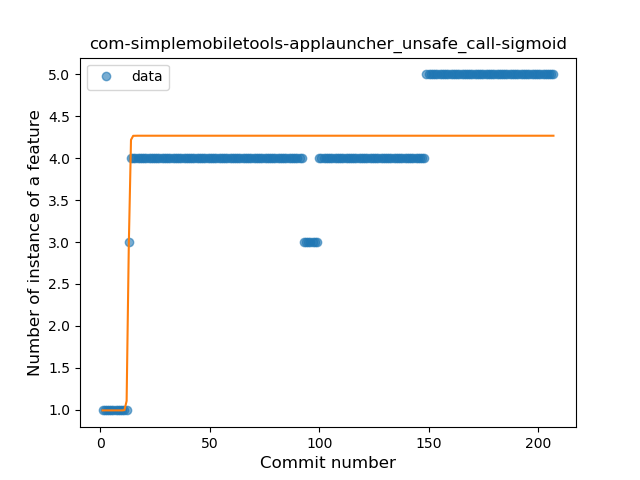
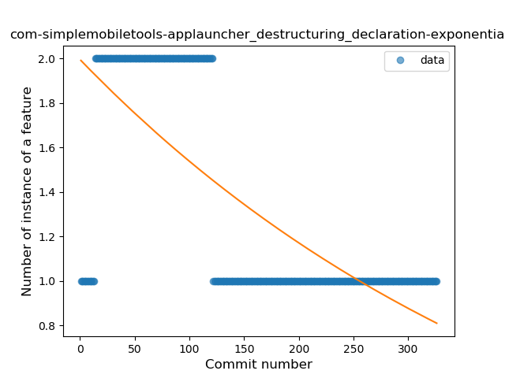

## com-simplemobiletools-applauncher
----
#### Metrics provided by Detekt
* Number of lines of code 895
* Number of Kotlin files: 16
* Cyclomatic complexity: 144
* Cyclomatic complexity by thousands of lines: 305 

----
**11** features analyzed

*	<a href="#type_inference">Type Inference</a> 
*	<a href="#lambda">Lambda</a> 
*	<a href="#safe_call">Safe Call</a> 
*	<a href="#when_expr">When expression</a> 
*	<a href="#unsafe_call">Unsafe Call</a> 
*	<a href="#companion_object">Companion Object</a> 
*	<a href="#string_template">String Template</a> 
*	<a href="#func_with_default_value">Function with Default Value</a> 
*	<a href="#range_expr">Range Expression</a> 
*	<a href="#extension_function">Extension Function</a> 
*	<a href="#destructuring_declaration">Destructuring Declaration</a> 

### <a name="type_inference">Type Inference</a>
----
#### Functions
* **Sudden Rise Plateau - Logarithm:** 
    * **R_Squared:** 0.83003519
* **Constant Rise - Linear:** 
    * **R_Squared:** 0.55203946

**Plots** :chart_with_upwards_trend:
-----

### <a name="lambda">Lambda</a>
----
#### Functions
* **Constant Rise - Linear:** 
    * **R_Squared:** 0.86200452
* **Sudden Rise Plateau - Logarithm:** 
    * **R_Squared:** 0.80172496

**Plots** :chart_with_upwards_trend:
-----

### <a name="safe_call">Safe Call</a>
----
#### Functions
* **Plateau Sudden Rise - Binary Sigmoid:** 
    * **R_Squared:** 0.79482451
* **Sudden Rise Plateau - Logarithm:** 
    * **R_Squared:** 0.59874421
* **Constant Rise - Linear:** 
    * **R_Squared:** 0.40943338

**Plots** :chart_with_upwards_trend:
-----

### <a name="when_expr">When expression</a>
----
#### Functions
* **Plateau Gradual Rise - Sigmoid:** 
    * **R_Squared:** 0.77315391
* **Sudden Rise Plateau - Logarithm:** 
    * **R_Squared:** 0.63342407
* **Constant Rise - Linear:** 
    * **R_Squared:** 0.31157839

**Plots** :chart_with_upwards_trend:
-----

### <a name="unsafe_call">Unsafe Call</a>
----
#### Functions
* **Plateau Gradual Rise - Sigmoid:** 
    * **R_Squared:** 0.70071467
* **Sudden Rise Plateau - Logarithm:** 
    * **R_Squared:** 0.64922787
* **Constant Rise - Linear:** 
    * **R_Squared:** 0.50075094

**Plots** :chart_with_upwards_trend:
-----

### <a name="companion_object">Companion Object</a>
----
#### Functions
* **Plateau Gradual Rise - Sigmoid:** 
    * **R_Squared:** 0.30628072
* **Constant Decline - Linear:** 
    * **R_Squared:** 0.09897303
* **Sudden Rise Plateau - Logarithm:** 
    * **R_Squared:** 0.00050961

**Plots** :chart_with_upwards_trend:
-----

### <a name="string_template">String Template</a>
----
#### Functions
* **Sudden Rise Plateau - Logarithm:** 
    * **R_Squared:** 0.31885408
* **Constant Rise - Linear:** 
    * **R_Squared:** 0.10097906

**Plots** :chart_with_upwards_trend:
-----

### <a name="func_with_default_value">Function with Default Value</a>
----
#### Functions
* **Constant Decline - Linear:** 
    * **R_Squared:** 0.17770238
* **Plateau Gradual Rise - Sigmoid:** 
    * **R_Squared:** 0.11141755
* **Sudden Rise Plateau - Logarithm:** 
    * **R_Squared:** -0.0

**Plots** :chart_with_upwards_trend:
-----

### <a name="range_expr">Range Expression</a>
----
#### Functions
* **Constant Decline - Linear:** 
    * **R_Squared:** 0.02018857
* **Plateau Gradual Rise - Sigmoid:** 
    * **R_Squared:** 0.01715385
* **Sudden Rise Plateau - Logarithm:** 
    * **R_Squared:** -0.0

**Plots** :chart_with_upwards_trend:
-----

### <a name="extension_function">Extension Function</a>
----
#### Functions
* **Plateau Sudden Rise - Binary Sigmoid:** 
    * **R_Squared:** 0.17229446
* **Constant Decline - Linear:** 
    * **R_Squared:** 0.01434433
* **Sudden Rise Plateau - Logarithm:** 
    * **R_Squared:** 0.00658336

**Plots** :chart_with_upwards_trend:
-----

### <a name="destructuring_declaration">Destructuring Declaration</a>
----
#### Functions
* **Constant Decline - Linear:** 
    * **R_Squared:** 0.51553702
* **Sudden Decline - Exponential:** 
    * **R_Squared:** 0.52351623
* **Plateau Gradual Rise - Sigmoid:** 
    * **R_Squared:** 0.02048612
* **Sudden Rise Plateau - Logarithm:** 
    * **R_Squared:** -0.0

**Plots** :chart_with_upwards_trend:
-----

