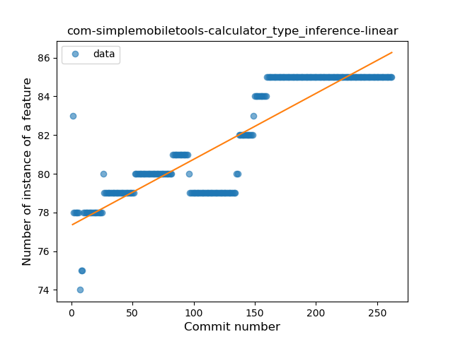
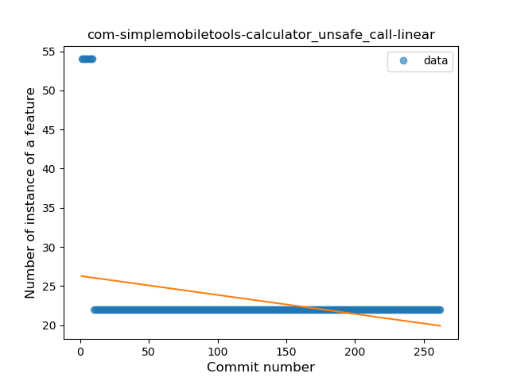
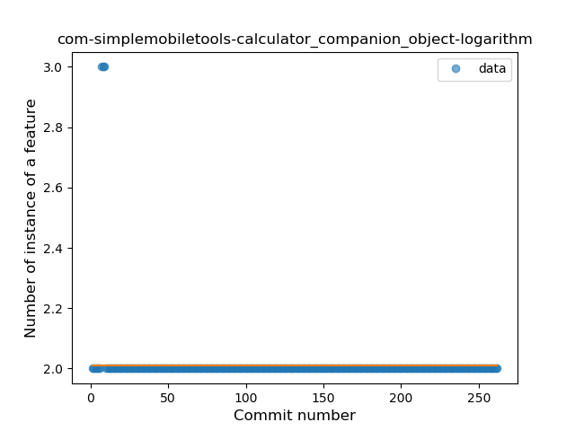

## com-simplemobiletools-calculator
----
#### Metrics provided by Detekt
* Number of lines of code 1303
* Number of Kotlin files: 28
* Cyclomatic complexity: 219
* Cyclomatic complexity by thousands of lines: 293 

----
**7** features analyzed

*	<a href="#type_inference">Type Inference</a> 
*	<a href="#lambda">Lambda</a> 
*	<a href="#when_expr">When expression</a> 
*	<a href="#unsafe_call">Unsafe Call</a> 
*	<a href="#companion_object">Companion Object</a> 
*	<a href="#string_template">String Template</a> 
*	<a href="#range_expr">Range Expression</a> 

### <a name="type_inference">Type Inference</a>
----
#### Functions
* **Constant Rise - Linear:** 
    * **R_Squared:** 0.79835768
* **Sudden Rise Plateau - Logarithm:** 
    * **R_Squared:** 0.57691123

**Plots** :chart_with_upwards_trend:
-----

### <a name="lambda">Lambda</a>
----
#### Functions
* **Sudden Rise Plateau - Logarithm:** 
    * **R_Squared:** 0.88570487
* **Constant Rise - Linear:** 
    * **R_Squared:** 0.60422918

**Plots** :chart_with_upwards_trend:
-----

### <a name="when_expr">When expression</a>
----
#### Functions
* **Sudden Rise Plateau - Logarithm:** 
    * **R_Squared:** 0.38520838
* **Constant Rise - Linear:** 
    * **R_Squared:** 0.09951488

**Plots** :chart_with_upwards_trend:
-----

### <a name="unsafe_call">Unsafe Call</a>
----
#### Functions
* **Sudden Decline - Exponential:** 
    * **R_Squared:** 0.8100525
* **Constant Decline - Linear:** 
    * **R_Squared:** 0.09951488
* **Sudden Rise Plateau - Logarithm:** 
    * **R_Squared:** 0.0

**Plots** :chart_with_upwards_trend:
-----

### <a name="companion_object">Companion Object</a>
----
#### Functions
* **Plateau Gradual Decline - Sigmoid:** 
    * **R_Squared:** 0.32561132
* **Sudden Decline - Exponential:** 
    * **R_Squared:** 0.13845353
* **Constant Decline - Linear:** 
    * **R_Squared:** 0.03088449
* **Sudden Rise Plateau - Logarithm:** 
    * **R_Squared:** -0.0

**Plots** :chart_with_upwards_trend:
-----

### <a name="string_template">String Template</a>
----
#### Functions
* **Sudden Decline - Exponential:** 
    * **R_Squared:** 1.0
* **Constant Decline - Linear:** 
    * **R_Squared:** 0.01181102
* **Sudden Rise Plateau - Logarithm:** 
    * **R_Squared:** -0.0

**Plots** :chart_with_upwards_trend:
-----

### <a name="range_expr">Range Expression</a>
----
#### Functions
* **Plateau Sudden Rise - Binary Sigmoid:** 
    * **R_Squared:** 1.0
* **Constant Rise - Linear:** 
    * **R_Squared:** 0.74268841
* **Sudden Rise - Exponential:** 
    * **R_Squared:** 0.75082529
* **Sudden Rise Plateau - Logarithm:** 
    * **R_Squared:** 0.4560084

**Plots** :chart_with_upwards_trend:
-----

