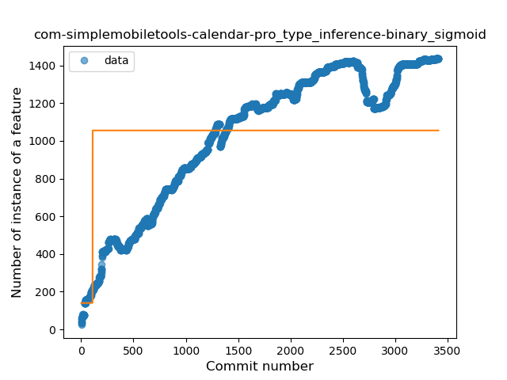
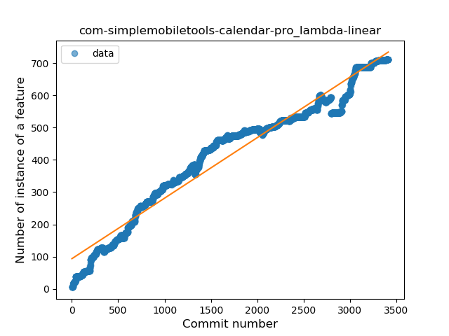
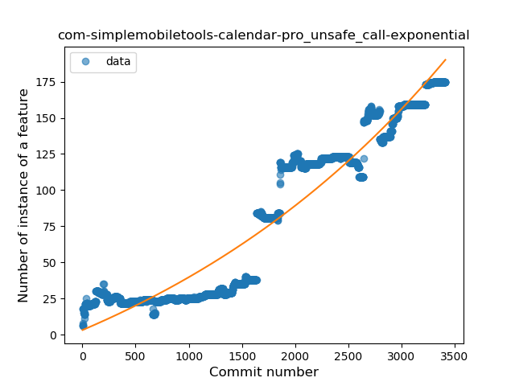
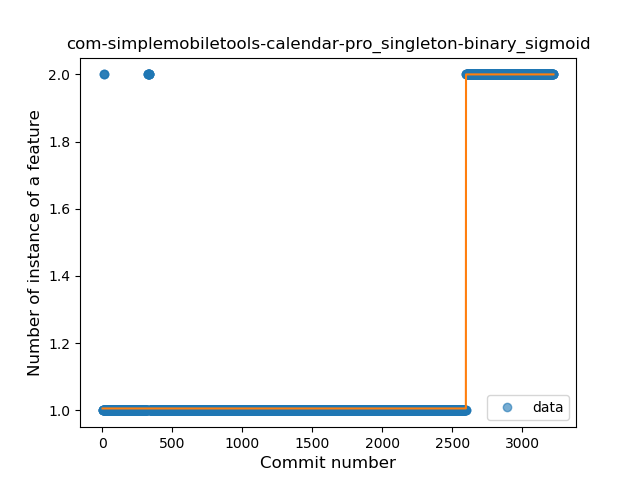
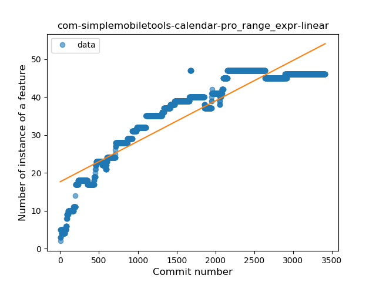
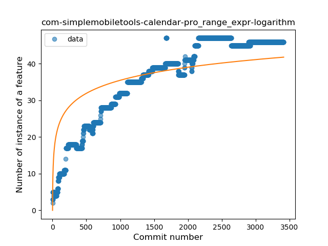
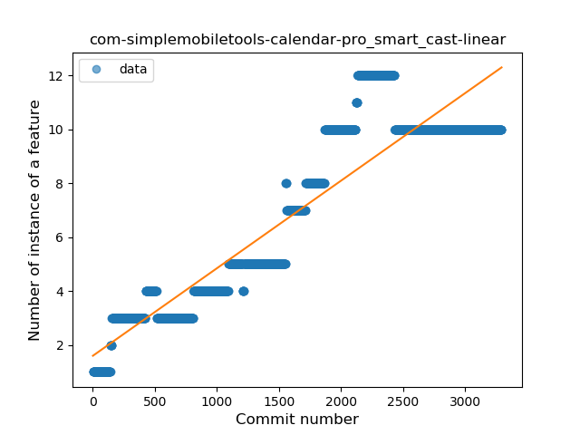

## com-simplemobiletools-calendar-pro
----
#### Metrics provided by Detekt
* Number of lines of code 12317
* Number of Kotlin files: 102
* Cyclomatic complexity: 2378
* Cyclomatic complexity by thousands of lines: 339 

----
**15** features analyzed

*	<a href="#type_inference">Type Inference</a> 
*	<a href="#lambda">Lambda</a> 
*	<a href="#safe_call">Safe Call</a> 
*	<a href="#when_expr">When expression</a> 
*	<a href="#unsafe_call">Unsafe Call</a> 
*	<a href="#companion_object">Companion Object</a> 
*	<a href="#string_template">String Template</a> 
*	<a href="#func_with_default_value">Function with Default Value</a> 
*	<a href="#singleton">Singleton</a> 
*	<a href="#range_expr">Range Expression</a> 
*	<a href="#smart_cast">Smart Cast</a> 
*	<a href="#data_class">Data Class</a> 
*	<a href="#func_call_with_named_arg">Function call with Named Argument</a> 
*	<a href="#extension_function">Extension Function</a> 
*	<a href="#destructuring_declaration">Destructuring Declaration</a> 

### <a name="type_inference">Type Inference</a>
----
#### Functions
* **Constant Rise - Linear:** 
    * **R_Squared:** 0.84897264
* **Sudden Rise Plateau - Logarithm:** 
    * **R_Squared:** 0.5730742
* **Plateau Sudden Rise - Binary Sigmoid:** 
    * **R_Squared:** 0.18262098

**Plots** :chart_with_upwards_trend:
-----

### <a name="lambda">Lambda</a>
----
#### Functions
* **Constant Rise - Linear:** 
    * **R_Squared:** 0.95616295
* **Sudden Rise Plateau - Logarithm:** 
    * **R_Squared:** 0.47402259
* **Plateau Sudden Rise - Binary Sigmoid:** 
    * **R_Squared:** 0.2689386

**Plots** :chart_with_upwards_trend:
-----

### <a name="safe_call">Safe Call</a>
----
#### Functions
* **Constant Rise - Linear:** 
    * **R_Squared:** 0.83460759
* **Sudden Rise - Exponential:** 
    * **R_Squared:** 0.83178999
* **Sudden Rise Plateau - Logarithm:** 
    * **R_Squared:** 0.58784109
* **Plateau Sudden Rise - Binary Sigmoid:** 
    * **R_Squared:** 0.23823853

**Plots** :chart_with_upwards_trend:
-----

### <a name="when_expr">When expression</a>
----
#### Functions
* **Plateau Gradual Rise - Sigmoid:** 
    * **R_Squared:** 0.94306546
* **Constant Rise - Linear:** 
    * **R_Squared:** 0.90777566
* **Sudden Rise Plateau - Logarithm:** 
    * **R_Squared:** 0.45053338

**Plots** :chart_with_upwards_trend:
-----

### <a name="unsafe_call">Unsafe Call</a>
----
#### Functions
* **Sudden Rise - Exponential:** 
    * **R_Squared:** 0.91509146
* **Constant Rise - Linear:** 
    * **R_Squared:** 0.89533501
* **Sudden Rise Plateau - Logarithm:** 
    * **R_Squared:** 0.26197093

**Plots** :chart_with_upwards_trend:
-----

### <a name="companion_object">Companion Object</a>
----
#### Functions
* **Constant Decline - Linear:** 
    * **R_Squared:** 0.25349498
* **Sudden Rise Plateau - Logarithm:** 
    * **R_Squared:** -0.0

**Plots** :chart_with_upwards_trend:
-----

### <a name="string_template">String Template</a>
----
#### Functions
* **Sudden Rise Plateau - Logarithm:** 
    * **R_Squared:** 0.33427151
* **Constant Rise - Linear:** 
    * **R_Squared:** 0.24156492
* **Sudden Rise - Exponential:** 
    * **R_Squared:** 0.23859121
* **Plateau Sudden Rise - Binary Sigmoid:** 
    * **R_Squared:** 0.14817614

**Plots** :chart_with_upwards_trend:
-----

### <a name="func_with_default_value">Function with Default Value</a>
----
#### Functions
* **Plateau Gradual Rise - Sigmoid:** 
    * **R_Squared:** 0.88636047
* **Constant Rise - Linear:** 
    * **R_Squared:** 0.46795768
* **Sudden Rise - Exponential:** 
    * **R_Squared:** 0.46478967
* **Sudden Rise Plateau - Logarithm:** 
    * **R_Squared:** 0.42610582

**Plots** :chart_with_upwards_trend:
-----

### <a name="singleton">Singleton</a>
----
#### Functions
* **Plateau Sudden Rise - Binary Sigmoid:** 
    * **R_Squared:** 0.9709605
* **Sudden Rise - Exponential:** 
    * **R_Squared:** 0.75148366
* **Constant Rise - Linear:** 
    * **R_Squared:** 0.43846939
* **Sudden Rise Plateau - Logarithm:** 
    * **R_Squared:** 0.17215168

**Plots** :chart_with_upwards_trend:
-----

### <a name="range_expr">Range Expression</a>
----
#### Functions
* **Constant Rise - Linear:** 
    * **R_Squared:** 0.83668291
* **Sudden Rise Plateau - Logarithm:** 
    * **R_Squared:** 0.64819853
* **Plateau Sudden Rise - Binary Sigmoid:** 
    * **R_Squared:** 0.05992521

**Plots** :chart_with_upwards_trend:
-----

### <a name="smart_cast">Smart Cast</a>
----
#### Functions
* **Constant Rise - Linear:** 
    * **R_Squared:** 0.83668752
* **Sudden Rise Plateau - Logarithm:** 
    * **R_Squared:** 0.39710248

**Plots** :chart_with_upwards_trend:
-----

### <a name="data_class">Data Class</a>
----
#### Functions
* **Constant Rise - Linear:** 
    * **R_Squared:** 0.64463989
* **Sudden Rise Plateau - Logarithm:** 
    * **R_Squared:** 0.52891786

**Plots** :chart_with_upwards_trend:
-----

### <a name="func_call_with_named_arg">Function call with Named Argument</a>
----
#### Functions
* **Constant Rise - Linear:** 
    * **R_Squared:** 0.57623562
* **Sudden Rise Plateau - Logarithm:** 
    * **R_Squared:** 0.21060665

**Plots** :chart_with_upwards_trend:
-----

### <a name="extension_function">Extension Function</a>
----
#### Functions
* **Constant Rise - Linear:** 
    * **R_Squared:** 0.66622722
* **Sudden Rise - Exponential:** 
    * **R_Squared:** 0.66295326
* **Sudden Rise Plateau - Logarithm:** 
    * **R_Squared:** 0.49954753
* **Plateau Sudden Rise - Binary Sigmoid:** 
    * **R_Squared:** 0.06065396

**Plots** :chart_with_upwards_trend:
-----

### <a name="destructuring_declaration">Destructuring Declaration</a>
----
#### Functions
* **Constant Decline - Linear:** 
    * **R_Squared:** 0.00016752
* **Sudden Decline - Exponential:** 
    * **R_Squared:** 0.00711246
* **Plateau Gradual Rise - Sigmoid:** 
    * **R_Squared:** 0.01673949
* **Sudden Rise Plateau - Logarithm:** 
    * **R_Squared:** 0.0

**Plots** :chart_with_upwards_trend:
-----

