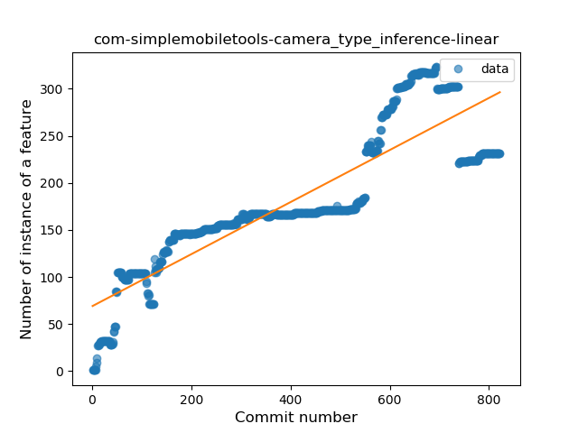
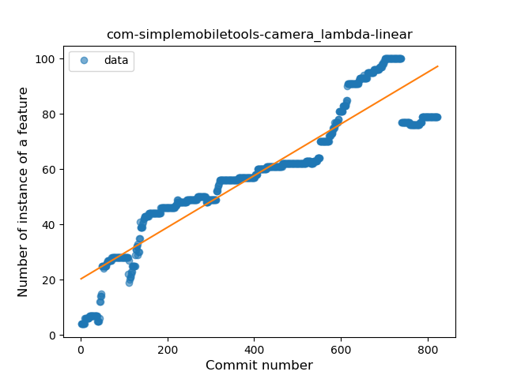
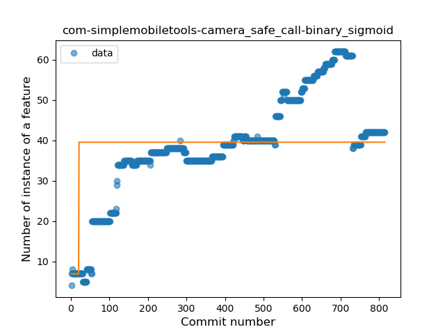
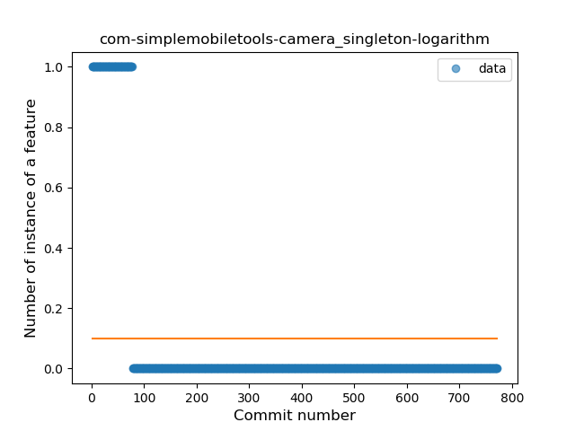
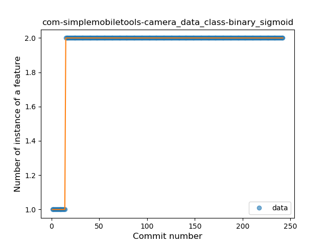

## com-simplemobiletools-camera
----
#### Metrics provided by Detekt
* Number of lines of code 2513
* Number of Kotlin files: 18
* Cyclomatic complexity: 501
* Cyclomatic complexity by thousands of lines: 319 

----
**13** features analyzed

*	<a href="#type_inference">Type Inference</a> 
*	<a href="#lambda">Lambda</a> 
*	<a href="#safe_call">Safe Call</a> 
*	<a href="#when_expr">When expression</a> 
*	<a href="#unsafe_call">Unsafe Call</a> 
*	<a href="#companion_object">Companion Object</a> 
*	<a href="#string_template">String Template</a> 
*	<a href="#func_with_default_value">Function with Default Value</a> 
*	<a href="#singleton">Singleton</a> 
*	<a href="#range_expr">Range Expression</a> 
*	<a href="#smart_cast">Smart Cast</a> 
*	<a href="#data_class">Data Class</a> 
*	<a href="#extension_function">Extension Function</a> 

### <a name="type_inference">Type Inference</a>
----
#### Functions
* **Constant Rise - Linear:** 
    * **R_Squared:** 0.77027291
* **Sudden Rise Plateau - Logarithm:** 
    * **R_Squared:** 0.53667848
* **Plateau Sudden Rise - Binary Sigmoid:** 
    * **R_Squared:** 0.45518536

**Plots** :chart_with_upwards_trend:
-----

### <a name="lambda">Lambda</a>
----
#### Functions
* **Constant Rise - Linear:** 
    * **R_Squared:** 0.86386891
* **Sudden Rise Plateau - Logarithm:** 
    * **R_Squared:** 0.58717105
* **Plateau Sudden Rise - Binary Sigmoid:** 
    * **R_Squared:** 0.25632764

**Plots** :chart_with_upwards_trend:
-----

### <a name="safe_call">Safe Call</a>
----
#### Functions
* **Constant Rise - Linear:** 
    * **R_Squared:** 0.66094071
* **Sudden Rise Plateau - Logarithm:** 
    * **R_Squared:** 0.62552464
* **Plateau Sudden Rise - Binary Sigmoid:** 
    * **R_Squared:** 0.14755319

**Plots** :chart_with_upwards_trend:
-----

### <a name="when_expr">When expression</a>
----
#### Functions
* **Plateau Gradual Rise - Sigmoid:** 
    * **R_Squared:** 0.63868308
* **Constant Rise - Linear:** 
    * **R_Squared:** 0.59277469
* **Sudden Rise Plateau - Logarithm:** 
    * **R_Squared:** 0.43615156

**Plots** :chart_with_upwards_trend:
-----

### <a name="unsafe_call">Unsafe Call</a>
----
#### Functions
* **Constant Rise - Linear:** 
    * **R_Squared:** 0.40764415
* **Sudden Rise Plateau - Logarithm:** 
    * **R_Squared:** 0.36232724
* **Plateau Sudden Rise - Binary Sigmoid:** 
    * **R_Squared:** 0.30838263

**Plots** :chart_with_upwards_trend:
-----

### <a name="companion_object">Companion Object</a>
----
#### Functions
* **Constant Decline - Linear:** 
    * **R_Squared:** 0.64253064
* **Sudden Decline - Exponential:** 
    * **R_Squared:** 0.64839645
* **Sudden Rise Plateau - Logarithm:** 
    * **R_Squared:** -0.0
* **Plateau Gradual Rise - Sigmoid:** 
    * **R_Squared:** 0.00330686

**Plots** :chart_with_upwards_trend:
-----

### <a name="string_template">String Template</a>
----
#### Functions
* **Sudden Rise - Exponential:** 
    * **R_Squared:** 0.2117743
* **Constant Rise - Linear:** 
    * **R_Squared:** 8.642e-05
* **Sudden Rise Plateau - Logarithm:** 
    * **R_Squared:** -0.0

**Plots** :chart_with_upwards_trend:
-----

### <a name="func_with_default_value">Function with Default Value</a>
----
#### Functions
* **Plateau Gradual Rise - Sigmoid:** 
    * **R_Squared:** 0.84052989
* **Constant Rise - Linear:** 
    * **R_Squared:** 0.56255425
* **Sudden Rise Plateau - Logarithm:** 
    * **R_Squared:** 0.32487072

**Plots** :chart_with_upwards_trend:
-----

### <a name="singleton">Singleton</a>
----
#### Functions
* **Plateau Sudden Decline - Binary Sigmoid:** 
    * **R_Squared:** 1.0
* **Sudden Decline - Exponential:** 
    * **R_Squared:** 0.79691413
* **Constant Decline - Linear:** 
    * **R_Squared:** 0.26937849
* **Sudden Rise Plateau - Logarithm:** 
    * **R_Squared:** 0.0

**Plots** :chart_with_upwards_trend:
-----

### <a name="range_expr">Range Expression</a>
----
#### Functions
* **Plateau Sudden Rise - Binary Sigmoid:** 
    * **R_Squared:** 0.39960678
* **Sudden Rise Plateau - Logarithm:** 
    * **R_Squared:** 0.08402982
* **Constant Decline - Linear:** 
    * **R_Squared:** 0.00308069

**Plots** :chart_with_upwards_trend:
-----

### <a name="smart_cast">Smart Cast</a>
----
#### Functions
* **Plateau Sudden Decline - Binary Sigmoid:** 
    * **R_Squared:** 1.0
* **Sudden Decline - Exponential:** 
    * **R_Squared:** 0.79927983
* **Constant Decline - Linear:** 
    * **R_Squared:** 0.23818564
* **Sudden Rise Plateau - Logarithm:** 
    * **R_Squared:** 0.0

**Plots** :chart_with_upwards_trend:
-----

### <a name="data_class">Data Class</a>
----
#### Functions
* **Plateau Sudden Rise - Binary Sigmoid:** 
    * **R_Squared:** 1.0
* **Sudden Rise Plateau - Logarithm:** 
    * **R_Squared:** 0.48941044
* **Constant Rise - Linear:** 
    * **R_Squared:** 0.16351621

**Plots** :chart_with_upwards_trend:
-----

### <a name="extension_function">Extension Function</a>
----
#### Functions
* **Plateau Gradual Rise - Sigmoid:** 
    * **R_Squared:** 0.23932055
* **Sudden Rise Plateau - Logarithm:** 
    * **R_Squared:** 0.03110938
* **Constant Decline - Linear:** 
    * **R_Squared:** 0.01234398

**Plots** :chart_with_upwards_trend:
-----

