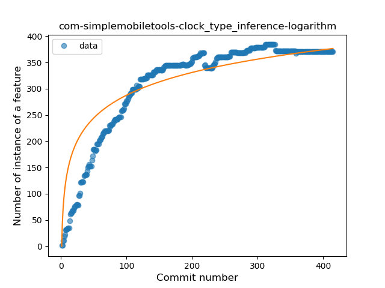
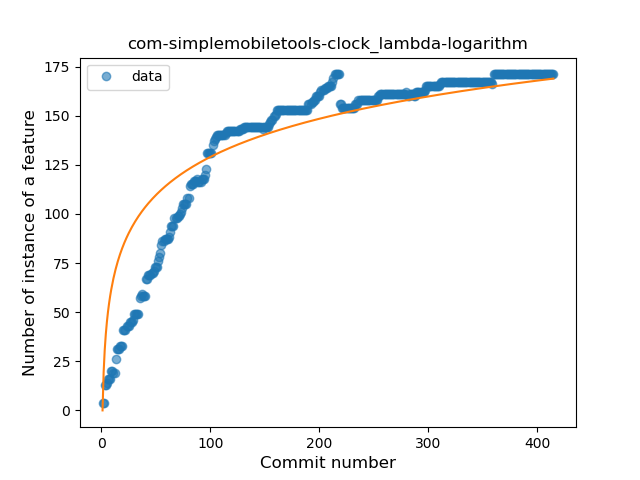
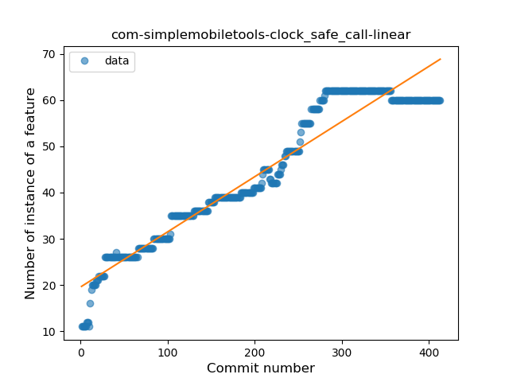
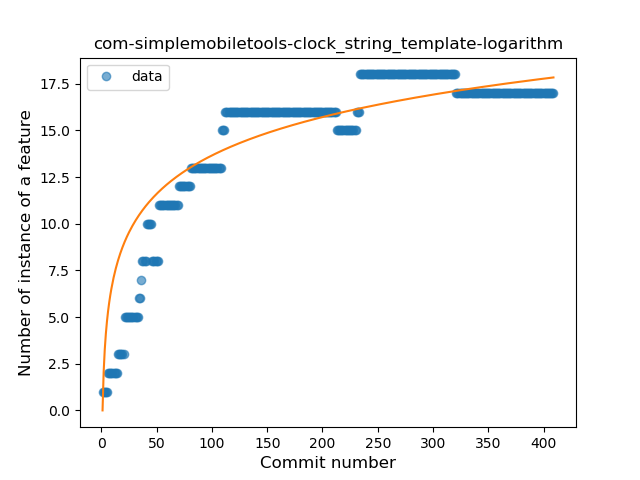
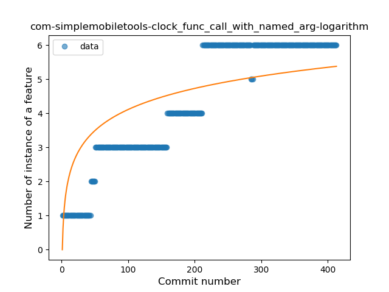

## com-simplemobiletools-clock
----
#### Metrics provided by Detekt
* Number of lines of code 3601
* Number of Kotlin files: 40
* Cyclomatic complexity: 563
* Cyclomatic complexity by thousands of lines: 270 

----
**12** features analyzed

*	<a href="#type_inference">Type Inference</a> 
*	<a href="#lambda">Lambda</a> 
*	<a href="#safe_call">Safe Call</a> 
*	<a href="#when_expr">When expression</a> 
*	<a href="#unsafe_call">Unsafe Call</a> 
*	<a href="#companion_object">Companion Object</a> 
*	<a href="#string_template">String Template</a> 
*	<a href="#range_expr">Range Expression</a> 
*	<a href="#smart_cast">Smart Cast</a> 
*	<a href="#data_class">Data Class</a> 
*	<a href="#func_call_with_named_arg">Function call with Named Argument</a> 
*	<a href="#extension_function">Extension Function</a> 

### <a name="type_inference">Type Inference</a>
----
#### Functions
* **Sudden Rise Plateau - Logarithm:** 
    * **R_Squared:** 0.82550325
* **Constant Rise - Linear:** 
    * **R_Squared:** 0.67441133
* **Plateau Sudden Rise - Binary Sigmoid:** 
    * **R_Squared:** 0.1546807

**Plots** :chart_with_upwards_trend:
-----

### <a name="lambda">Lambda</a>
----
#### Functions
* **Sudden Rise Plateau - Logarithm:** 
    * **R_Squared:** 0.83169694
* **Constant Rise - Linear:** 
    * **R_Squared:** 0.68902689
* **Plateau Sudden Rise - Binary Sigmoid:** 
    * **R_Squared:** 0.56462197

**Plots** :chart_with_upwards_trend:
-----

### <a name="safe_call">Safe Call</a>
----
#### Functions
* **Constant Rise - Linear:** 
    * **R_Squared:** 0.92915049
* **Sudden Rise Plateau - Logarithm:** 
    * **R_Squared:** 0.70753051

**Plots** :chart_with_upwards_trend:
-----

### <a name="when_expr">When expression</a>
----
#### Functions
* **Sudden Rise Plateau - Logarithm:** 
    * **R_Squared:** 0.74193667
* **Constant Rise - Linear:** 
    * **R_Squared:** 0.66849076

**Plots** :chart_with_upwards_trend:
-----

### <a name="unsafe_call">Unsafe Call</a>
----
#### Functions
* **Sudden Rise Plateau - Logarithm:** 
    * **R_Squared:** 0.80206257
* **Constant Rise - Linear:** 
    * **R_Squared:** 0.71595687

**Plots** :chart_with_upwards_trend:
-----

### <a name="companion_object">Companion Object</a>
----
#### Functions
* **Plateau Gradual Rise - Sigmoid:** 
    * **R_Squared:** 0.94099734
* **Sudden Rise Plateau - Logarithm:** 
    * **R_Squared:** 0.72886971
* **Constant Rise - Linear:** 
    * **R_Squared:** 0.3637109

**Plots** :chart_with_upwards_trend:
-----

### <a name="string_template">String Template</a>
----
#### Functions
* **Sudden Rise Plateau - Logarithm:** 
    * **R_Squared:** 0.82631387
* **Constant Rise - Linear:** 
    * **R_Squared:** 0.60126937

**Plots** :chart_with_upwards_trend:
-----

### <a name="range_expr">Range Expression</a>
----
#### Functions
* **Constant Decline - Linear:** 
    * **R_Squared:** 0.57341977
* **Sudden Decline - Exponential:** 
    * **R_Squared:** 0.57472446
* **Plateau Gradual Rise - Sigmoid:** 
    * **R_Squared:** 0.02065669
* **Sudden Rise Plateau - Logarithm:** 
    * **R_Squared:** -0.0

**Plots** :chart_with_upwards_trend:
-----

### <a name="smart_cast">Smart Cast</a>
----
#### Functions
* **Constant Decline - Linear:** 
    * **R_Squared:** 0.00661162
* **Sudden Rise Plateau - Logarithm:** 
    * **R_Squared:** 0.00068001

**Plots** :chart_with_upwards_trend:
-----

### <a name="data_class">Data Class</a>
----
#### Functions
* **Plateau Gradual Rise - Sigmoid:** 
    * **R_Squared:** 0.56393544
* **Sudden Rise Plateau - Logarithm:** 
    * **R_Squared:** 0.11306063
* **Constant Decline - Linear:** 
    * **R_Squared:** 0.00497523

**Plots** :chart_with_upwards_trend:
-----

### <a name="func_call_with_named_arg">Function call with Named Argument</a>
----
#### Functions
* **Plateau Gradual Rise - Sigmoid:** 
    * **R_Squared:** 0.91641597
* **Constant Rise - Linear:** 
    * **R_Squared:** 0.85068381
* **Sudden Rise Plateau - Logarithm:** 
    * **R_Squared:** 0.63174702

**Plots** :chart_with_upwards_trend:
-----

### <a name="extension_function">Extension Function</a>
----
#### Functions
* **Sudden Rise Plateau - Logarithm:** 
    * **R_Squared:** 0.69845978
* **Constant Rise - Linear:** 
    * **R_Squared:** 0.64244285
* **Plateau Sudden Rise - Binary Sigmoid:** 
    * **R_Squared:** 0.52825714

**Plots** :chart_with_upwards_trend:
-----

