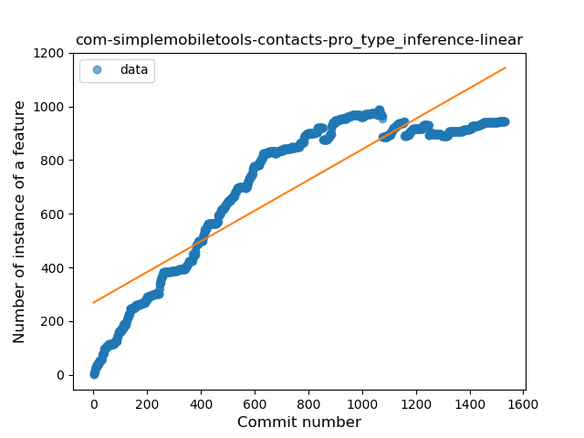
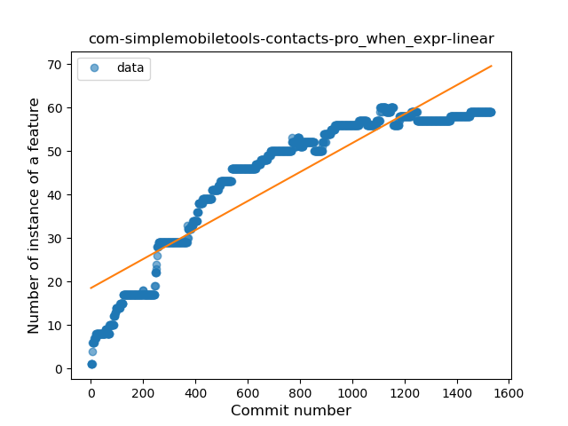
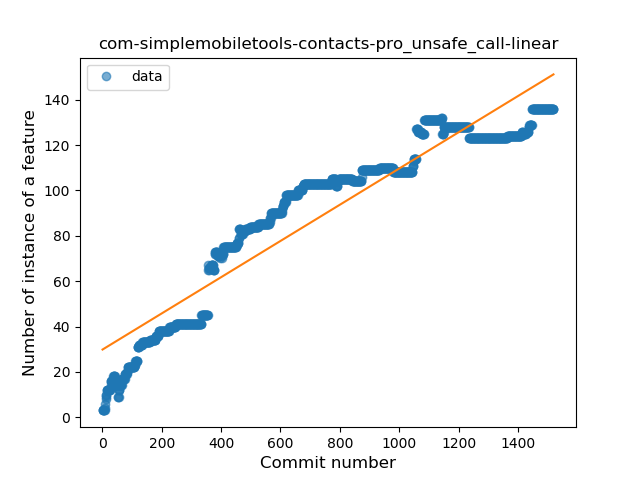
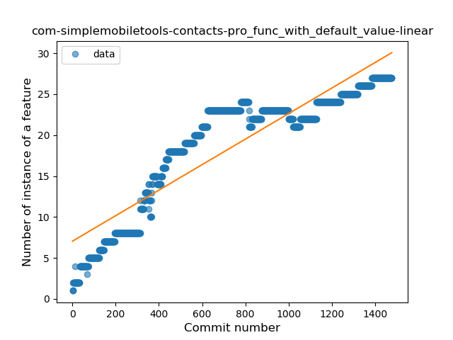
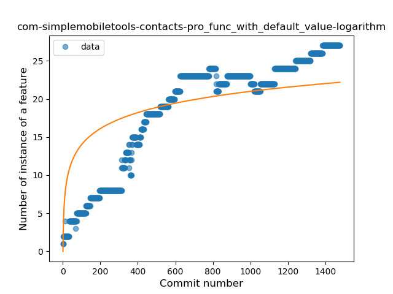
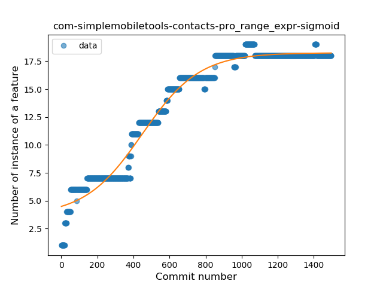
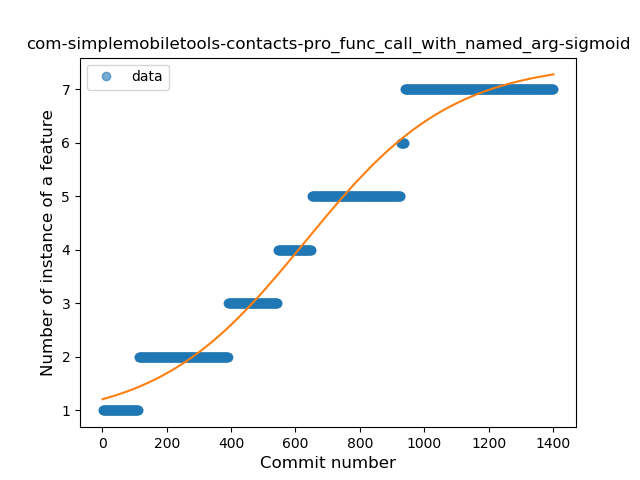
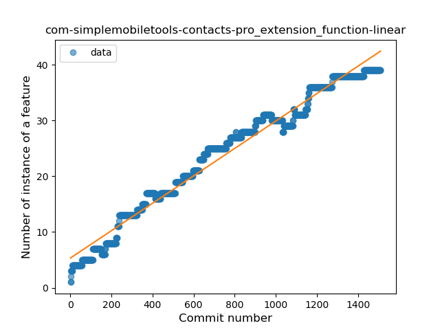
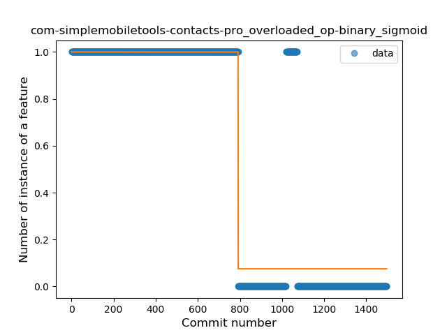

## com-simplemobiletools-contacts-pro
----
#### Metrics provided by Detekt
* Number of lines of code 9157
* Number of Kotlin files: 65
* Cyclomatic complexity: 1789
* Cyclomatic complexity by thousands of lines: 322 

----
**16** features analyzed

*	<a href="#type_inference">Type Inference</a> 
*	<a href="#lambda">Lambda</a> 
*	<a href="#safe_call">Safe Call</a> 
*	<a href="#when_expr">When expression</a> 
*	<a href="#unsafe_call">Unsafe Call</a> 
*	<a href="#companion_object">Companion Object</a> 
*	<a href="#string_template">String Template</a> 
*	<a href="#func_with_default_value">Function with Default Value</a> 
*	<a href="#singleton">Singleton</a> 
*	<a href="#range_expr">Range Expression</a> 
*	<a href="#smart_cast">Smart Cast</a> 
*	<a href="#data_class">Data Class</a> 
*	<a href="#func_call_with_named_arg">Function call with Named Argument</a> 
*	<a href="#extension_function">Extension Function</a> 
*	<a href="#destructuring_declaration">Destructuring Declaration</a> 
*	<a href="#overloaded_op">Overloaded Operator</a> 

### <a name="type_inference">Type Inference</a>
----
#### Functions
* **Constant Rise - Linear:** 
    * **R_Squared:** 0.79123209
* **Sudden Rise Plateau - Logarithm:** 
    * **R_Squared:** 0.57981176
* **Plateau Sudden Rise - Binary Sigmoid:** 
    * **R_Squared:** 0.43278819

**Plots** :chart_with_upwards_trend:
-----

### <a name="lambda">Lambda</a>
----
#### Functions
* **Constant Rise - Linear:** 
    * **R_Squared:** 0.93934409
* **Sudden Rise Plateau - Logarithm:** 
    * **R_Squared:** 0.52877177
* **Plateau Sudden Rise - Binary Sigmoid:** 
    * **R_Squared:** 0.50104678

**Plots** :chart_with_upwards_trend:
-----

### <a name="safe_call">Safe Call</a>
----
#### Functions
* **Constant Rise - Linear:** 
    * **R_Squared:** 0.89427886
* **Sudden Rise Plateau - Logarithm:** 
    * **R_Squared:** 0.59590403
* **Plateau Sudden Rise - Binary Sigmoid:** 
    * **R_Squared:** 0.41392978

**Plots** :chart_with_upwards_trend:
-----

### <a name="when_expr">When expression</a>
----
#### Functions
* **Constant Rise - Linear:** 
    * **R_Squared:** 0.83507943
* **Sudden Rise Plateau - Logarithm:** 
    * **R_Squared:** 0.63131394
* **Plateau Sudden Rise - Binary Sigmoid:** 
    * **R_Squared:** 0.10078188

**Plots** :chart_with_upwards_trend:
-----

### <a name="unsafe_call">Unsafe Call</a>
----
#### Functions
* **Constant Rise - Linear:** 
    * **R_Squared:** 0.89261355
* **Sudden Rise Plateau - Logarithm:** 
    * **R_Squared:** 0.57222079
* **Plateau Sudden Rise - Binary Sigmoid:** 
    * **R_Squared:** 0.23668737

**Plots** :chart_with_upwards_trend:
-----

### <a name="companion_object">Companion Object</a>
----
#### Functions
* **Plateau Gradual Rise - Sigmoid:** 
    * **R_Squared:** 0.68603637
* **Sudden Rise Plateau - Logarithm:** 
    * **R_Squared:** 0.36651927
* **Constant Rise - Linear:** 
    * **R_Squared:** 0.18888071

**Plots** :chart_with_upwards_trend:
-----

### <a name="string_template">String Template</a>
----
#### Functions
* **Sudden Rise Plateau - Logarithm:** 
    * **R_Squared:** 0.41755812
* **Constant Rise - Linear:** 
    * **R_Squared:** 0.28982324

**Plots** :chart_with_upwards_trend:
-----

### <a name="func_with_default_value">Function with Default Value</a>
----
#### Functions
* **Constant Rise - Linear:** 
    * **R_Squared:** 0.8247052
* **Sudden Rise Plateau - Logarithm:** 
    * **R_Squared:** 0.58367261
* **Plateau Sudden Rise - Binary Sigmoid:** 
    * **R_Squared:** 0.07070169

**Plots** :chart_with_upwards_trend:
-----

### <a name="singleton">Singleton</a>
----
#### Functions
* **Plateau Sudden Decline - Binary Sigmoid:** 
    * **R_Squared:** 0.87947776
* **Constant Decline - Linear:** 
    * **R_Squared:** 0.57803059
* **Sudden Rise Plateau - Logarithm:** 
    * **R_Squared:** -0.0

**Plots** :chart_with_upwards_trend:
-----

### <a name="range_expr">Range Expression</a>
----
#### Functions
* **Plateau Gradual Rise - Sigmoid:** 
    * **R_Squared:** 0.97248787
* **Constant Rise - Linear:** 
    * **R_Squared:** 0.84125193
* **Sudden Rise Plateau - Logarithm:** 
    * **R_Squared:** 0.61670221

**Plots** :chart_with_upwards_trend:
-----

### <a name="smart_cast">Smart Cast</a>
----
#### Functions
* **Plateau Gradual Rise - Sigmoid:** 
    * **R_Squared:** 0.61242322
* **Sudden Rise Plateau - Logarithm:** 
    * **R_Squared:** 0.30888964
* **Constant Rise - Linear:** 
    * **R_Squared:** 0.27203606

**Plots** :chart_with_upwards_trend:
-----

### <a name="data_class">Data Class</a>
----
#### Functions
* **Sudden Rise Plateau - Logarithm:** 
    * **R_Squared:** 0.51370152
* **Constant Rise - Linear:** 
    * **R_Squared:** 0.37551476

**Plots** :chart_with_upwards_trend:
-----

### <a name="func_call_with_named_arg">Function call with Named Argument</a>
----
#### Functions
* **Plateau Gradual Rise - Sigmoid:** 
    * **R_Squared:** 0.96741832
* **Constant Rise - Linear:** 
    * **R_Squared:** 0.94476219
* **Sudden Rise Plateau - Logarithm:** 
    * **R_Squared:** 0.46006673

**Plots** :chart_with_upwards_trend:
-----

### <a name="extension_function">Extension Function</a>
----
#### Functions
* **Constant Rise - Linear:** 
    * **R_Squared:** 0.97528826
* **Sudden Rise Plateau - Logarithm:** 
    * **R_Squared:** 0.51149091

**Plots** :chart_with_upwards_trend:
-----

### <a name="destructuring_declaration">Destructuring Declaration</a>
----
#### Functions
* **Constant Rise - Linear:** 
    * **R_Squared:** 0.60507004
* **Sudden Rise Plateau - Logarithm:** 
    * **R_Squared:** 0.58271634

**Plots** :chart_with_upwards_trend:
-----

### <a name="overloaded_op">Overloaded Operator</a>
----
#### Functions
* **Plateau Sudden Decline - Binary Sigmoid:** 
    * **R_Squared:** 0.86674734
* **Constant Decline - Linear:** 
    * **R_Squared:** 0.67454794
* **Sudden Rise Plateau - Logarithm:** 
    * **R_Squared:** -0.0

**Plots** :chart_with_upwards_trend:
-----

