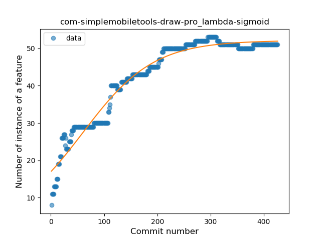
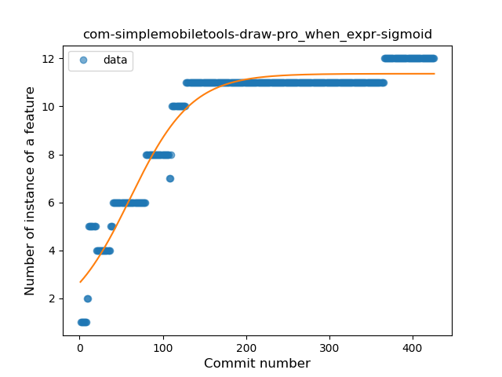

## com-simplemobiletools-draw-pro
----
#### Metrics provided by Detekt
* Number of lines of code 1562
* Number of Kotlin files: 19
* Cyclomatic complexity: 258
* Cyclomatic complexity by thousands of lines: 282 

----
**9** features analyzed

*	<a href="#type_inference">Type Inference</a> 
*	<a href="#lambda">Lambda</a> 
*	<a href="#safe_call">Safe Call</a> 
*	<a href="#when_expr">When expression</a> 
*	<a href="#unsafe_call">Unsafe Call</a> 
*	<a href="#companion_object">Companion Object</a> 
*	<a href="#string_template">String Template</a> 
*	<a href="#smart_cast">Smart Cast</a> 
*	<a href="#destructuring_declaration">Destructuring Declaration</a> 

### <a name="type_inference">Type Inference</a>
----
#### Functions
* **Sudden Rise Plateau - Logarithm:** 
    * **R_Squared:** 0.94966829
* **Constant Rise - Linear:** 
    * **R_Squared:** 0.78137791
* **Plateau Sudden Rise - Binary Sigmoid:** 
    * **R_Squared:** 0.55688153

**Plots** :chart_with_upwards_trend:
-----

### <a name="lambda">Lambda</a>
----
#### Functions
* **Plateau Gradual Rise - Sigmoid:** 
    * **R_Squared:** 0.95982485
* **Sudden Rise Plateau - Logarithm:** 
    * **R_Squared:** 0.87393673
* **Constant Rise - Linear:** 
    * **R_Squared:** 0.78491537

**Plots** :chart_with_upwards_trend:
-----

### <a name="safe_call">Safe Call</a>
----
#### Functions
* **Constant Rise - Linear:** 
    * **R_Squared:** 0.87416115
* **Sudden Rise Plateau - Logarithm:** 
    * **R_Squared:** 0.58739018
* **Plateau Sudden Rise - Binary Sigmoid:** 
    * **R_Squared:** 0.09136553

**Plots** :chart_with_upwards_trend:
-----

### <a name="when_expr">When expression</a>
----
#### Functions
* **Plateau Gradual Rise - Sigmoid:** 
    * **R_Squared:** 0.9438784
* **Sudden Rise Plateau - Logarithm:** 
    * **R_Squared:** 0.83756471
* **Constant Rise - Linear:** 
    * **R_Squared:** 0.65777662

**Plots** :chart_with_upwards_trend:
-----

### <a name="unsafe_call">Unsafe Call</a>
----
#### Functions
* **Sudden Rise - Exponential:** 
    * **R_Squared:** 0.05820269
* **Constant Rise - Linear:** 
    * **R_Squared:** 0.00947011
* **Sudden Rise Plateau - Logarithm:** 
    * **R_Squared:** -0.0

**Plots** :chart_with_upwards_trend:
-----

### <a name="companion_object">Companion Object</a>
----
#### Functions
* **Plateau Sudden Rise - Binary Sigmoid:** 
    * **R_Squared:** 0.2302259
* **Sudden Decline - Exponential:** 
    * **R_Squared:** 0.10706795
* **Constant Decline - Linear:** 
    * **R_Squared:** 0.01843359
* **Sudden Rise Plateau - Logarithm:** 
    * **R_Squared:** -0.0

**Plots** :chart_with_upwards_trend:
-----

### <a name="string_template">String Template</a>
----
#### Functions
* **Sudden Rise Plateau - Logarithm:** 
    * **R_Squared:** 0.81343829
* **Constant Rise - Linear:** 
    * **R_Squared:** 0.51602688

**Plots** :chart_with_upwards_trend:
-----

### <a name="smart_cast">Smart Cast</a>
----
#### Functions
* **Plateau Sudden Rise - Binary Sigmoid:** 
    * **R_Squared:** 0.9792921
* **Sudden Rise Plateau - Logarithm:** 
    * **R_Squared:** 0.72550634
* **Constant Rise - Linear:** 
    * **R_Squared:** 0.57553537

**Plots** :chart_with_upwards_trend:
-----

### <a name="destructuring_declaration">Destructuring Declaration</a>
----
#### Functions
* **Plateau Sudden Rise - Binary Sigmoid:** 
    * **R_Squared:** 1.0
* **Sudden Rise Plateau - Logarithm:** 
    * **R_Squared:** 0.26192314
* **Constant Rise - Linear:** 
    * **R_Squared:** 0.04859819

**Plots** :chart_with_upwards_trend:
-----

