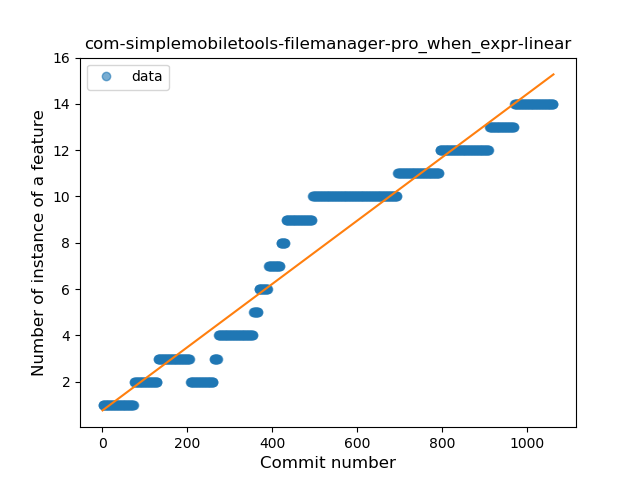
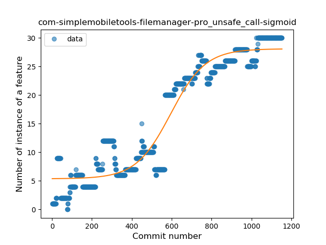

## com-simplemobiletools-filemanager-pro
----
#### Metrics provided by Detekt
* Number of lines of code 3142
* Number of Kotlin files: 23
* Cyclomatic complexity: 666
* Cyclomatic complexity by thousands of lines: 352 

----
**12** features analyzed

*	<a href="#type_inference">Type Inference</a> 
*	<a href="#lambda">Lambda</a> 
*	<a href="#safe_call">Safe Call</a> 
*	<a href="#when_expr">When expression</a> 
*	<a href="#unsafe_call">Unsafe Call</a> 
*	<a href="#companion_object">Companion Object</a> 
*	<a href="#string_template">String Template</a> 
*	<a href="#func_with_default_value">Function with Default Value</a> 
*	<a href="#singleton">Singleton</a> 
*	<a href="#range_expr">Range Expression</a> 
*	<a href="#func_call_with_named_arg">Function call with Named Argument</a> 
*	<a href="#extension_function">Extension Function</a> 

### <a name="type_inference">Type Inference</a>
----
#### Functions
* **Constant Rise - Linear:** 
    * **R_Squared:** 0.95842739
* **Sudden Rise - Exponential:** 
    * **R_Squared:** 0.96800187
* **Sudden Rise Plateau - Logarithm:** 
    * **R_Squared:** 0.43105719
* **Plateau Sudden Rise - Binary Sigmoid:** 
    * **R_Squared:** 0.19760878

**Plots** :chart_with_upwards_trend:
-----

### <a name="lambda">Lambda</a>
----
#### Functions
* **Constant Rise - Linear:** 
    * **R_Squared:** 0.98562131
* **Sudden Rise Plateau - Logarithm:** 
    * **R_Squared:** 0.38025583
* **Plateau Sudden Rise - Binary Sigmoid:** 
    * **R_Squared:** 0.23021284

**Plots** :chart_with_upwards_trend:
-----

### <a name="safe_call">Safe Call</a>
----
#### Functions
* **Constant Rise - Linear:** 
    * **R_Squared:** 0.96706677
* **Sudden Rise Plateau - Logarithm:** 
    * **R_Squared:** 0.38353444

**Plots** :chart_with_upwards_trend:
-----

### <a name="when_expr">When expression</a>
----
#### Functions
* **Plateau Gradual Rise - Sigmoid:** 
    * **R_Squared:** 0.96513743
* **Constant Rise - Linear:** 
    * **R_Squared:** 0.94189039
* **Sudden Rise Plateau - Logarithm:** 
    * **R_Squared:** 0.44670692

**Plots** :chart_with_upwards_trend:
-----

### <a name="unsafe_call">Unsafe Call</a>
----
#### Functions
* **Plateau Gradual Rise - Sigmoid:** 
    * **R_Squared:** 0.92423038
* **Constant Rise - Linear:** 
    * **R_Squared:** 0.8856408
* **Sudden Rise - Exponential:** 
    * **R_Squared:** 0.88616923
* **Sudden Rise Plateau - Logarithm:** 
    * **R_Squared:** 0.36089627

**Plots** :chart_with_upwards_trend:
-----

### <a name="companion_object">Companion Object</a>
----
#### Functions
* **Constant Decline - Linear:** 
    * **R_Squared:** 0.25077688
* **Sudden Rise Plateau - Logarithm:** 
    * **R_Squared:** 0.0

**Plots** :chart_with_upwards_trend:
-----

### <a name="string_template">String Template</a>
----
#### Functions
* **Plateau Gradual Rise - Sigmoid:** 
    * **R_Squared:** 0.94840779
* **Sudden Rise - Exponential:** 
    * **R_Squared:** 0.88268314
* **Constant Rise - Linear:** 
    * **R_Squared:** 0.83876044
* **Sudden Rise Plateau - Logarithm:** 
    * **R_Squared:** 0.26156002

**Plots** :chart_with_upwards_trend:
-----

### <a name="func_with_default_value">Function with Default Value</a>
----
#### Functions
* **Plateau Gradual Rise - Sigmoid:** 
    * **R_Squared:** 0.97677307
* **Sudden Rise - Exponential:** 
    * **R_Squared:** 0.86266217
* **Constant Rise - Linear:** 
    * **R_Squared:** 0.745724
* **Sudden Rise Plateau - Logarithm:** 
    * **R_Squared:** 0.17637739

**Plots** :chart_with_upwards_trend:
-----

### <a name="singleton">Singleton</a>
----
#### Functions
* **Plateau Sudden Decline - Binary Sigmoid:** 
    * **R_Squared:** 0.21362514
* **Sudden Decline - Exponential:** 
    * **R_Squared:** 0.09836247
* **Constant Decline - Linear:** 
    * **R_Squared:** 0.04871624
* **Sudden Rise Plateau - Logarithm:** 
    * **R_Squared:** -0.0

**Plots** :chart_with_upwards_trend:
-----

### <a name="range_expr">Range Expression</a>
----
#### Functions
* **Constant Decline - Linear:** 
    * **R_Squared:** 0.04755773
* **Sudden Rise Plateau - Logarithm:** 
    * **R_Squared:** -0.0

**Plots** :chart_with_upwards_trend:
-----

### <a name="func_call_with_named_arg">Function call with Named Argument</a>
----
#### Functions
* **Constant Rise - Linear:** 
    * **R_Squared:** 0.47385907
* **Sudden Rise Plateau - Logarithm:** 
    * **R_Squared:** 0.35361583

**Plots** :chart_with_upwards_trend:
-----

### <a name="extension_function">Extension Function</a>
----
#### Functions
* **Sudden Rise - Exponential:** 
    * **R_Squared:** 0.05883669
* **Constant Rise - Linear:** 
    * **R_Squared:** 0.01414275
* **Plateau Sudden Rise - Binary Sigmoid:** 
    * **R_Squared:** 0.01788141
* **Sudden Rise Plateau - Logarithm:** 
    * **R_Squared:** -0.0

**Plots** :chart_with_upwards_trend:
-----

