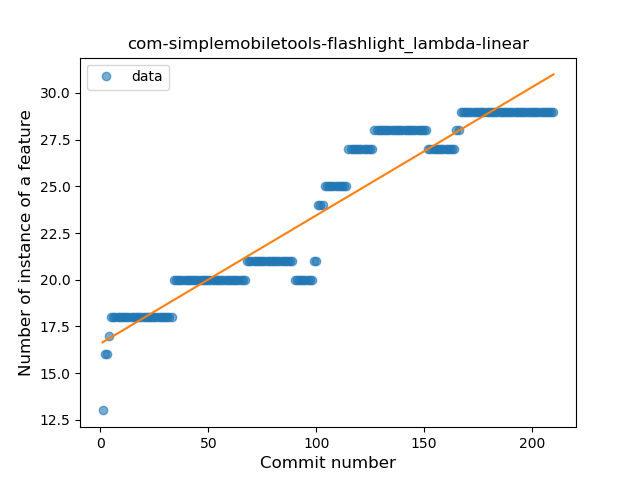
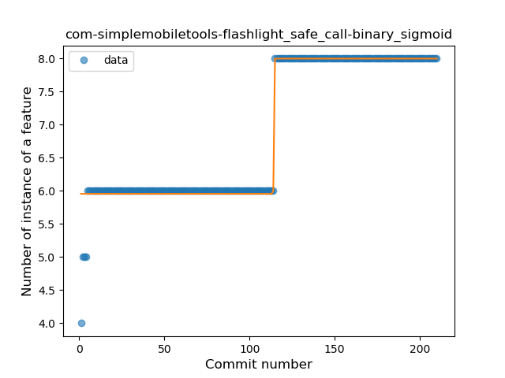
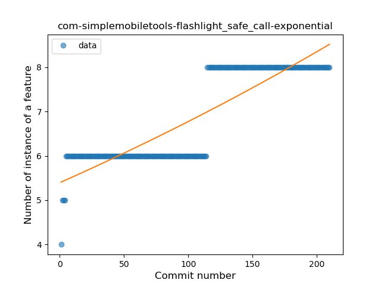
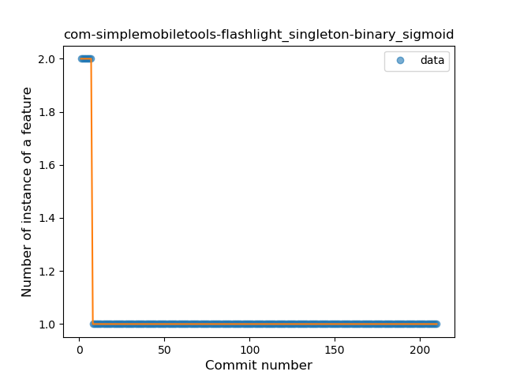
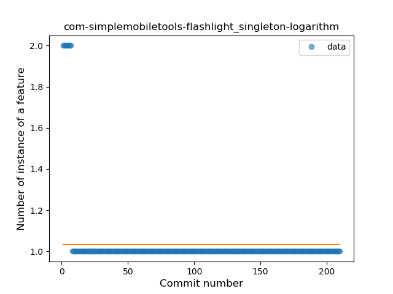

## com-simplemobiletools-flashlight
----
#### Metrics provided by Detekt
* Number of lines of code 1193
* Number of Kotlin files: 16
* Cyclomatic complexity: 208
* Cyclomatic complexity by thousands of lines: 313 

----
**9** features analyzed

*	<a href="#type_inference">Type Inference</a> 
*	<a href="#lambda">Lambda</a> 
*	<a href="#safe_call">Safe Call</a> 
*	<a href="#when_expr">When expression</a> 
*	<a href="#unsafe_call">Unsafe Call</a> 
*	<a href="#companion_object">Companion Object</a> 
*	<a href="#string_template">String Template</a> 
*	<a href="#singleton">Singleton</a> 
*	<a href="#extension_function">Extension Function</a> 

### <a name="type_inference">Type Inference</a>
----
#### Functions
* **Sudden Rise - Exponential:** 
    * **R_Squared:** 0.92610601
* **Constant Rise - Linear:** 
    * **R_Squared:** 0.88803636
* **Sudden Rise Plateau - Logarithm:** 
    * **R_Squared:** 0.59146285

**Plots** :chart_with_upwards_trend:
-----

### <a name="lambda">Lambda</a>
----
#### Functions
* **Constant Rise - Linear:** 
    * **R_Squared:** 0.90790229
* **Sudden Rise Plateau - Logarithm:** 
    * **R_Squared:** 0.73246049

**Plots** :chart_with_upwards_trend:
-----

### <a name="safe_call">Safe Call</a>
----
#### Functions
* **Plateau Sudden Rise - Binary Sigmoid:** 
    * **R_Squared:** 0.96980251
* **Constant Rise - Linear:** 
    * **R_Squared:** 0.75815996
* **Sudden Rise - Exponential:** 
    * **R_Squared:** 0.75949771
* **Sudden Rise Plateau - Logarithm:** 
    * **R_Squared:** 0.56220341

**Plots** :chart_with_upwards_trend:
-----

### <a name="when_expr">When expression</a>
----
#### Functions
* **Sudden Rise Plateau - Logarithm:** 
    * **R_Squared:** 0.10019913
* **Constant Rise - Linear:** 
    * **R_Squared:** 0.01421801

**Plots** :chart_with_upwards_trend:
-----

### <a name="unsafe_call">Unsafe Call</a>
----
#### Functions
* **Sudden Rise - Exponential:** 
    * **R_Squared:** 0.31795768
* **Constant Rise - Linear:** 
    * **R_Squared:** 0.17699202
* **Sudden Rise Plateau - Logarithm:** 
    * **R_Squared:** 0.00218766

**Plots** :chart_with_upwards_trend:
-----

### <a name="companion_object">Companion Object</a>
----
#### Functions
* **Sudden Decline - Exponential:** 
    * **R_Squared:** 0.94199144
* **Constant Decline - Linear:** 
    * **R_Squared:** 0.05008271
* **Sudden Rise Plateau - Logarithm:** 
    * **R_Squared:** -0.0

**Plots** :chart_with_upwards_trend:
-----

### <a name="string_template">String Template</a>
----
#### Functions
* **Sudden Decline - Exponential:** 
    * **R_Squared:** 1.0
* **Constant Decline - Linear:** 
    * **R_Squared:** 0.01442308
* **Sudden Rise Plateau - Logarithm:** 
    * **R_Squared:** -0.0

**Plots** :chart_with_upwards_trend:
-----

### <a name="singleton">Singleton</a>
----
#### Functions
* **Plateau Sudden Decline - Binary Sigmoid:** 
    * **R_Squared:** 1.0
* **Sudden Decline - Exponential:** 
    * **R_Squared:** 0.81112725
* **Constant Decline - Linear:** 
    * **R_Squared:** 0.09666886
* **Sudden Rise Plateau - Logarithm:** 
    * **R_Squared:** -0.0

**Plots** :chart_with_upwards_trend:
-----

### <a name="extension_function">Extension Function</a>
----
#### Functions
* **Plateau Sudden Rise - Binary Sigmoid:** 
    * **R_Squared:** 1.0
* **Sudden Rise Plateau - Logarithm:** 
    * **R_Squared:** 0.27415275
* **Constant Rise - Linear:** 
    * **R_Squared:** 0.05685213

**Plots** :chart_with_upwards_trend:
-----

