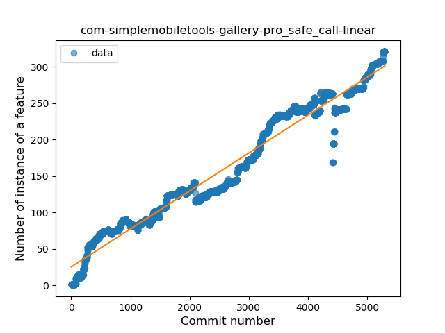
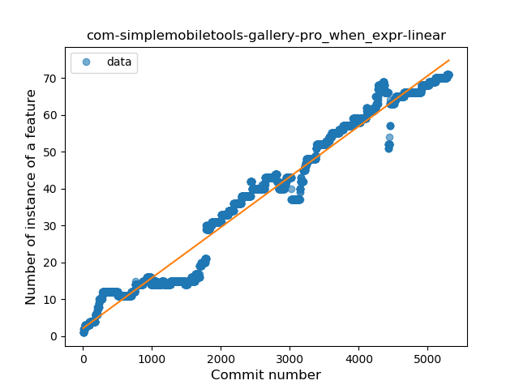
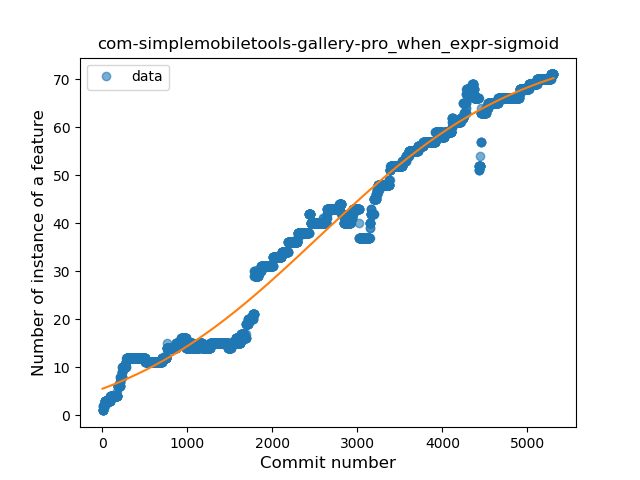
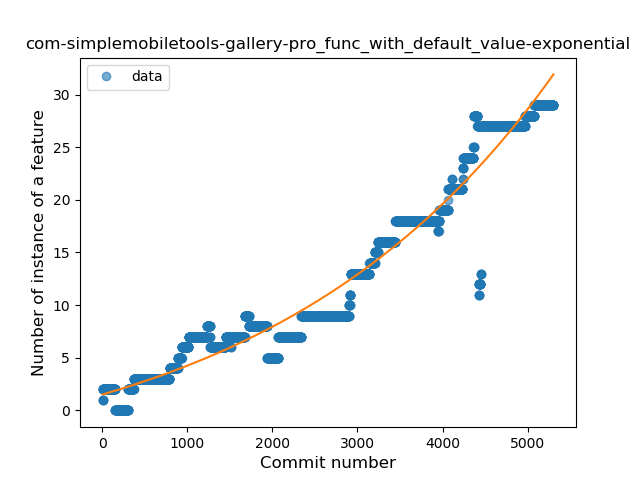
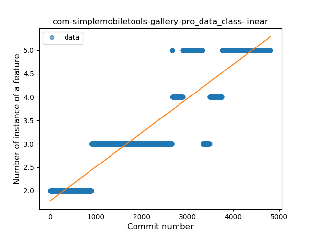

## com-simplemobiletools-gallery-pro
----
#### Metrics provided by Detekt
* Number of lines of code 16606
* Number of Kotlin files: 89
* Cyclomatic complexity: 3513
* Cyclomatic complexity by thousands of lines: 353 

----
**15** features analyzed

*	<a href="#type_inference">Type Inference</a> 
*	<a href="#lambda">Lambda</a> 
*	<a href="#safe_call">Safe Call</a> 
*	<a href="#when_expr">When expression</a> 
*	<a href="#unsafe_call">Unsafe Call</a> 
*	<a href="#companion_object">Companion Object</a> 
*	<a href="#string_template">String Template</a> 
*	<a href="#func_with_default_value">Function with Default Value</a> 
*	<a href="#singleton">Singleton</a> 
*	<a href="#range_expr">Range Expression</a> 
*	<a href="#smart_cast">Smart Cast</a> 
*	<a href="#data_class">Data Class</a> 
*	<a href="#func_call_with_named_arg">Function call with Named Argument</a> 
*	<a href="#extension_function">Extension Function</a> 
*	<a href="#destructuring_declaration">Destructuring Declaration</a> 

### <a name="type_inference">Type Inference</a>
----
#### Functions
* **Constant Rise - Linear:** 
    * **R_Squared:** 0.97369495
* **Sudden Rise - Exponential:** 
    * **R_Squared:** 0.98151712
* **Sudden Rise Plateau - Logarithm:** 
    * **R_Squared:** 0.38270922
* **Plateau Sudden Rise - Binary Sigmoid:** 
    * **R_Squared:** 0.08443981

**Plots** :chart_with_upwards_trend:
-----

### <a name="lambda">Lambda</a>
----
#### Functions
* **Sudden Rise - Exponential:** 
    * **R_Squared:** 0.98476696
* **Constant Rise - Linear:** 
    * **R_Squared:** 0.97027709
* **Sudden Rise Plateau - Logarithm:** 
    * **R_Squared:** 0.30057298
* **Plateau Sudden Rise - Binary Sigmoid:** 
    * **R_Squared:** 0.09752289

**Plots** :chart_with_upwards_trend:
-----

### <a name="safe_call">Safe Call</a>
----
#### Functions
* **Constant Rise - Linear:** 
    * **R_Squared:** 0.96342056
* **Sudden Rise - Exponential:** 
    * **R_Squared:** 0.96389189
* **Sudden Rise Plateau - Logarithm:** 
    * **R_Squared:** 0.3927322
* **Plateau Sudden Rise - Binary Sigmoid:** 
    * **R_Squared:** 0.11670258

**Plots** :chart_with_upwards_trend:
-----

### <a name="when_expr">When expression</a>
----
#### Functions
* **Constant Rise - Linear:** 
    * **R_Squared:** 0.97054873
* **Sudden Rise - Exponential:** 
    * **R_Squared:** 0.97023137
* **Plateau Gradual Rise - Sigmoid:** 
    * **R_Squared:** 0.97708106
* **Sudden Rise Plateau - Logarithm:** 
    * **R_Squared:** 0.3532863

**Plots** :chart_with_upwards_trend:
-----

### <a name="unsafe_call">Unsafe Call</a>
----
#### Functions
* **Constant Rise - Linear:** 
    * **R_Squared:** 0.74426879
* **Sudden Rise - Exponential:** 
    * **R_Squared:** 0.74132036
* **Sudden Rise Plateau - Logarithm:** 
    * **R_Squared:** 0.40856107
* **Plateau Sudden Rise - Binary Sigmoid:** 
    * **R_Squared:** 0.10540459

**Plots** :chart_with_upwards_trend:
-----

### <a name="companion_object">Companion Object</a>
----
#### Functions
* **Sudden Decline - Exponential:** 
    * **R_Squared:** 0.40045019
* **Constant Decline - Linear:** 
    * **R_Squared:** 0.37867351
* **Sudden Rise Plateau - Logarithm:** 
    * **R_Squared:** -0.0

**Plots** :chart_with_upwards_trend:
-----

### <a name="string_template">String Template</a>
----
#### Functions
* **Constant Rise - Linear:** 
    * **R_Squared:** 0.93525194
* **Sudden Rise - Exponential:** 
    * **R_Squared:** 0.93711321
* **Sudden Rise Plateau - Logarithm:** 
    * **R_Squared:** 0.41688749

**Plots** :chart_with_upwards_trend:
-----

### <a name="func_with_default_value">Function with Default Value</a>
----
#### Functions
* **Sudden Rise - Exponential:** 
    * **R_Squared:** 0.9589246
* **Plateau Gradual Rise - Sigmoid:** 
    * **R_Squared:** 0.9624951
* **Constant Rise - Linear:** 
    * **R_Squared:** 0.9197289
* **Sudden Rise Plateau - Logarithm:** 
    * **R_Squared:** 0.2644479

**Plots** :chart_with_upwards_trend:
-----

### <a name="singleton">Singleton</a>
----
#### Functions
* **Sudden Rise - Exponential:** 
    * **R_Squared:** 0.55093856
* **Constant Rise - Linear:** 
    * **R_Squared:** 0.42520105
* **Sudden Rise Plateau - Logarithm:** 
    * **R_Squared:** 0.05204487
* **Plateau Sudden Decline - Binary Sigmoid:** 
    * **R_Squared:** 0.00913336

**Plots** :chart_with_upwards_trend:
-----

### <a name="range_expr">Range Expression</a>
----
#### Functions
* **Constant Decline - Linear:** 
    * **R_Squared:** 0.12086908
* **Sudden Rise Plateau - Logarithm:** 
    * **R_Squared:** 0.0

**Plots** :chart_with_upwards_trend:
-----

### <a name="smart_cast">Smart Cast</a>
----
#### Functions
* **Plateau Gradual Rise - Sigmoid:** 
    * **R_Squared:** 0.96459846
* **Sudden Rise - Exponential:** 
    * **R_Squared:** 0.67971103
* **Constant Rise - Linear:** 
    * **R_Squared:** 0.66894505
* **Sudden Rise Plateau - Logarithm:** 
    * **R_Squared:** 0.16230052

**Plots** :chart_with_upwards_trend:
-----

### <a name="data_class">Data Class</a>
----
#### Functions
* **Constant Rise - Linear:** 
    * **R_Squared:** 0.82259361
* **Plateau Gradual Rise - Sigmoid:** 
    * **R_Squared:** 0.82439698
* **Sudden Rise Plateau - Logarithm:** 
    * **R_Squared:** 0.48042411

**Plots** :chart_with_upwards_trend:
-----

### <a name="func_call_with_named_arg">Function call with Named Argument</a>
----
#### Functions
* **Sudden Rise - Exponential:** 
    * **R_Squared:** 0.84217817
* **Constant Rise - Linear:** 
    * **R_Squared:** 0.70806147
* **Sudden Rise Plateau - Logarithm:** 
    * **R_Squared:** 0.19974224

**Plots** :chart_with_upwards_trend:
-----

### <a name="extension_function">Extension Function</a>
----
#### Functions
* **Constant Rise - Linear:** 
    * **R_Squared:** 0.90348331
* **Sudden Rise Plateau - Logarithm:** 
    * **R_Squared:** 0.39742409

**Plots** :chart_with_upwards_trend:
-----

### <a name="destructuring_declaration">Destructuring Declaration</a>
----
#### Functions
* **Constant Rise - Linear:** 
    * **R_Squared:** 0.73607491
* **Sudden Rise Plateau - Logarithm:** 
    * **R_Squared:** 0.36533436

**Plots** :chart_with_upwards_trend:
-----

