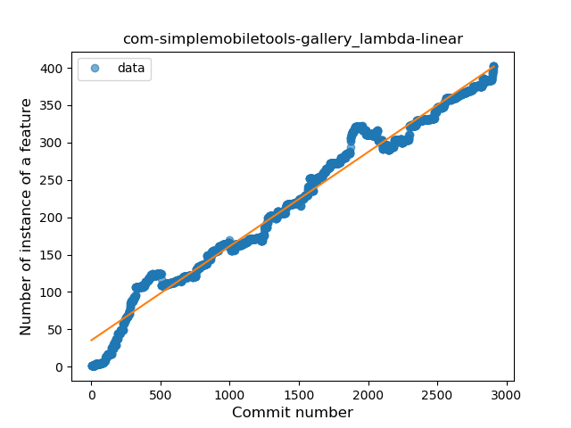
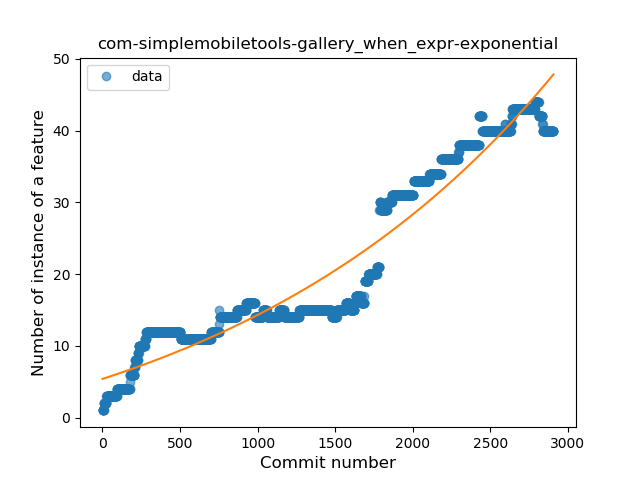
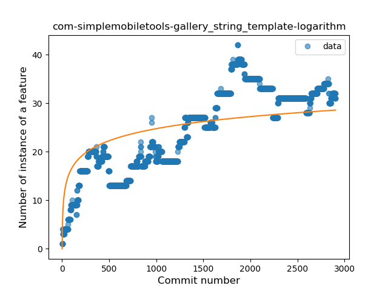
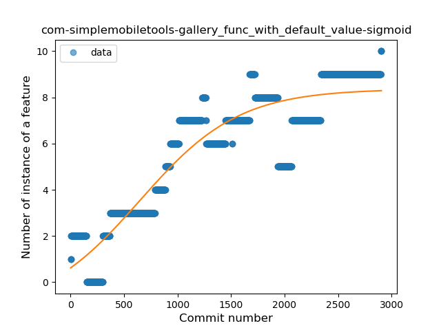
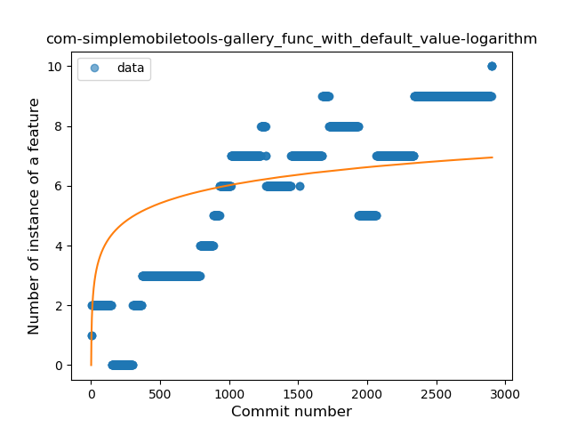
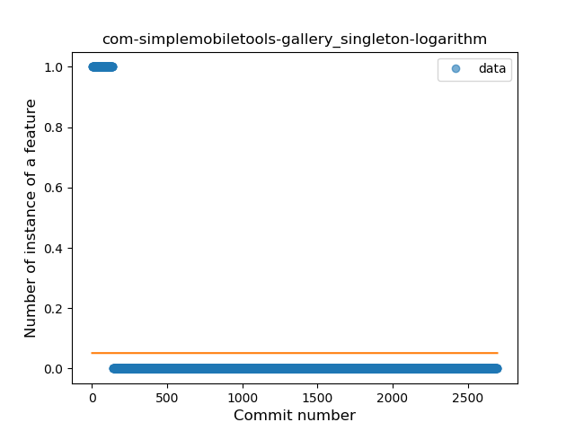

## com-simplemobiletools-gallery
----
#### Metrics provided by Detekt
* Number of lines of code 8489
* Number of Kotlin files: 57
* Cyclomatic complexity: 1754
* Cyclomatic complexity by thousands of lines: 351 

----
**15** features analyzed

*	<a href="#type_inference">Type Inference</a> 
*	<a href="#lambda">Lambda</a> 
*	<a href="#safe_call">Safe Call</a> 
*	<a href="#when_expr">When expression</a> 
*	<a href="#unsafe_call">Unsafe Call</a> 
*	<a href="#companion_object">Companion Object</a> 
*	<a href="#string_template">String Template</a> 
*	<a href="#func_with_default_value">Function with Default Value</a> 
*	<a href="#singleton">Singleton</a> 
*	<a href="#range_expr">Range Expression</a> 
*	<a href="#smart_cast">Smart Cast</a> 
*	<a href="#data_class">Data Class</a> 
*	<a href="#func_call_with_named_arg">Function call with Named Argument</a> 
*	<a href="#extension_function">Extension Function</a> 
*	<a href="#destructuring_declaration">Destructuring Declaration</a> 

### <a name="type_inference">Type Inference</a>
----
#### Functions
* **Constant Rise - Linear:** 
    * **R_Squared:** 0.93324545
* **Sudden Rise Plateau - Logarithm:** 
    * **R_Squared:** 0.58133608
* **Plateau Sudden Rise - Binary Sigmoid:** 
    * **R_Squared:** 0.38608897

**Plots** :chart_with_upwards_trend:
-----

### <a name="lambda">Lambda</a>
----
#### Functions
* **Constant Rise - Linear:** 
    * **R_Squared:** 0.97576613
* **Sudden Rise Plateau - Logarithm:** 
    * **R_Squared:** 0.44468067
* **Plateau Sudden Rise - Binary Sigmoid:** 
    * **R_Squared:** 0.38856237

**Plots** :chart_with_upwards_trend:
-----

### <a name="safe_call">Safe Call</a>
----
#### Functions
* **Constant Rise - Linear:** 
    * **R_Squared:** 0.88649388
* **Sudden Rise Plateau - Logarithm:** 
    * **R_Squared:** 0.55985374
* **Plateau Sudden Rise - Binary Sigmoid:** 
    * **R_Squared:** 0.2496987

**Plots** :chart_with_upwards_trend:
-----

### <a name="when_expr">When expression</a>
----
#### Functions
* **Sudden Rise - Exponential:** 
    * **R_Squared:** 0.9282797
* **Constant Rise - Linear:** 
    * **R_Squared:** 0.89956815
* **Sudden Rise Plateau - Logarithm:** 
    * **R_Squared:** 0.33384761

**Plots** :chart_with_upwards_trend:
-----

### <a name="unsafe_call">Unsafe Call</a>
----
#### Functions
* **Sudden Rise - Exponential:** 
    * **R_Squared:** 0.86068532
* **Constant Rise - Linear:** 
    * **R_Squared:** 0.77123668
* **Sudden Rise Plateau - Logarithm:** 
    * **R_Squared:** 0.30467992
* **Plateau Sudden Rise - Binary Sigmoid:** 
    * **R_Squared:** 0.06384174

**Plots** :chart_with_upwards_trend:
-----

### <a name="companion_object">Companion Object</a>
----
#### Functions
* **Constant Decline - Linear:** 
    * **R_Squared:** 0.38017056
* **Sudden Rise Plateau - Logarithm:** 
    * **R_Squared:** -0.0

**Plots** :chart_with_upwards_trend:
-----

### <a name="string_template">String Template</a>
----
#### Functions
* **Constant Rise - Linear:** 
    * **R_Squared:** 0.7527325
* **Sudden Rise Plateau - Logarithm:** 
    * **R_Squared:** 0.52333427
* **Plateau Sudden Rise - Binary Sigmoid:** 
    * **R_Squared:** 0.09089585

**Plots** :chart_with_upwards_trend:
-----

### <a name="func_with_default_value">Function with Default Value</a>
----
#### Functions
* **Plateau Gradual Rise - Sigmoid:** 
    * **R_Squared:** 0.84567428
* **Constant Rise - Linear:** 
    * **R_Squared:** 0.78859558
* **Sudden Rise Plateau - Logarithm:** 
    * **R_Squared:** 0.43402738

**Plots** :chart_with_upwards_trend:
-----

### <a name="singleton">Singleton</a>
----
#### Functions
* **Plateau Sudden Decline - Binary Sigmoid:** 
    * **R_Squared:** 1.0
* **Sudden Decline - Exponential:** 
    * **R_Squared:** 0.80573355
* **Constant Decline - Linear:** 
    * **R_Squared:** 0.14564943
* **Sudden Rise Plateau - Logarithm:** 
    * **R_Squared:** -0.0

**Plots** :chart_with_upwards_trend:
-----

### <a name="range_expr">Range Expression</a>
----
#### Functions
* **Sudden Rise Plateau - Logarithm:** 
    * **R_Squared:** 0.02814332
* **Constant Rise - Linear:** 
    * **R_Squared:** 0.00032559
* **Sudden Rise - Exponential:** 
    * **R_Squared:** 5.698e-05
* **Plateau Sudden Rise - Binary Sigmoid:** 
    * **R_Squared:** 0.000455

**Plots** :chart_with_upwards_trend:
-----

### <a name="smart_cast">Smart Cast</a>
----
#### Functions
* **Constant Decline - Linear:** 
    * **R_Squared:** 0.57270415
* **Plateau Gradual Decline - Sigmoid:** 
    * **R_Squared:** 0.57270373
* **Sudden Rise Plateau - Logarithm:** 
    * **R_Squared:** -0.0

**Plots** :chart_with_upwards_trend:
-----

### <a name="data_class">Data Class</a>
----
#### Functions
* **Plateau Sudden Rise - Binary Sigmoid:** 
    * **R_Squared:** 1.0
* **Constant Rise - Linear:** 
    * **R_Squared:** 0.70335785
* **Sudden Rise Plateau - Logarithm:** 
    * **R_Squared:** 0.58267899

**Plots** :chart_with_upwards_trend:
-----

### <a name="func_call_with_named_arg">Function call with Named Argument</a>
----
#### Functions
* **Constant Rise - Linear:** 
    * **R_Squared:** 0.46867015
* **Sudden Rise Plateau - Logarithm:** 
    * **R_Squared:** 0.20162133

**Plots** :chart_with_upwards_trend:
-----

### <a name="extension_function">Extension Function</a>
----
#### Functions
* **Constant Rise - Linear:** 
    * **R_Squared:** 0.66009621
* **Sudden Rise Plateau - Logarithm:** 
    * **R_Squared:** 0.52201249
* **Plateau Sudden Rise - Binary Sigmoid:** 
    * **R_Squared:** 0.07201302

**Plots** :chart_with_upwards_trend:
-----

### <a name="destructuring_declaration">Destructuring Declaration</a>
----
#### Functions
* **Plateau Gradual Rise - Sigmoid:** 
    * **R_Squared:** 0.92653773
* **Constant Rise - Linear:** 
    * **R_Squared:** 0.79347179
* **Sudden Rise Plateau - Logarithm:** 
    * **R_Squared:** 0.30909458

**Plots** :chart_with_upwards_trend:
-----

