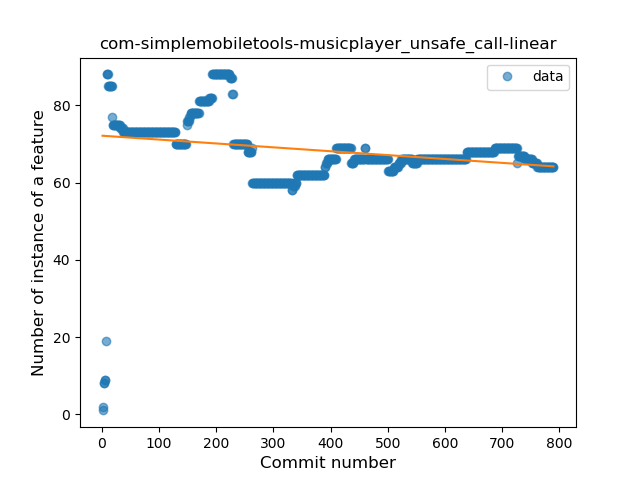
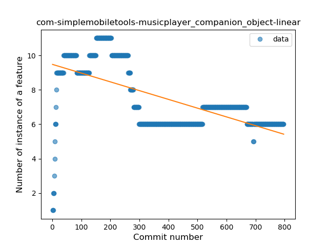
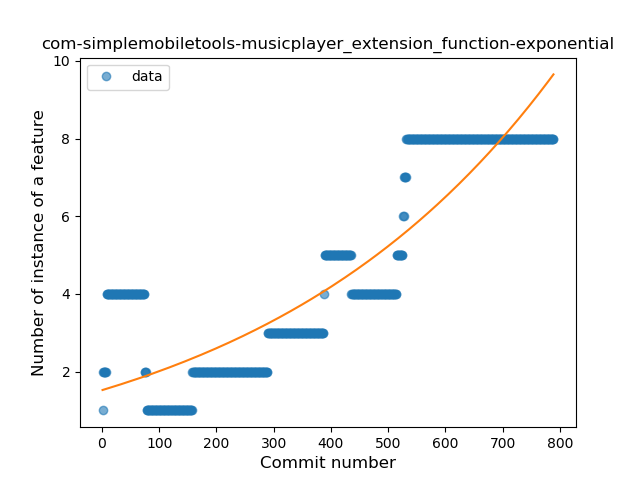

## com-simplemobiletools-musicplayer
----
#### Metrics provided by Detekt
* Number of lines of code 3974
* Number of Kotlin files: 35
* Cyclomatic complexity: 799
* Cyclomatic complexity by thousands of lines: 342 

----
**13** features analyzed

*	<a href="#type_inference">Type Inference</a> 
*	<a href="#lambda">Lambda</a> 
*	<a href="#safe_call">Safe Call</a> 
*	<a href="#when_expr">When expression</a> 
*	<a href="#unsafe_call">Unsafe Call</a> 
*	<a href="#companion_object">Companion Object</a> 
*	<a href="#string_template">String Template</a> 
*	<a href="#func_with_default_value">Function with Default Value</a> 
*	<a href="#range_expr">Range Expression</a> 
*	<a href="#smart_cast">Smart Cast</a> 
*	<a href="#data_class">Data Class</a> 
*	<a href="#func_call_with_named_arg">Function call with Named Argument</a> 
*	<a href="#extension_function">Extension Function</a> 

### <a name="type_inference">Type Inference</a>
----
#### Functions
* **Sudden Rise Plateau - Logarithm:** 
    * **R_Squared:** 0.85349347
* **Constant Rise - Linear:** 
    * **R_Squared:** 0.79645558
* **Plateau Sudden Rise - Binary Sigmoid:** 
    * **R_Squared:** 0.63132495

**Plots** :chart_with_upwards_trend:
-----

### <a name="lambda">Lambda</a>
----
#### Functions
* **Constant Rise - Linear:** 
    * **R_Squared:** 0.9662526
* **Sudden Rise Plateau - Logarithm:** 
    * **R_Squared:** 0.57982077
* **Plateau Sudden Rise - Binary Sigmoid:** 
    * **R_Squared:** 0.40406269

**Plots** :chart_with_upwards_trend:
-----

### <a name="safe_call">Safe Call</a>
----
#### Functions
* **Plateau Gradual Rise - Sigmoid:** 
    * **R_Squared:** 0.91972715
* **Constant Rise - Linear:** 
    * **R_Squared:** 0.88220702
* **Sudden Rise Plateau - Logarithm:** 
    * **R_Squared:** 0.47502145

**Plots** :chart_with_upwards_trend:
-----

### <a name="when_expr">When expression</a>
----
#### Functions
* **Plateau Gradual Rise - Sigmoid:** 
    * **R_Squared:** 0.98085325
* **Constant Rise - Linear:** 
    * **R_Squared:** 0.93209521
* **Sudden Rise Plateau - Logarithm:** 
    * **R_Squared:** 0.57089111

**Plots** :chart_with_upwards_trend:
-----

### <a name="unsafe_call">Unsafe Call</a>
----
#### Functions
* **Constant Decline - Linear:** 
    * **R_Squared:** 0.06785051
* **Sudden Decline - Exponential:** 
    * **R_Squared:** 0.07325696
* **Sudden Rise Plateau - Logarithm:** 
    * **R_Squared:** -0.0
* **Plateau Gradual Rise - Sigmoid:** 
    * **R_Squared:** 0.00012133

**Plots** :chart_with_upwards_trend:
-----

### <a name="companion_object">Companion Object</a>
----
#### Functions
* **Constant Decline - Linear:** 
    * **R_Squared:** 0.40405277
* **Sudden Decline - Exponential:** 
    * **R_Squared:** 0.41400904
* **Plateau Sudden Decline - Binary Sigmoid:** 
    * **R_Squared:** 0.17569528
* **Sudden Rise Plateau - Logarithm:** 
    * **R_Squared:** 0.0

**Plots** :chart_with_upwards_trend:
-----

### <a name="string_template">String Template</a>
----
#### Functions
* **Plateau Gradual Rise - Sigmoid:** 
    * **R_Squared:** 0.38306676
* **Sudden Rise Plateau - Logarithm:** 
    * **R_Squared:** 0.07819482
* **Constant Decline - Linear:** 
    * **R_Squared:** 0.00251396
* **Sudden Decline - Exponential:** 
    * **R_Squared:** 0.00043432

**Plots** :chart_with_upwards_trend:
-----

### <a name="func_with_default_value">Function with Default Value</a>
----
#### Functions
* **Plateau Gradual Rise - Sigmoid:** 
    * **R_Squared:** 0.92455063
* **Sudden Rise Plateau - Logarithm:** 
    * **R_Squared:** 0.5283199
* **Constant Rise - Linear:** 
    * **R_Squared:** 0.36674576

**Plots** :chart_with_upwards_trend:
-----

### <a name="range_expr">Range Expression</a>
----
#### Functions
* **Plateau Gradual Rise - Sigmoid:** 
    * **R_Squared:** 0.14277078
* **Constant Decline - Linear:** 
    * **R_Squared:** 0.03099504
* **Sudden Rise Plateau - Logarithm:** 
    * **R_Squared:** 0.00602886

**Plots** :chart_with_upwards_trend:
-----

### <a name="smart_cast">Smart Cast</a>
----
#### Functions
* **Sudden Decline - Exponential:** 
    * **R_Squared:** 0.8430461
* **Plateau Sudden Decline - Binary Sigmoid:** 
    * **R_Squared:** 0.32999165
* **Constant Decline - Linear:** 
    * **R_Squared:** 0.01488806
* **Sudden Rise Plateau - Logarithm:** 
    * **R_Squared:** -0.0

**Plots** :chart_with_upwards_trend:
-----

### <a name="data_class">Data Class</a>
----
#### Functions
* **Plateau Sudden Rise - Binary Sigmoid:** 
    * **R_Squared:** 1.0
* **Sudden Rise Plateau - Logarithm:** 
    * **R_Squared:** 0.52416304
* **Constant Rise - Linear:** 
    * **R_Squared:** 0.18763496

**Plots** :chart_with_upwards_trend:
-----

### <a name="func_call_with_named_arg">Function call with Named Argument</a>
----
#### Functions
* **Plateau Gradual Rise - Sigmoid:** 
    * **R_Squared:** 0.56034696
* **Sudden Rise Plateau - Logarithm:** 
    * **R_Squared:** 0.26271476
* **Constant Rise - Linear:** 
    * **R_Squared:** 0.21458024

**Plots** :chart_with_upwards_trend:
-----

### <a name="extension_function">Extension Function</a>
----
#### Functions
* **Plateau Gradual Rise - Sigmoid:** 
    * **R_Squared:** 0.87699607
* **Sudden Rise - Exponential:** 
    * **R_Squared:** 0.78919289
* **Constant Rise - Linear:** 
    * **R_Squared:** 0.74696939
* **Sudden Rise Plateau - Logarithm:** 
    * **R_Squared:** 0.28301796

**Plots** :chart_with_upwards_trend:
-----

