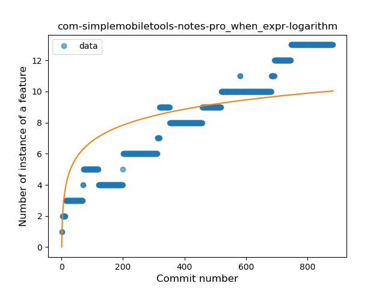
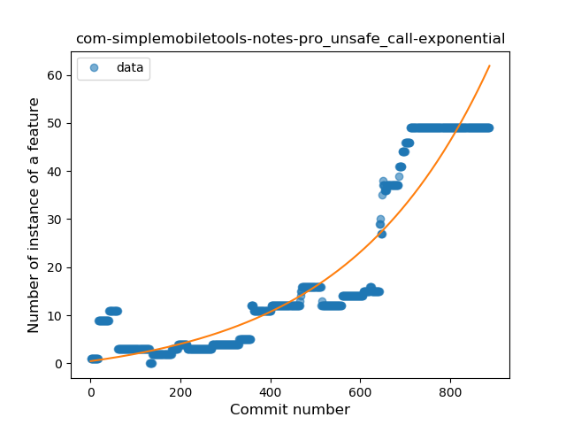
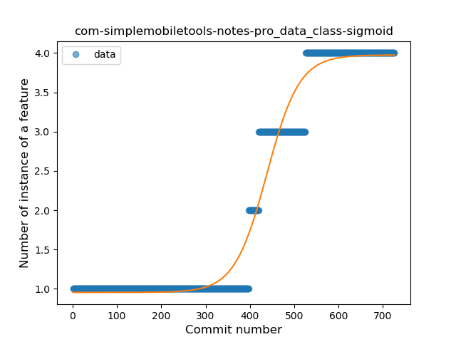
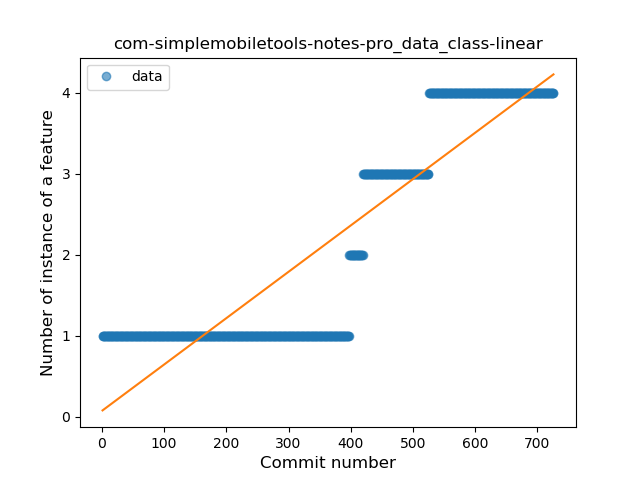

## com-simplemobiletools-notes-pro
----
#### Metrics provided by Detekt
* Number of lines of code 3280
* Number of Kotlin files: 41
* Cyclomatic complexity: 578
* Cyclomatic complexity by thousands of lines: 321 

----
**13** features analyzed

*	<a href="#type_inference">Type Inference</a> 
*	<a href="#lambda">Lambda</a> 
*	<a href="#safe_call">Safe Call</a> 
*	<a href="#when_expr">When expression</a> 
*	<a href="#unsafe_call">Unsafe Call</a> 
*	<a href="#companion_object">Companion Object</a> 
*	<a href="#string_template">String Template</a> 
*	<a href="#func_with_default_value">Function with Default Value</a> 
*	<a href="#singleton">Singleton</a> 
*	<a href="#range_expr">Range Expression</a> 
*	<a href="#data_class">Data Class</a> 
*	<a href="#func_call_with_named_arg">Function call with Named Argument</a> 
*	<a href="#extension_function">Extension Function</a> 

### <a name="type_inference">Type Inference</a>
----
#### Functions
* **Constant Rise - Linear:** 
    * **R_Squared:** 0.86126254
* **Sudden Rise Plateau - Logarithm:** 
    * **R_Squared:** 0.6640566
* **Plateau Sudden Rise - Binary Sigmoid:** 
    * **R_Squared:** 0.31997321

**Plots** :chart_with_upwards_trend:
-----

### <a name="lambda">Lambda</a>
----
#### Functions
* **Sudden Rise - Exponential:** 
    * **R_Squared:** 0.97671206
* **Constant Rise - Linear:** 
    * **R_Squared:** 0.96324943
* **Sudden Rise Plateau - Logarithm:** 
    * **R_Squared:** 0.40142952
* **Plateau Sudden Rise - Binary Sigmoid:** 
    * **R_Squared:** 0.2497022

**Plots** :chart_with_upwards_trend:
-----

### <a name="safe_call">Safe Call</a>
----
#### Functions
* **Sudden Rise - Exponential:** 
    * **R_Squared:** 0.97741583
* **Constant Rise - Linear:** 
    * **R_Squared:** 0.96308295
* **Sudden Rise Plateau - Logarithm:** 
    * **R_Squared:** 0.35034488

**Plots** :chart_with_upwards_trend:
-----

### <a name="when_expr">When expression</a>
----
#### Functions
* **Constant Rise - Linear:** 
    * **R_Squared:** 0.95449463
* **Sudden Rise Plateau - Logarithm:** 
    * **R_Squared:** 0.58440981

**Plots** :chart_with_upwards_trend:
-----

### <a name="unsafe_call">Unsafe Call</a>
----
#### Functions
* **Sudden Rise - Exponential:** 
    * **R_Squared:** 0.88927411
* **Constant Rise - Linear:** 
    * **R_Squared:** 0.76930693
* **Sudden Rise Plateau - Logarithm:** 
    * **R_Squared:** 0.19787671
* **Plateau Sudden Rise - Binary Sigmoid:** 
    * **R_Squared:** 0.01797649

**Plots** :chart_with_upwards_trend:
-----

### <a name="companion_object">Companion Object</a>
----
#### Functions
* **Plateau Sudden Rise - Binary Sigmoid:** 
    * **R_Squared:** 0.19665609
* **Sudden Rise - Exponential:** 
    * **R_Squared:** 0.05566909
* **Constant Rise - Linear:** 
    * **R_Squared:** 0.01711425
* **Sudden Rise Plateau - Logarithm:** 
    * **R_Squared:** 0.02204564

**Plots** :chart_with_upwards_trend:
-----

### <a name="string_template">String Template</a>
----
#### Functions
* **Constant Decline - Linear:** 
    * **R_Squared:** 0.09831859
* **Sudden Rise Plateau - Logarithm:** 
    * **R_Squared:** 0.0

**Plots** :chart_with_upwards_trend:
-----

### <a name="func_with_default_value">Function with Default Value</a>
----
#### Functions
* **Plateau Gradual Rise - Sigmoid:** 
    * **R_Squared:** 0.94919642
* **Sudden Rise - Exponential:** 
    * **R_Squared:** 0.93386789
* **Constant Rise - Linear:** 
    * **R_Squared:** 0.88881848
* **Sudden Rise Plateau - Logarithm:** 
    * **R_Squared:** 0.36942692

**Plots** :chart_with_upwards_trend:
-----

### <a name="singleton">Singleton</a>
----
#### Functions
* **Plateau Sudden Decline - Binary Sigmoid:** 
    * **R_Squared:** 0.71231433
* **Sudden Decline - Exponential:** 
    * **R_Squared:** 0.56812935
* **Constant Decline - Linear:** 
    * **R_Squared:** 0.05457691
* **Sudden Rise Plateau - Logarithm:** 
    * **R_Squared:** 0.0

**Plots** :chart_with_upwards_trend:
-----

### <a name="range_expr">Range Expression</a>
----
#### Functions
* **Plateau Sudden Decline - Binary Sigmoid:** 
    * **R_Squared:** 0.99144764
* **Sudden Decline - Exponential:** 
    * **R_Squared:** 0.76767566
* **Constant Decline - Linear:** 
    * **R_Squared:** 0.42232414
* **Sudden Rise Plateau - Logarithm:** 
    * **R_Squared:** -0.0

**Plots** :chart_with_upwards_trend:
-----

### <a name="data_class">Data Class</a>
----
#### Functions
* **Plateau Gradual Rise - Sigmoid:** 
    * **R_Squared:** 0.97011433
* **Sudden Rise - Exponential:** 
    * **R_Squared:** 0.85493568
* **Constant Rise - Linear:** 
    * **R_Squared:** 0.80863657
* **Sudden Rise Plateau - Logarithm:** 
    * **R_Squared:** 0.30376467

**Plots** :chart_with_upwards_trend:
-----

### <a name="func_call_with_named_arg">Function call with Named Argument</a>
----
#### Functions
* **Plateau Gradual Rise - Sigmoid:** 
    * **R_Squared:** 0.9871006
* **Constant Rise - Linear:** 
    * **R_Squared:** 0.67699143
* **Sudden Rise Plateau - Logarithm:** 
    * **R_Squared:** 0.53917782

**Plots** :chart_with_upwards_trend:
-----

### <a name="extension_function">Extension Function</a>
----
#### Functions
* **Sudden Decline - Exponential:** 
    * **R_Squared:** 0.14958891
* **Plateau Sudden Rise - Binary Sigmoid:** 
    * **R_Squared:** 0.14532729
* **Constant Decline - Linear:** 
    * **R_Squared:** 0.12018039
* **Sudden Rise Plateau - Logarithm:** 
    * **R_Squared:** -0.0

**Plots** :chart_with_upwards_trend:
-----

