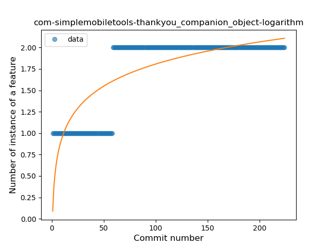
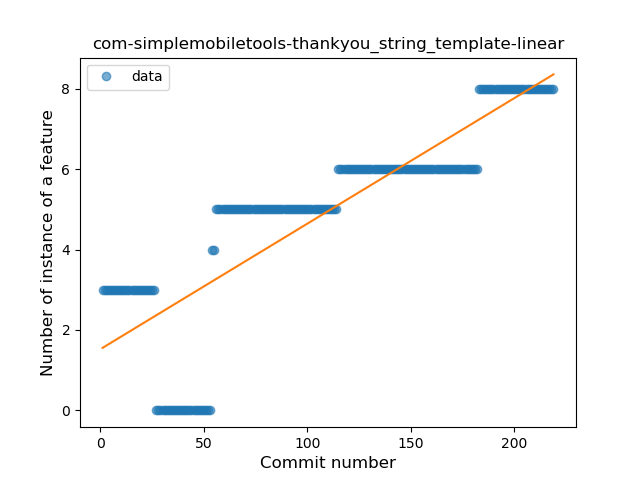

## com-simplemobiletools-thankyou
----
#### Metrics provided by Detekt
* Number of lines of code 332
* Number of Kotlin files: 10
* Cyclomatic complexity: 43
* Cyclomatic complexity by thousands of lines: 270 

----
**5** features analyzed

*	<a href="#type_inference">Type Inference</a> 
*	<a href="#lambda">Lambda</a> 
*	<a href="#when_expr">When expression</a> 
*	<a href="#companion_object">Companion Object</a> 
*	<a href="#string_template">String Template</a> 

### <a name="type_inference">Type Inference</a>
----
#### Functions
* **Sudden Rise Plateau - Logarithm:** 
    * **R_Squared:** 0.32369648
* **Constant Rise - Linear:** 
    * **R_Squared:** 0.29660557
* **Plateau Sudden Rise - Binary Sigmoid:** 
    * **R_Squared:** 0.06284701

**Plots** :chart_with_upwards_trend:
-----

### <a name="lambda">Lambda</a>
----
#### Functions
* **Constant Rise - Linear:** 
    * **R_Squared:** 0.00056999
* **Sudden Rise - Exponential:** 
    * **R_Squared:** 0.00145614
* **Sudden Rise Plateau - Logarithm:** 
    * **R_Squared:** -0.0

**Plots** :chart_with_upwards_trend:
-----

### <a name="when_expr">When expression</a>
----
#### Functions
* **Plateau Sudden Decline - Binary Sigmoid:** 
    * **R_Squared:** 0.88940092
* **Sudden Decline - Exponential:** 
    * **R_Squared:** 0.60267831
* **Constant Decline - Linear:** 
    * **R_Squared:** 0.30834935
* **Sudden Rise Plateau - Logarithm:** 
    * **R_Squared:** -0.0

**Plots** :chart_with_upwards_trend:
-----

### <a name="companion_object">Companion Object</a>
----
#### Functions
* **Plateau Sudden Rise - Binary Sigmoid:** 
    * **R_Squared:** 1.0
* **Sudden Rise Plateau - Logarithm:** 
    * **R_Squared:** 0.66301174
* **Constant Rise - Linear:** 
    * **R_Squared:** 0.57566517

**Plots** :chart_with_upwards_trend:
-----

### <a name="string_template">String Template</a>
----
#### Functions
* **Constant Rise - Linear:** 
    * **R_Squared:** 0.72055966
* **Plateau Gradual Rise - Sigmoid:** 
    * **R_Squared:** 0.72819501
* **Sudden Rise Plateau - Logarithm:** 
    * **R_Squared:** 0.44790916

**Plots** :chart_with_upwards_trend:
-----

