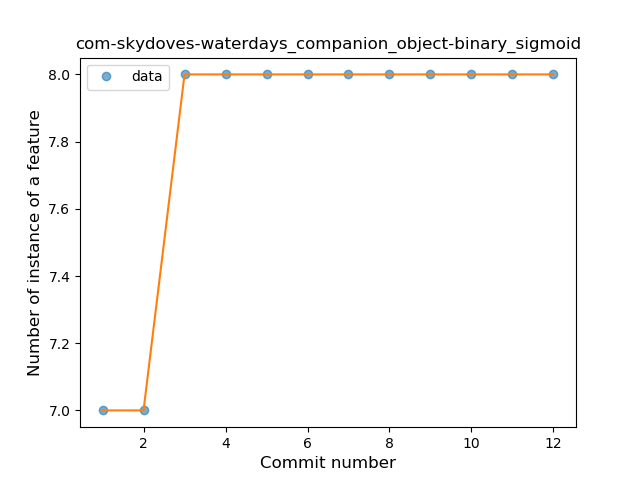
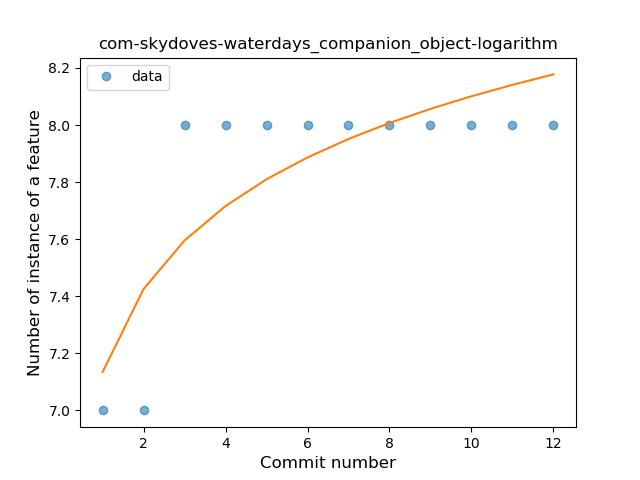

## com-skydoves-waterdays
----
#### Metrics provided by Detekt
* Number of lines of code 4675
* Number of Kotlin files: 67
* Cyclomatic complexity: 454
* Cyclomatic complexity by thousands of lines: 271 

----
**9** features analyzed

*	<a href="#type_inference">Type Inference</a> 
*	<a href="#lambda">Lambda</a> 
*	<a href="#safe_call">Safe Call</a> 
*	<a href="#when_expr">When expression</a> 
*	<a href="#unsafe_call">Unsafe Call</a> 
*	<a href="#companion_object">Companion Object</a> 
*	<a href="#string_template">String Template</a> 
*	<a href="#range_expr">Range Expression</a> 
*	<a href="#property_delegation">Property Delegation</a> 

### <a name="type_inference">Type Inference</a>
----
#### Functions
* **Instability - Polinomial 4:** 
    * **R_Squared:** 0.25949726
* **Instability - Polinomial 3:** )
    * **R_Squared:** 0.11661312
* **Constant Rise - Linear:** 
    * **R_Squared:** 0.08193158
* **Sudden Rise Plateau - Logarithm:** 
    * **R_Squared:** 0.06592291

**Plots** :chart_with_upwards_trend:
-----

### <a name="lambda">Lambda</a>
----
#### Functions
* **Instability - Polinomial 4:** 
    * **R_Squared:** 0.88461538
* **Instability - Polinomial 3:** )
    * **R_Squared:** 0.73626374
* **Constant Rise - Linear:** 
    * **R_Squared:** 0.23076923
* **Sudden Rise Plateau - Logarithm:** 
    * **R_Squared:** 0.11652839

**Plots** :chart_with_upwards_trend:
-----

### <a name="safe_call">Safe Call</a>
----
#### Functions
* **Instability - Polinomial 4:** 
    * **R_Squared:** 0.88461538
* **Instability - Polinomial 3:** )
    * **R_Squared:** 0.73626374
* **Sudden Rise Plateau - Logarithm:** 
    * **R_Squared:** 0.48159519
* **Constant Rise - Linear:** 
    * **R_Squared:** 0.23076923

**Plots** :chart_with_upwards_trend:
-----

### <a name="when_expr">When expression</a>
----
#### Functions
* **Instability - Polinomial 4:** 
    * **R_Squared:** 0.98386229
* **Instability - Polinomial 3:** )
    * **R_Squared:** 0.90916776
* **Sudden Rise Plateau - Logarithm:** 
    * **R_Squared:** 0.6542445
* **Constant Rise - Linear:** 
    * **R_Squared:** 0.35583647

**Plots** :chart_with_upwards_trend:
-----

### <a name="unsafe_call">Unsafe Call</a>
----
#### Functions
* **Sudden Decline - Exponential:** 
    * **R_Squared:** 0.98507646
* **Instability - Polinomial 4:** 
    * **R_Squared:** 0.81539323
* **Instability - Polinomial 3:** )
    * **R_Squared:** 0.64180279
* **Constant Decline - Linear:** 
    * **R_Squared:** 0.1791109
* **Sudden Rise Plateau - Logarithm:** 
    * **R_Squared:** -0.0

**Plots** :chart_with_upwards_trend:
-----

### <a name="companion_object">Companion Object</a>
----
#### Functions
* **Plateau Sudden Rise - Binary Sigmoid:** 
    * **R_Squared:** 1.0
* **Instability - Polinomial 3:** )
    * **R_Squared:** 0.84415584
* **Instability - Polinomial 4:** 
    * **R_Squared:** 0.84685315
* **Sudden Rise Plateau - Logarithm:** 
    * **R_Squared:** 0.6644626
* **Constant Rise - Linear:** 
    * **R_Squared:** 0.41958042

**Plots** :chart_with_upwards_trend:
-----

### <a name="string_template">String Template</a>
----
#### Functions
* **Instability - Polinomial 4:** 
    * **R_Squared:** 0.88461538
* **Instability - Polinomial 3:** )
    * **R_Squared:** 0.73626374
* **Sudden Rise Plateau - Logarithm:** 
    * **R_Squared:** 0.48159519
* **Constant Rise - Linear:** 
    * **R_Squared:** 0.23076923

**Plots** :chart_with_upwards_trend:
-----

### <a name="range_expr">Range Expression</a>
----
#### Functions
* **Instability - Polinomial 4:** 
    * **R_Squared:** 0.88461538
* **Instability - Polinomial 3:** )
    * **R_Squared:** 0.73626374
* **Sudden Rise Plateau - Logarithm:** 
    * **R_Squared:** 0.48159519
* **Constant Rise - Linear:** 
    * **R_Squared:** 0.23076923

**Plots** :chart_with_upwards_trend:
-----

### <a name="property_delegation">Property Delegation</a>
----
#### Functions
* **Sudden Rise - Exponential:** 
    * **R_Squared:** 1.0
* **Instability - Polinomial 4:** 
    * **R_Squared:** 0.88461538
* **Instability - Polinomial 3:** )
    * **R_Squared:** 0.73626374
* **Constant Rise - Linear:** 
    * **R_Squared:** 0.23076923
* **Sudden Rise Plateau - Logarithm:** 
    * **R_Squared:** 0.11652839

**Plots** :chart_with_upwards_trend:
-----

