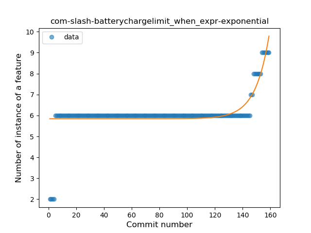

## com-slash-batterychargelimit
----
#### Metrics provided by Detekt
* Number of lines of code 2110
* Number of Kotlin files: 21
* Cyclomatic complexity: 292
* Cyclomatic complexity by thousands of lines: 260 

----
**11** features analyzed

*	<a href="#type_inference">Type Inference</a> 
*	<a href="#lambda">Lambda</a> 
*	<a href="#safe_call">Safe Call</a> 
*	<a href="#when_expr">When expression</a> 
*	<a href="#unsafe_call">Unsafe Call</a> 
*	<a href="#companion_object">Companion Object</a> 
*	<a href="#string_template">String Template</a> 
*	<a href="#func_with_default_value">Function with Default Value</a> 
*	<a href="#range_expr">Range Expression</a> 
*	<a href="#smart_cast">Smart Cast</a> 
*	<a href="#property_delegation">Property Delegation</a> 

### <a name="type_inference">Type Inference</a>
----
#### Functions
* **Constant Rise - Linear:** 
    * **R_Squared:** 0.74961363
* **Sudden Rise Plateau - Logarithm:** 
    * **R_Squared:** 0.72920699

**Plots** :chart_with_upwards_trend:
-----

### <a name="lambda">Lambda</a>
----
#### Functions
* **Constant Rise - Linear:** 
    * **R_Squared:** 0.8346623
* **Sudden Rise Plateau - Logarithm:** 
    * **R_Squared:** 0.76929928

**Plots** :chart_with_upwards_trend:
-----

### <a name="safe_call">Safe Call</a>
----
#### Functions
* **Sudden Rise - Exponential:** 
    * **R_Squared:** 0.84507397
* **Constant Rise - Linear:** 
    * **R_Squared:** 0.10220541
* **Sudden Rise Plateau - Logarithm:** 
    * **R_Squared:** 0.03811234

**Plots** :chart_with_upwards_trend:
-----

### <a name="when_expr">When expression</a>
----
#### Functions
* **Sudden Rise - Exponential:** 
    * **R_Squared:** 0.52269185
* **Plateau Sudden Rise - Binary Sigmoid:** 
    * **R_Squared:** 0.48486073
* **Sudden Rise Plateau - Logarithm:** 
    * **R_Squared:** 0.34096697
* **Constant Rise - Linear:** 
    * **R_Squared:** 0.27112347

**Plots** :chart_with_upwards_trend:
-----

### <a name="unsafe_call">Unsafe Call</a>
----
#### Functions
* **Sudden Rise - Exponential:** 
    * **R_Squared:** 0.64253228
* **Constant Rise - Linear:** 
    * **R_Squared:** 0.62124794
* **Sudden Rise Plateau - Logarithm:** 
    * **R_Squared:** 0.4263478

**Plots** :chart_with_upwards_trend:
-----

### <a name="companion_object">Companion Object</a>
----
#### Functions
* **Constant Rise - Linear:** 
    * **R_Squared:** 0.5836195
* **Sudden Rise - Exponential:** 
    * **R_Squared:** 0.58873897
* **Sudden Rise Plateau - Logarithm:** 
    * **R_Squared:** 0.5238764

**Plots** :chart_with_upwards_trend:
-----

### <a name="string_template">String Template</a>
----
#### Functions
* **Sudden Rise - Exponential:** 
    * **R_Squared:** 0.69571538
* **Constant Rise - Linear:** 
    * **R_Squared:** 0.63331424
* **Sudden Rise Plateau - Logarithm:** 
    * **R_Squared:** 0.49346949

**Plots** :chart_with_upwards_trend:
-----

### <a name="func_with_default_value">Function with Default Value</a>
----
#### Functions
* **Plateau Sudden Rise - Binary Sigmoid:** 
    * **R_Squared:** 1.0
* **Sudden Rise - Exponential:** 
    * **R_Squared:** 0.78039646
* **Constant Rise - Linear:** 
    * **R_Squared:** 0.46148299
* **Sudden Rise Plateau - Logarithm:** 
    * **R_Squared:** 0.20385059

**Plots** :chart_with_upwards_trend:
-----

### <a name="range_expr">Range Expression</a>
----
#### Functions
* **Plateau Sudden Rise - Binary Sigmoid:** 
    * **R_Squared:** 1.0
* **Sudden Rise - Exponential:** 
    * **R_Squared:** 0.81115685
* **Constant Rise - Linear:** 
    * **R_Squared:** 0.10960221
* **Sudden Rise Plateau - Logarithm:** 
    * **R_Squared:** 0.04103505

**Plots** :chart_with_upwards_trend:
-----

### <a name="smart_cast">Smart Cast</a>
----
#### Functions
* **Plateau Gradual Rise - Sigmoid:** 
    * **R_Squared:** 0.95932224
* **Sudden Rise - Exponential:** 
    * **R_Squared:** 0.9056979
* **Constant Rise - Linear:** 
    * **R_Squared:** 0.19313628
* **Sudden Rise Plateau - Logarithm:** 
    * **R_Squared:** 0.07420605

**Plots** :chart_with_upwards_trend:
-----

### <a name="property_delegation">Property Delegation</a>
----
#### Functions
* **Sudden Rise - Exponential:** 
    * **R_Squared:** 0.84226209
* **Constant Rise - Linear:** 
    * **R_Squared:** 0.17757031
* **Sudden Rise Plateau - Logarithm:** 
    * **R_Squared:** 0.11042204
* **Plateau Sudden Rise - Binary Sigmoid:** 
    * **R_Squared:** 0.02850146

**Plots** :chart_with_upwards_trend:
-----

