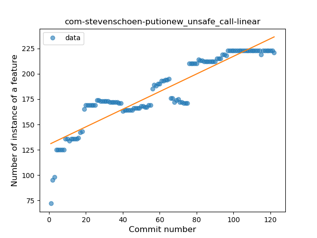
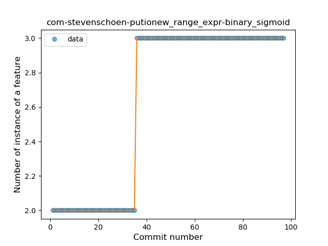
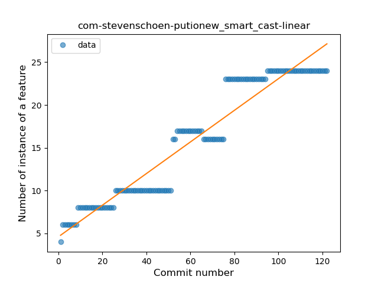
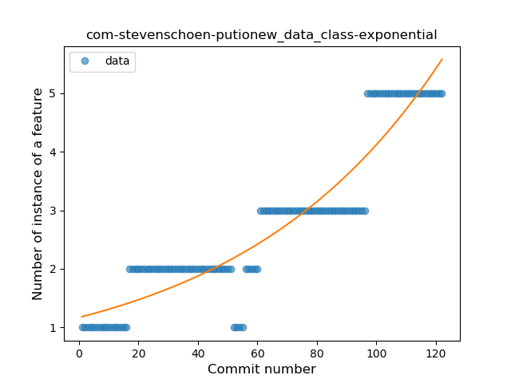
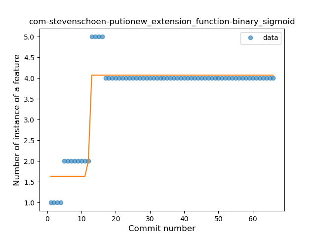
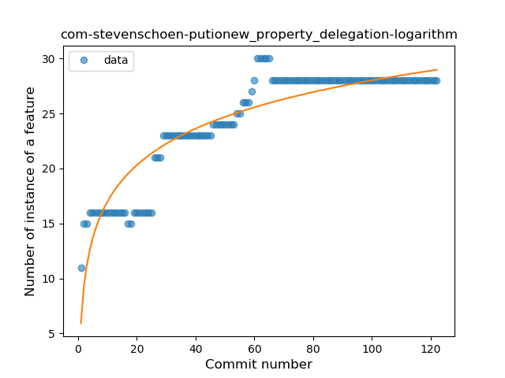
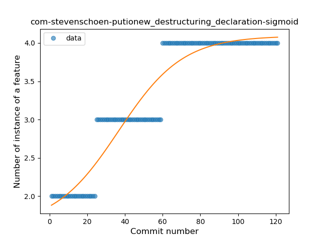

## com-stevenschoen-putionew
----
#### Metrics provided by Detekt
* Number of lines of code 5863
* Number of Kotlin files: 55
* Cyclomatic complexity: 856
* Cyclomatic complexity by thousands of lines: 254 

----
**16** features analyzed

*	<a href="#type_inference">Type Inference</a> 
*	<a href="#lambda">Lambda</a> 
*	<a href="#safe_call">Safe Call</a> 
*	<a href="#when_expr">When expression</a> 
*	<a href="#unsafe_call">Unsafe Call</a> 
*	<a href="#companion_object">Companion Object</a> 
*	<a href="#string_template">String Template</a> 
*	<a href="#func_with_default_value">Function with Default Value</a> 
*	<a href="#range_expr">Range Expression</a> 
*	<a href="#smart_cast">Smart Cast</a> 
*	<a href="#data_class">Data Class</a> 
*	<a href="#func_call_with_named_arg">Function call with Named Argument</a> 
*	<a href="#extension_function">Extension Function</a> 
*	<a href="#property_delegation">Property Delegation</a> 
*	<a href="#destructuring_declaration">Destructuring Declaration</a> 
*	<a href="#sealed_class">Sealed Class</a> 

### <a name="type_inference">Type Inference</a>
----
#### Functions
* **Instability - Polinomial 3:** )
    * **R_Squared:** 0.95500963
* **Sudden Rise Plateau - Logarithm:** 
    * **R_Squared:** 0.91750294
* **Constant Rise - Linear:** 
    * **R_Squared:** 0.70725281

**Plots** :chart_with_upwards_trend:
-----

### <a name="lambda">Lambda</a>
----
#### Functions
* **Constant Rise - Linear:** 
    * **R_Squared:** 0.88799446
* **Sudden Rise Plateau - Logarithm:** 
    * **R_Squared:** 0.85322313

**Plots** :chart_with_upwards_trend:
-----

### <a name="safe_call">Safe Call</a>
----
#### Functions
* **Plateau Gradual Rise - Sigmoid:** 
    * **R_Squared:** 0.94582186
* **Sudden Rise Plateau - Logarithm:** 
    * **R_Squared:** 0.89482304
* **Constant Rise - Linear:** 
    * **R_Squared:** 0.75370429

**Plots** :chart_with_upwards_trend:
-----

### <a name="when_expr">When expression</a>
----
#### Functions
* **Sudden Rise Plateau - Logarithm:** 
    * **R_Squared:** 0.92955875
* **Constant Rise - Linear:** 
    * **R_Squared:** 0.75915126

**Plots** :chart_with_upwards_trend:
-----

### <a name="unsafe_call">Unsafe Call</a>
----
#### Functions
* **Constant Rise - Linear:** 
    * **R_Squared:** 0.84921064
* **Sudden Rise Plateau - Logarithm:** 
    * **R_Squared:** 0.8558211
* **Plateau Sudden Rise - Binary Sigmoid:** 
    * **R_Squared:** 0.13410344

**Plots** :chart_with_upwards_trend:
-----

### <a name="companion_object">Companion Object</a>
----
#### Functions
* **Sudden Rise Plateau - Logarithm:** 
    * **R_Squared:** 0.84702357
* **Constant Rise - Linear:** 
    * **R_Squared:** 0.52232746

**Plots** :chart_with_upwards_trend:
-----

### <a name="string_template">String Template</a>
----
#### Functions
* **Plateau Gradual Rise - Sigmoid:** 
    * **R_Squared:** 0.96141555
* **Constant Rise - Linear:** 
    * **R_Squared:** 0.83717513
* **Sudden Rise Plateau - Logarithm:** 
    * **R_Squared:** 0.68121215

**Plots** :chart_with_upwards_trend:
-----

### <a name="func_with_default_value">Function with Default Value</a>
----
#### Functions
* **Constant Rise - Linear:** 
    * **R_Squared:** 0.83259004
* **Sudden Rise Plateau - Logarithm:** 
    * **R_Squared:** 0.83294272

**Plots** :chart_with_upwards_trend:
-----

### <a name="range_expr">Range Expression</a>
----
#### Functions
* **Plateau Sudden Rise - Binary Sigmoid:** 
    * **R_Squared:** 1.0
* **Constant Rise - Linear:** 
    * **R_Squared:** 0.69196429
* **Sudden Rise Plateau - Logarithm:** 
    * **R_Squared:** 0.63190136

**Plots** :chart_with_upwards_trend:
-----

### <a name="smart_cast">Smart Cast</a>
----
#### Functions
* **Constant Rise - Linear:** 
    * **R_Squared:** 0.92152126
* **Sudden Rise Plateau - Logarithm:** 
    * **R_Squared:** 0.65135665
* **Plateau Sudden Rise - Binary Sigmoid:** 
    * **R_Squared:** 0.15927323

**Plots** :chart_with_upwards_trend:
-----

### <a name="data_class">Data Class</a>
----
#### Functions
* **Sudden Rise - Exponential:** 
    * **R_Squared:** 0.87533257
* **Plateau Gradual Rise - Sigmoid:** 
    * **R_Squared:** 0.8761722
* **Constant Rise - Linear:** 
    * **R_Squared:** 0.83276732
* **Sudden Rise Plateau - Logarithm:** 
    * **R_Squared:** 0.52045443

**Plots** :chart_with_upwards_trend:
-----

### <a name="func_call_with_named_arg">Function call with Named Argument</a>
----
#### Functions
* **Constant Rise - Linear:** 
    * **R_Squared:** 0.91493669
* **Sudden Rise Plateau - Logarithm:** 
    * **R_Squared:** 0.77355959

**Plots** :chart_with_upwards_trend:
-----

### <a name="extension_function">Extension Function</a>
----
#### Functions
* **Plateau Sudden Rise - Binary Sigmoid:** 
    * **R_Squared:** 0.90123457
* **Instability - Polinomial 3:** )
    * **R_Squared:** 0.76277162
* **Sudden Rise Plateau - Logarithm:** 
    * **R_Squared:** 0.60403747
* **Constant Rise - Linear:** 
    * **R_Squared:** 0.31963261

**Plots** :chart_with_upwards_trend:
-----

### <a name="property_delegation">Property Delegation</a>
----
#### Functions
* **Sudden Rise Plateau - Logarithm:** 
    * **R_Squared:** 0.83236013
* **Constant Rise - Linear:** 
    * **R_Squared:** 0.7567629

**Plots** :chart_with_upwards_trend:
-----

### <a name="destructuring_declaration">Destructuring Declaration</a>
----
#### Functions
* **Plateau Gradual Rise - Sigmoid:** 
    * **R_Squared:** 0.91285782
* **Constant Rise - Linear:** 
    * **R_Squared:** 0.81931077
* **Sudden Rise Plateau - Logarithm:** 
    * **R_Squared:** 0.78080272

**Plots** :chart_with_upwards_trend:
-----

### <a name="sealed_class">Sealed Class</a>
----
#### Functions
* **Plateau Sudden Rise - Binary Sigmoid:** 
    * **R_Squared:** 1.0
* **Constant Rise - Linear:** 
    * **R_Squared:** 0.67142857
* **Sudden Rise Plateau - Logarithm:** 
    * **R_Squared:** 0.65360949

**Plots** :chart_with_upwards_trend:
-----

