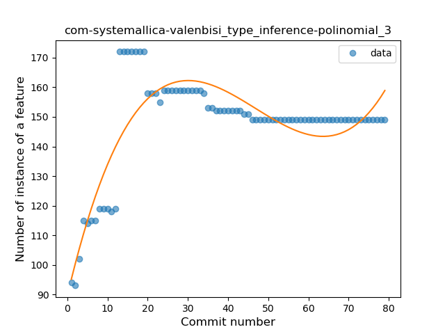
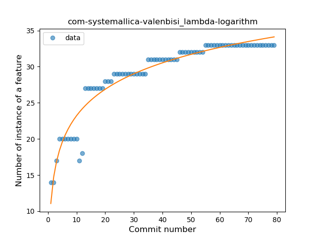
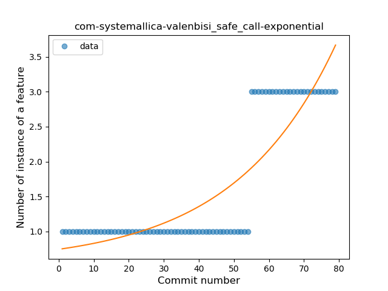
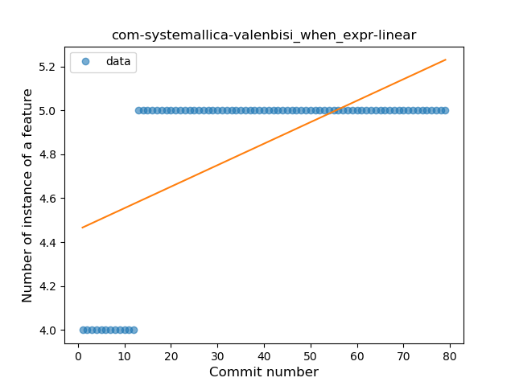

## com-systemallica-valenbisi
----
#### Metrics provided by Detekt
* Number of lines of code 1944
* Number of Kotlin files: 11
* Cyclomatic complexity: 263
* Cyclomatic complexity by thousands of lines: 233 

----
**6** features analyzed

*	<a href="#type_inference">Type Inference</a> 
*	<a href="#lambda">Lambda</a> 
*	<a href="#safe_call">Safe Call</a> 
*	<a href="#when_expr">When expression</a> 
*	<a href="#unsafe_call">Unsafe Call</a> 
*	<a href="#string_template">String Template</a> 

### <a name="type_inference">Type Inference</a>
----
#### Functions
* **Instability - Polinomial 3:** )
    * **R_Squared:** 0.71989154
* **Sudden Rise Plateau - Logarithm:** 
    * **R_Squared:** 0.3705015
* **Constant Rise - Linear:** 
    * **R_Squared:** 0.09842499

**Plots** :chart_with_upwards_trend:
-----

### <a name="lambda">Lambda</a>
----
#### Functions
* **Sudden Rise Plateau - Logarithm:** 
    * **R_Squared:** 0.91997603
* **Constant Rise - Linear:** 
    * **R_Squared:** 0.7277015
* **Plateau Gradual Rise - Sigmoid:** 
    * **R_Squared:** 0.48828721

**Plots** :chart_with_upwards_trend:
-----

### <a name="safe_call">Safe Call</a>
----
#### Functions
* **Plateau Sudden Rise - Binary Sigmoid:** 
    * **R_Squared:** 1.0
* **Sudden Rise - Exponential:** 
    * **R_Squared:** 0.76128733
* **Constant Rise - Linear:** 
    * **R_Squared:** 0.64903846
* **Sudden Rise Plateau - Logarithm:** 
    * **R_Squared:** 0.33477957

**Plots** :chart_with_upwards_trend:
-----

### <a name="when_expr">When expression</a>
----
#### Functions
* **Plateau Sudden Rise - Binary Sigmoid:** 
    * **R_Squared:** 1.0
* **Sudden Rise Plateau - Logarithm:** 
    * **R_Squared:** 0.65634207
* **Constant Rise - Linear:** 
    * **R_Squared:** 0.38653846

**Plots** :chart_with_upwards_trend:
-----

### <a name="unsafe_call">Unsafe Call</a>
----
#### Functions
* **Instability - Polinomial 3:** )
    * **R_Squared:** 0.8303912
* **Constant Decline - Linear:** 
    * **R_Squared:** 0.20740113
* **Sudden Decline - Exponential:** 
    * **R_Squared:** -0.0
* **Sudden Rise Plateau - Logarithm:** 
    * **R_Squared:** -0.0

**Plots** :chart_with_upwards_trend:
-----

### <a name="string_template">String Template</a>
----
#### Functions
* **Plateau Sudden Rise - Binary Sigmoid:** 
    * **R_Squared:** 1.0
* **Sudden Rise Plateau - Logarithm:** 
    * **R_Squared:** 0.65634207
* **Constant Rise - Linear:** 
    * **R_Squared:** 0.38653846

**Plots** :chart_with_upwards_trend:
-----

