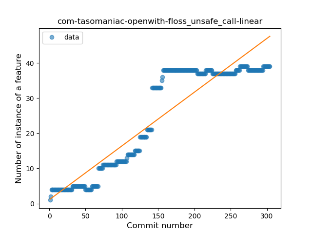
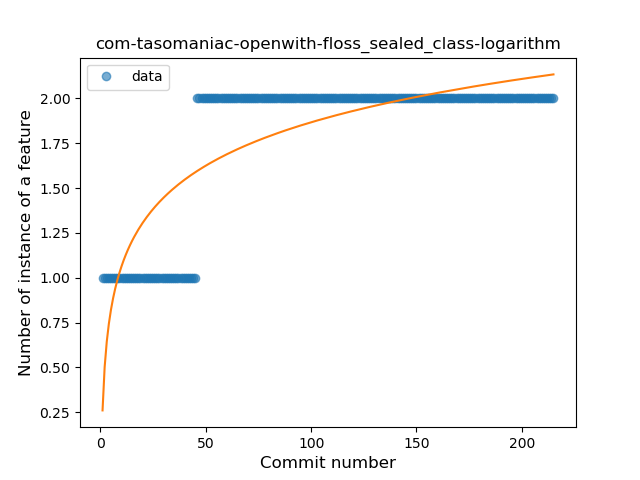

## com-tasomaniac-openwith-floss
----
#### Metrics provided by Detekt
* Number of lines of code 4395
* Number of Kotlin files: 88
* Cyclomatic complexity: 568
* Cyclomatic complexity by thousands of lines: 252 

----
**19** features analyzed

*	<a href="#type_inference">Type Inference</a> 
*	<a href="#lambda">Lambda</a> 
*	<a href="#safe_call">Safe Call</a> 
*	<a href="#when_expr">When expression</a> 
*	<a href="#unsafe_call">Unsafe Call</a> 
*	<a href="#companion_object">Companion Object</a> 
*	<a href="#string_template">String Template</a> 
*	<a href="#func_with_default_value">Function with Default Value</a> 
*	<a href="#singleton">Singleton</a> 
*	<a href="#range_expr">Range Expression</a> 
*	<a href="#smart_cast">Smart Cast</a> 
*	<a href="#data_class">Data Class</a> 
*	<a href="#func_call_with_named_arg">Function call with Named Argument</a> 
*	<a href="#extension_function">Extension Function</a> 
*	<a href="#property_delegation">Property Delegation</a> 
*	<a href="#destructuring_declaration">Destructuring Declaration</a> 
*	<a href="#inline_func">Inline Function</a> 
*	<a href="#sealed_class">Sealed Class</a> 
*	<a href="#infix_func">Infix Function</a> 

### <a name="type_inference">Type Inference</a>
----
#### Functions
* **Constant Rise - Linear:** 
    * **R_Squared:** 0.87982512
* **Sudden Rise Plateau - Logarithm:** 
    * **R_Squared:** 0.717499
* **Plateau Sudden Rise - Binary Sigmoid:** 
    * **R_Squared:** 0.57052339

**Plots** :chart_with_upwards_trend:
-----

### <a name="lambda">Lambda</a>
----
#### Functions
* **Constant Rise - Linear:** 
    * **R_Squared:** 0.95725753
* **Plateau Sudden Rise - Binary Sigmoid:** 
    * **R_Squared:** 0.71867426
* **Sudden Rise Plateau - Logarithm:** 
    * **R_Squared:** 0.67877894

**Plots** :chart_with_upwards_trend:
-----

### <a name="safe_call">Safe Call</a>
----
#### Functions
* **Constant Rise - Linear:** 
    * **R_Squared:** 0.89718246
* **Sudden Rise Plateau - Logarithm:** 
    * **R_Squared:** 0.73980458
* **Plateau Sudden Rise - Binary Sigmoid:** 
    * **R_Squared:** 0.02287648

**Plots** :chart_with_upwards_trend:
-----

### <a name="when_expr">When expression</a>
----
#### Functions
* **Plateau Gradual Rise - Sigmoid:** 
    * **R_Squared:** 0.96907285
* **Constant Rise - Linear:** 
    * **R_Squared:** 0.62176507
* **Sudden Rise Plateau - Logarithm:** 
    * **R_Squared:** 0.54082345

**Plots** :chart_with_upwards_trend:
-----

### <a name="unsafe_call">Unsafe Call</a>
----
#### Functions
* **Constant Rise - Linear:** 
    * **R_Squared:** 0.85469353
* **Sudden Rise Plateau - Logarithm:** 
    * **R_Squared:** 0.46743609

**Plots** :chart_with_upwards_trend:
-----

### <a name="companion_object">Companion Object</a>
----
#### Functions
* **Plateau Gradual Rise - Sigmoid:** 
    * **R_Squared:** 0.97706784
* **Constant Rise - Linear:** 
    * **R_Squared:** 0.9051829
* **Sudden Rise Plateau - Logarithm:** 
    * **R_Squared:** 0.58248684

**Plots** :chart_with_upwards_trend:
-----

### <a name="string_template">String Template</a>
----
#### Functions
* **Plateau Gradual Rise - Sigmoid:** 
    * **R_Squared:** 0.9268808
* **Constant Rise - Linear:** 
    * **R_Squared:** 0.90674948
* **Sudden Rise Plateau - Logarithm:** 
    * **R_Squared:** 0.61153733

**Plots** :chart_with_upwards_trend:
-----

### <a name="func_with_default_value">Function with Default Value</a>
----
#### Functions
* **Constant Rise - Linear:** 
    * **R_Squared:** 0.94569189
* **Sudden Rise Plateau - Logarithm:** 
    * **R_Squared:** 0.61586234

**Plots** :chart_with_upwards_trend:
-----

### <a name="singleton">Singleton</a>
----
#### Functions
* **Plateau Gradual Rise - Sigmoid:** 
    * **R_Squared:** 0.90279279
* **Constant Rise - Linear:** 
    * **R_Squared:** 0.73925435
* **Sudden Rise Plateau - Logarithm:** 
    * **R_Squared:** 0.73175043

**Plots** :chart_with_upwards_trend:
-----

### <a name="range_expr">Range Expression</a>
----
#### Functions
* **Plateau Gradual Decline - Sigmoid:** 
    * **R_Squared:** 0.13922518
* **Sudden Decline - Exponential:** 
    * **R_Squared:** 0.05288573
* **Constant Decline - Linear:** 
    * **R_Squared:** 0.01135576
* **Sudden Rise Plateau - Logarithm:** 
    * **R_Squared:** -0.0

**Plots** :chart_with_upwards_trend:
-----

### <a name="smart_cast">Smart Cast</a>
----
#### Functions
* **Plateau Gradual Rise - Sigmoid:** 
    * **R_Squared:** 0.95333569
* **Sudden Rise Plateau - Logarithm:** 
    * **R_Squared:** 0.72036959
* **Constant Rise - Linear:** 
    * **R_Squared:** 0.36976694

**Plots** :chart_with_upwards_trend:
-----

### <a name="data_class">Data Class</a>
----
#### Functions
* **Plateau Gradual Rise - Sigmoid:** 
    * **R_Squared:** 0.9420861
* **Sudden Rise Plateau - Logarithm:** 
    * **R_Squared:** 0.87861894
* **Constant Rise - Linear:** 
    * **R_Squared:** 0.64075523

**Plots** :chart_with_upwards_trend:
-----

### <a name="func_call_with_named_arg">Function call with Named Argument</a>
----
#### Functions
* **Constant Rise - Linear:** 
    * **R_Squared:** 0.88123748
* **Sudden Rise Plateau - Logarithm:** 
    * **R_Squared:** 0.6114648

**Plots** :chart_with_upwards_trend:
-----

### <a name="extension_function">Extension Function</a>
----
#### Functions
* **Constant Rise - Linear:** 
    * **R_Squared:** 0.94863393
* **Sudden Rise Plateau - Logarithm:** 
    * **R_Squared:** 0.67023495

**Plots** :chart_with_upwards_trend:
-----

### <a name="property_delegation">Property Delegation</a>
----
#### Functions
* **Sudden Rise - Exponential:** 
    * **R_Squared:** 0.6031706
* **Plateau Sudden Decline - Binary Sigmoid:** 
    * **R_Squared:** 0.17125019
* **Constant Rise - Linear:** 
    * **R_Squared:** 0.13488604
* **Sudden Rise Plateau - Logarithm:** 
    * **R_Squared:** 0.00192574

**Plots** :chart_with_upwards_trend:
-----

### <a name="destructuring_declaration">Destructuring Declaration</a>
----
#### Functions
* **Plateau Sudden Rise - Binary Sigmoid:** 
    * **R_Squared:** 1.0
* **Sudden Rise - Exponential:** 
    * **R_Squared:** 0.80401202
* **Constant Rise - Linear:** 
    * **R_Squared:** 0.17699831
* **Sudden Rise Plateau - Logarithm:** 
    * **R_Squared:** 0.06647469

**Plots** :chart_with_upwards_trend:
-----

### <a name="inline_func">Inline Function</a>
----
#### Functions
* **Sudden Rise - Exponential:** 
    * **R_Squared:** 0.88577046
* **Plateau Gradual Rise - Sigmoid:** 
    * **R_Squared:** 0.89317197
* **Constant Rise - Linear:** 
    * **R_Squared:** 0.49568247
* **Sudden Rise Plateau - Logarithm:** 
    * **R_Squared:** 0.21672654

**Plots** :chart_with_upwards_trend:
-----

### <a name="sealed_class">Sealed Class</a>
----
#### Functions
* **Plateau Sudden Rise - Binary Sigmoid:** 
    * **R_Squared:** 1.0
* **Sudden Rise Plateau - Logarithm:** 
    * **R_Squared:** 0.66959503
* **Constant Rise - Linear:** 
    * **R_Squared:** 0.49649533

**Plots** :chart_with_upwards_trend:
-----

### <a name="infix_func">Infix Function</a>
----
#### Functions
* **Plateau Gradual Rise - Sigmoid:** 
    * **R_Squared:** 0.90932199
* **Sudden Rise - Exponential:** 
    * **R_Squared:** 0.89156874
* **Constant Rise - Linear:** 
    * **R_Squared:** 0.77810641
* **Sudden Rise Plateau - Logarithm:** 
    * **R_Squared:** 0.4164766

**Plots** :chart_with_upwards_trend:
-----

