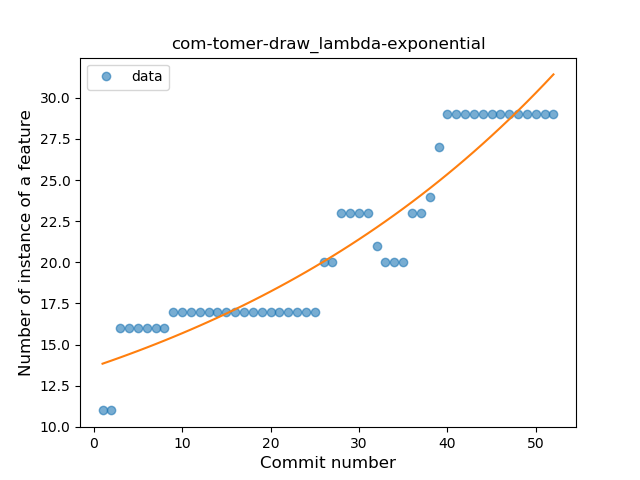
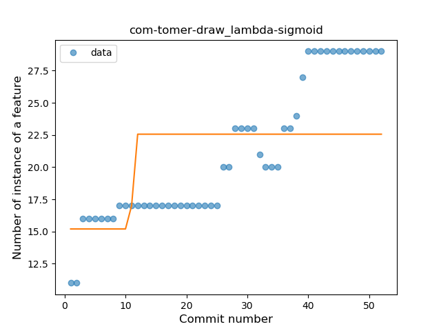
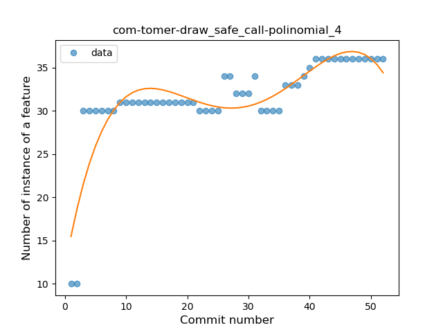
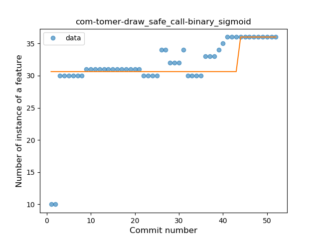
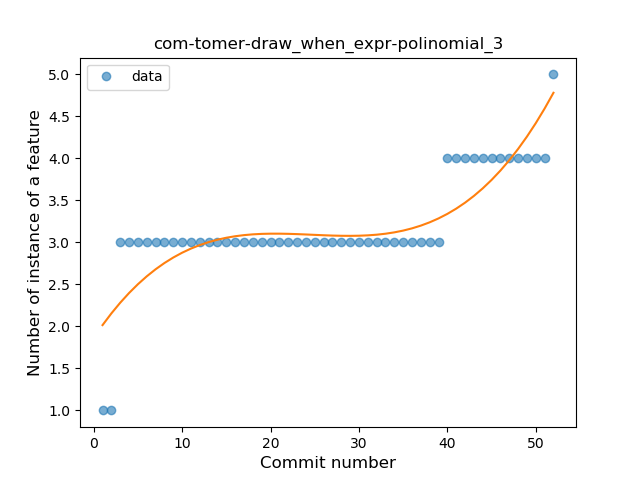
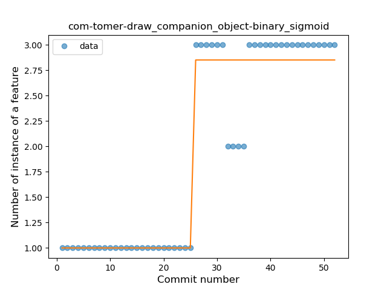
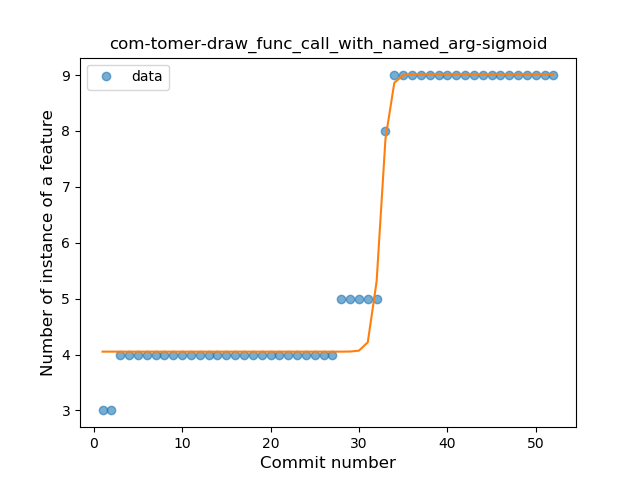

## com-tomer-draw
----
#### Metrics provided by Detekt
* Number of lines of code 1339
* Number of Kotlin files: 24
* Cyclomatic complexity: 217
* Cyclomatic complexity by thousands of lines: 344 

----
**9** features analyzed

*	<a href="#type_inference">Type Inference</a> 
*	<a href="#lambda">Lambda</a> 
*	<a href="#safe_call">Safe Call</a> 
*	<a href="#when_expr">When expression</a> 
*	<a href="#unsafe_call">Unsafe Call</a> 
*	<a href="#companion_object">Companion Object</a> 
*	<a href="#func_with_default_value">Function with Default Value</a> 
*	<a href="#func_call_with_named_arg">Function call with Named Argument</a> 
*	<a href="#extension_function">Extension Function</a> 

### <a name="type_inference">Type Inference</a>
----
#### Functions
* **Instability - Polinomial 3:** )
    * **R_Squared:** 0.63447289
* **Sudden Rise Plateau - Logarithm:** 
    * **R_Squared:** 0.56374857
* **Constant Rise - Linear:** 
    * **R_Squared:** 0.43973463

**Plots** :chart_with_upwards_trend:
-----

### <a name="lambda">Lambda</a>
----
#### Functions
* **Sudden Rise - Exponential:** 
    * **R_Squared:** 0.89533399
* **Constant Rise - Linear:** 
    * **R_Squared:** 0.87402397
* **Sudden Rise Plateau - Logarithm:** 
    * **R_Squared:** 0.6647112
* **Plateau Gradual Rise - Sigmoid:** 
    * **R_Squared:** 0.29597401

**Plots** :chart_with_upwards_trend:
-----

### <a name="safe_call">Safe Call</a>
----
#### Functions
* **Instability - Polinomial 4:** 
    * **R_Squared:** 0.7437263
* **Sudden Rise Plateau - Logarithm:** 
    * **R_Squared:** 0.63603955
* **Instability - Polinomial 3:** )
    * **R_Squared:** 0.58831349
* **Constant Rise - Linear:** 
    * **R_Squared:** 0.44020292
* **Plateau Sudden Rise - Binary Sigmoid:** 
    * **R_Squared:** 0.17226161

**Plots** :chart_with_upwards_trend:
-----

### <a name="when_expr">When expression</a>
----
#### Functions
* **Instability - Polinomial 3:** )
    * **R_Squared:** 0.70977091
* **Sudden Rise - Exponential:** 
    * **R_Squared:** 0.60043909
* **Constant Rise - Linear:** 
    * **R_Squared:** 0.55548423
* **Sudden Rise Plateau - Logarithm:** 
    * **R_Squared:** 0.55165698

**Plots** :chart_with_upwards_trend:
-----

### <a name="unsafe_call">Unsafe Call</a>
----
#### Functions
* **Plateau Sudden Rise - Binary Sigmoid:** 
    * **R_Squared:** 0.9288984
* **Instability - Polinomial 3:** )
    * **R_Squared:** 0.81778019
* **Constant Rise - Linear:** 
    * **R_Squared:** 0.74575423
* **Sudden Rise - Exponential:** 
    * **R_Squared:** 0.74619457
* **Sudden Rise Plateau - Logarithm:** 
    * **R_Squared:** 0.52126238

**Plots** :chart_with_upwards_trend:
-----

### <a name="companion_object">Companion Object</a>
----
#### Functions
* **Plateau Sudden Rise - Binary Sigmoid:** 
    * **R_Squared:** 0.9288984
* **Instability - Polinomial 3:** )
    * **R_Squared:** 0.81778019
* **Constant Rise - Linear:** 
    * **R_Squared:** 0.74575423
* **Sudden Rise - Exponential:** 
    * **R_Squared:** 0.74619457
* **Sudden Rise Plateau - Logarithm:** 
    * **R_Squared:** 0.52126238

**Plots** :chart_with_upwards_trend:
-----

### <a name="func_with_default_value">Function with Default Value</a>
----
#### Functions
* **Instability - Polinomial 3:** )
    * **R_Squared:** 0.85885812
* **Constant Rise - Linear:** 
    * **R_Squared:** 0.74916759
* **Sudden Rise Plateau - Logarithm:** 
    * **R_Squared:** 0.5599796

**Plots** :chart_with_upwards_trend:
-----

### <a name="func_call_with_named_arg">Function call with Named Argument</a>
----
#### Functions
* **Plateau Gradual Rise - Sigmoid:** 
    * **R_Squared:** 0.98091354
* **Instability - Polinomial 3:** )
    * **R_Squared:** 0.87462558
* **Sudden Rise - Exponential:** 
    * **R_Squared:** 0.81680366
* **Constant Rise - Linear:** 
    * **R_Squared:** 0.79061851
* **Sudden Rise Plateau - Logarithm:** 
    * **R_Squared:** 0.53123601

**Plots** :chart_with_upwards_trend:
-----

### <a name="extension_function">Extension Function</a>
----
#### Functions
* **Plateau Sudden Rise - Binary Sigmoid:** 
    * **R_Squared:** 1.0
* **Instability - Polinomial 3:** )
    * **R_Squared:** 0.44187715
* **Sudden Rise Plateau - Logarithm:** 
    * **R_Squared:** 0.36298143
* **Constant Rise - Linear:** 
    * **R_Squared:** 0.11098779

**Plots** :chart_with_upwards_trend:
-----

