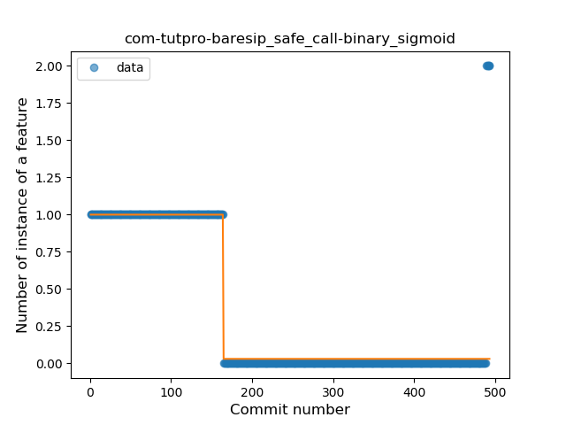
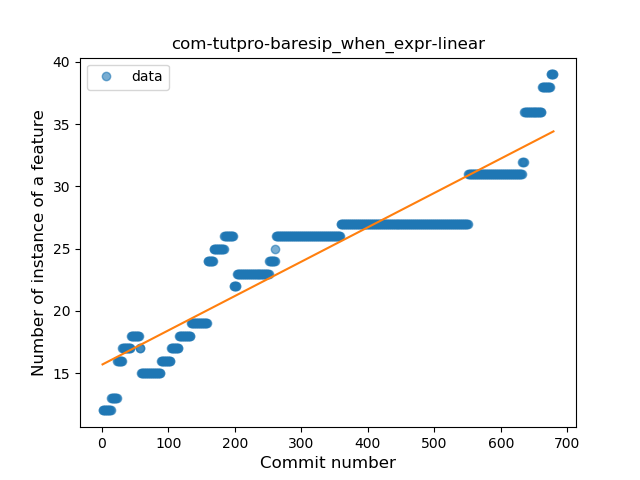
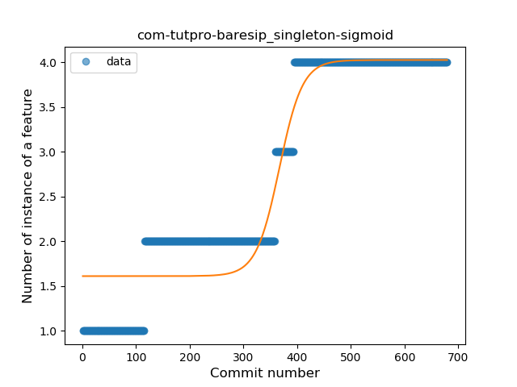
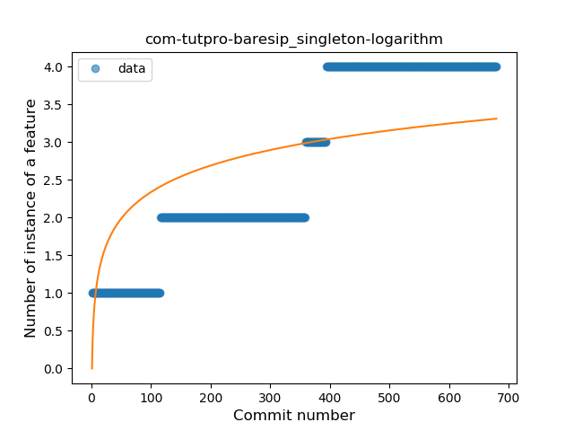

## com-tutpro-baresip
----
#### Metrics provided by Detekt
* Number of lines of code 6754
* Number of Kotlin files: 30
* Cyclomatic complexity: 1348
* Cyclomatic complexity by thousands of lines: 303 

----
**11** features analyzed

*	<a href="#type_inference">Type Inference</a> 
*	<a href="#lambda">Lambda</a> 
*	<a href="#safe_call">Safe Call</a> 
*	<a href="#when_expr">When expression</a> 
*	<a href="#unsafe_call">Unsafe Call</a> 
*	<a href="#companion_object">Companion Object</a> 
*	<a href="#string_template">String Template</a> 
*	<a href="#func_with_default_value">Function with Default Value</a> 
*	<a href="#singleton">Singleton</a> 
*	<a href="#range_expr">Range Expression</a> 
*	<a href="#func_call_with_named_arg">Function call with Named Argument</a> 

### <a name="type_inference">Type Inference</a>
----
#### Functions
* **Constant Rise - Linear:** 
    * **R_Squared:** 0.93051665
* **Sudden Rise Plateau - Logarithm:** 
    * **R_Squared:** 0.71320533
* **Plateau Sudden Rise - Binary Sigmoid:** 
    * **R_Squared:** 0.325475

**Plots** :chart_with_upwards_trend:
-----

### <a name="lambda">Lambda</a>
----
#### Functions
* **Constant Rise - Linear:** 
    * **R_Squared:** 0.87023346
* **Sudden Rise Plateau - Logarithm:** 
    * **R_Squared:** 0.73841346

**Plots** :chart_with_upwards_trend:
-----

### <a name="safe_call">Safe Call</a>
----
#### Functions
* **Plateau Sudden Decline - Binary Sigmoid:** 
    * **R_Squared:** 0.83933166
* **Sudden Decline - Exponential:** 
    * **R_Squared:** 0.60641335
* **Constant Decline - Linear:** 
    * **R_Squared:** 0.49189432
* **Sudden Rise Plateau - Logarithm:** 
    * **R_Squared:** 0.0

**Plots** :chart_with_upwards_trend:
-----

### <a name="when_expr">When expression</a>
----
#### Functions
* **Constant Rise - Linear:** 
    * **R_Squared:** 0.85961276
* **Sudden Rise Plateau - Logarithm:** 
    * **R_Squared:** 0.76078908

**Plots** :chart_with_upwards_trend:
-----

### <a name="unsafe_call">Unsafe Call</a>
----
#### Functions
* **Sudden Rise - Exponential:** 
    * **R_Squared:** 0.66197245
* **Constant Rise - Linear:** 
    * **R_Squared:** 0.60391684
* **Sudden Rise Plateau - Logarithm:** 
    * **R_Squared:** 0.25883368

**Plots** :chart_with_upwards_trend:
-----

### <a name="companion_object">Companion Object</a>
----
#### Functions
* **Plateau Gradual Rise - Sigmoid:** 
    * **R_Squared:** 0.95068712
* **Sudden Rise Plateau - Logarithm:** 
    * **R_Squared:** 0.7863863
* **Constant Rise - Linear:** 
    * **R_Squared:** 0.42093198

**Plots** :chart_with_upwards_trend:
-----

### <a name="string_template">String Template</a>
----
#### Functions
* **Constant Rise - Linear:** 
    * **R_Squared:** 0.93026274
* **Sudden Rise Plateau - Logarithm:** 
    * **R_Squared:** 0.64715567
* **Plateau Sudden Rise - Binary Sigmoid:** 
    * **R_Squared:** 0.39933897

**Plots** :chart_with_upwards_trend:
-----

### <a name="func_with_default_value">Function with Default Value</a>
----
#### Functions
* **Plateau Sudden Decline - Binary Sigmoid:** 
    * **R_Squared:** 0.90046647
* **Sudden Decline - Exponential:** 
    * **R_Squared:** 0.82932982
* **Constant Decline - Linear:** 
    * **R_Squared:** 0.57263134
* **Sudden Rise Plateau - Logarithm:** 
    * **R_Squared:** -0.0

**Plots** :chart_with_upwards_trend:
-----

### <a name="singleton">Singleton</a>
----
#### Functions
* **Plateau Gradual Rise - Sigmoid:** 
    * **R_Squared:** 0.91591762
* **Constant Rise - Linear:** 
    * **R_Squared:** 0.87263176
* **Sudden Rise Plateau - Logarithm:** 
    * **R_Squared:** 0.51183849

**Plots** :chart_with_upwards_trend:
-----

### <a name="range_expr">Range Expression</a>
----
#### Functions
* **Sudden Decline - Exponential:** 
    * **R_Squared:** 0.43732125
* **Constant Decline - Linear:** 
    * **R_Squared:** 0.40740107
* **Sudden Rise Plateau - Logarithm:** 
    * **R_Squared:** 0.0

**Plots** :chart_with_upwards_trend:
-----

### <a name="func_call_with_named_arg">Function call with Named Argument</a>
----
#### Functions
* **Plateau Sudden Rise - Binary Sigmoid:** 
    * **R_Squared:** 1.0
* **Sudden Rise Plateau - Logarithm:** 
    * **R_Squared:** 0.23896649
* **Constant Rise - Linear:** 
    * **R_Squared:** 0.0406704

**Plots** :chart_with_upwards_trend:
-----

