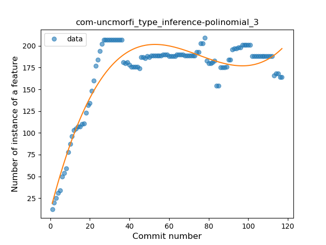
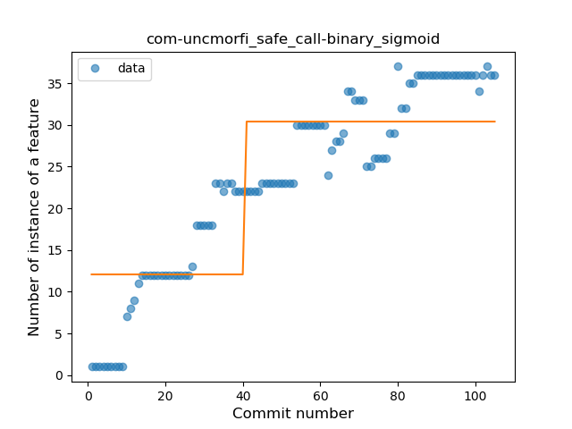
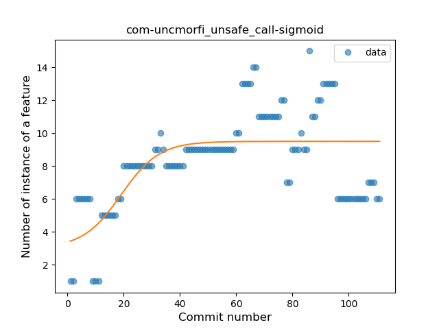
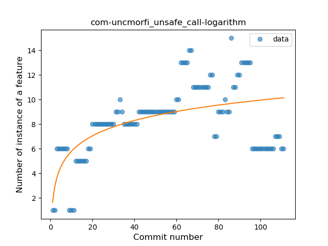
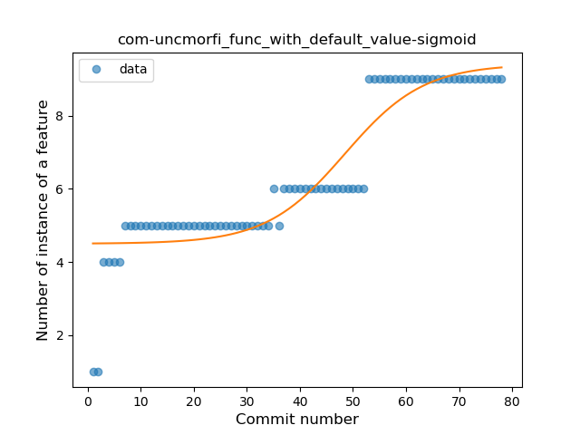
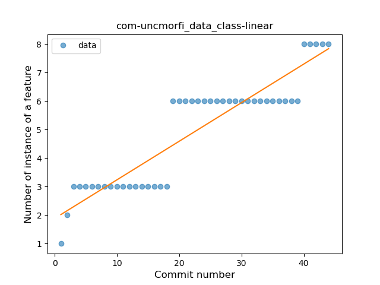
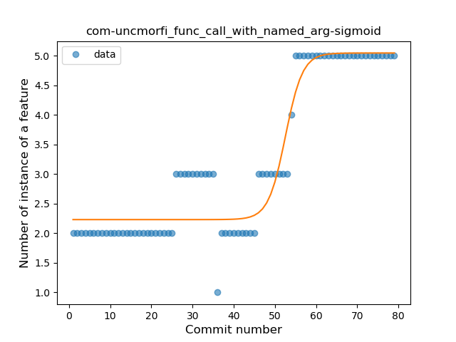

## com-uncmorfi
----
#### Metrics provided by Detekt
* Number of lines of code 3321
* Number of Kotlin files: 44
* Cyclomatic complexity: 477
* Cyclomatic complexity by thousands of lines: 266 

----
**15** features analyzed

*	<a href="#type_inference">Type Inference</a> 
*	<a href="#lambda">Lambda</a> 
*	<a href="#safe_call">Safe Call</a> 
*	<a href="#when_expr">When expression</a> 
*	<a href="#unsafe_call">Unsafe Call</a> 
*	<a href="#companion_object">Companion Object</a> 
*	<a href="#string_template">String Template</a> 
*	<a href="#func_with_default_value">Function with Default Value</a> 
*	<a href="#singleton">Singleton</a> 
*	<a href="#range_expr">Range Expression</a> 
*	<a href="#data_class">Data Class</a> 
*	<a href="#func_call_with_named_arg">Function call with Named Argument</a> 
*	<a href="#extension_function">Extension Function</a> 
*	<a href="#property_delegation">Property Delegation</a> 
*	<a href="#coroutine">Coroutine</a> 

### <a name="type_inference">Type Inference</a>
----
#### Functions
* **Instability - Polinomial 3:** )
    * **R_Squared:** 0.86520215
* **Sudden Rise Plateau - Logarithm:** 
    * **R_Squared:** 0.70139753
* **Constant Rise - Linear:** 
    * **R_Squared:** 0.33722631

**Plots** :chart_with_upwards_trend:
-----

### <a name="lambda">Lambda</a>
----
#### Functions
* **Sudden Rise - Exponential:** 
    * **R_Squared:** 0.96122396
* **Constant Rise - Linear:** 
    * **R_Squared:** 0.94174635
* **Sudden Rise Plateau - Logarithm:** 
    * **R_Squared:** 0.42276476

**Plots** :chart_with_upwards_trend:
-----

### <a name="safe_call">Safe Call</a>
----
#### Functions
* **Constant Rise - Linear:** 
    * **R_Squared:** 0.89371907
* **Sudden Rise Plateau - Logarithm:** 
    * **R_Squared:** 0.7322193
* **Plateau Sudden Rise - Binary Sigmoid:** 
    * **R_Squared:** 0.67649555

**Plots** :chart_with_upwards_trend:
-----

### <a name="when_expr">When expression</a>
----
#### Functions
* **Plateau Gradual Rise - Sigmoid:** 
    * **R_Squared:** 0.95257607
* **Sudden Rise Plateau - Logarithm:** 
    * **R_Squared:** 0.75472762
* **Constant Rise - Linear:** 
    * **R_Squared:** 0.72315299

**Plots** :chart_with_upwards_trend:
-----

### <a name="unsafe_call">Unsafe Call</a>
----
#### Functions
* **Plateau Gradual Rise - Sigmoid:** 
    * **R_Squared:** 0.43188947
* **Sudden Rise Plateau - Logarithm:** 
    * **R_Squared:** 0.34180516
* **Constant Rise - Linear:** 
    * **R_Squared:** 0.17083702

**Plots** :chart_with_upwards_trend:
-----

### <a name="companion_object">Companion Object</a>
----
#### Functions
* **Plateau Gradual Rise - Sigmoid:** 
    * **R_Squared:** 0.94300139
* **Instability - Polinomial 3:** )
    * **R_Squared:** 0.9126994
* **Sudden Rise Plateau - Logarithm:** 
    * **R_Squared:** 0.83323261
* **Constant Rise - Linear:** 
    * **R_Squared:** 0.53905423

**Plots** :chart_with_upwards_trend:
-----

### <a name="string_template">String Template</a>
----
#### Functions
* **Constant Decline - Linear:** 
    * **R_Squared:** 0.19721477
* **Sudden Rise Plateau - Logarithm:** 
    * **R_Squared:** 0.0

**Plots** :chart_with_upwards_trend:
-----

### <a name="func_with_default_value">Function with Default Value</a>
----
#### Functions
* **Plateau Gradual Rise - Sigmoid:** 
    * **R_Squared:** 0.85154973
* **Constant Rise - Linear:** 
    * **R_Squared:** 0.82985888
* **Sudden Rise - Exponential:** 
    * **R_Squared:** 0.83490363
* **Sudden Rise Plateau - Logarithm:** 
    * **R_Squared:** 0.69919077

**Plots** :chart_with_upwards_trend:
-----

### <a name="singleton">Singleton</a>
----
#### Functions
* **Sudden Decline - Exponential:** 
    * **R_Squared:** 0.70073586
* **Constant Decline - Linear:** 
    * **R_Squared:** 0.6772533
* **Plateau Sudden Decline - Binary Sigmoid:** 
    * **R_Squared:** 0.17119515
* **Sudden Rise Plateau - Logarithm:** 
    * **R_Squared:** -0.0

**Plots** :chart_with_upwards_trend:
-----

### <a name="range_expr">Range Expression</a>
----
#### Functions
* **Plateau Gradual Rise - Sigmoid:** 
    * **R_Squared:** 0.79065167
* **Sudden Rise - Exponential:** 
    * **R_Squared:** 0.55796881
* **Constant Rise - Linear:** 
    * **R_Squared:** 0.49188413
* **Sudden Rise Plateau - Logarithm:** 
    * **R_Squared:** 0.36665453

**Plots** :chart_with_upwards_trend:
-----

### <a name="data_class">Data Class</a>
----
#### Functions
* **Constant Rise - Linear:** 
    * **R_Squared:** 0.84000938
* **Plateau Gradual Rise - Sigmoid:** 
    * **R_Squared:** 0.84222681
* **Sudden Rise Plateau - Logarithm:** 
    * **R_Squared:** 0.72734841

**Plots** :chart_with_upwards_trend:
-----

### <a name="func_call_with_named_arg">Function call with Named Argument</a>
----
#### Functions
* **Plateau Gradual Rise - Sigmoid:** 
    * **R_Squared:** 0.91184176
* **Sudden Rise - Exponential:** 
    * **R_Squared:** 0.79117554
* **Constant Rise - Linear:** 
    * **R_Squared:** 0.74259876
* **Sudden Rise Plateau - Logarithm:** 
    * **R_Squared:** 0.46160326

**Plots** :chart_with_upwards_trend:
-----

### <a name="extension_function">Extension Function</a>
----
#### Functions
* **Constant Rise - Linear:** 
    * **R_Squared:** 0.77225053
* **Plateau Sudden Rise - Binary Sigmoid:** 
    * **R_Squared:** 0.73923907
* **Sudden Rise Plateau - Logarithm:** 
    * **R_Squared:** 0.48097297

**Plots** :chart_with_upwards_trend:
-----

### <a name="property_delegation">Property Delegation</a>
----
#### Functions
* **Plateau Sudden Decline - Binary Sigmoid:** 
    * **R_Squared:** 0.64573834
* **Sudden Decline - Exponential:** 
    * **R_Squared:** 0.45767838
* **Constant Decline - Linear:** 
    * **R_Squared:** 0.36966993
* **Sudden Rise Plateau - Logarithm:** 
    * **R_Squared:** -0.0

**Plots** :chart_with_upwards_trend:
-----

### <a name="coroutine">Coroutine</a>
----
#### Functions
* **Plateau Sudden Decline - Binary Sigmoid:** 
    * **R_Squared:** 0.9507373
* **Sudden Decline - Exponential:** 
    * **R_Squared:** 0.64479339
* **Constant Decline - Linear:** 
    * **R_Squared:** 0.47839703
* **Sudden Rise Plateau - Logarithm:** 
    * **R_Squared:** -0.0

**Plots** :chart_with_upwards_trend:
-----

