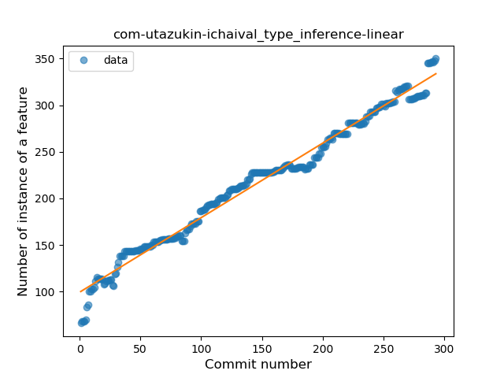

## com-utazukin-ichaival
----
#### Metrics provided by Detekt
* Number of lines of code 4864
* Number of Kotlin files: 30
* Cyclomatic complexity: 802
* Cyclomatic complexity by thousands of lines: 315 

----
**17** features analyzed

*	<a href="#type_inference">Type Inference</a> 
*	<a href="#lambda">Lambda</a> 
*	<a href="#safe_call">Safe Call</a> 
*	<a href="#when_expr">When expression</a> 
*	<a href="#unsafe_call">Unsafe Call</a> 
*	<a href="#companion_object">Companion Object</a> 
*	<a href="#string_template">String Template</a> 
*	<a href="#func_with_default_value">Function with Default Value</a> 
*	<a href="#range_expr">Range Expression</a> 
*	<a href="#smart_cast">Smart Cast</a> 
*	<a href="#data_class">Data Class</a> 
*	<a href="#func_call_with_named_arg">Function call with Named Argument</a> 
*	<a href="#extension_function">Extension Function</a> 
*	<a href="#property_delegation">Property Delegation</a> 
*	<a href="#destructuring_declaration">Destructuring Declaration</a> 
*	<a href="#coroutine">Coroutine</a> 
*	<a href="#type_alias">Type Alias</a> 

### <a name="type_inference">Type Inference</a>
----
#### Functions
* **Constant Rise - Linear:** 
    * **R_Squared:** 0.98248866
* **Sudden Rise Plateau - Logarithm:** 
    * **R_Squared:** 0.75754962
* **Plateau Sudden Rise - Binary Sigmoid:** 
    * **R_Squared:** 0.58493988

**Plots** :chart_with_upwards_trend:
-----

### <a name="lambda">Lambda</a>
----
#### Functions
* **Sudden Rise - Exponential:** 
    * **R_Squared:** 0.98226984
* **Constant Rise - Linear:** 
    * **R_Squared:** 0.96205638
* **Sudden Rise Plateau - Logarithm:** 
    * **R_Squared:** 0.57018981
* **Plateau Sudden Rise - Binary Sigmoid:** 
    * **R_Squared:** 0.418288

**Plots** :chart_with_upwards_trend:
-----

### <a name="safe_call">Safe Call</a>
----
#### Functions
* **Constant Rise - Linear:** 
    * **R_Squared:** 0.96876194
* **Plateau Sudden Rise - Binary Sigmoid:** 
    * **R_Squared:** 0.66135193
* **Sudden Rise Plateau - Logarithm:** 
    * **R_Squared:** 0.56232073

**Plots** :chart_with_upwards_trend:
-----

### <a name="when_expr">When expression</a>
----
#### Functions
* **Constant Rise - Linear:** 
    * **R_Squared:** 0.95268055
* **Sudden Rise Plateau - Logarithm:** 
    * **R_Squared:** 0.49987999

**Plots** :chart_with_upwards_trend:
-----

### <a name="unsafe_call">Unsafe Call</a>
----
#### Functions
* **Sudden Rise Plateau - Logarithm:** 
    * **R_Squared:** 0.79269272
* **Plateau Sudden Rise - Binary Sigmoid:** 
    * **R_Squared:** 0.65245677
* **Constant Rise - Linear:** 
    * **R_Squared:** 0.58074654

**Plots** :chart_with_upwards_trend:
-----

### <a name="companion_object">Companion Object</a>
----
#### Functions
* **Sudden Rise - Exponential:** 
    * **R_Squared:** 0.93967884
* **Constant Rise - Linear:** 
    * **R_Squared:** 0.88562719
* **Sudden Rise Plateau - Logarithm:** 
    * **R_Squared:** 0.52235091

**Plots** :chart_with_upwards_trend:
-----

### <a name="string_template">String Template</a>
----
#### Functions
* **Sudden Rise - Exponential:** 
    * **R_Squared:** 0.97766964
* **Constant Rise - Linear:** 
    * **R_Squared:** 0.94279305
* **Sudden Rise Plateau - Logarithm:** 
    * **R_Squared:** 0.48734288

**Plots** :chart_with_upwards_trend:
-----

### <a name="func_with_default_value">Function with Default Value</a>
----
#### Functions
* **Sudden Rise - Exponential:** 
    * **R_Squared:** 0.94640712
* **Constant Rise - Linear:** 
    * **R_Squared:** 0.59310334
* **Sudden Rise Plateau - Logarithm:** 
    * **R_Squared:** 0.220158

**Plots** :chart_with_upwards_trend:
-----

### <a name="range_expr">Range Expression</a>
----
#### Functions
* **Plateau Gradual Rise - Sigmoid:** 
    * **R_Squared:** 0.83787822
* **Constant Rise - Linear:** 
    * **R_Squared:** 0.70102417
* **Sudden Rise Plateau - Logarithm:** 
    * **R_Squared:** 0.65339246

**Plots** :chart_with_upwards_trend:
-----

### <a name="smart_cast">Smart Cast</a>
----
#### Functions
* **Sudden Rise Plateau - Logarithm:** 
    * **R_Squared:** 0.48815894
* **Constant Rise - Linear:** 
    * **R_Squared:** 0.4072448

**Plots** :chart_with_upwards_trend:
-----

### <a name="data_class">Data Class</a>
----
#### Functions
* **Plateau Sudden Rise - Binary Sigmoid:** 
    * **R_Squared:** 1.0
* **Sudden Rise - Exponential:** 
    * **R_Squared:** 0.78500191
* **Constant Rise - Linear:** 
    * **R_Squared:** 0.41182786
* **Sudden Rise Plateau - Logarithm:** 
    * **R_Squared:** 0.17453344

**Plots** :chart_with_upwards_trend:
-----

### <a name="func_call_with_named_arg">Function call with Named Argument</a>
----
#### Functions
* **Plateau Sudden Rise - Binary Sigmoid:** 
    * **R_Squared:** 0.87097545
* **Sudden Rise - Exponential:** 
    * **R_Squared:** 0.56942855
* **Constant Rise - Linear:** 
    * **R_Squared:** 0.14792403
* **Sudden Rise Plateau - Logarithm:** 
    * **R_Squared:** 0.05520781

**Plots** :chart_with_upwards_trend:
-----

### <a name="extension_function">Extension Function</a>
----
#### Functions
* **Instability - Polinomial 3:** )
    * **R_Squared:** 0.36164736
* **Sudden Rise Plateau - Logarithm:** 
    * **R_Squared:** 0.28600187
* **Constant Rise - Linear:** 
    * **R_Squared:** 0.08571429

**Plots** :chart_with_upwards_trend:
-----

### <a name="property_delegation">Property Delegation</a>
----
#### Functions
* **Plateau Gradual Rise - Sigmoid:** 
    * **R_Squared:** 0.95121864
* **Constant Rise - Linear:** 
    * **R_Squared:** 0.90438141
* **Sudden Rise - Exponential:** 
    * **R_Squared:** 0.90457435
* **Sudden Rise Plateau - Logarithm:** 
    * **R_Squared:** 0.52724188

**Plots** :chart_with_upwards_trend:
-----

### <a name="destructuring_declaration">Destructuring Declaration</a>
----
#### Functions
* **Plateau Sudden Decline - Binary Sigmoid:** 
    * **R_Squared:** 1.0
* **Constant Decline - Linear:** 
    * **R_Squared:** 0.29630321
* **Sudden Rise Plateau - Logarithm:** 
    * **R_Squared:** 0.0

**Plots** :chart_with_upwards_trend:
-----

### <a name="coroutine">Coroutine</a>
----
#### Functions
* **Sudden Rise - Exponential:** 
    * **R_Squared:** 0.88640483
* **Constant Rise - Linear:** 
    * **R_Squared:** 0.85788515
* **Sudden Rise Plateau - Logarithm:** 
    * **R_Squared:** 0.60238568

**Plots** :chart_with_upwards_trend:
-----

### <a name="type_alias">Type Alias</a>
----
#### Functions
* **Plateau Gradual Rise - Sigmoid:** 
    * **R_Squared:** 0.98216065
* **Instability - Polinomial 3:** )
    * **R_Squared:** 0.86743172
* **Sudden Rise Plateau - Logarithm:** 
    * **R_Squared:** 0.6959976
* **Constant Rise - Linear:** 
    * **R_Squared:** 0.37273037

**Plots** :chart_with_upwards_trend:
-----

