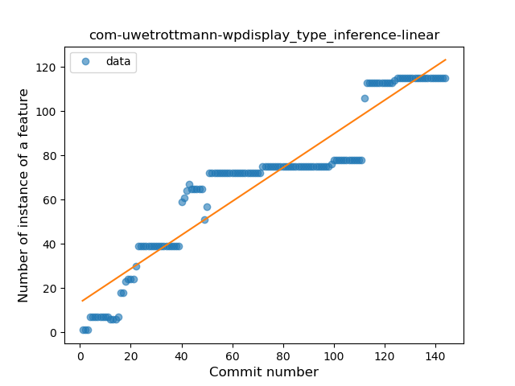
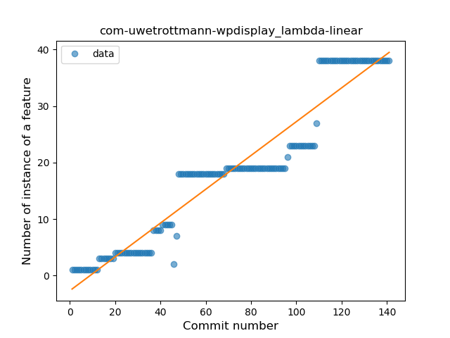
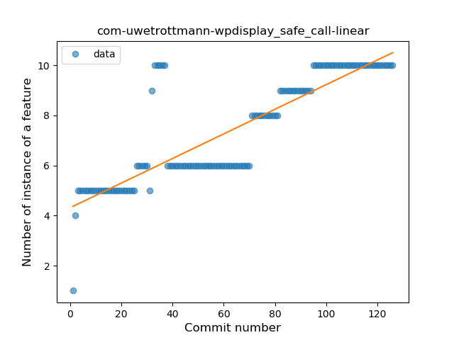
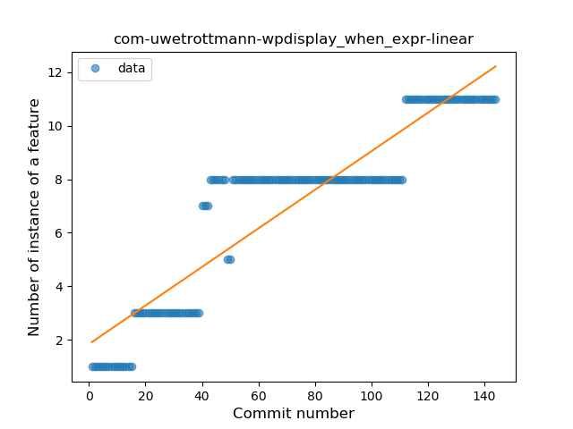
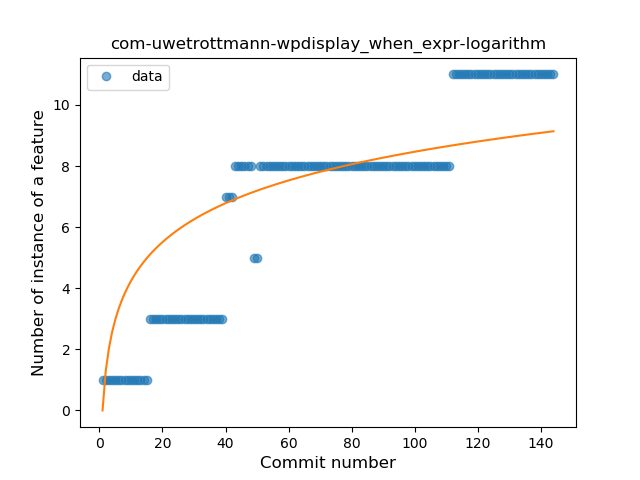
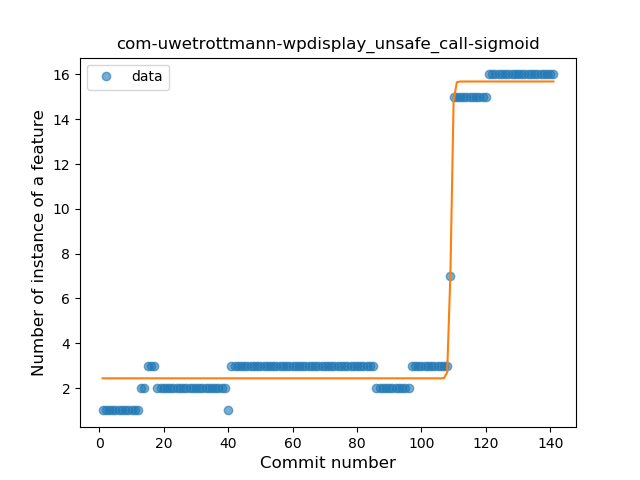
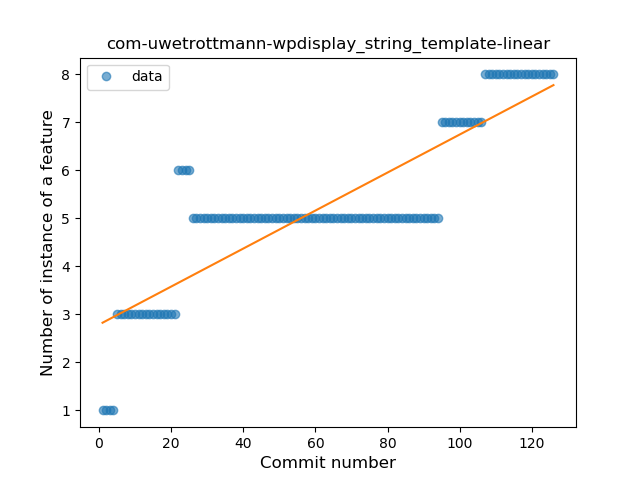
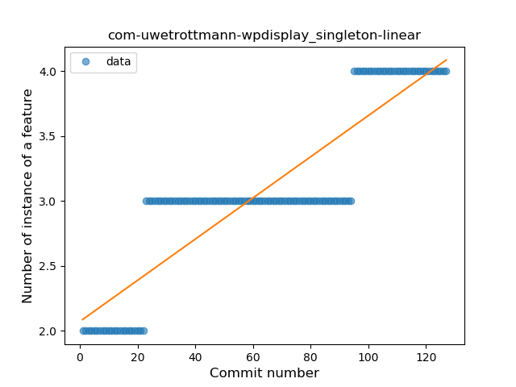

## com-uwetrottmann-wpdisplay
----
#### Metrics provided by Detekt
* Number of lines of code 2070
* Number of Kotlin files: 22
* Cyclomatic complexity: 217
* Cyclomatic complexity by thousands of lines: 240 

----
**10** features analyzed

*	<a href="#type_inference">Type Inference</a> 
*	<a href="#lambda">Lambda</a> 
*	<a href="#safe_call">Safe Call</a> 
*	<a href="#when_expr">When expression</a> 
*	<a href="#unsafe_call">Unsafe Call</a> 
*	<a href="#companion_object">Companion Object</a> 
*	<a href="#string_template">String Template</a> 
*	<a href="#singleton">Singleton</a> 
*	<a href="#range_expr">Range Expression</a> 
*	<a href="#smart_cast">Smart Cast</a> 

### <a name="type_inference">Type Inference</a>
----
#### Functions
* **Constant Rise - Linear:** 
    * **R_Squared:** 0.90174132
* **Sudden Rise Plateau - Logarithm:** 
    * **R_Squared:** 0.66002853
* **Plateau Gradual Rise - Sigmoid:** 
    * **R_Squared:** 0.58360124

**Plots** :chart_with_upwards_trend:
-----

### <a name="lambda">Lambda</a>
----
#### Functions
* **Constant Rise - Linear:** 
    * **R_Squared:** 0.91963718
* **Sudden Rise - Exponential:** 
    * **R_Squared:** 0.92512452
* **Sudden Rise Plateau - Logarithm:** 
    * **R_Squared:** 0.46322985

**Plots** :chart_with_upwards_trend:
-----

### <a name="safe_call">Safe Call</a>
----
#### Functions
* **Constant Rise - Linear:** 
    * **R_Squared:** 0.7248012
* **Sudden Rise - Exponential:** 
    * **R_Squared:** 0.72728424
* **Plateau Gradual Rise - Sigmoid:** 
    * **R_Squared:** 0.72830963
* **Sudden Rise Plateau - Logarithm:** 
    * **R_Squared:** 0.60275908

**Plots** :chart_with_upwards_trend:
-----

### <a name="when_expr">When expression</a>
----
#### Functions
* **Constant Rise - Linear:** 
    * **R_Squared:** 0.84356293
* **Sudden Rise Plateau - Logarithm:** 
    * **R_Squared:** 0.66403232

**Plots** :chart_with_upwards_trend:
-----

### <a name="unsafe_call">Unsafe Call</a>
----
#### Functions
* **Plateau Gradual Rise - Sigmoid:** 
    * **R_Squared:** 0.98650457
* **Sudden Rise - Exponential:** 
    * **R_Squared:** 0.81380535
* **Constant Rise - Linear:** 
    * **R_Squared:** 0.60056671
* **Sudden Rise Plateau - Logarithm:** 
    * **R_Squared:** 0.21487297

**Plots** :chart_with_upwards_trend:
-----

### <a name="companion_object">Companion Object</a>
----
#### Functions
* **Plateau Gradual Rise - Sigmoid:** 
    * **R_Squared:** 0.88739122
* **Sudden Rise - Exponential:** 
    * **R_Squared:** 0.87560656
* **Constant Rise - Linear:** 
    * **R_Squared:** 0.85635644
* **Sudden Rise Plateau - Logarithm:** 
    * **R_Squared:** 0.63717965

**Plots** :chart_with_upwards_trend:
-----

### <a name="string_template">String Template</a>
----
#### Functions
* **Constant Rise - Linear:** 
    * **R_Squared:** 0.74149534
* **Sudden Rise - Exponential:** 
    * **R_Squared:** 0.746564
* **Sudden Rise Plateau - Logarithm:** 
    * **R_Squared:** 0.69532215

**Plots** :chart_with_upwards_trend:
-----

### <a name="singleton">Singleton</a>
----
#### Functions
* **Constant Rise - Linear:** 
    * **R_Squared:** 0.79374141
* **Sudden Rise Plateau - Logarithm:** 
    * **R_Squared:** 0.68829409

**Plots** :chart_with_upwards_trend:
-----

### <a name="range_expr">Range Expression</a>
----
#### Functions
* **Sudden Rise - Exponential:** 
    * **R_Squared:** 0.73554987
* **Constant Rise - Linear:** 
    * **R_Squared:** 0.57981851
* **Sudden Rise Plateau - Logarithm:** 
    * **R_Squared:** 0.30286977

**Plots** :chart_with_upwards_trend:
-----

### <a name="smart_cast">Smart Cast</a>
----
#### Functions
* **Plateau Sudden Rise - Binary Sigmoid:** 
    * **R_Squared:** 1.0
* **Sudden Rise Plateau - Logarithm:** 
    * **R_Squared:** 0.32711506
* **Constant Rise - Linear:** 
    * **R_Squared:** 0.08327286

**Plots** :chart_with_upwards_trend:
-----

