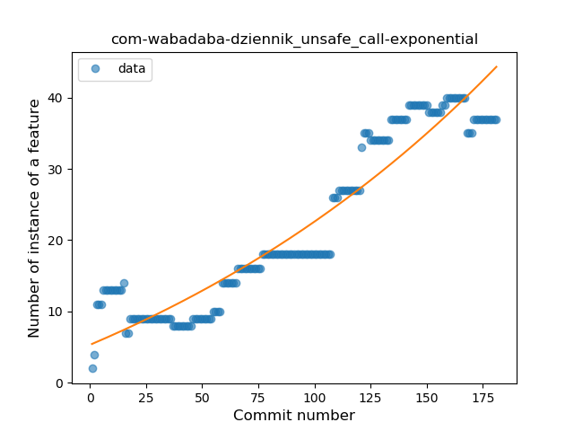
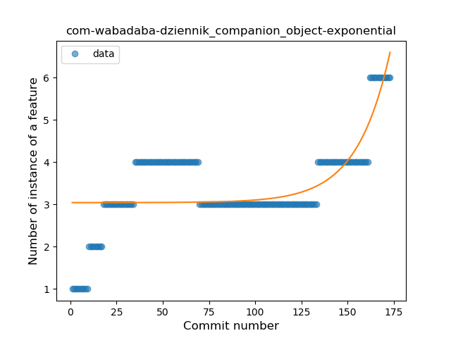
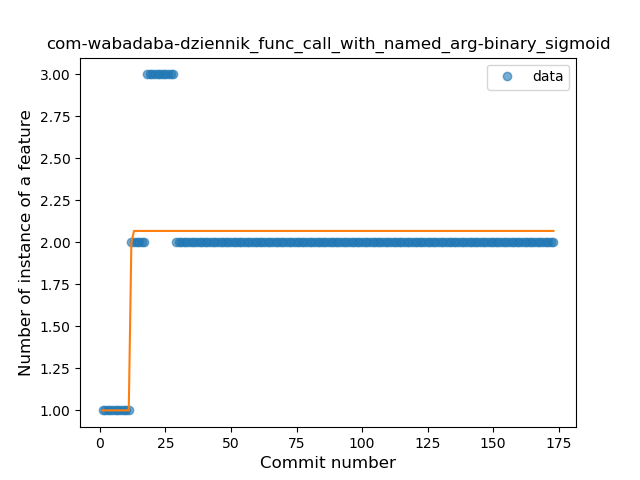
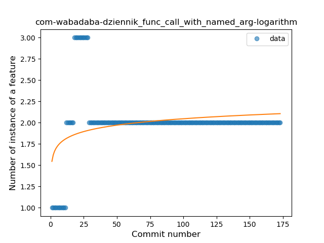
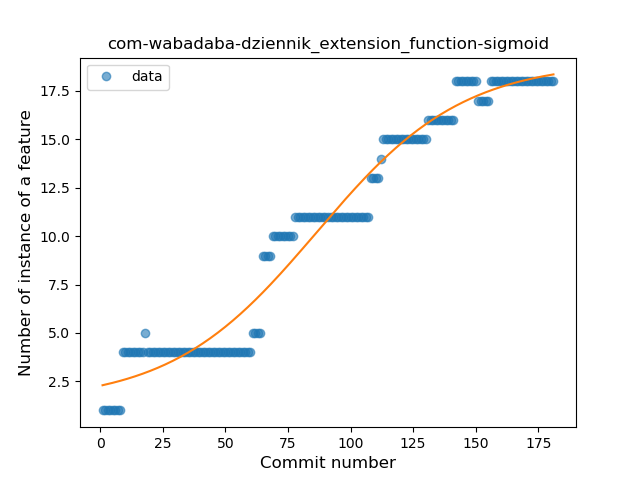

## com-wabadaba-dziennik
----
#### Metrics provided by Detekt
* Number of lines of code 4942
* Number of Kotlin files: 93
* Cyclomatic complexity: 578
* Cyclomatic complexity by thousands of lines: 219 

----
**17** features analyzed

*	<a href="#type_inference">Type Inference</a> 
*	<a href="#lambda">Lambda</a> 
*	<a href="#safe_call">Safe Call</a> 
*	<a href="#when_expr">When expression</a> 
*	<a href="#unsafe_call">Unsafe Call</a> 
*	<a href="#companion_object">Companion Object</a> 
*	<a href="#string_template">String Template</a> 
*	<a href="#func_with_default_value">Function with Default Value</a> 
*	<a href="#singleton">Singleton</a> 
*	<a href="#range_expr">Range Expression</a> 
*	<a href="#smart_cast">Smart Cast</a> 
*	<a href="#data_class">Data Class</a> 
*	<a href="#func_call_with_named_arg">Function call with Named Argument</a> 
*	<a href="#extension_function">Extension Function</a> 
*	<a href="#property_delegation">Property Delegation</a> 
*	<a href="#destructuring_declaration">Destructuring Declaration</a> 
*	<a href="#inline_func">Inline Function</a> 

### <a name="type_inference">Type Inference</a>
----
#### Functions
* **Constant Rise - Linear:** 
    * **R_Squared:** 0.92261175
* **Sudden Rise Plateau - Logarithm:** 
    * **R_Squared:** 0.74782949

**Plots** :chart_with_upwards_trend:
-----

### <a name="lambda">Lambda</a>
----
#### Functions
* **Constant Rise - Linear:** 
    * **R_Squared:** 0.97715272
* **Sudden Rise Plateau - Logarithm:** 
    * **R_Squared:** 0.63028577
* **Plateau Sudden Rise - Binary Sigmoid:** 
    * **R_Squared:** 0.61823733

**Plots** :chart_with_upwards_trend:
-----

### <a name="safe_call">Safe Call</a>
----
#### Functions
* **Plateau Gradual Rise - Sigmoid:** 
    * **R_Squared:** 0.98752378
* **Constant Rise - Linear:** 
    * **R_Squared:** 0.93901984
* **Sudden Rise Plateau - Logarithm:** 
    * **R_Squared:** 0.51319312

**Plots** :chart_with_upwards_trend:
-----

### <a name="when_expr">When expression</a>
----
#### Functions
* **Plateau Gradual Rise - Sigmoid:** 
    * **R_Squared:** 0.93764236
* **Constant Rise - Linear:** 
    * **R_Squared:** 0.91699331
* **Sudden Rise Plateau - Logarithm:** 
    * **R_Squared:** 0.67550957

**Plots** :chart_with_upwards_trend:
-----

### <a name="unsafe_call">Unsafe Call</a>
----
#### Functions
* **Sudden Rise - Exponential:** 
    * **R_Squared:** 0.89748829
* **Constant Rise - Linear:** 
    * **R_Squared:** 0.88207803
* **Sudden Rise Plateau - Logarithm:** 
    * **R_Squared:** 0.46312053

**Plots** :chart_with_upwards_trend:
-----

### <a name="companion_object">Companion Object</a>
----
#### Functions
* **Sudden Rise - Exponential:** 
    * **R_Squared:** 0.51573573
* **Sudden Rise Plateau - Logarithm:** 
    * **R_Squared:** 0.42930709
* **Plateau Gradual Rise - Sigmoid:** 
    * **R_Squared:** 0.43353635
* **Constant Rise - Linear:** 
    * **R_Squared:** 0.37113816

**Plots** :chart_with_upwards_trend:
-----

### <a name="string_template">String Template</a>
----
#### Functions
* **Constant Rise - Linear:** 
    * **R_Squared:** 0.84940386
* **Sudden Rise Plateau - Logarithm:** 
    * **R_Squared:** 0.8398451
* **Plateau Sudden Rise - Binary Sigmoid:** 
    * **R_Squared:** 0.40504938

**Plots** :chart_with_upwards_trend:
-----

### <a name="func_with_default_value">Function with Default Value</a>
----
#### Functions
* **Plateau Sudden Rise - Binary Sigmoid:** 
    * **R_Squared:** 0.94818763
* **Sudden Rise - Exponential:** 
    * **R_Squared:** 0.69867732
* **Constant Rise - Linear:** 
    * **R_Squared:** 0.454701
* **Sudden Rise Plateau - Logarithm:** 
    * **R_Squared:** 0.16689183

**Plots** :chart_with_upwards_trend:
-----

### <a name="singleton">Singleton</a>
----
#### Functions
* **Plateau Sudden Rise - Binary Sigmoid:** 
    * **R_Squared:** 0.66792777
* **Sudden Rise Plateau - Logarithm:** 
    * **R_Squared:** 0.12692959
* **Constant Rise - Linear:** 
    * **R_Squared:** 0.0183995

**Plots** :chart_with_upwards_trend:
-----

### <a name="range_expr">Range Expression</a>
----
#### Functions
* **Sudden Rise - Exponential:** 
    * **R_Squared:** 0.92935144
* **Constant Rise - Linear:** 
    * **R_Squared:** 0.90209987
* **Sudden Rise Plateau - Logarithm:** 
    * **R_Squared:** 0.51444467

**Plots** :chart_with_upwards_trend:
-----

### <a name="smart_cast">Smart Cast</a>
----
#### Functions
* **Constant Rise - Linear:** 
    * **R_Squared:** 0.90535507
* **Sudden Rise Plateau - Logarithm:** 
    * **R_Squared:** 0.67108183

**Plots** :chart_with_upwards_trend:
-----

### <a name="data_class">Data Class</a>
----
#### Functions
* **Plateau Gradual Rise - Sigmoid:** 
    * **R_Squared:** 0.97054595
* **Constant Rise - Linear:** 
    * **R_Squared:** 0.95035825
* **Sudden Rise Plateau - Logarithm:** 
    * **R_Squared:** 0.58115993

**Plots** :chart_with_upwards_trend:
-----

### <a name="func_call_with_named_arg">Function call with Named Argument</a>
----
#### Functions
* **Plateau Sudden Rise - Binary Sigmoid:** 
    * **R_Squared:** 0.5341615
* **Sudden Rise Plateau - Logarithm:** 
    * **R_Squared:** 0.08349255
* **Constant Rise - Linear:** 
    * **R_Squared:** 0.00368399

**Plots** :chart_with_upwards_trend:
-----

### <a name="extension_function">Extension Function</a>
----
#### Functions
* **Plateau Gradual Rise - Sigmoid:** 
    * **R_Squared:** 0.96429827
* **Constant Rise - Linear:** 
    * **R_Squared:** 0.94558229
* **Sudden Rise Plateau - Logarithm:** 
    * **R_Squared:** 0.54880085

**Plots** :chart_with_upwards_trend:
-----

### <a name="property_delegation">Property Delegation</a>
----
#### Functions
* **Sudden Rise - Exponential:** 
    * **R_Squared:** 0.71812552
* **Constant Rise - Linear:** 
    * **R_Squared:** 0.23303003
* **Plateau Sudden Decline - Binary Sigmoid:** 
    * **R_Squared:** 0.06804733
* **Sudden Rise Plateau - Logarithm:** 
    * **R_Squared:** 0.03514916

**Plots** :chart_with_upwards_trend:
-----

### <a name="destructuring_declaration">Destructuring Declaration</a>
----
#### Functions
* **Constant Rise - Linear:** 
    * **R_Squared:** 0.95312566
* **Sudden Rise Plateau - Logarithm:** 
    * **R_Squared:** 0.49904952

**Plots** :chart_with_upwards_trend:
-----

### <a name="inline_func">Inline Function</a>
----
#### Functions
* **Plateau Sudden Decline - Binary Sigmoid:** 
    * **R_Squared:** 0.20505342
* **Constant Rise - Linear:** 
    * **R_Squared:** 0.00022562
* **Sudden Rise - Exponential:** 
    * **R_Squared:** 0.00022648
* **Sudden Rise Plateau - Logarithm:** 
    * **R_Squared:** -0.0

**Plots** :chart_with_upwards_trend:
-----

