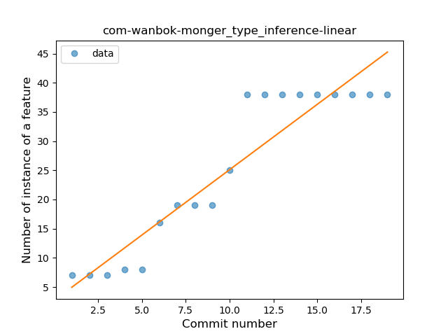
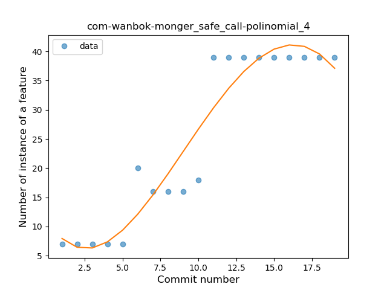

## com-wanbok-monger
----
#### Metrics provided by Detekt
* Number of lines of code 290
* Number of Kotlin files: 5
* Cyclomatic complexity: 40
* Cyclomatic complexity by thousands of lines: 285 

----
**3** features analyzed

*	<a href="#type_inference">Type Inference</a> 
*	<a href="#lambda">Lambda</a> 
*	<a href="#safe_call">Safe Call</a> 

### <a name="type_inference">Type Inference</a>
----
#### Functions
* **Instability - Polinomial 3:** )
    * **R_Squared:** 0.95636297
* **Instability - Polinomial 4:** 
    * **R_Squared:** 0.96138938
* **Constant Rise - Linear:** 
    * **R_Squared:** 0.87626798
* **Sudden Rise Plateau - Logarithm:** 
    * **R_Squared:** 0.77055204

**Plots** :chart_with_upwards_trend:
-----

### <a name="lambda">Lambda</a>
----
#### Functions
* **Plateau Gradual Rise - Sigmoid:** 
    * **R_Squared:** 0.88234851
* **Constant Rise - Linear:** 
    * **R_Squared:** 0.84201031
* **Sudden Rise Plateau - Logarithm:** 
    * **R_Squared:** 0.78743309

**Plots** :chart_with_upwards_trend:
-----

### <a name="safe_call">Safe Call</a>
----
#### Functions
* **Instability - Polinomial 3:** )
    * **R_Squared:** 0.91199935
* **Instability - Polinomial 4:** 
    * **R_Squared:** 0.91223917
* **Constant Rise - Linear:** 
    * **R_Squared:** 0.84367136
* **Sudden Rise Plateau - Logarithm:** 
    * **R_Squared:** 0.70339729

**Plots** :chart_with_upwards_trend:
-----

