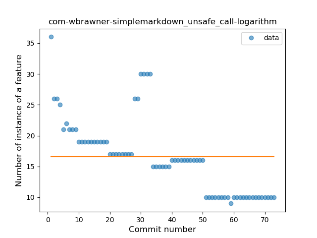
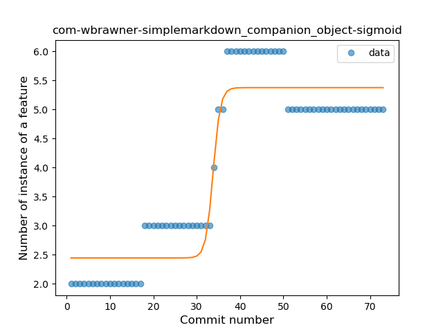
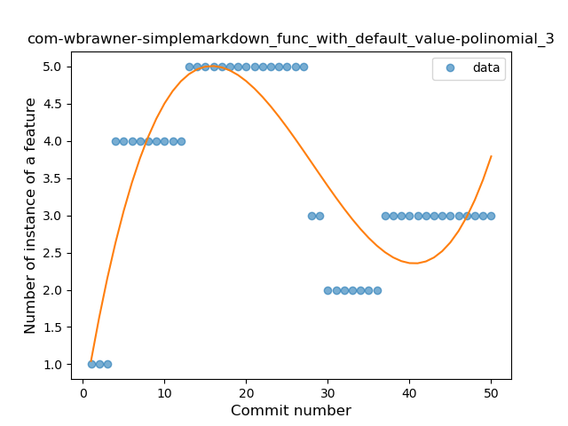
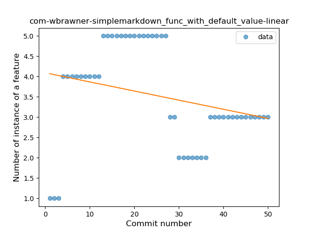
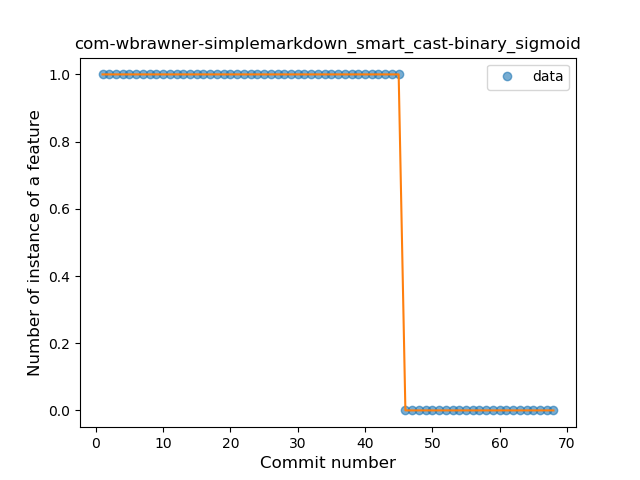
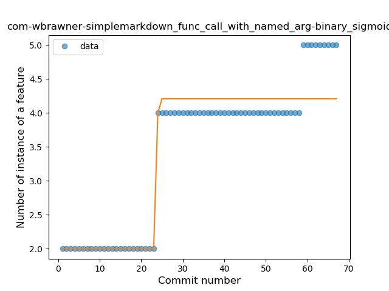
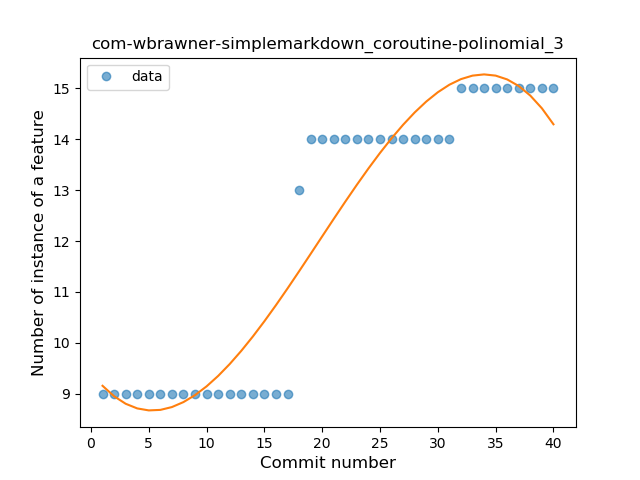
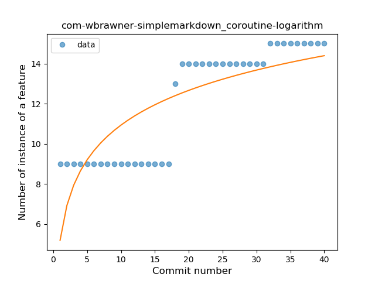

## com-wbrawner-simplemarkdown
----
#### Metrics provided by Detekt
* Number of lines of code 1621
* Number of Kotlin files: 20
* Cyclomatic complexity: 241
* Cyclomatic complexity by thousands of lines: 260 

----
**13** features analyzed

*	<a href="#type_inference">Type Inference</a> 
*	<a href="#lambda">Lambda</a> 
*	<a href="#safe_call">Safe Call</a> 
*	<a href="#when_expr">When expression</a> 
*	<a href="#unsafe_call">Unsafe Call</a> 
*	<a href="#companion_object">Companion Object</a> 
*	<a href="#string_template">String Template</a> 
*	<a href="#func_with_default_value">Function with Default Value</a> 
*	<a href="#smart_cast">Smart Cast</a> 
*	<a href="#func_call_with_named_arg">Function call with Named Argument</a> 
*	<a href="#extension_function">Extension Function</a> 
*	<a href="#property_delegation">Property Delegation</a> 
*	<a href="#coroutine">Coroutine</a> 

### <a name="type_inference">Type Inference</a>
----
#### Functions
* **Instability - Polinomial 3:** )
    * **R_Squared:** 0.97684896
* **Constant Rise - Linear:** 
    * **R_Squared:** 0.9413667
* **Sudden Rise Plateau - Logarithm:** 
    * **R_Squared:** 0.76175847

**Plots** :chart_with_upwards_trend:
-----

### <a name="lambda">Lambda</a>
----
#### Functions
* **Sudden Rise - Exponential:** 
    * **R_Squared:** 0.93809909
* **Constant Rise - Linear:** 
    * **R_Squared:** 0.88797632
* **Sudden Rise Plateau - Logarithm:** 
    * **R_Squared:** 0.46993836

**Plots** :chart_with_upwards_trend:
-----

### <a name="safe_call">Safe Call</a>
----
#### Functions
* **Constant Rise - Linear:** 
    * **R_Squared:** 0.82693286
* **Plateau Gradual Rise - Sigmoid:** 
    * **R_Squared:** 0.81183596
* **Sudden Rise Plateau - Logarithm:** 
    * **R_Squared:** 0.67064781

**Plots** :chart_with_upwards_trend:
-----

### <a name="when_expr">When expression</a>
----
#### Functions
* **Plateau Gradual Rise - Sigmoid:** 
    * **R_Squared:** 0.91684469
* **Sudden Rise Plateau - Logarithm:** 
    * **R_Squared:** 0.82299307
* **Constant Rise - Linear:** 
    * **R_Squared:** 0.75922241

**Plots** :chart_with_upwards_trend:
-----

### <a name="unsafe_call">Unsafe Call</a>
----
#### Functions
* **Constant Decline - Linear:** 
    * **R_Squared:** 0.59107439
* **Sudden Rise Plateau - Logarithm:** 
    * **R_Squared:** -0.0

**Plots** :chart_with_upwards_trend:
-----

### <a name="companion_object">Companion Object</a>
----
#### Functions
* **Plateau Gradual Rise - Sigmoid:** 
    * **R_Squared:** 0.89960758
* **Instability - Polinomial 3:** )
    * **R_Squared:** 0.84140874
* **Constant Rise - Linear:** 
    * **R_Squared:** 0.66843389
* **Sudden Rise Plateau - Logarithm:** 
    * **R_Squared:** 0.62641664

**Plots** :chart_with_upwards_trend:
-----

### <a name="string_template">String Template</a>
----
#### Functions
* **Plateau Gradual Rise - Sigmoid:** 
    * **R_Squared:** 0.96118731
* **Sudden Rise - Exponential:** 
    * **R_Squared:** 0.91808819
* **Constant Rise - Linear:** 
    * **R_Squared:** 0.80334638
* **Sudden Rise Plateau - Logarithm:** 
    * **R_Squared:** 0.27415968

**Plots** :chart_with_upwards_trend:
-----

### <a name="func_with_default_value">Function with Default Value</a>
----
#### Functions
* **Instability - Polinomial 3:** )
    * **R_Squared:** 0.70612679
* **Constant Decline - Linear:** 
    * **R_Squared:** 0.07060526
* **Sudden Rise Plateau - Logarithm:** 
    * **R_Squared:** 0.0015016

**Plots** :chart_with_upwards_trend:
-----

### <a name="smart_cast">Smart Cast</a>
----
#### Functions
* **Plateau Sudden Decline - Binary Sigmoid:** 
    * **R_Squared:** 1.0
* **Constant Decline - Linear:** 
    * **R_Squared:** 0.67164179
* **Sudden Rise Plateau - Logarithm:** 
    * **R_Squared:** -0.0

**Plots** :chart_with_upwards_trend:
-----

### <a name="func_call_with_named_arg">Function call with Named Argument</a>
----
#### Functions
* **Plateau Sudden Rise - Binary Sigmoid:** 
    * **R_Squared:** 0.91167278
* **Constant Rise - Linear:** 
    * **R_Squared:** 0.80269827
* **Sudden Rise Plateau - Logarithm:** 
    * **R_Squared:** 0.67378869

**Plots** :chart_with_upwards_trend:
-----

### <a name="extension_function">Extension Function</a>
----
#### Functions
* **Plateau Sudden Rise - Binary Sigmoid:** 
    * **R_Squared:** 1.0
* **Instability - Polinomial 3:** )
    * **R_Squared:** 0.84559981
* **Sudden Rise - Exponential:** 
    * **R_Squared:** 0.75210953
* **Constant Rise - Linear:** 
    * **R_Squared:** 0.73379074
* **Sudden Rise Plateau - Logarithm:** 
    * **R_Squared:** 0.46958779

**Plots** :chart_with_upwards_trend:
-----

### <a name="property_delegation">Property Delegation</a>
----
#### Functions
* **Instability - Polinomial 4:** 
    * **R_Squared:** 0.70260668
* **Constant Decline - Linear:** 
    * **R_Squared:** 0.2947861
* **Sudden Rise Plateau - Logarithm:** 
    * **R_Squared:** -0.0

**Plots** :chart_with_upwards_trend:
-----

### <a name="coroutine">Coroutine</a>
----
#### Functions
* **Instability - Polinomial 3:** )
    * **R_Squared:** 0.88669236
* **Constant Rise - Linear:** 
    * **R_Squared:** 0.81993552
* **Sudden Rise Plateau - Logarithm:** 
    * **R_Squared:** 0.64498258

**Plots** :chart_with_upwards_trend:
-----

