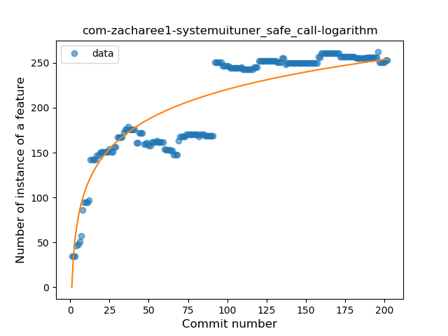
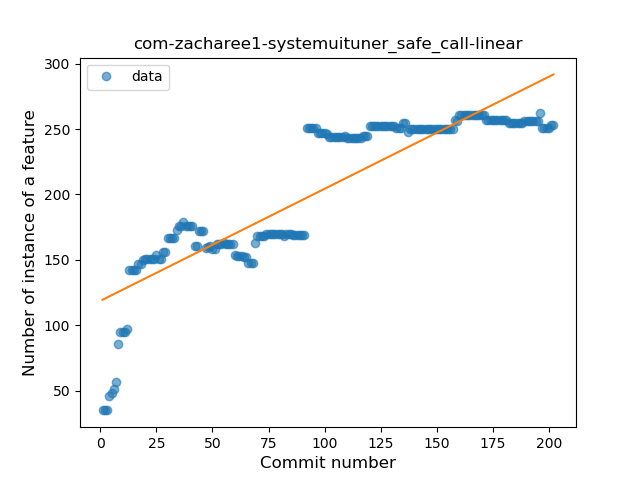
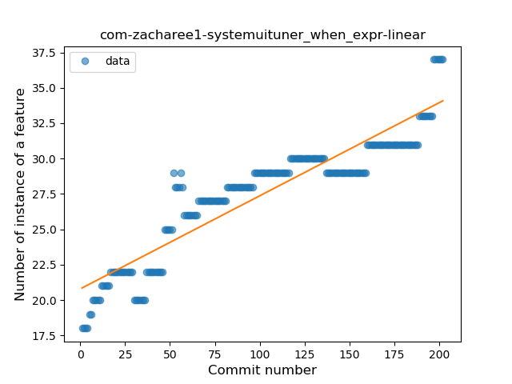
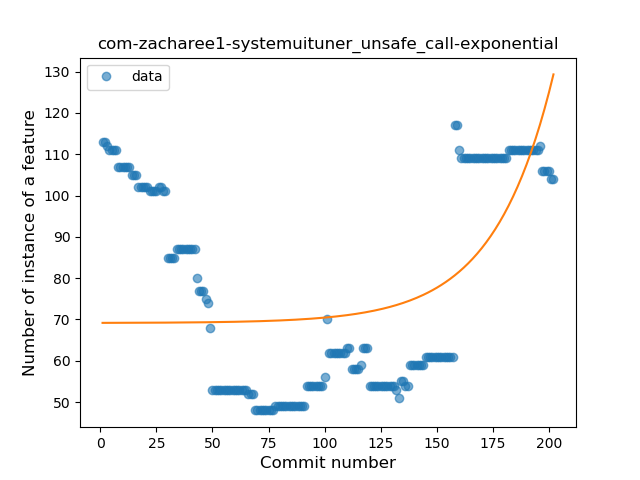
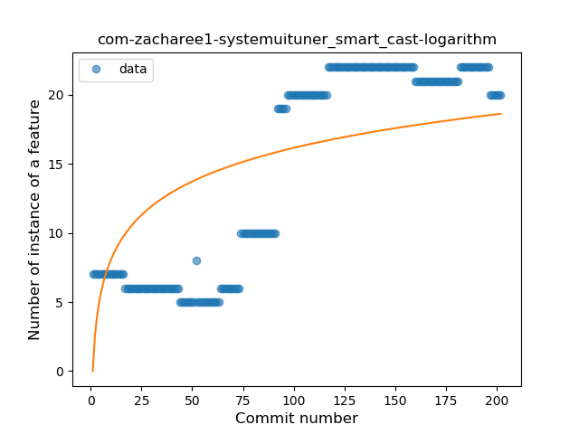

## com-zacharee1-systemuituner
----
#### Metrics provided by Detekt
* Number of lines of code 6936
* Number of Kotlin files: 72
* Cyclomatic complexity: 1088
* Cyclomatic complexity by thousands of lines: 284 

----
**14** features analyzed

*	<a href="#type_inference">Type Inference</a> 
*	<a href="#lambda">Lambda</a> 
*	<a href="#safe_call">Safe Call</a> 
*	<a href="#when_expr">When expression</a> 
*	<a href="#unsafe_call">Unsafe Call</a> 
*	<a href="#companion_object">Companion Object</a> 
*	<a href="#string_template">String Template</a> 
*	<a href="#func_with_default_value">Function with Default Value</a> 
*	<a href="#singleton">Singleton</a> 
*	<a href="#range_expr">Range Expression</a> 
*	<a href="#smart_cast">Smart Cast</a> 
*	<a href="#data_class">Data Class</a> 
*	<a href="#extension_function">Extension Function</a> 
*	<a href="#property_delegation">Property Delegation</a> 

### <a name="type_inference">Type Inference</a>
----
#### Functions
* **Constant Rise - Linear:** 
    * **R_Squared:** 0.95165517
* **Sudden Rise Plateau - Logarithm:** 
    * **R_Squared:** 0.80711922

**Plots** :chart_with_upwards_trend:
-----

### <a name="lambda">Lambda</a>
----
#### Functions
* **Constant Rise - Linear:** 
    * **R_Squared:** 0.9437819
* **Sudden Rise Plateau - Logarithm:** 
    * **R_Squared:** 0.74322983

**Plots** :chart_with_upwards_trend:
-----

### <a name="safe_call">Safe Call</a>
----
#### Functions
* **Sudden Rise Plateau - Logarithm:** 
    * **R_Squared:** 0.83138471
* **Constant Rise - Linear:** 
    * **R_Squared:** 0.77901572

**Plots** :chart_with_upwards_trend:
-----

### <a name="when_expr">When expression</a>
----
#### Functions
* **Constant Rise - Linear:** 
    * **R_Squared:** 0.84733758
* **Sudden Rise Plateau - Logarithm:** 
    * **R_Squared:** 0.81618051

**Plots** :chart_with_upwards_trend:
-----

### <a name="unsafe_call">Unsafe Call</a>
----
#### Functions
* **Sudden Rise - Exponential:** 
    * **R_Squared:** 0.28899511
* **Plateau Sudden Decline - Binary Sigmoid:** 
    * **R_Squared:** 0.12775913
* **Constant Rise - Linear:** 
    * **R_Squared:** 0.01868409
* **Sudden Rise Plateau - Logarithm:** 
    * **R_Squared:** -0.0

**Plots** :chart_with_upwards_trend:
-----

### <a name="companion_object">Companion Object</a>
----
#### Functions
* **Constant Rise - Linear:** 
    * **R_Squared:** 0.8810939
* **Sudden Rise Plateau - Logarithm:** 
    * **R_Squared:** 0.81626954

**Plots** :chart_with_upwards_trend:
-----

### <a name="string_template">String Template</a>
----
#### Functions
* **Constant Rise - Linear:** 
    * **R_Squared:** 0.89409658
* **Sudden Rise Plateau - Logarithm:** 
    * **R_Squared:** 0.78735892

**Plots** :chart_with_upwards_trend:
-----

### <a name="func_with_default_value">Function with Default Value</a>
----
#### Functions
* **Constant Rise - Linear:** 
    * **R_Squared:** 0.88269951
* **Sudden Rise Plateau - Logarithm:** 
    * **R_Squared:** 0.53195127

**Plots** :chart_with_upwards_trend:
-----

### <a name="singleton">Singleton</a>
----
#### Functions
* **Constant Decline - Linear:** 
    * **R_Squared:** 0.77603228
* **Sudden Rise - Exponential:** 
    * **R_Squared:** -0.0
* **Sudden Rise Plateau - Logarithm:** 
    * **R_Squared:** -0.0

**Plots** :chart_with_upwards_trend:
-----

### <a name="range_expr">Range Expression</a>
----
#### Functions
* **Constant Decline - Linear:** 
    * **R_Squared:** 0.65825553
* **Sudden Decline - Exponential:** 
    * **R_Squared:** 0.6589231
* **Sudden Rise Plateau - Logarithm:** 
    * **R_Squared:** 0.0

**Plots** :chart_with_upwards_trend:
-----

### <a name="smart_cast">Smart Cast</a>
----
#### Functions
* **Plateau Gradual Rise - Sigmoid:** 
    * **R_Squared:** 0.97790319
* **Constant Rise - Linear:** 
    * **R_Squared:** 0.78072423
* **Sudden Rise Plateau - Logarithm:** 
    * **R_Squared:** 0.47914575

**Plots** :chart_with_upwards_trend:
-----

### <a name="data_class">Data Class</a>
----
#### Functions
* **Plateau Sudden Rise - Binary Sigmoid:** 
    * **R_Squared:** 1.0
* **Sudden Rise Plateau - Logarithm:** 
    * **R_Squared:** 0.67021407
* **Constant Rise - Linear:** 
    * **R_Squared:** 0.59297565

**Plots** :chart_with_upwards_trend:
-----

### <a name="extension_function">Extension Function</a>
----
#### Functions
* **Sudden Rise Plateau - Logarithm:** 
    * **R_Squared:** 0.65492629
* **Constant Rise - Linear:** 
    * **R_Squared:** 0.45794099
* **Plateau Sudden Rise - Binary Sigmoid:** 
    * **R_Squared:** 0.39926571

**Plots** :chart_with_upwards_trend:
-----

### <a name="property_delegation">Property Delegation</a>
----
#### Functions
* **Constant Rise - Linear:** 
    * **R_Squared:** 0.85843153
* **Plateau Gradual Rise - Sigmoid:** 
    * **R_Squared:** 0.6408599
* **Sudden Rise Plateau - Logarithm:** 
    * **R_Squared:** 0.63013314

**Plots** :chart_with_upwards_trend:
-----

