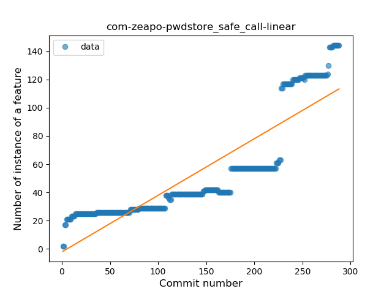
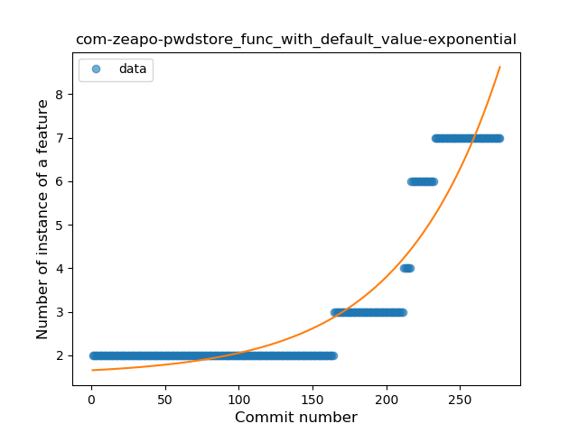
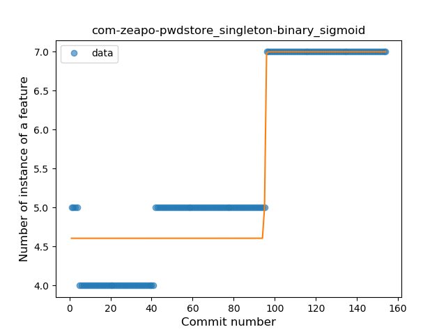
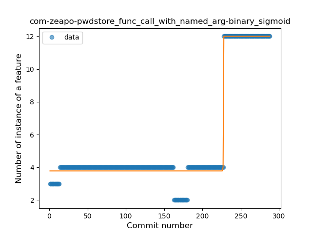
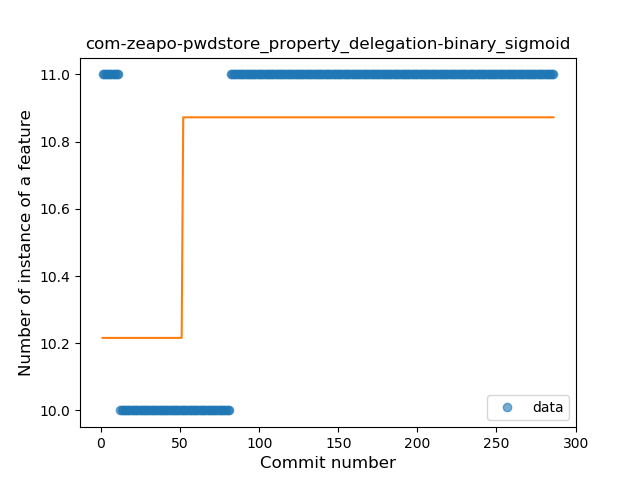

## com-zeapo-pwdstore
----
#### Metrics provided by Detekt
* Number of lines of code 7365
* Number of Kotlin files: 44
* Cyclomatic complexity: 1070
* Cyclomatic complexity by thousands of lines: 264 

----
**15** features analyzed

*	<a href="#type_inference">Type Inference</a> 
*	<a href="#lambda">Lambda</a> 
*	<a href="#safe_call">Safe Call</a> 
*	<a href="#when_expr">When expression</a> 
*	<a href="#unsafe_call">Unsafe Call</a> 
*	<a href="#companion_object">Companion Object</a> 
*	<a href="#string_template">String Template</a> 
*	<a href="#func_with_default_value">Function with Default Value</a> 
*	<a href="#singleton">Singleton</a> 
*	<a href="#range_expr">Range Expression</a> 
*	<a href="#smart_cast">Smart Cast</a> 
*	<a href="#data_class">Data Class</a> 
*	<a href="#func_call_with_named_arg">Function call with Named Argument</a> 
*	<a href="#extension_function">Extension Function</a> 
*	<a href="#property_delegation">Property Delegation</a> 

### <a name="type_inference">Type Inference</a>
----
#### Functions
* **Sudden Rise - Exponential:** 
    * **R_Squared:** 0.94832203
* **Constant Rise - Linear:** 
    * **R_Squared:** 0.82775346
* **Sudden Rise Plateau - Logarithm:** 
    * **R_Squared:** 0.36924018

**Plots** :chart_with_upwards_trend:
-----

### <a name="lambda">Lambda</a>
----
#### Functions
* **Sudden Rise - Exponential:** 
    * **R_Squared:** 0.94790872
* **Constant Rise - Linear:** 
    * **R_Squared:** 0.87395082
* **Sudden Rise Plateau - Logarithm:** 
    * **R_Squared:** 0.44468897

**Plots** :chart_with_upwards_trend:
-----

### <a name="safe_call">Safe Call</a>
----
#### Functions
* **Sudden Rise - Exponential:** 
    * **R_Squared:** 0.93384206
* **Constant Rise - Linear:** 
    * **R_Squared:** 0.77280127
* **Sudden Rise Plateau - Logarithm:** 
    * **R_Squared:** 0.31615654
* **Plateau Gradual Rise - Sigmoid:** 
    * **R_Squared:** 0.08112843

**Plots** :chart_with_upwards_trend:
-----

### <a name="when_expr">When expression</a>
----
#### Functions
* **Sudden Rise - Exponential:** 
    * **R_Squared:** 0.89405
* **Constant Rise - Linear:** 
    * **R_Squared:** 0.75053973
* **Sudden Rise Plateau - Logarithm:** 
    * **R_Squared:** 0.41369227

**Plots** :chart_with_upwards_trend:
-----

### <a name="unsafe_call">Unsafe Call</a>
----
#### Functions
* **Constant Rise - Linear:** 
    * **R_Squared:** 0.87953493
* **Plateau Gradual Rise - Sigmoid:** 
    * **R_Squared:** 0.65867649
* **Sudden Rise Plateau - Logarithm:** 
    * **R_Squared:** 0.4480616

**Plots** :chart_with_upwards_trend:
-----

### <a name="companion_object">Companion Object</a>
----
#### Functions
* **Plateau Gradual Rise - Sigmoid:** 
    * **R_Squared:** 0.95998271
* **Sudden Rise - Exponential:** 
    * **R_Squared:** 0.91514928
* **Constant Rise - Linear:** 
    * **R_Squared:** 0.79045539
* **Sudden Rise Plateau - Logarithm:** 
    * **R_Squared:** 0.29858103

**Plots** :chart_with_upwards_trend:
-----

### <a name="string_template">String Template</a>
----
#### Functions
* **Sudden Rise - Exponential:** 
    * **R_Squared:** 0.91551699
* **Constant Rise - Linear:** 
    * **R_Squared:** 0.87723877
* **Plateau Sudden Rise - Binary Sigmoid:** 
    * **R_Squared:** 0.56085128
* **Sudden Rise Plateau - Logarithm:** 
    * **R_Squared:** 0.44315687

**Plots** :chart_with_upwards_trend:
-----

### <a name="func_with_default_value">Function with Default Value</a>
----
#### Functions
* **Plateau Gradual Rise - Sigmoid:** 
    * **R_Squared:** 0.97005533
* **Sudden Rise - Exponential:** 
    * **R_Squared:** 0.89321841
* **Constant Rise - Linear:** 
    * **R_Squared:** 0.66636735
* **Sudden Rise Plateau - Logarithm:** 
    * **R_Squared:** 0.27537254

**Plots** :chart_with_upwards_trend:
-----

### <a name="singleton">Singleton</a>
----
#### Functions
* **Plateau Sudden Rise - Binary Sigmoid:** 
    * **R_Squared:** 0.90262019
* **Constant Rise - Linear:** 
    * **R_Squared:** 0.82840588
* **Sudden Rise - Exponential:** 
    * **R_Squared:** 0.83309887
* **Sudden Rise Plateau - Logarithm:** 
    * **R_Squared:** 0.52753903

**Plots** :chart_with_upwards_trend:
-----

### <a name="range_expr">Range Expression</a>
----
#### Functions
* **Plateau Gradual Rise - Sigmoid:** 
    * **R_Squared:** 0.97882508
* **Sudden Rise - Exponential:** 
    * **R_Squared:** 0.83060008
* **Constant Rise - Linear:** 
    * **R_Squared:** 0.81806746
* **Sudden Rise Plateau - Logarithm:** 
    * **R_Squared:** 0.32891419

**Plots** :chart_with_upwards_trend:
-----

### <a name="smart_cast">Smart Cast</a>
----
#### Functions
* **Plateau Gradual Rise - Sigmoid:** 
    * **R_Squared:** 0.91409506
* **Constant Rise - Linear:** 
    * **R_Squared:** 0.89034886
* **Sudden Rise Plateau - Logarithm:** 
    * **R_Squared:** 0.59212104

**Plots** :chart_with_upwards_trend:
-----

### <a name="data_class">Data Class</a>
----
#### Functions
* **Sudden Rise Plateau - Logarithm:** 
    * **R_Squared:** 0.33534915
* **Constant Rise - Linear:** 
    * **R_Squared:** 0.09516129
* **Plateau Gradual Rise - Sigmoid:** 
    * **R_Squared:** 0.09533898

**Plots** :chart_with_upwards_trend:
-----

### <a name="func_call_with_named_arg">Function call with Named Argument</a>
----
#### Functions
* **Plateau Sudden Rise - Binary Sigmoid:** 
    * **R_Squared:** 0.97759641
* **Sudden Rise - Exponential:** 
    * **R_Squared:** 0.75516616
* **Constant Rise - Linear:** 
    * **R_Squared:** 0.47799122
* **Sudden Rise Plateau - Logarithm:** 
    * **R_Squared:** 0.20755644

**Plots** :chart_with_upwards_trend:
-----

### <a name="extension_function">Extension Function</a>
----
#### Functions
* **Plateau Gradual Rise - Sigmoid:** 
    * **R_Squared:** 0.82534567
* **Constant Rise - Linear:** 
    * **R_Squared:** 0.4466906
* **Sudden Rise Plateau - Logarithm:** 
    * **R_Squared:** 0.38564935

**Plots** :chart_with_upwards_trend:
-----

### <a name="property_delegation">Property Delegation</a>
----
#### Functions
* **Constant Rise - Linear:** 
    * **R_Squared:** 0.44734465
* **Plateau Sudden Rise - Binary Sigmoid:** 
    * **R_Squared:** 0.34179022
* **Sudden Rise Plateau - Logarithm:** 
    * **R_Squared:** 0.31342921

**Plots** :chart_with_upwards_trend:
-----

