## commons-app-apps-android-commons
----
#### Metrics provided by Detekt
* Number of lines of code 3146
* Number of Kotlin files: 26
* Cyclomatic complexity: 373
* Cyclomatic complexity by thousands of lines: 203 

----
**5** features analyzed

*	<a href="#type_inference">Type Inference</a> 
*	<a href="#lambda">Lambda</a> 
*	<a href="#safe_call">Safe Call</a> 
*	<a href="#string_template">String Template</a> 
*	<a href="#range_expr">Range Expression</a> 

### <a name="type_inference">Type Inference</a>
----
#### Functions
* **Constant Rise - Linear:** 
    * **R_Squared:** 0.89740816
* **Sudden Rise - Exponential:** 
    * **R_Squared:** 0.89905
* **Sudden Rise Plateau - Logarithm:** 
    * **R_Squared:** 0.63565825

**Plots** :chart_with_upwards_trend:
-----

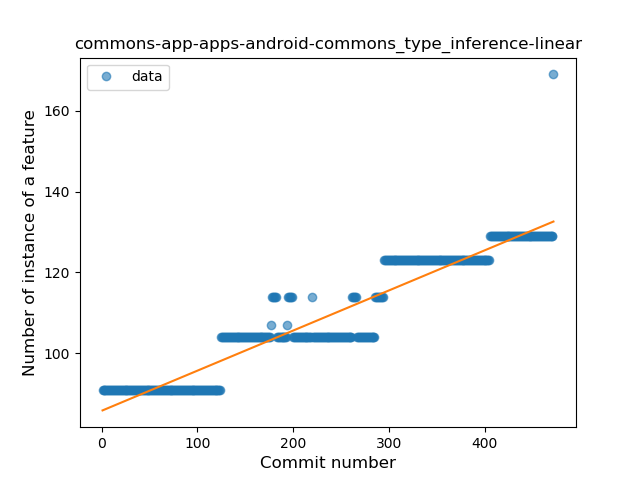
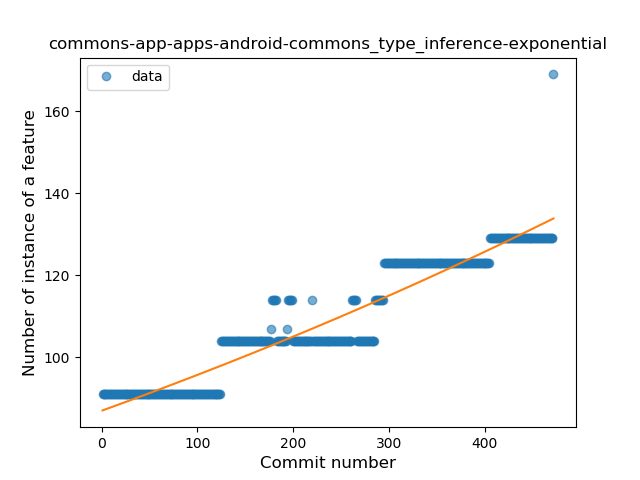
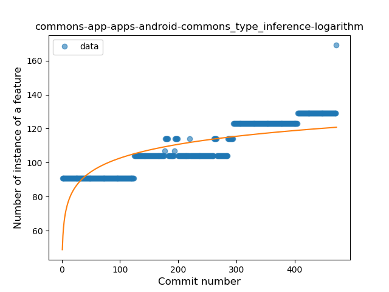
### <a name="lambda">Lambda</a>
----
#### Functions
* **Sudden Rise - Exponential:** 
    * **R_Squared:** 0.9223149
* **Constant Rise - Linear:** 
    * **R_Squared:** 0.85144739
* **Sudden Rise Plateau - Logarithm:** 
    * **R_Squared:** 0.50234744

**Plots** :chart_with_upwards_trend:
-----

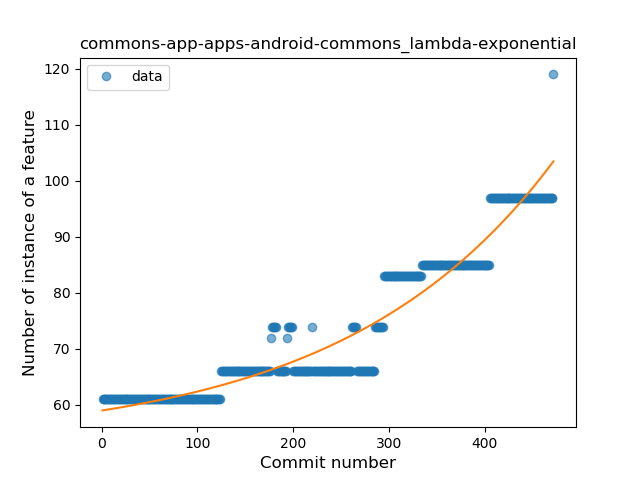
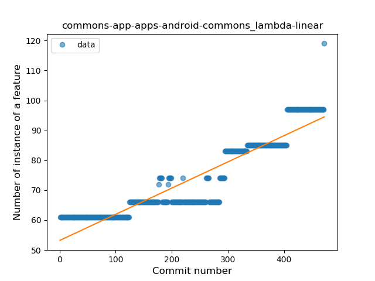
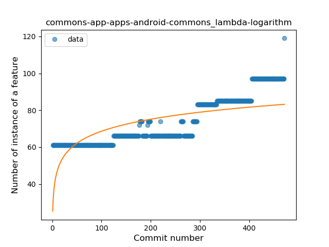
### <a name="safe_call">Safe Call</a>
----
#### Functions
* **Plateau Sudden Rise - Binary Sigmoid:** 
    * **R_Squared:** 1.0
* **Sudden Rise - Exponential:** 
    * **R_Squared:** 0.75501064
* **Constant Rise - Linear:** 
    * **R_Squared:** 0.70470368
* **Sudden Rise Plateau - Logarithm:** 
    * **R_Squared:** 0.38316293

**Plots** :chart_with_upwards_trend:
-----

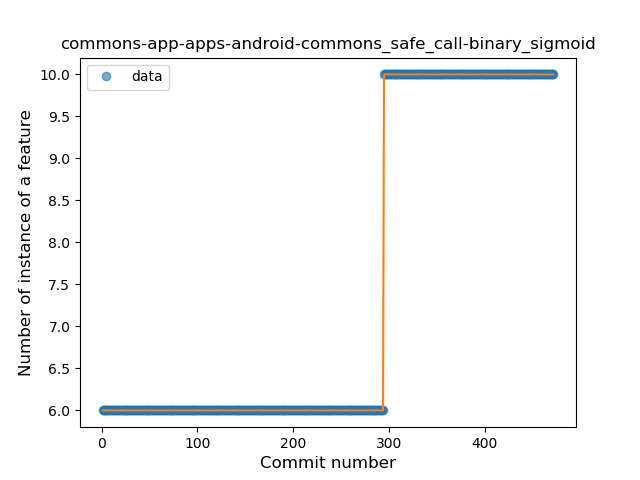

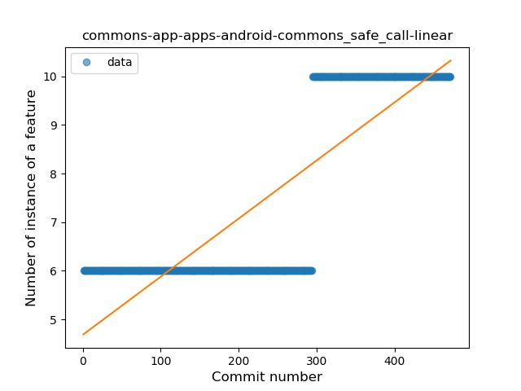
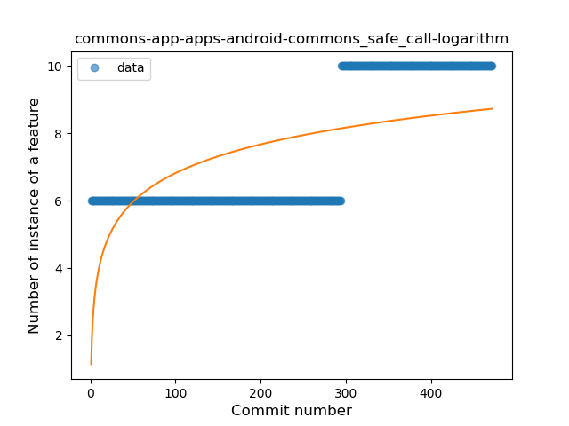
### <a name="string_template">String Template</a>
----
#### Functions
* **Plateau Gradual Rise - Sigmoid:** 
    * **R_Squared:** 0.89783704
* **Constant Rise - Linear:** 
    * **R_Squared:** 0.87928142
* **Sudden Rise Plateau - Logarithm:** 
    * **R_Squared:** 0.68584166

**Plots** :chart_with_upwards_trend:
-----

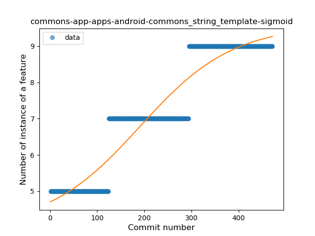
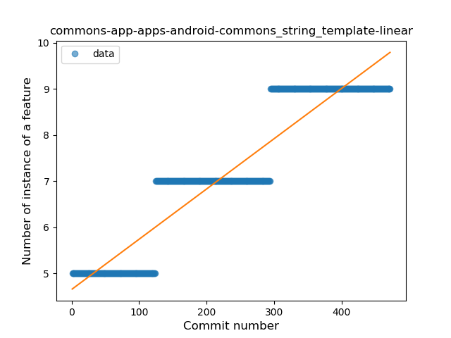
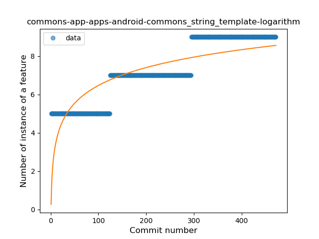
### <a name="range_expr">Range Expression</a>
----
#### Functions
* **Plateau Gradual Rise - Sigmoid:** 
    * **R_Squared:** 0.91151426
* **Sudden Rise - Exponential:** 
    * **R_Squared:** 0.89688385
* **Constant Rise - Linear:** 
    * **R_Squared:** 0.63850913
* **Sudden Rise Plateau - Logarithm:** 
    * **R_Squared:** 0.24138984

**Plots** :chart_with_upwards_trend:
-----

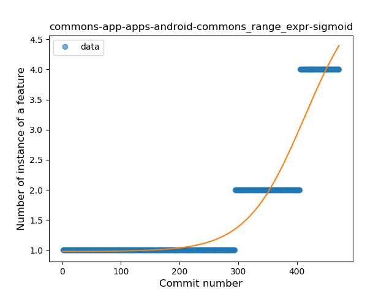
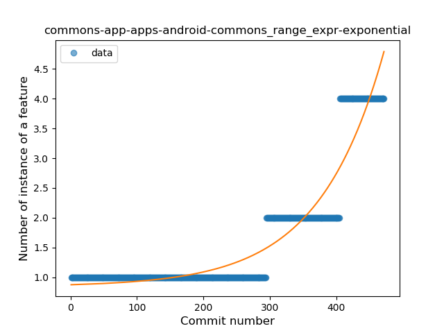
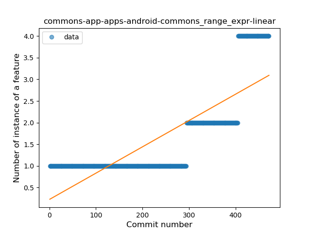
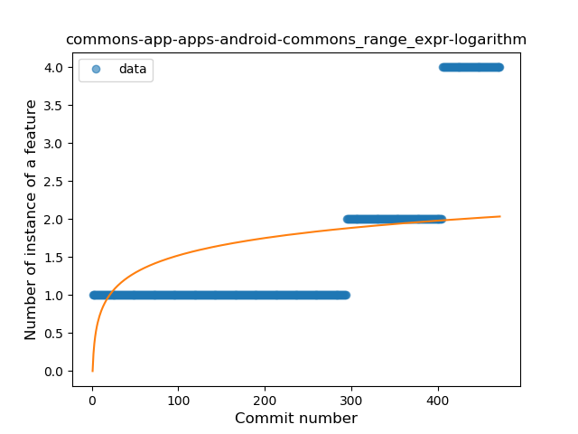
