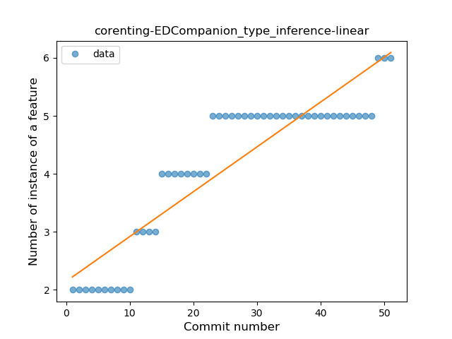
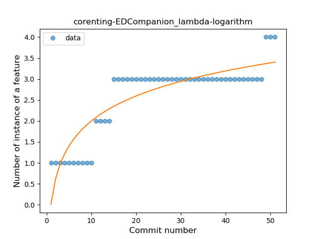
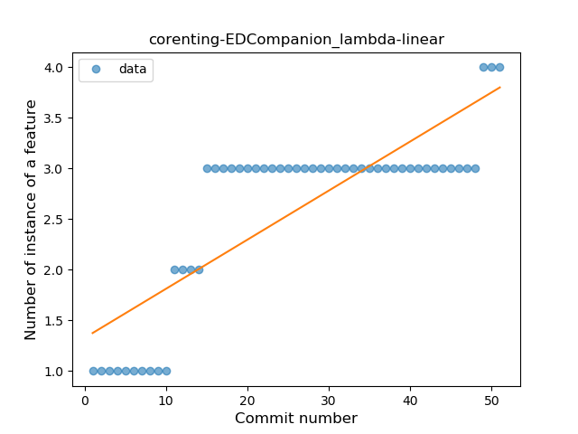
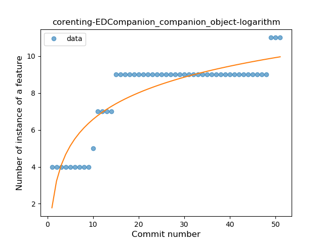
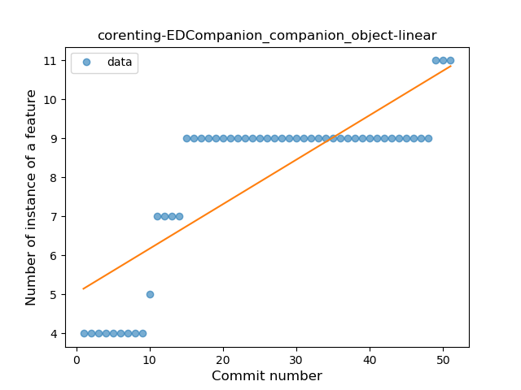
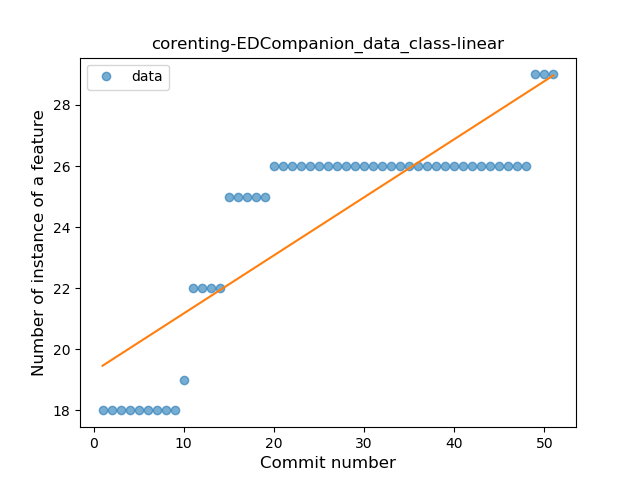

## corenting-EDCompanion
----
#### Metrics provided by Detekt
* Number of lines of code 363
* Number of Kotlin files: 29
* Cyclomatic complexity: 21
* Cyclomatic complexity by thousands of lines: 128 

----
**4** features analyzed

*	<a href="#type_inference">Type Inference</a> 
*	<a href="#lambda">Lambda</a> 
*	<a href="#companion_object">Companion Object</a> 
*	<a href="#data_class">Data Class</a> 

### <a name="type_inference">Type Inference</a>
----
#### Functions
* **Plateau Gradual Rise - Sigmoid:** 
    * **R_Squared:** 0.9427783
* **Constant Rise - Linear:** 
    * **R_Squared:** 0.81932043
* **Sudden Rise Plateau - Logarithm:** 
    * **R_Squared:** 0.82755193

**Plots** :chart_with_upwards_trend:
-----

### <a name="lambda">Lambda</a>
----
#### Functions
* **Plateau Gradual Rise - Sigmoid:** 
    * **R_Squared:** 0.91019858
* **Sudden Rise Plateau - Logarithm:** 
    * **R_Squared:** 0.76906081
* **Constant Rise - Linear:** 
    * **R_Squared:** 0.67790467

**Plots** :chart_with_upwards_trend:
-----

### <a name="companion_object">Companion Object</a>
----
#### Functions
* **Plateau Gradual Rise - Sigmoid:** 
    * **R_Squared:** 0.88577982
* **Sudden Rise Plateau - Logarithm:** 
    * **R_Squared:** 0.7872425
* **Constant Rise - Linear:** 
    * **R_Squared:** 0.66010254

**Plots** :chart_with_upwards_trend:
-----

### <a name="data_class">Data Class</a>
----
#### Functions
* **Sudden Rise Plateau - Logarithm:** 
    * **R_Squared:** 0.81223538
* **Constant Rise - Linear:** 
    * **R_Squared:** 0.71510128

**Plots** :chart_with_upwards_trend:
-----

