## corphish-NightLight
----
#### Metrics provided by Detekt
* Number of lines of code 4994
* Number of Kotlin files: 54
* Cyclomatic complexity: 653
* Cyclomatic complexity by thousands of lines: 306 

----
**13** features analyzed

*	<a href="#type_inference">Type Inference</a> 
*	<a href="#lambda">Lambda</a> 
*	<a href="#safe_call">Safe Call</a> 
*	<a href="#when_expr">When expression</a> 
*	<a href="#companion_object">Companion Object</a> 
*	<a href="#unsafe_call">Unsafe Call</a> 
*	<a href="#string_template">String Template</a> 
*	<a href="#func_with_default_value">Function with Default Value</a> 
*	<a href="#singleton">Singleton</a> 
*	<a href="#smart_cast">Smart Cast</a> 
*	<a href="#func_call_with_named_arg">Function call with Named Argument</a> 
*	<a href="#data_class">Data Class</a> 
*	<a href="#extension_function">Extension Function</a> 

### <a name="type_inference">Type Inference</a>
----
#### Functions
* **Sudden Rise - Exponential:** 
    * **R_Squared:** 0.96093975
* **Constant Rise - Linear:** 
    * **R_Squared:** 0.92121544
* **Sudden Rise Plateau - Logarithm:** 
    * **R_Squared:** 0.58733664

**Plots** :chart_with_upwards_trend:
-----

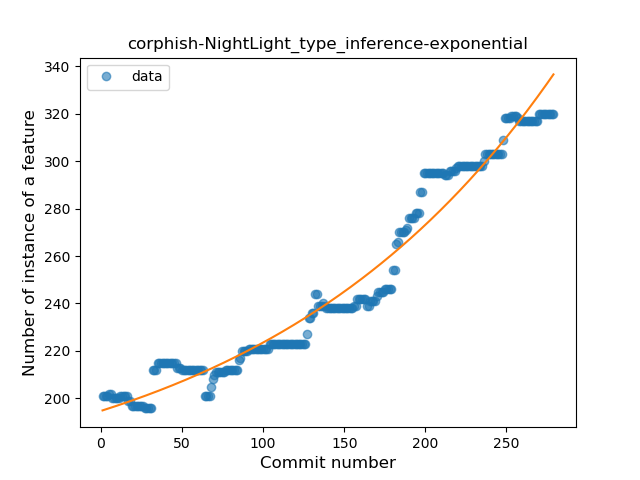
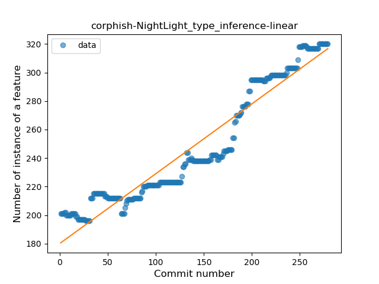
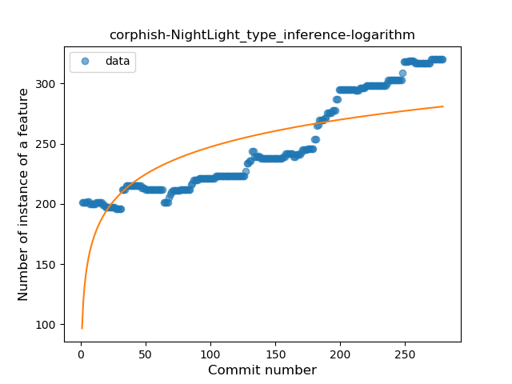
### <a name="lambda">Lambda</a>
----
#### Functions
* **Constant Rise - Linear:** 
    * **R_Squared:** 0.85771629
* **Sudden Rise Plateau - Logarithm:** 
    * **R_Squared:** 0.78257755

**Plots** :chart_with_upwards_trend:
-----

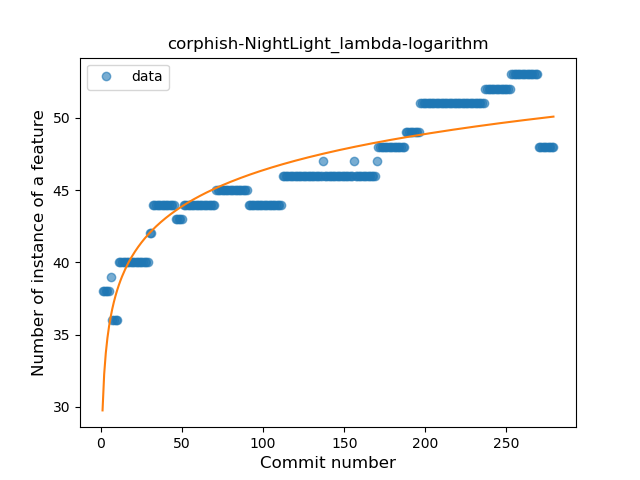
### <a name="safe_call">Safe Call</a>
----
#### Functions
* **Sudden Decline - Exponential:** 
    * **R_Squared:** 0.12918581
* **Constant Decline - Linear:** 
    * **R_Squared:** 0.02167036
* **Sudden Rise Plateau - Logarithm:** 
    * **R_Squared:** -0.0

**Plots** :chart_with_upwards_trend:
-----

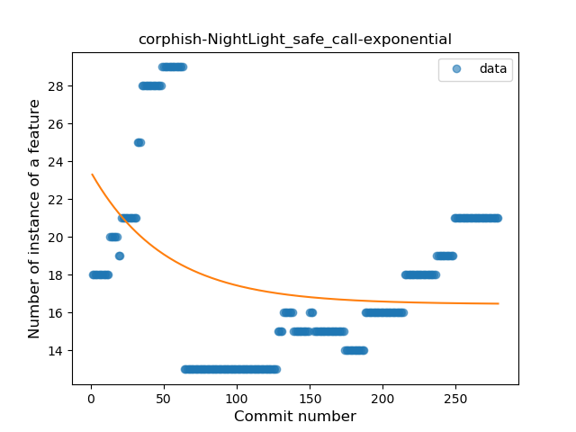
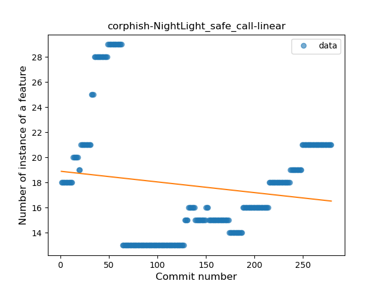
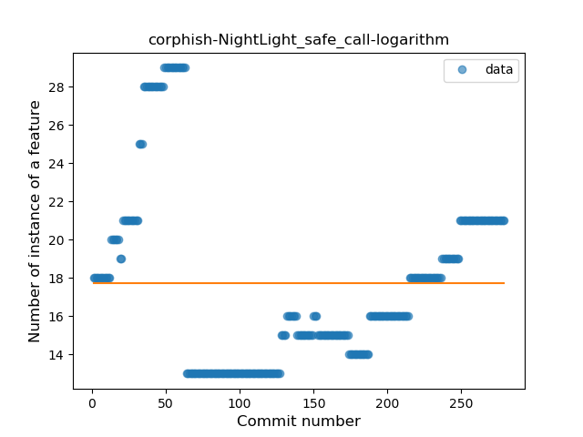
### <a name="when_expr">When expression</a>
----
#### Functions
* **Plateau Sudden Rise - Binary Sigmoid:** 
    * **R_Squared:** 0.9643201
* **Sudden Rise - Exponential:** 
    * **R_Squared:** 0.78109149
* **Constant Rise - Linear:** 
    * **R_Squared:** 0.36679086
* **Sudden Rise Plateau - Logarithm:** 
    * **R_Squared:** 0.21433688

**Plots** :chart_with_upwards_trend:
-----

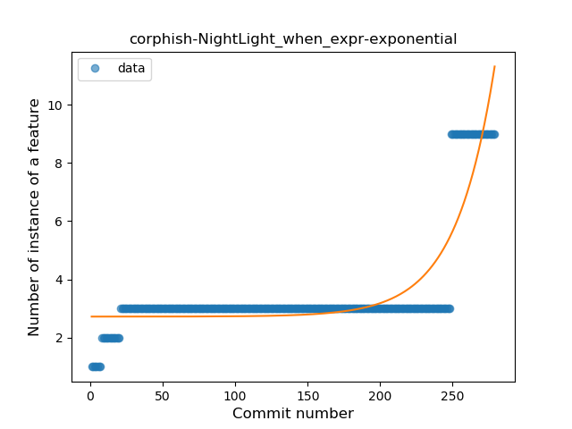
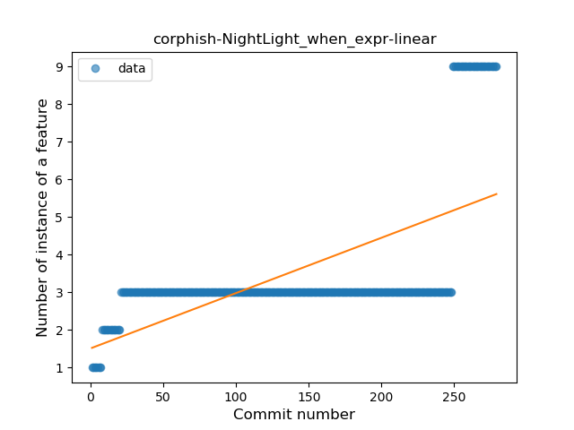

### <a name="companion_object">Companion Object</a>
----
#### Functions
* **Constant Rise - Linear:** 
    * **R_Squared:** 0.03466122
* **Sudden Rise Plateau - Logarithm:** 
    * **R_Squared:** 0.03222926
* **Plateau Gradual Decline - Sigmoid:** 
    * **R_Squared:** 0.00057404

**Plots** :chart_with_upwards_trend:
-----

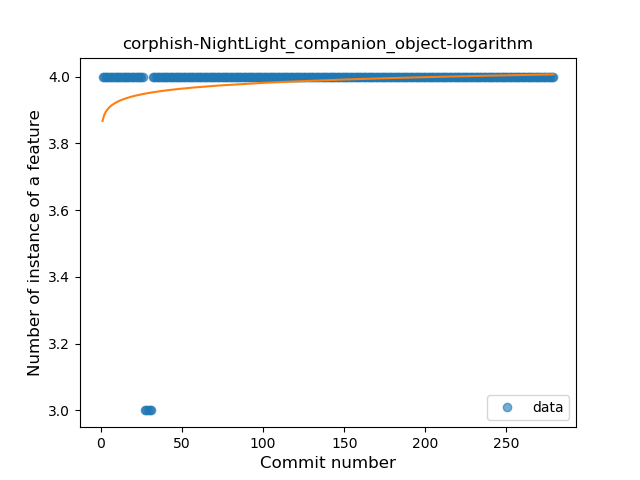
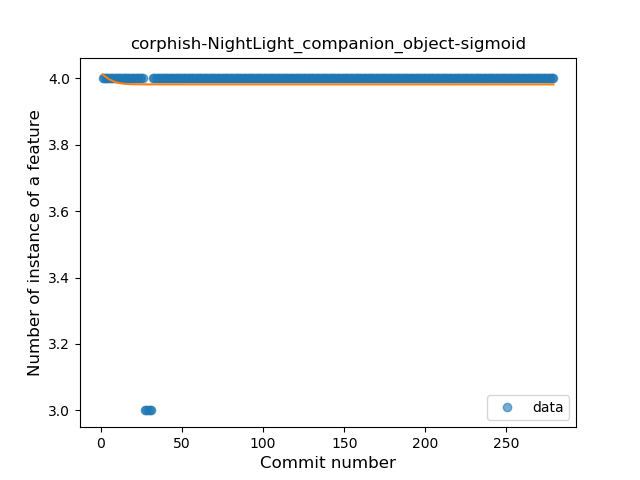
### <a name="unsafe_call">Unsafe Call</a>
----
#### Functions
* **Sudden Decline - Exponential:** 
    * **R_Squared:** 0.90387513
* **Constant Decline - Linear:** 
    * **R_Squared:** 0.45613109
* **Sudden Rise Plateau - Logarithm:** 
    * **R_Squared:** -0.0

**Plots** :chart_with_upwards_trend:
-----

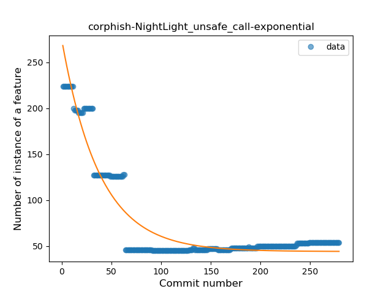
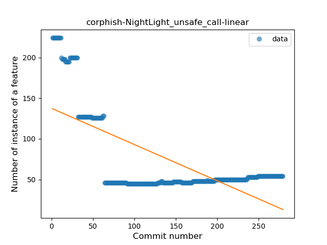
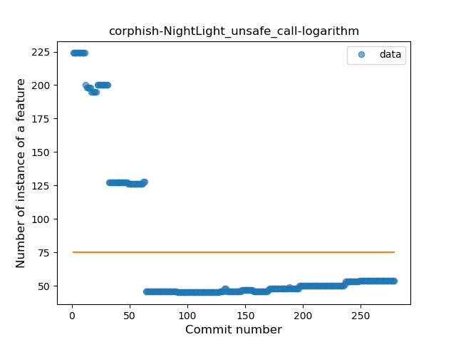
### <a name="string_template">String Template</a>
----
#### Functions
* **Constant Rise - Linear:** 
    * **R_Squared:** 0.9184134
* **Sudden Rise - Exponential:** 
    * **R_Squared:** 0.92137744
* **Sudden Rise Plateau - Logarithm:** 
    * **R_Squared:** 0.62688397

**Plots** :chart_with_upwards_trend:
-----

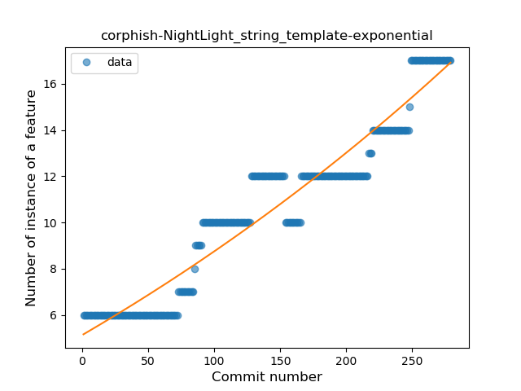
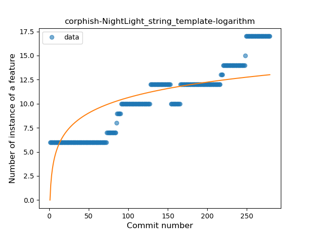
### <a name="func_with_default_value">Function with Default Value</a>
----
#### Functions
* **Plateau Gradual Rise - Sigmoid:** 
    * **R_Squared:** 0.96487882
* **Sudden Rise - Exponential:** 
    * **R_Squared:** 0.89086244
* **Constant Rise - Linear:** 
    * **R_Squared:** 0.79474251
* **Sudden Rise Plateau - Logarithm:** 
    * **R_Squared:** 0.47603476

**Plots** :chart_with_upwards_trend:
-----

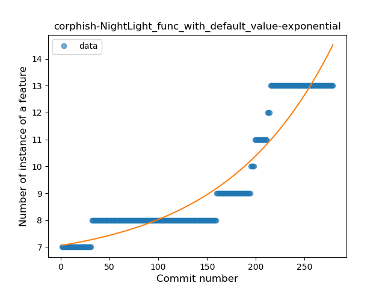
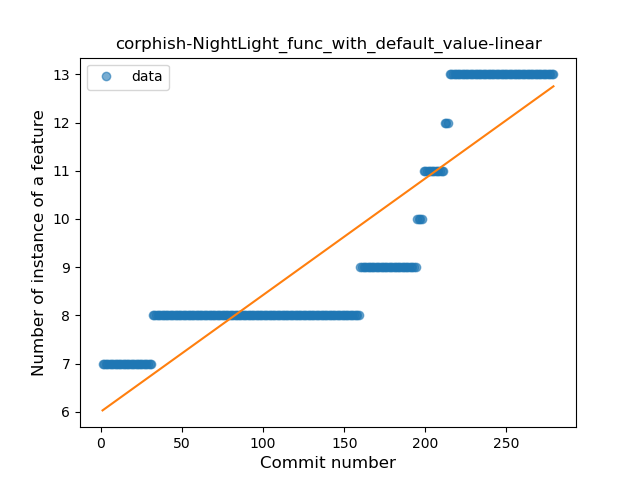
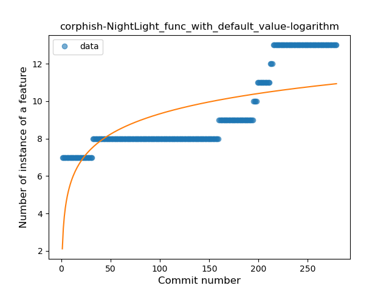
### <a name="singleton">Singleton</a>
----
#### Functions
* **Plateau Sudden Rise - Binary Sigmoid:** 
    * **R_Squared:** 0.68504078
* **Constant Rise - Linear:** 
    * **R_Squared:** 0.48458015
* **Sudden Rise Plateau - Logarithm:** 
    * **R_Squared:** 0.42516873

**Plots** :chart_with_upwards_trend:
-----

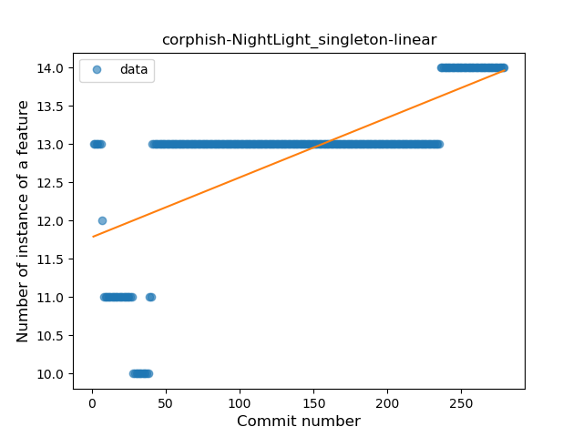
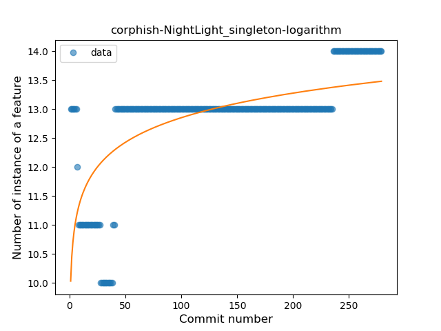
### <a name="smart_cast">Smart Cast</a>
----
#### Functions
* **Plateau Sudden Rise - Binary Sigmoid:** 
    * **R_Squared:** 0.52144602
* **Sudden Rise Plateau - Logarithm:** 
    * **R_Squared:** 0.30499763
* **Constant Rise - Linear:** 
    * **R_Squared:** 0.08850206

**Plots** :chart_with_upwards_trend:
-----

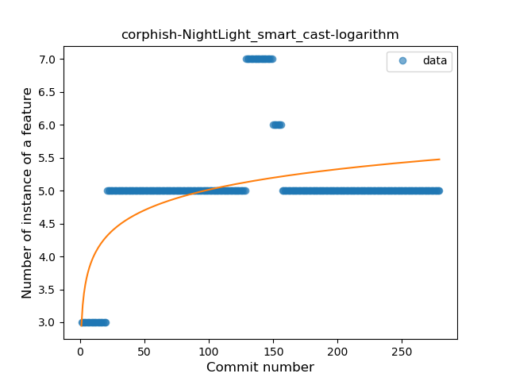
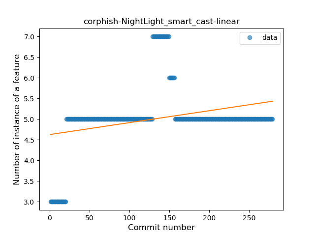
### <a name="func_call_with_named_arg">Function call with Named Argument</a>
----
#### Functions
* **Plateau Gradual Rise - Sigmoid:** 
    * **R_Squared:** 0.9810699
* **Sudden Rise - Exponential:** 
    * **R_Squared:** 0.81137084
* **Constant Rise - Linear:** 
    * **R_Squared:** 0.68178939
* **Sudden Rise Plateau - Logarithm:** 
    * **R_Squared:** 0.34402425

**Plots** :chart_with_upwards_trend:
-----

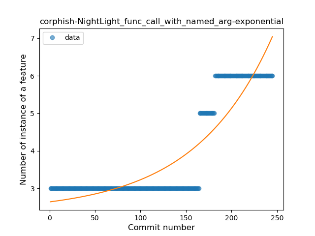
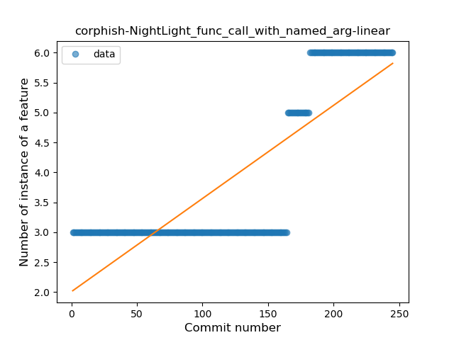
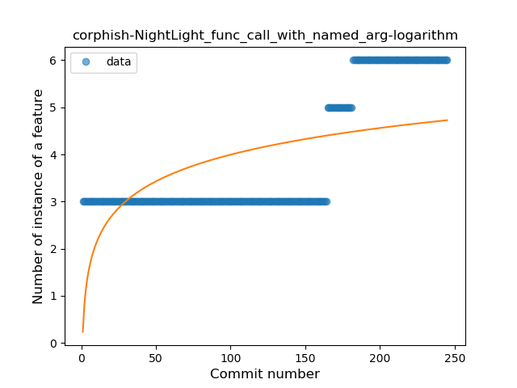
### <a name="data_class">Data Class</a>
----
#### Functions
* **Plateau Sudden Rise - Binary Sigmoid:** 
    * **R_Squared:** 1.0
* **Constant Rise - Linear:** 
    * **R_Squared:** 0.74653135
* **Sudden Rise Plateau - Logarithm:** 
    * **R_Squared:** 0.52388492

**Plots** :chart_with_upwards_trend:
-----

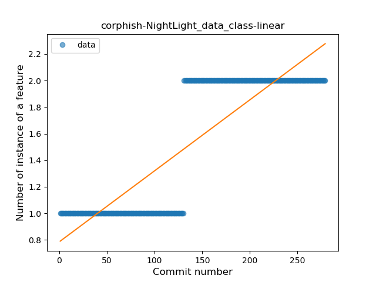
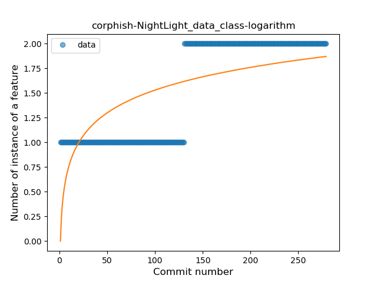
### <a name="extension_function">Extension Function</a>
----
#### Functions
* **Sudden Rise - Exponential:** 
    * **R_Squared:** 0.72805449
* **Constant Rise - Linear:** 
    * **R_Squared:** 0.71332273
* **Sudden Rise Plateau - Logarithm:** 
    * **R_Squared:** 0.48505987

**Plots** :chart_with_upwards_trend:
-----

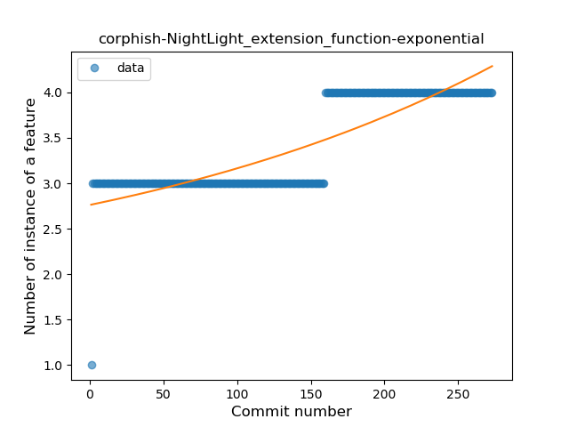
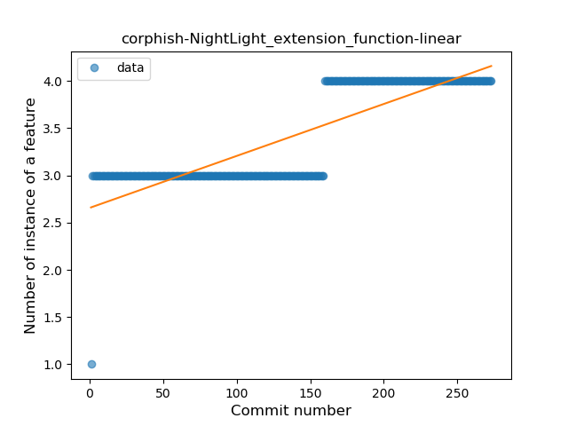
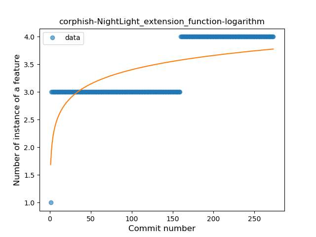
