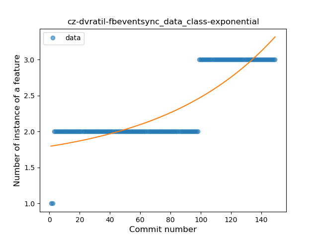
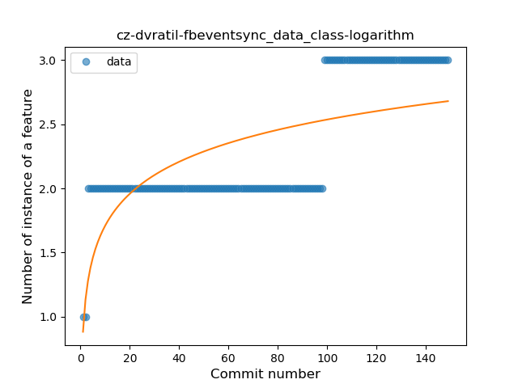
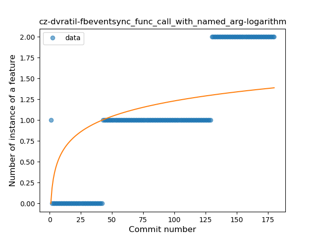

## cz-dvratil-fbeventsync
----
#### Metrics provided by Detekt
* Number of lines of code 5002
* Number of Kotlin files: 32
* Cyclomatic complexity: 703
* Cyclomatic complexity by thousands of lines: 223 

----
**14** features analyzed

*	<a href="#type_inference">Type Inference</a> 
*	<a href="#lambda">Lambda</a> 
*	<a href="#safe_call">Safe Call</a> 
*	<a href="#when_expr">When expression</a> 
*	<a href="#unsafe_call">Unsafe Call</a> 
*	<a href="#companion_object">Companion Object</a> 
*	<a href="#string_template">String Template</a> 
*	<a href="#func_with_default_value">Function with Default Value</a> 
*	<a href="#singleton">Singleton</a> 
*	<a href="#range_expr">Range Expression</a> 
*	<a href="#smart_cast">Smart Cast</a> 
*	<a href="#data_class">Data Class</a> 
*	<a href="#func_call_with_named_arg">Function call with Named Argument</a> 
*	<a href="#inline_func">Inline Function</a> 

### <a name="type_inference">Type Inference</a>
----
#### Functions
* **Constant Rise - Linear:** 
    * **R_Squared:** 0.90320773
* **Sudden Rise - Exponential:** 
    * **R_Squared:** 0.90777946
* **Sudden Rise Plateau - Logarithm:** 
    * **R_Squared:** 0.69865351

**Plots** :chart_with_upwards_trend:
-----

### <a name="lambda">Lambda</a>
----
#### Functions
* **Constant Rise - Linear:** 
    * **R_Squared:** 0.72908575
* **Sudden Rise Plateau - Logarithm:** 
    * **R_Squared:** 0.67330533
* **Plateau Gradual Rise - Sigmoid:** 
    * **R_Squared:** 0.62772332

**Plots** :chart_with_upwards_trend:
-----

### <a name="safe_call">Safe Call</a>
----
#### Functions
* **Constant Rise - Linear:** 
    * **R_Squared:** 0.95703987
* **Sudden Rise Plateau - Logarithm:** 
    * **R_Squared:** 0.71276636

**Plots** :chart_with_upwards_trend:
-----

### <a name="when_expr">When expression</a>
----
#### Functions
* **Sudden Rise Plateau - Logarithm:** 
    * **R_Squared:** 0.68276422
* **Plateau Sudden Rise - Binary Sigmoid:** 
    * **R_Squared:** 0.63615574
* **Constant Rise - Linear:** 
    * **R_Squared:** 0.28484145

**Plots** :chart_with_upwards_trend:
-----

### <a name="unsafe_call">Unsafe Call</a>
----
#### Functions
* **Sudden Decline - Exponential:** 
    * **R_Squared:** 0.92369059
* **Constant Decline - Linear:** 
    * **R_Squared:** 0.04204931
* **Sudden Rise Plateau - Logarithm:** 
    * **R_Squared:** -0.0

**Plots** :chart_with_upwards_trend:
-----

### <a name="companion_object">Companion Object</a>
----
#### Functions
* **Sudden Rise Plateau - Logarithm:** 
    * **R_Squared:** 0.80729113
* **Constant Rise - Linear:** 
    * **R_Squared:** 0.71707289

**Plots** :chart_with_upwards_trend:
-----

### <a name="string_template">String Template</a>
----
#### Functions
* **Sudden Rise Plateau - Logarithm:** 
    * **R_Squared:** 0.90747554
* **Constant Rise - Linear:** 
    * **R_Squared:** 0.73873224

**Plots** :chart_with_upwards_trend:
-----

### <a name="func_with_default_value">Function with Default Value</a>
----
#### Functions
* **Sudden Rise - Exponential:** 
    * **R_Squared:** 0.75988052
* **Constant Rise - Linear:** 
    * **R_Squared:** 0.44839919
* **Sudden Rise Plateau - Logarithm:** 
    * **R_Squared:** 0.10993976
* **Plateau Sudden Decline - Binary Sigmoid:** 
    * **R_Squared:** 0.02538082

**Plots** :chart_with_upwards_trend:
-----

### <a name="singleton">Singleton</a>
----
#### Functions
* **Plateau Gradual Rise - Sigmoid:** 
    * **R_Squared:** 0.98041089
* **Sudden Rise Plateau - Logarithm:** 
    * **R_Squared:** 0.67306624
* **Constant Rise - Linear:** 
    * **R_Squared:** 0.53529124

**Plots** :chart_with_upwards_trend:
-----

### <a name="range_expr">Range Expression</a>
----
#### Functions
* **Plateau Sudden Rise - Binary Sigmoid:** 
    * **R_Squared:** 0.85501454
* **Sudden Rise Plateau - Logarithm:** 
    * **R_Squared:** 0.43396457
* **Constant Rise - Linear:** 
    * **R_Squared:** 0.36090072

**Plots** :chart_with_upwards_trend:
-----

### <a name="smart_cast">Smart Cast</a>
----
#### Functions
* **Constant Decline - Linear:** 
    * **R_Squared:** 0.62888987
* **Plateau Sudden Decline - Binary Sigmoid:** 
    * **R_Squared:** 0.04906776
* **Sudden Rise Plateau - Logarithm:** 
    * **R_Squared:** -0.0

**Plots** :chart_with_upwards_trend:
-----

### <a name="data_class">Data Class</a>
----
#### Functions
* **Plateau Sudden Rise - Binary Sigmoid:** 
    * **R_Squared:** 0.94689671
* **Sudden Rise - Exponential:** 
    * **R_Squared:** 0.74435503
* **Constant Rise - Linear:** 
    * **R_Squared:** 0.68859082
* **Sudden Rise Plateau - Logarithm:** 
    * **R_Squared:** 0.46244498

**Plots** :chart_with_upwards_trend:
-----

### <a name="func_call_with_named_arg">Function call with Named Argument</a>
----
#### Functions
* **Constant Rise - Linear:** 
    * **R_Squared:** 0.83674794
* **Sudden Rise Plateau - Logarithm:** 
    * **R_Squared:** 0.43129263

**Plots** :chart_with_upwards_trend:
-----

### <a name="inline_func">Inline Function</a>
----
#### Functions
* **Sudden Decline - Exponential:** 
    * **R_Squared:** 0.82345211
* **Constant Decline - Linear:** 
    * **R_Squared:** 0.06380297
* **Sudden Rise Plateau - Logarithm:** 
    * **R_Squared:** -0.0

**Plots** :chart_with_upwards_trend:
-----

