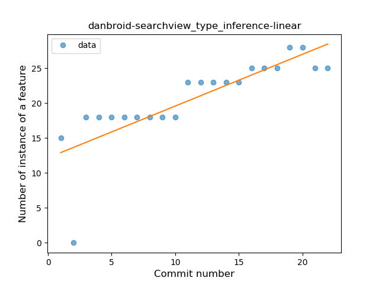
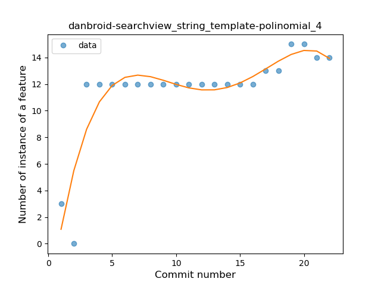
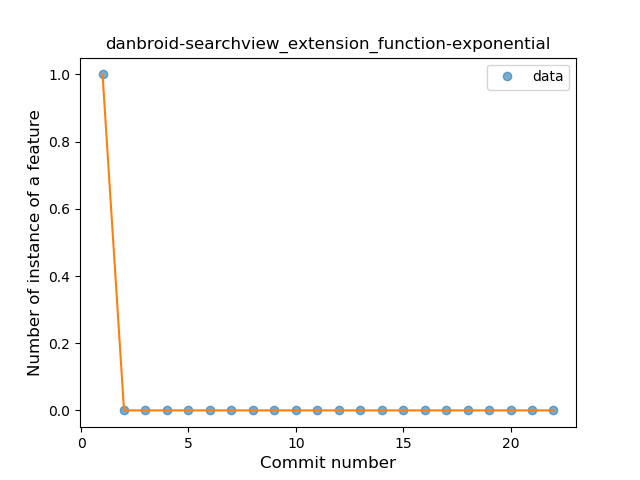

## danbroid-searchview
----
#### Metrics provided by Detekt
* Number of lines of code 587
* Number of Kotlin files: 8
* Cyclomatic complexity: 59
* Cyclomatic complexity by thousands of lines: 216 

----
**9** features analyzed

*	<a href="#type_inference">Type Inference</a> 
*	<a href="#lambda">Lambda</a> 
*	<a href="#safe_call">Safe Call</a> 
*	<a href="#when_expr">When expression</a> 
*	<a href="#unsafe_call">Unsafe Call</a> 
*	<a href="#companion_object">Companion Object</a> 
*	<a href="#string_template">String Template</a> 
*	<a href="#extension_function">Extension Function</a> 
*	<a href="#property_delegation">Property Delegation</a> 

### <a name="type_inference">Type Inference</a>
----
#### Functions
* **Constant Rise - Linear:** 
    * **R_Squared:** 0.65152797
* **Sudden Rise Plateau - Logarithm:** 
    * **R_Squared:** 0.65682621

**Plots** :chart_with_upwards_trend:
-----

### <a name="lambda">Lambda</a>
----
#### Functions
* **Instability - Polinomial 4:** 
    * **R_Squared:** 0.7475203
* **Instability - Polinomial 3:** )
    * **R_Squared:** 0.67021231
* **Sudden Rise Plateau - Logarithm:** 
    * **R_Squared:** 0.53570062
* **Constant Rise - Linear:** 
    * **R_Squared:** 0.28339646

**Plots** :chart_with_upwards_trend:
-----

### <a name="safe_call">Safe Call</a>
----
#### Functions
* **Sudden Rise Plateau - Logarithm:** 
    * **R_Squared:** 0.08586895
* **Constant Decline - Linear:** 
    * **R_Squared:** 0.00022936
* **Sudden Decline - Exponential:** 
    * **R_Squared:** 0.0001236

**Plots** :chart_with_upwards_trend:
-----

### <a name="when_expr">When expression</a>
----
#### Functions
* **Instability - Polinomial 4:** 
    * **R_Squared:** 0.74037672
* **Sudden Rise - Exponential:** 
    * **R_Squared:** 0.60993584
* **Constant Rise - Linear:** 
    * **R_Squared:** 0.5521049
* **Sudden Rise Plateau - Logarithm:** 
    * **R_Squared:** 0.37169282

**Plots** :chart_with_upwards_trend:
-----

### <a name="unsafe_call">Unsafe Call</a>
----
#### Functions
* **Plateau Gradual Rise - Sigmoid:** 
    * **R_Squared:** 0.79208357
* **Sudden Rise - Exponential:** 
    * **R_Squared:** 0.76700182
* **Constant Rise - Linear:** 
    * **R_Squared:** 0.67779388
* **Sudden Rise Plateau - Logarithm:** 
    * **R_Squared:** 0.36230381

**Plots** :chart_with_upwards_trend:
-----

### <a name="companion_object">Companion Object</a>
----
#### Functions
* **Plateau Sudden Rise - Binary Sigmoid:** 
    * **R_Squared:** 0.89108911
* **Instability - Polinomial 4:** 
    * **R_Squared:** 0.61724608
* **Instability - Polinomial 3:** )
    * **R_Squared:** 0.57445422
* **Sudden Rise Plateau - Logarithm:** 
    * **R_Squared:** 0.41867283
* **Constant Rise - Linear:** 
    * **R_Squared:** 0.21407048

**Plots** :chart_with_upwards_trend:
-----

### <a name="string_template">String Template</a>
----
#### Functions
* **Instability - Polinomial 4:** 
    * **R_Squared:** 0.79645914
* **Instability - Polinomial 3:** )
    * **R_Squared:** 0.70103624
* **Sudden Rise Plateau - Logarithm:** 
    * **R_Squared:** 0.63287976
* **Constant Rise - Linear:** 
    * **R_Squared:** 0.43108987

**Plots** :chart_with_upwards_trend:
-----

### <a name="extension_function">Extension Function</a>
----
#### Functions
* **Sudden Decline - Exponential:** 
    * **R_Squared:** 1.0
* **Instability - Polinomial 4:** 
    * **R_Squared:** 0.67591973
* **Instability - Polinomial 3:** )
    * **R_Squared:** 0.50434783
* **Constant Decline - Linear:** 
    * **R_Squared:** 0.13043478
* **Sudden Rise Plateau - Logarithm:** 
    * **R_Squared:** -0.0

**Plots** :chart_with_upwards_trend:
-----

### <a name="property_delegation">Property Delegation</a>
----
#### Functions
* **Instability - Polinomial 4:** 
    * **R_Squared:** 0.7668603
* **Sudden Rise Plateau - Logarithm:** 
    * **R_Squared:** 0.42733494
* **Constant Rise - Linear:** 
    * **R_Squared:** 0.18121938

**Plots** :chart_with_upwards_trend:
-----

