## danirod-rectball
----
#### Metrics provided by Detekt
* Number of lines of code 1440
* Number of Kotlin files: 16
* Cyclomatic complexity: 164
* Cyclomatic complexity by thousands of lines: 281 

----
**9** features analyzed

*	<a href="#type_inference">Type Inference</a> 
*	<a href="#lambda">Lambda</a> 
*	<a href="#safe_call">Safe Call</a> 
*	<a href="#companion_object">Companion Object</a> 
*	<a href="#string_template">String Template</a> 
*	<a href="#singleton">Singleton</a> 
*	<a href="#property_delegation">Property Delegation</a> 
*	<a href="#destructuring_declaration">Destructuring Declaration</a> 
*	<a href="#inline_func">Inline Function</a> 

### <a name="type_inference">Type Inference</a>
----
#### Functions
* **Sudden Rise - Exponential:** 
    * **R_Squared:** 0.88829035
* **Constant Rise - Linear:** 
    * **R_Squared:** 0.70884695
* **Plateau Sudden Rise - Binary Sigmoid:** 
    * **R_Squared:** 0.38480249
* **Sudden Rise Plateau - Logarithm:** 
    * **R_Squared:** 0.19932876

**Plots** :chart_with_upwards_trend:
-----

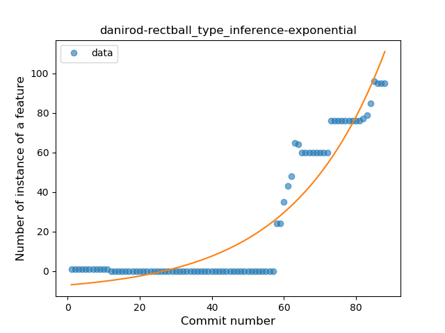

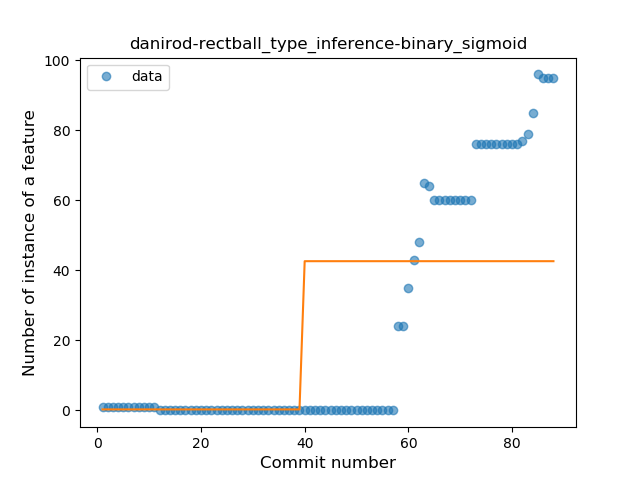
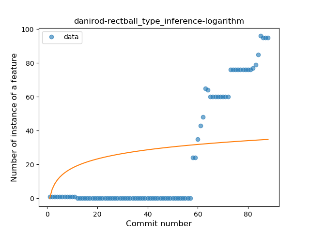
### <a name="lambda">Lambda</a>
----
#### Functions
* **Sudden Rise Plateau - Logarithm:** 
    * **R_Squared:** 0.91069261
* **Constant Rise - Linear:** 
    * **R_Squared:** 0.81983013

**Plots** :chart_with_upwards_trend:
-----

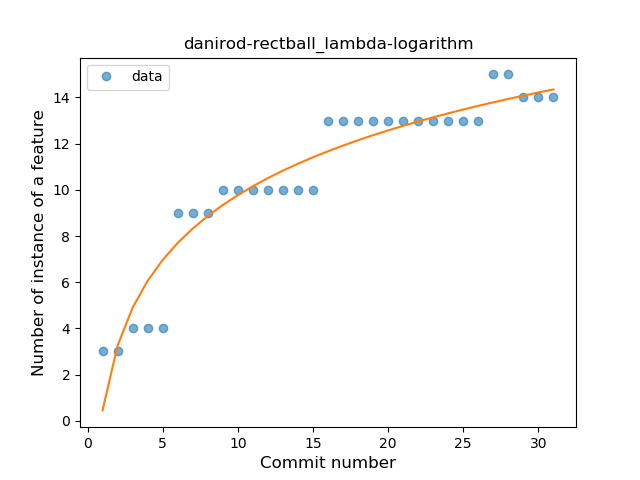
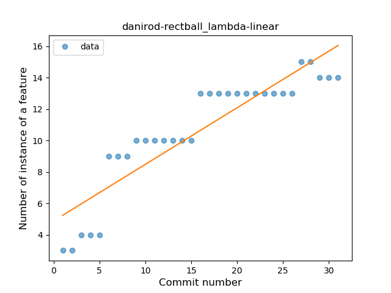
### <a name="safe_call">Safe Call</a>
----
#### Functions
* **Plateau Sudden Decline - Binary Sigmoid:** 
    * **R_Squared:** 1.0
* **Instability - Polinomial 3:** )
    * **R_Squared:** 0.81954177
* **Sudden Decline - Exponential:** 
    * **R_Squared:** 0.79039326
* **Constant Decline - Linear:** 
    * **R_Squared:** 0.40625
* **Sudden Rise Plateau - Logarithm:** 
    * **R_Squared:** -0.0

**Plots** :chart_with_upwards_trend:
-----

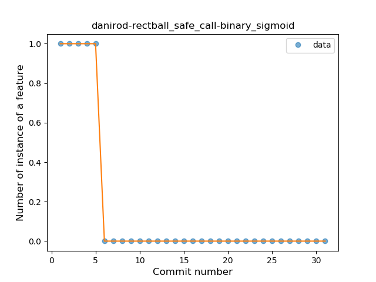
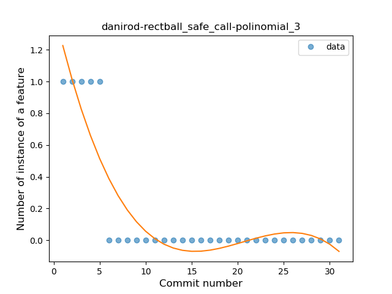
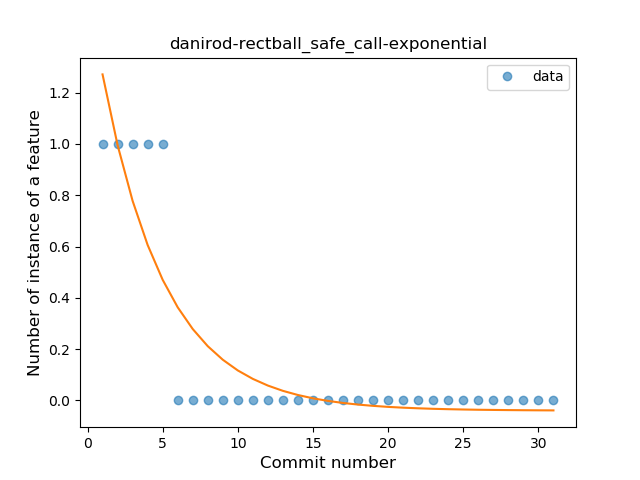
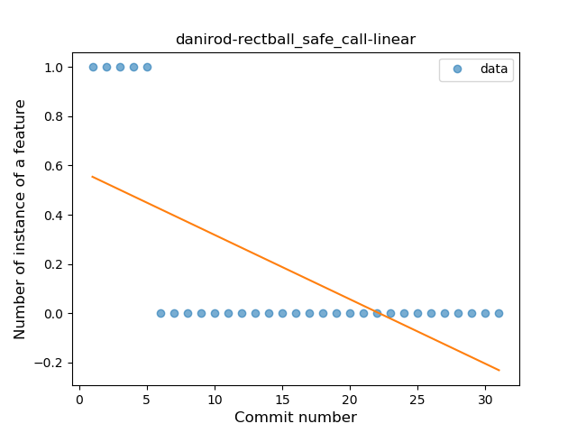
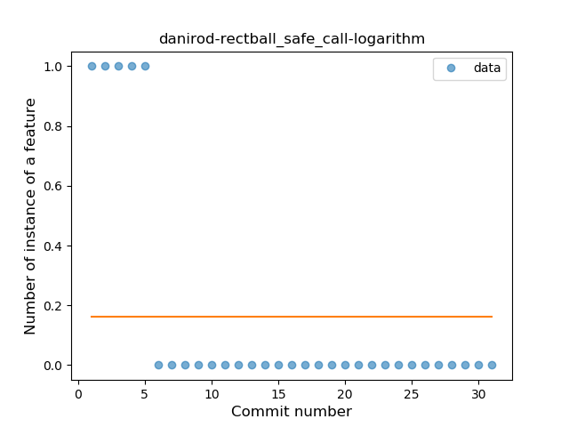
### <a name="companion_object">Companion Object</a>
----
#### Functions
* **Plateau Sudden Rise - Binary Sigmoid:** 
    * **R_Squared:** 1.0
* **Instability - Polinomial 3:** )
    * **R_Squared:** 0.85375064
* **Constant Rise - Linear:** 
    * **R_Squared:** 0.74285714
* **Sudden Rise Plateau - Logarithm:** 
    * **R_Squared:** 0.61130844

**Plots** :chart_with_upwards_trend:
-----

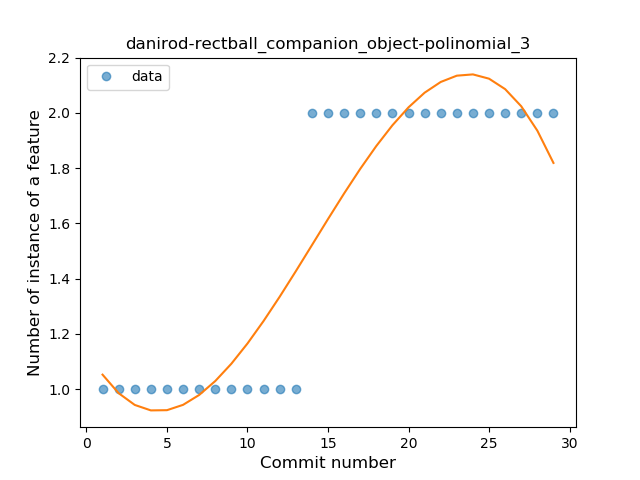
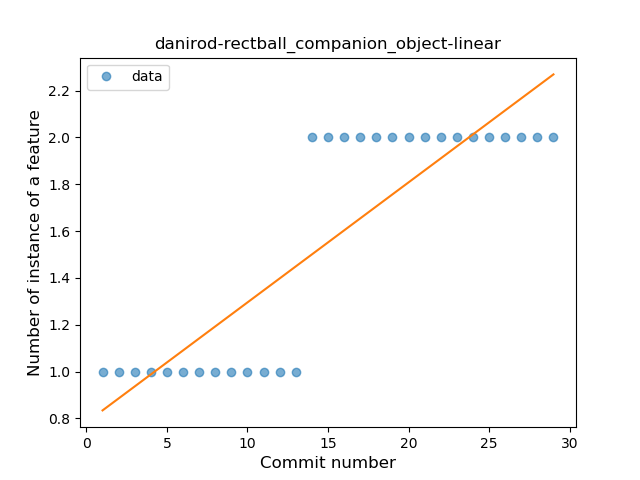
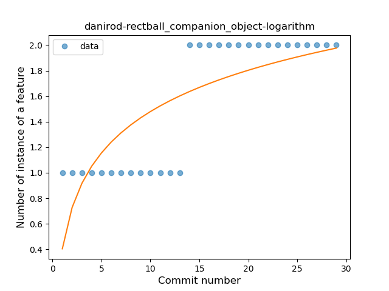
### <a name="string_template">String Template</a>
----
#### Functions
* **Instability - Polinomial 4:** 
    * **R_Squared:** 0.93644415
* **Instability - Polinomial 3:** )
    * **R_Squared:** 0.92289431
* **Sudden Rise Plateau - Logarithm:** 
    * **R_Squared:** 0.82639945
* **Constant Rise - Linear:** 
    * **R_Squared:** 0.55518785

**Plots** :chart_with_upwards_trend:
-----

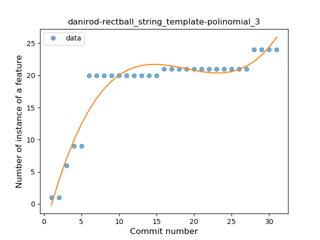
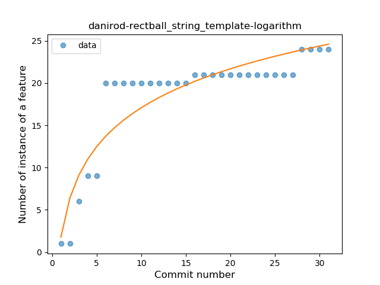
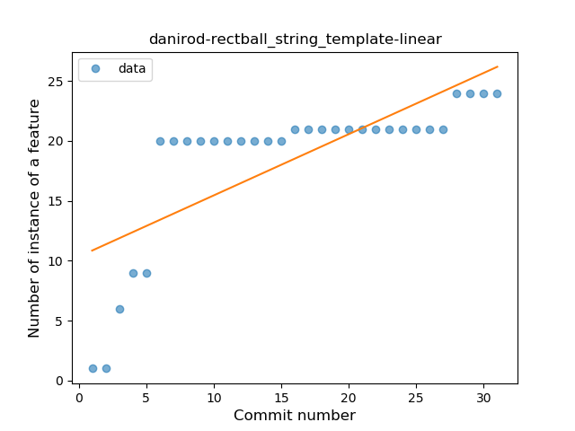
### <a name="singleton">Singleton</a>
----
#### Functions
* **Instability - Polinomial 3:** )
    * **R_Squared:** 0.98214286
* **Sudden Rise Plateau - Logarithm:** 
    * **R_Squared:** 0.70938513
* **Constant Rise - Linear:** 
    * **R_Squared:** 0.5

**Plots** :chart_with_upwards_trend:
-----

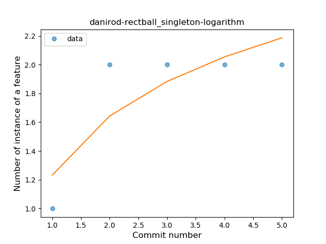
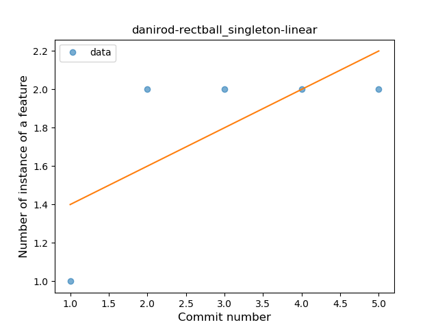
### <a name="property_delegation">Property Delegation</a>
----
#### Functions
* **Instability - Polinomial 3:** )
    * **R_Squared:** 0.57174533
* **Sudden Rise - Exponential:** 
    * **R_Squared:** 0.54143858
* **Constant Rise - Linear:** 
    * **R_Squared:** 0.34714286
* **Sudden Rise Plateau - Logarithm:** 
    * **R_Squared:** 0.17652245

**Plots** :chart_with_upwards_trend:
-----

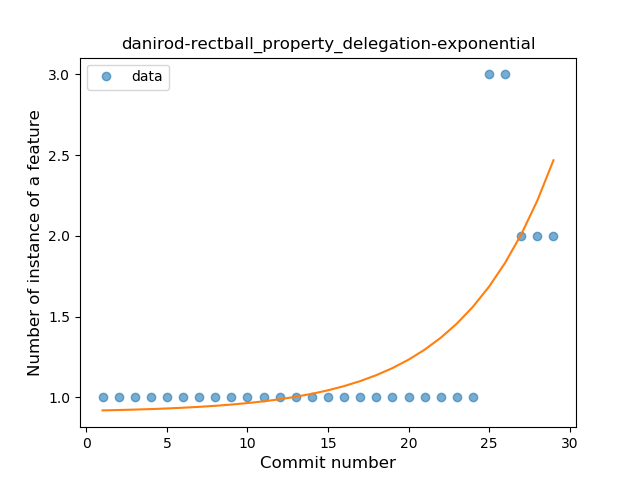
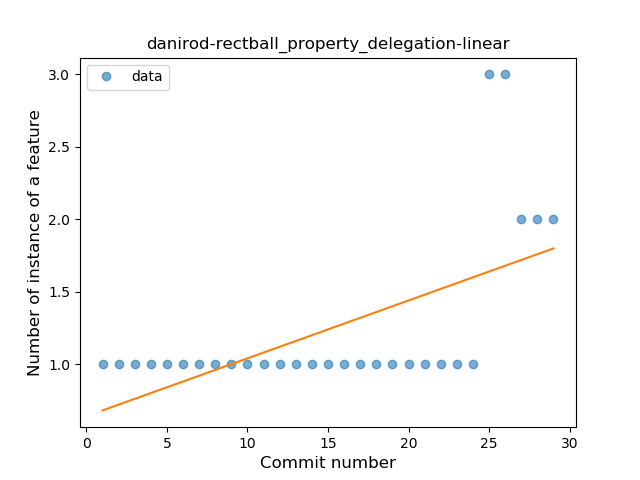
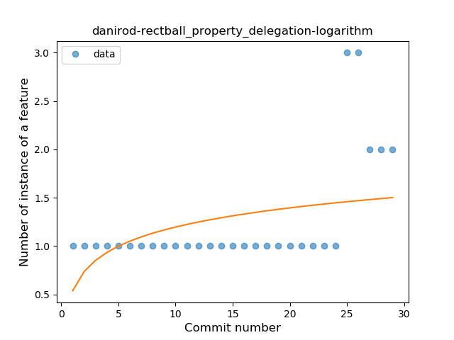
### <a name="destructuring_declaration">Destructuring Declaration</a>
----
#### Functions
* **Plateau Sudden Rise - Binary Sigmoid:** 
    * **R_Squared:** 0.97838556
* **Instability - Polinomial 3:** )
    * **R_Squared:** 0.88276569
* **Constant Rise - Linear:** 
    * **R_Squared:** 0.80538232
* **Sudden Rise Plateau - Logarithm:** 
    * **R_Squared:** 0.69056005

**Plots** :chart_with_upwards_trend:
-----

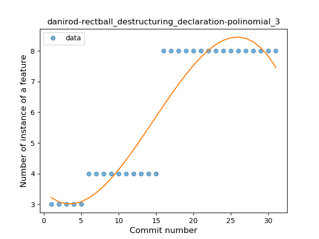
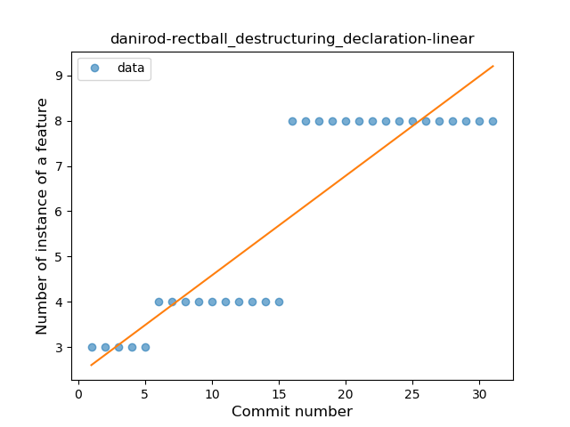
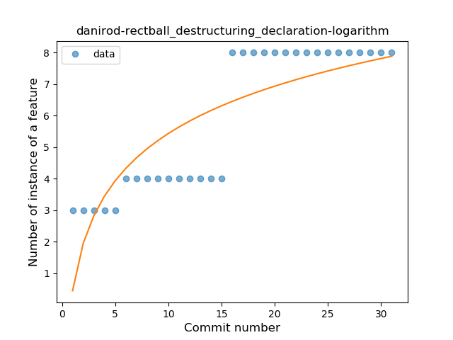
### <a name="inline_func">Inline Function</a>
----
#### Functions
* **Sudden Decline - Exponential:** 
    * **R_Squared:** 0.832346
* **Instability - Polinomial 4:** 
    * **R_Squared:** 0.80613027
* **Instability - Polinomial 3:** )
    * **R_Squared:** 0.68149973
* **Constant Decline - Linear:** 
    * **R_Squared:** 0.21333333
* **Sudden Rise Plateau - Logarithm:** 
    * **R_Squared:** -0.0

**Plots** :chart_with_upwards_trend:
-----

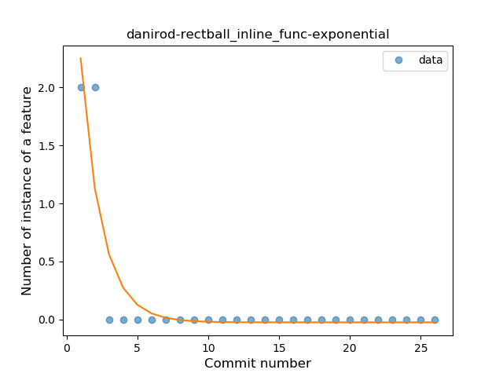
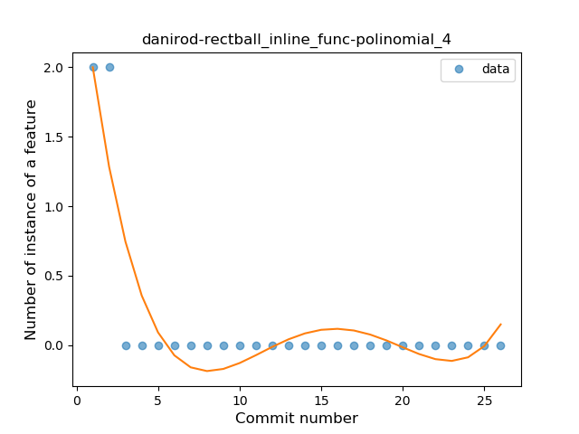
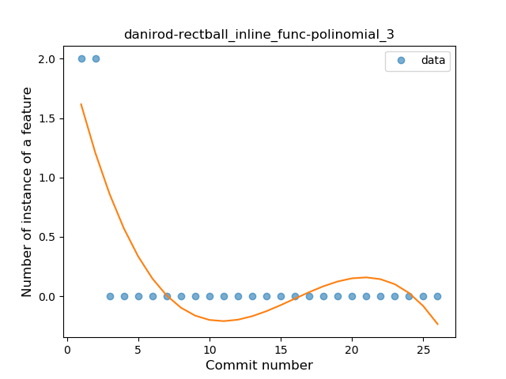
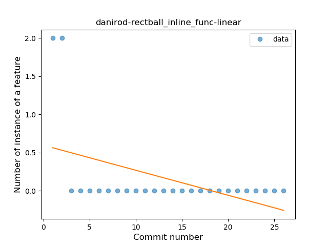
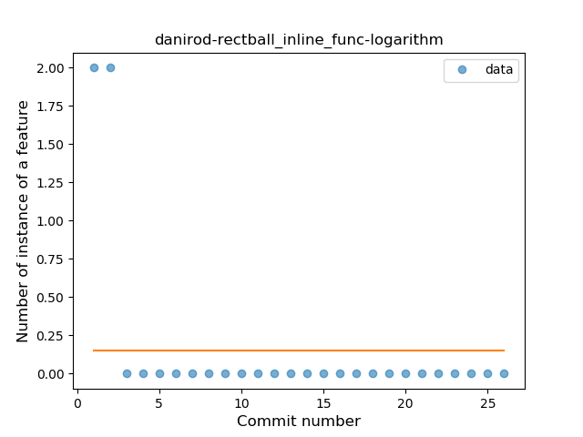
