## danvratil-FBEventSync
----
#### Metrics provided by Detekt
* Number of lines of code 4295
* Number of Kotlin files: 29
* Cyclomatic complexity: 673
* Cyclomatic complexity by thousands of lines: 250 

----
**14** features analyzed

*	<a href="#type_inference">Type Inference</a> 
*	<a href="#lambda">Lambda</a> 
*	<a href="#safe_call">Safe Call</a> 
*	<a href="#when_expr">When expression</a> 
*	<a href="#companion_object">Companion Object</a> 
*	<a href="#unsafe_call">Unsafe Call</a> 
*	<a href="#string_template">String Template</a> 
*	<a href="#func_with_default_value">Function with Default Value</a> 
*	<a href="#singleton">Singleton</a> 
*	<a href="#smart_cast">Smart Cast</a> 
*	<a href="#range_expr">Range Expression</a> 
*	<a href="#func_call_with_named_arg">Function call with Named Argument</a> 
*	<a href="#data_class">Data Class</a> 
*	<a href="#inline_func">Inline Function</a> 

### <a name="type_inference">Type Inference</a>
----
#### Functions
* **Instability - Polinomial 3:** )
    * **R_Squared:** 0.91775958
* **Constant Rise - Linear:** 
    * **R_Squared:** 0.83199466
* **Sudden Rise Plateau - Logarithm:** 
    * **R_Squared:** 0.6806153

**Plots** :chart_with_upwards_trend:
-----

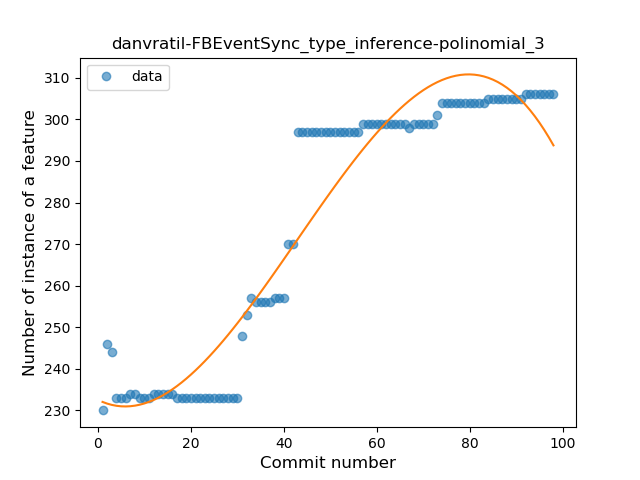
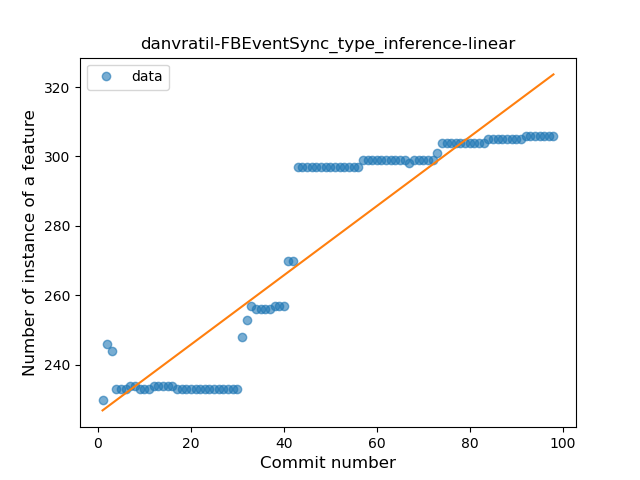
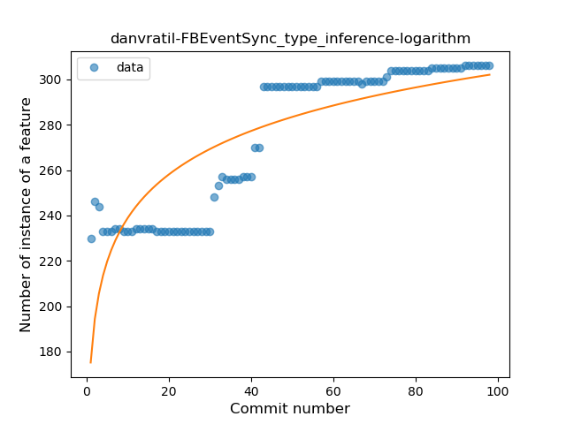
### <a name="lambda">Lambda</a>
----
#### Functions
* **Constant Rise - Linear:** 
    * **R_Squared:** 0.87664672
* **Plateau Sudden Rise - Binary Sigmoid:** 
    * **R_Squared:** 0.87214543
* **Sudden Rise Plateau - Logarithm:** 
    * **R_Squared:** 0.59560338

**Plots** :chart_with_upwards_trend:
-----

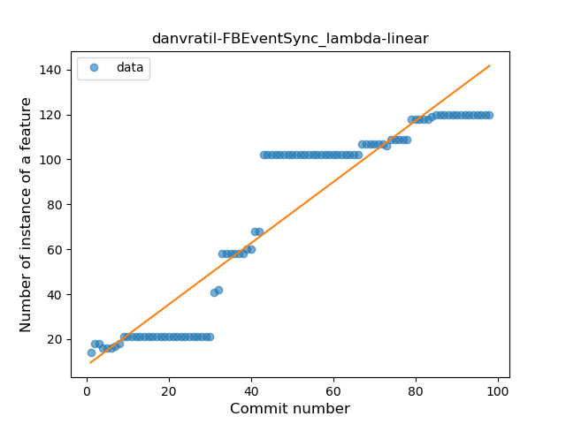
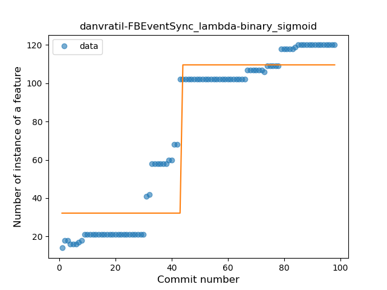
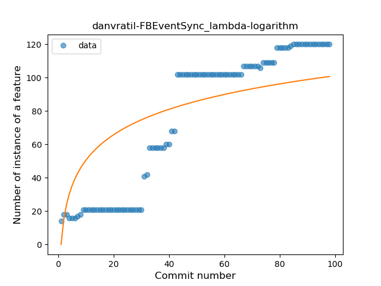
### <a name="safe_call">Safe Call</a>
----
#### Functions
* **Constant Rise - Linear:** 
    * **R_Squared:** 0.92559869
* **Sudden Rise Plateau - Logarithm:** 
    * **R_Squared:** 0.76421965
* **Plateau Gradual Rise - Sigmoid:** 
    * **R_Squared:** 0.59792097

**Plots** :chart_with_upwards_trend:
-----

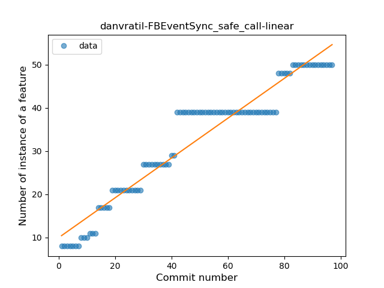
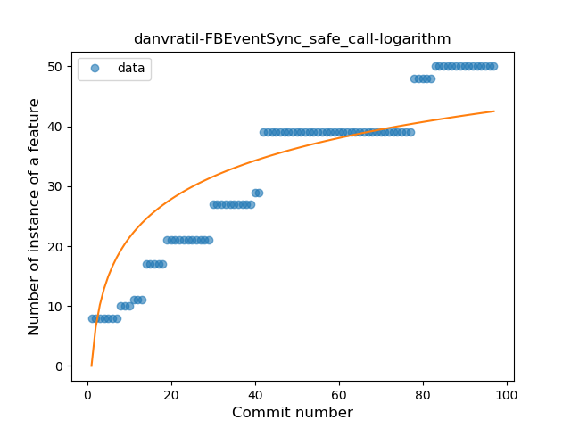
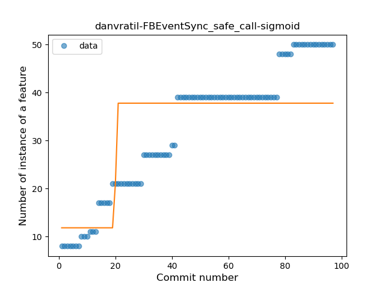
### <a name="when_expr">When expression</a>
----
#### Functions
* **Sudden Rise Plateau - Logarithm:** 
    * **R_Squared:** 0.89036343
* **Constant Rise - Linear:** 
    * **R_Squared:** 0.6918732

**Plots** :chart_with_upwards_trend:
-----

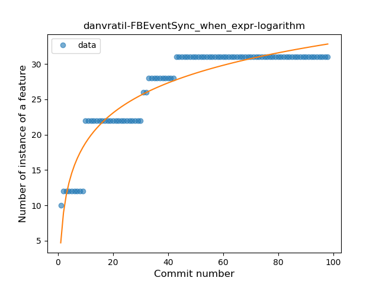
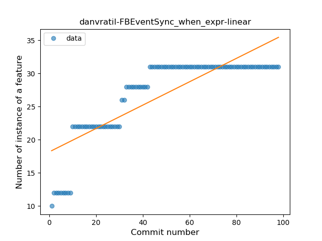
### <a name="companion_object">Companion Object</a>
----
#### Functions
* **Constant Rise - Linear:** 
    * **R_Squared:** 0.78009817
* **Sudden Rise Plateau - Logarithm:** 
    * **R_Squared:** 0.69658463

**Plots** :chart_with_upwards_trend:
-----

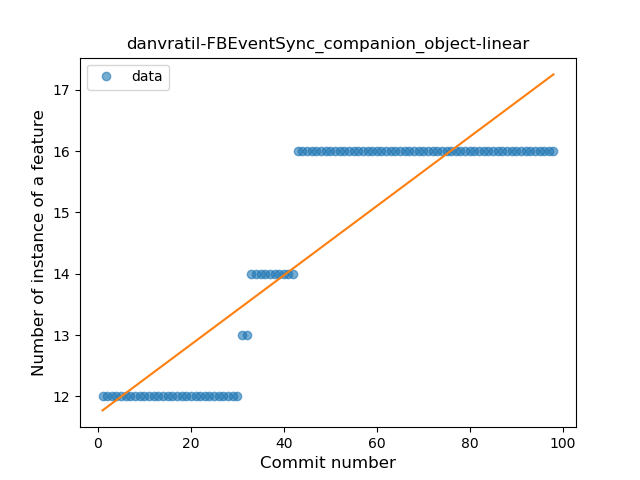
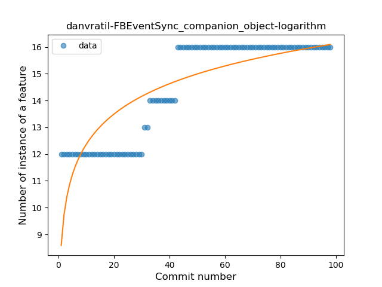
### <a name="unsafe_call">Unsafe Call</a>
----
#### Functions
* **Sudden Decline - Exponential:** 
    * **R_Squared:** 0.96714673
* **Instability - Polinomial 3:** )
    * **R_Squared:** 0.07396132
* **Constant Decline - Linear:** 
    * **R_Squared:** 0.0008831
* **Sudden Rise Plateau - Logarithm:** 
    * **R_Squared:** -0.0

**Plots** :chart_with_upwards_trend:
-----

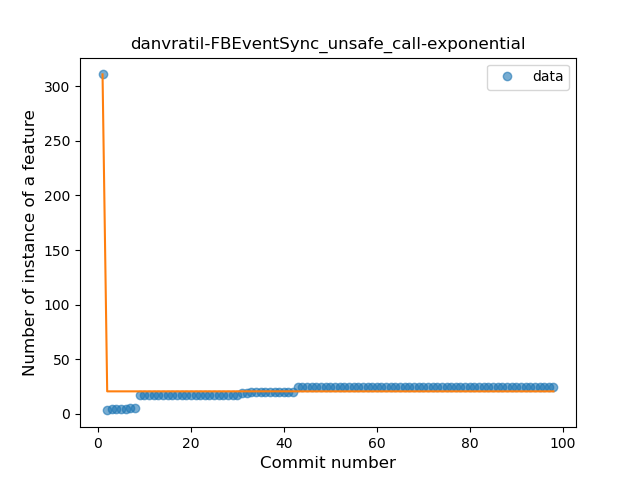
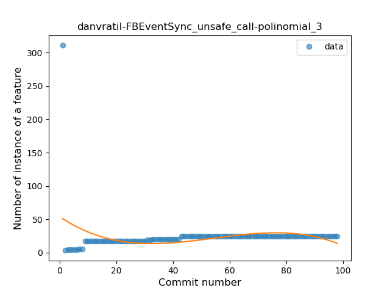
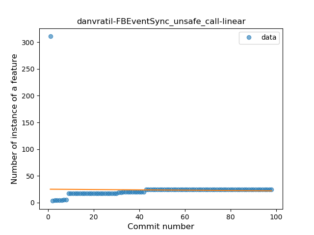
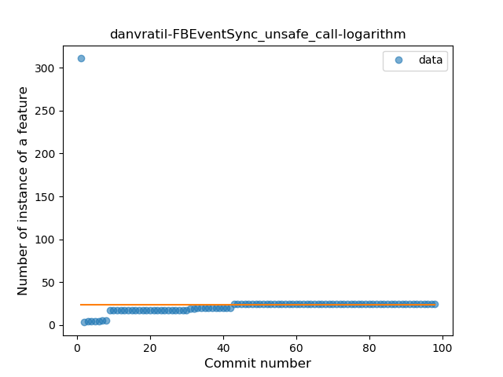
### <a name="string_template">String Template</a>
----
#### Functions
* **Sudden Rise Plateau - Logarithm:** 
    * **R_Squared:** 0.84470261
* **Instability - Polinomial 3:** )
    * **R_Squared:** 0.83962569
* **Constant Rise - Linear:** 
    * **R_Squared:** 0.57890141

**Plots** :chart_with_upwards_trend:
-----

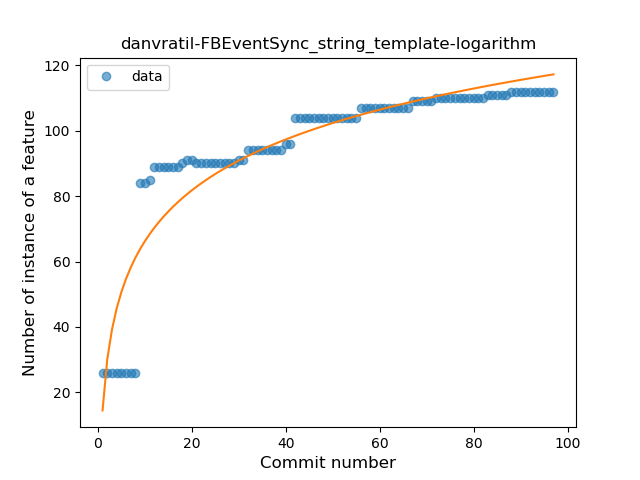
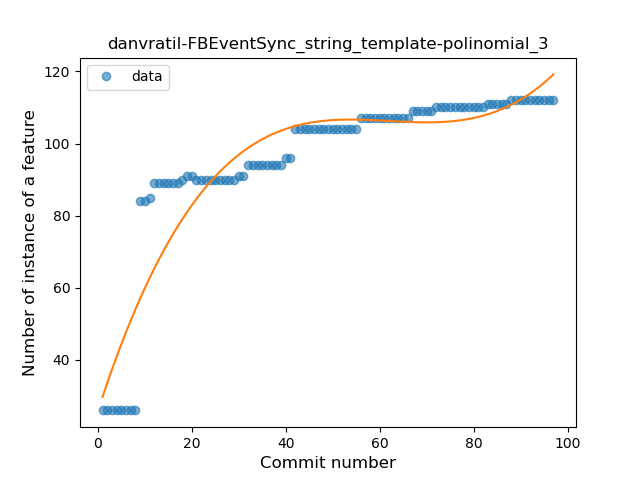
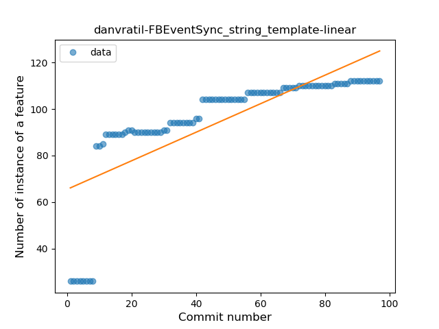
### <a name="func_with_default_value">Function with Default Value</a>
----
#### Functions
* **Plateau Sudden Decline - Binary Sigmoid:** 
    * **R_Squared:** 0.97537205
* **Sudden Decline - Exponential:** 
    * **R_Squared:** 0.71354842
* **Constant Decline - Linear:** 
    * **R_Squared:** 0.41810659
* **Sudden Rise Plateau - Logarithm:** 
    * **R_Squared:** -0.0

**Plots** :chart_with_upwards_trend:
-----

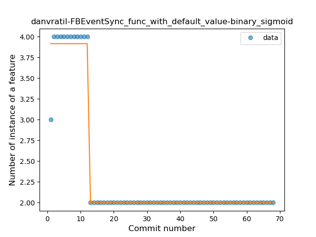
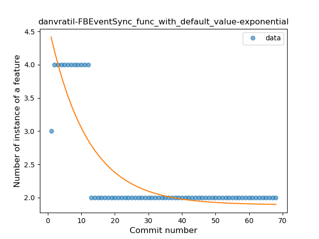
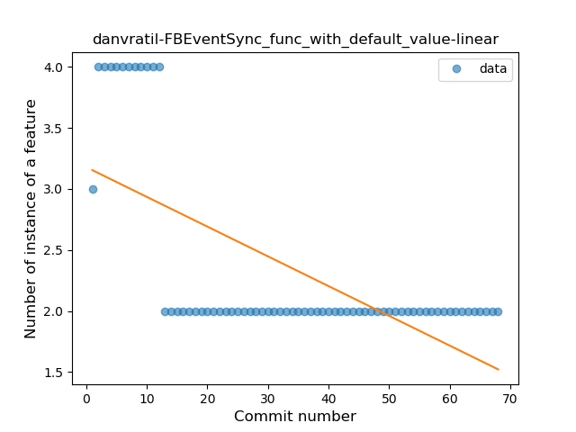
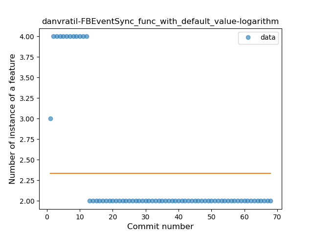
### <a name="singleton">Singleton</a>
----
#### Functions
* **Plateau Gradual Rise - Sigmoid:** 
    * **R_Squared:** 0.97404608
* **Constant Rise - Linear:** 
    * **R_Squared:** 0.75749925
* **Sudden Rise Plateau - Logarithm:** 
    * **R_Squared:** 0.58029092

**Plots** :chart_with_upwards_trend:
-----

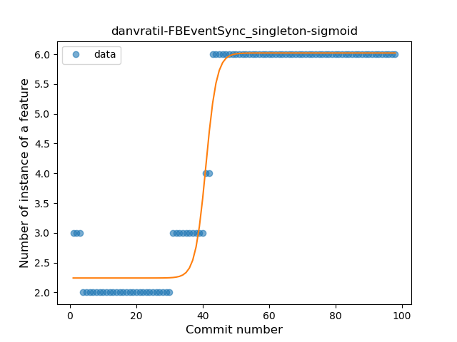
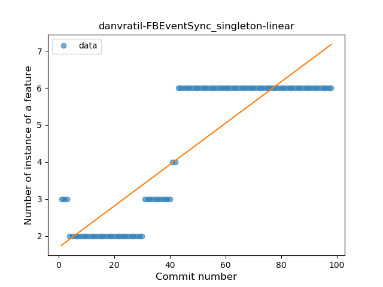
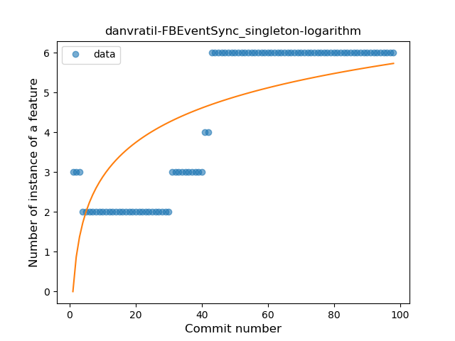
### <a name="smart_cast">Smart Cast</a>
----
#### Functions
* **Sudden Rise Plateau - Logarithm:** 
    * **R_Squared:** 0.68208396
* **Constant Rise - Linear:** 
    * **R_Squared:** 0.54090909

**Plots** :chart_with_upwards_trend:
-----

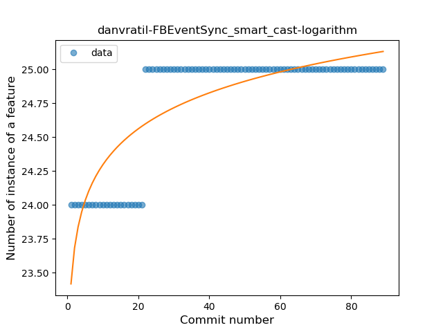
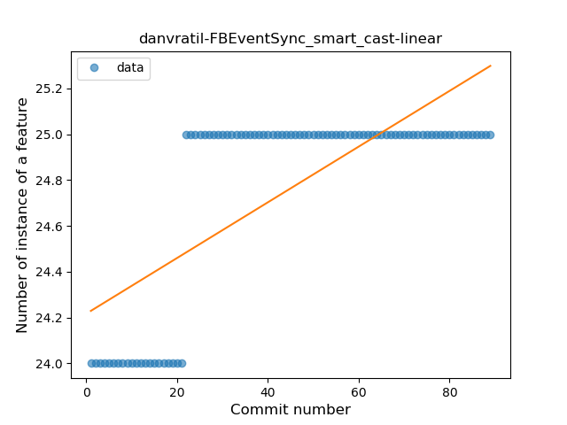
### <a name="range_expr">Range Expression</a>
----
#### Functions
* **Plateau Sudden Rise - Binary Sigmoid:** 
    * **R_Squared:** 0.86898396
* **Constant Rise - Linear:** 
    * **R_Squared:** 0.52979767
* **Sudden Rise Plateau - Logarithm:** 
    * **R_Squared:** 0.36792335

**Plots** :chart_with_upwards_trend:
-----

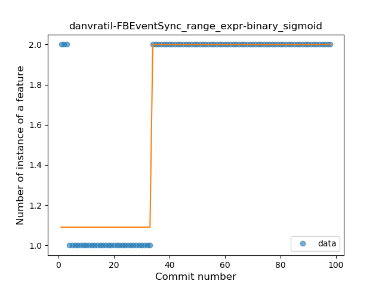
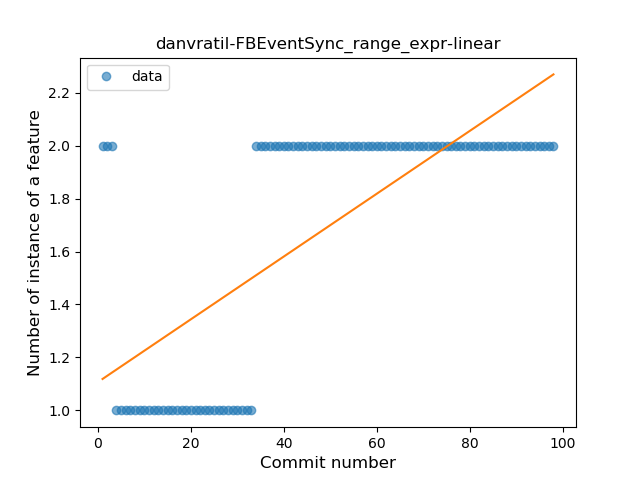
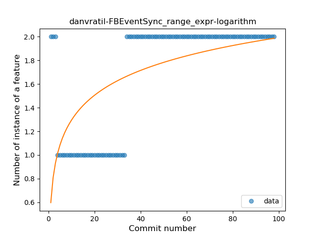
### <a name="func_call_with_named_arg">Function call with Named Argument</a>
----
#### Functions
* **Plateau Sudden Rise - Binary Sigmoid:** 
    * **R_Squared:** 0.95906433
* **Constant Rise - Linear:** 
    * **R_Squared:** 0.6797492
* **Sudden Rise Plateau - Logarithm:** 
    * **R_Squared:** 0.33066285

**Plots** :chart_with_upwards_trend:
-----

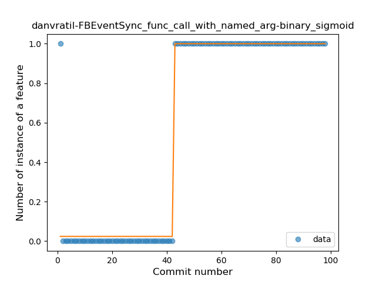
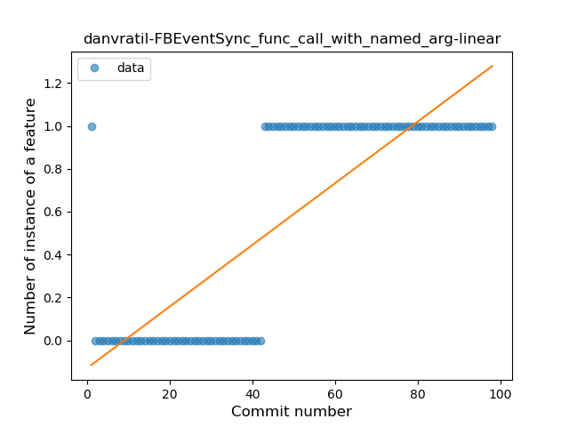
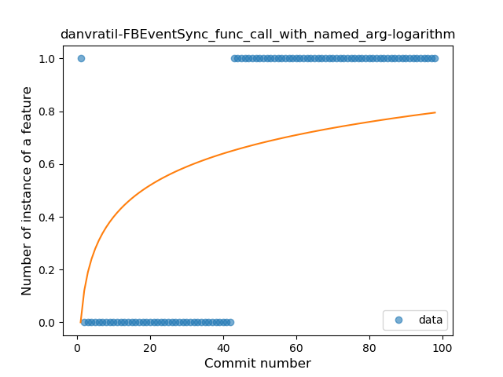
### <a name="data_class">Data Class</a>
----
#### Functions
* **Plateau Sudden Rise - Binary Sigmoid:** 
    * **R_Squared:** 1.0
* **Sudden Rise Plateau - Logarithm:** 
    * **R_Squared:** 0.31979798
* **Constant Rise - Linear:** 
    * **R_Squared:** 0.0868984

**Plots** :chart_with_upwards_trend:
-----

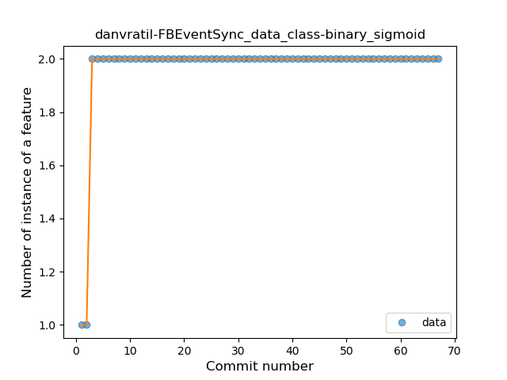
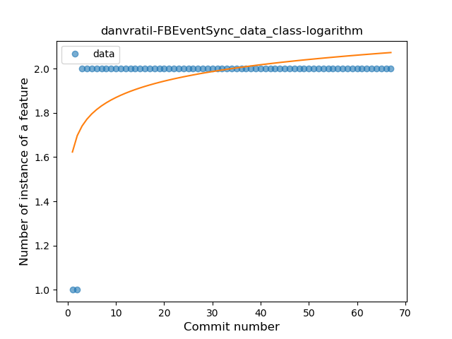
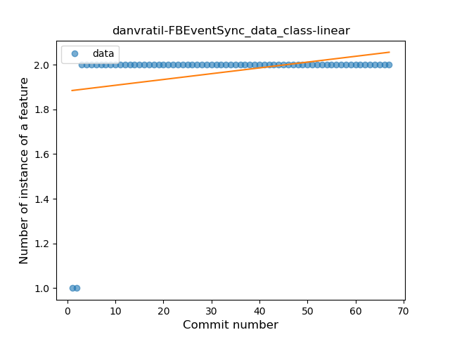
### <a name="inline_func">Inline Function</a>
----
#### Functions
* **Sudden Decline - Exponential:** 
    * **R_Squared:** 0.81824738
* **Constant Decline - Linear:** 
    * **R_Squared:** 0.15215311
* **Sudden Rise Plateau - Logarithm:** 
    * **R_Squared:** -0.0

**Plots** :chart_with_upwards_trend:
-----

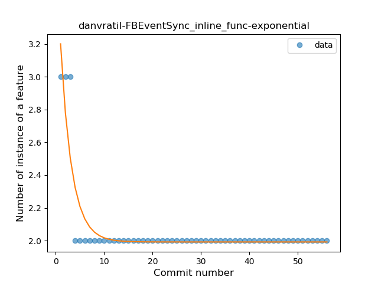
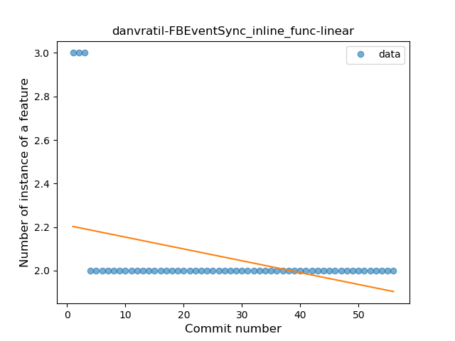
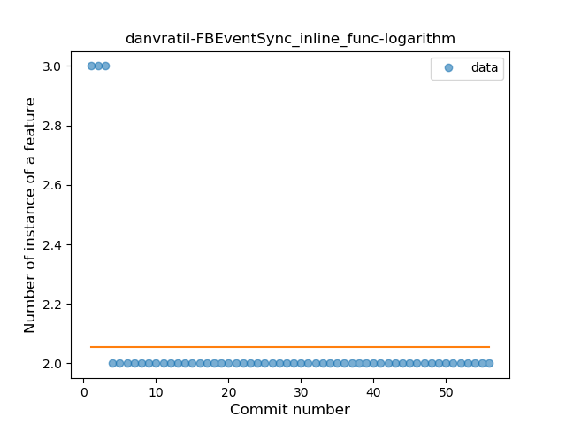
