## darshanparajuli-LogcatReader
----
#### Metrics provided by Detekt
* Number of lines of code 5960
* Number of Kotlin files: 49
* Cyclomatic complexity: 969
* Cyclomatic complexity by thousands of lines: 279 

----
**16** features analyzed

*	<a href="#type_inference">Type Inference</a> 
*	<a href="#lambda">Lambda</a> 
*	<a href="#safe_call">Safe Call</a> 
*	<a href="#when_expr">When expression</a> 
*	<a href="#companion_object">Companion Object</a> 
*	<a href="#unsafe_call">Unsafe Call</a> 
*	<a href="#string_template">String Template</a> 
*	<a href="#func_with_default_value">Function with Default Value</a> 
*	<a href="#singleton">Singleton</a> 
*	<a href="#range_expr">Range Expression</a> 
*	<a href="#func_call_with_named_arg">Function call with Named Argument</a> 
*	<a href="#data_class">Data Class</a> 
*	<a href="#extension_function">Extension Function</a> 
*	<a href="#destructuring_declaration">Destructuring Declaration</a> 
*	<a href="#inline_func">Inline Function</a> 
*	<a href="#overloaded_op">Overloaded Operator</a> 

### <a name="type_inference">Type Inference</a>
----
#### Functions
* **Constant Rise - Linear:** 
    * **R_Squared:** 0.95016932
* **Plateau Sudden Rise - Binary Sigmoid:** 
    * **R_Squared:** 0.81328148
* **Sudden Rise Plateau - Logarithm:** 
    * **R_Squared:** 0.54700971

**Plots** :chart_with_upwards_trend:
-----

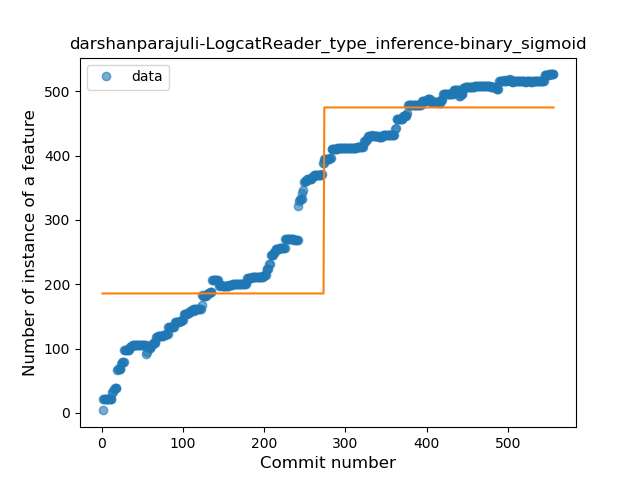
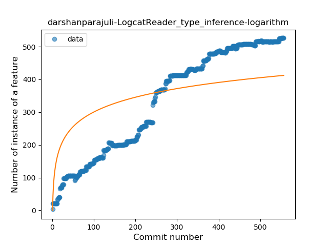
### <a name="lambda">Lambda</a>
----
#### Functions
* **Constant Rise - Linear:** 
    * **R_Squared:** 0.97621068
* **Sudden Rise - Exponential:** 
    * **R_Squared:** 0.98597245
* **Sudden Rise Plateau - Logarithm:** 
    * **R_Squared:** 0.49329595
* **Plateau Gradual Rise - Sigmoid:** 
    * **R_Squared:** 0.48040782

**Plots** :chart_with_upwards_trend:
-----

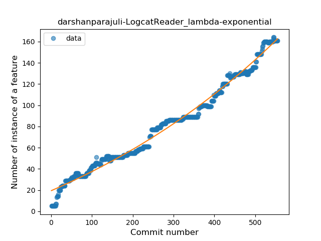
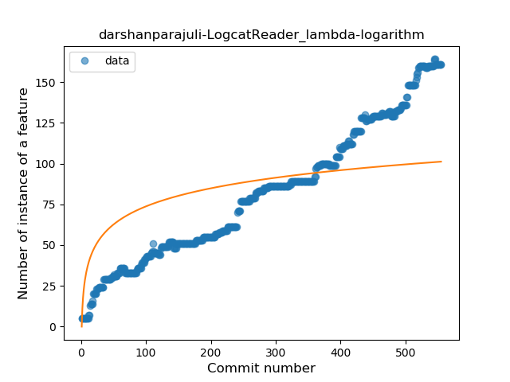
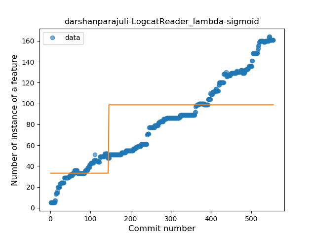
### <a name="safe_call">Safe Call</a>
----
#### Functions
* **Constant Rise - Linear:** 
    * **R_Squared:** 0.95279246
* **Sudden Rise Plateau - Logarithm:** 
    * **R_Squared:** 0.64959996
* **Plateau Sudden Rise - Binary Sigmoid:** 
    * **R_Squared:** 0.07299179

**Plots** :chart_with_upwards_trend:
-----

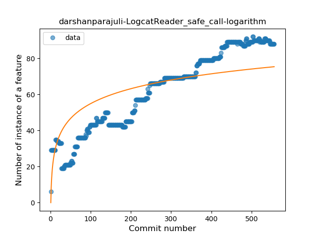
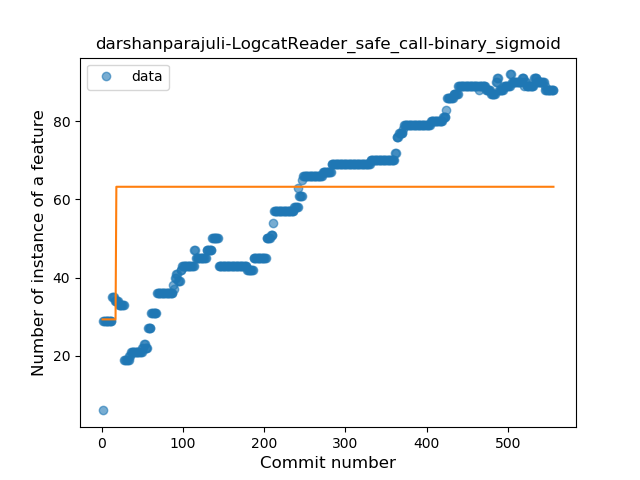
### <a name="when_expr">When expression</a>
----
#### Functions
* **Constant Rise - Linear:** 
    * **R_Squared:** 0.96543909
* **Sudden Rise Plateau - Logarithm:** 
    * **R_Squared:** 0.54669665
* **Plateau Sudden Rise - Binary Sigmoid:** 
    * **R_Squared:** 0.11084792

**Plots** :chart_with_upwards_trend:
-----

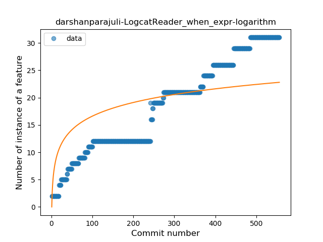
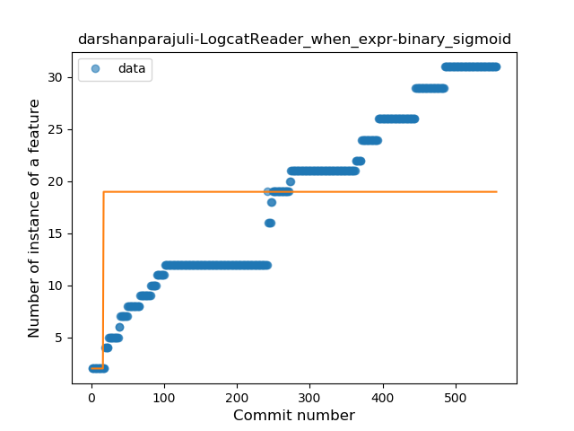
### <a name="companion_object">Companion Object</a>
----
#### Functions
* **Constant Rise - Linear:** 
    * **R_Squared:** 0.95879996
* **Sudden Rise Plateau - Logarithm:** 
    * **R_Squared:** 0.57884153

**Plots** :chart_with_upwards_trend:
-----

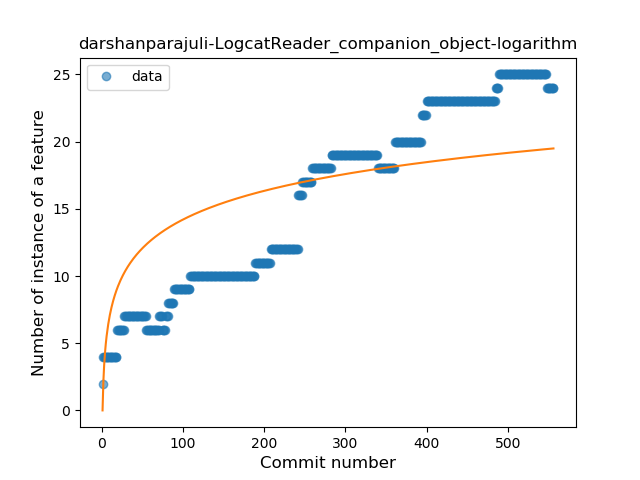
### <a name="unsafe_call">Unsafe Call</a>
----
#### Functions
* **Constant Rise - Linear:** 
    * **R_Squared:** 0.93845831
* **Sudden Rise - Exponential:** 
    * **R_Squared:** 0.94031031
* **Sudden Rise Plateau - Logarithm:** 
    * **R_Squared:** 0.32212706
* **Plateau Sudden Rise - Binary Sigmoid:** 
    * **R_Squared:** 0.12013997

**Plots** :chart_with_upwards_trend:
-----

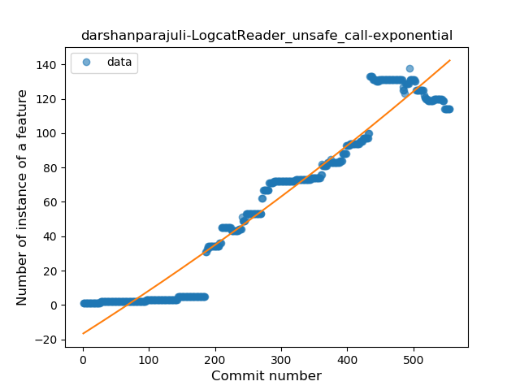
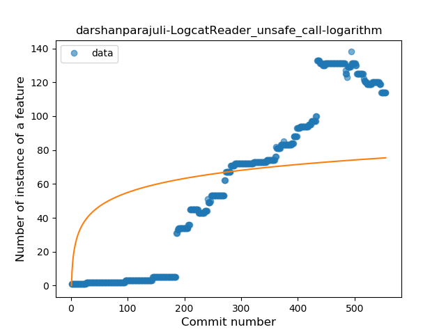
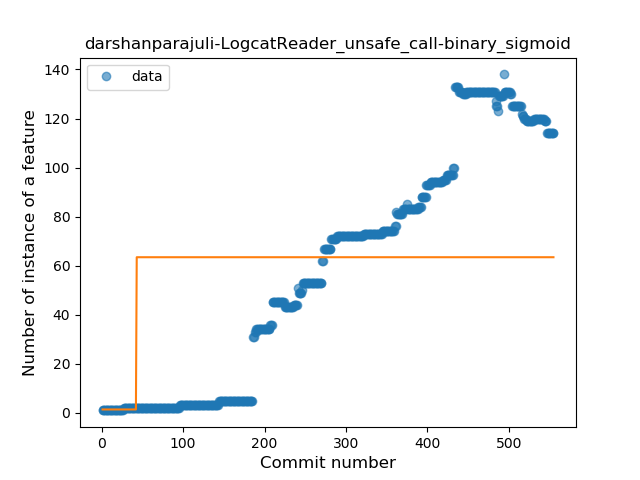
### <a name="string_template">String Template</a>
----
#### Functions
* **Constant Rise - Linear:** 
    * **R_Squared:** 0.90175036
* **Sudden Rise Plateau - Logarithm:** 
    * **R_Squared:** 0.72700152
* **Plateau Sudden Rise - Binary Sigmoid:** 
    * **R_Squared:** 0.27671529

**Plots** :chart_with_upwards_trend:
-----

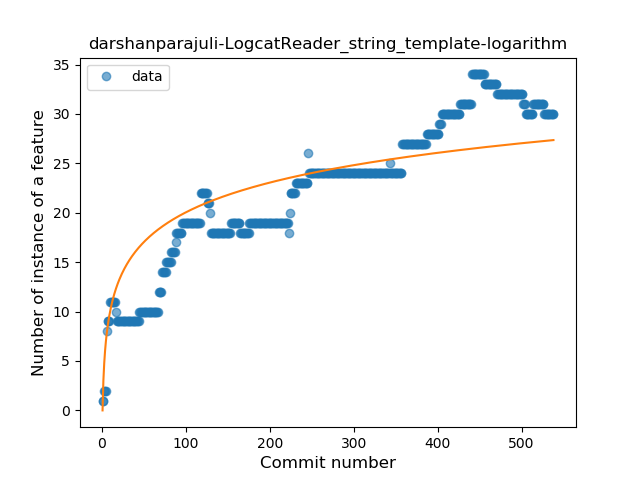
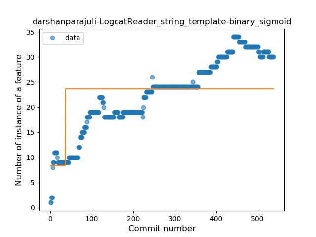
### <a name="func_with_default_value">Function with Default Value</a>
----
#### Functions
* **Constant Rise - Linear:** 
    * **R_Squared:** 0.87076294
* **Sudden Rise - Exponential:** 
    * **R_Squared:** 0.88017386
* **Sudden Rise Plateau - Logarithm:** 
    * **R_Squared:** 0.42167572

**Plots** :chart_with_upwards_trend:
-----

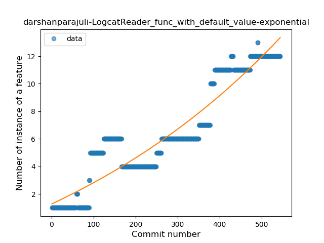
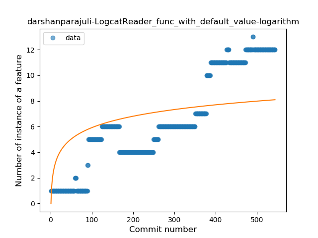
### <a name="singleton">Singleton</a>
----
#### Functions
* **Constant Rise - Linear:** 
    * **R_Squared:** 0.83224628
* **Sudden Rise Plateau - Logarithm:** 
    * **R_Squared:** 0.8021996

**Plots** :chart_with_upwards_trend:
-----

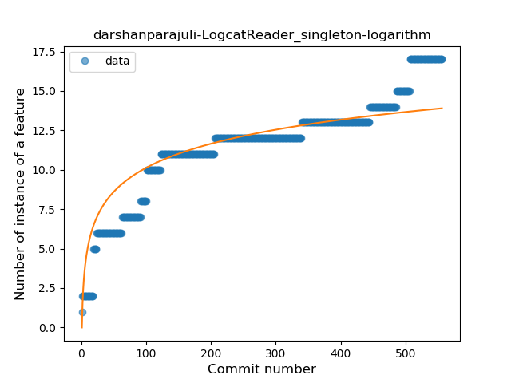
### <a name="range_expr">Range Expression</a>
----
#### Functions
* **Plateau Gradual Rise - Sigmoid:** 
    * **R_Squared:** 0.98714379
* **Constant Rise - Linear:** 
    * **R_Squared:** 0.7883908
* **Sudden Rise Plateau - Logarithm:** 
    * **R_Squared:** 0.35222781

**Plots** :chart_with_upwards_trend:
-----

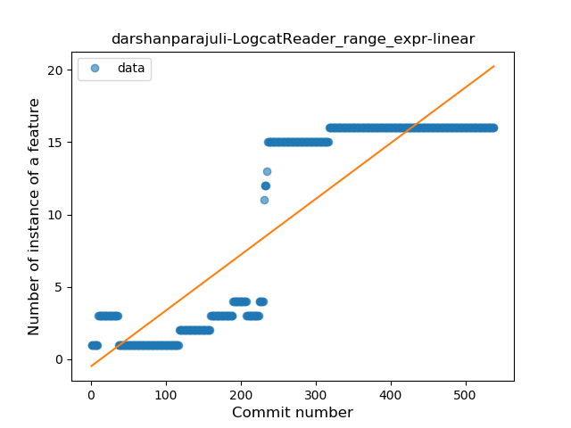
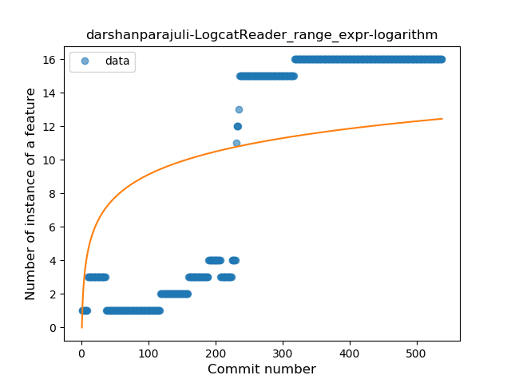
### <a name="func_call_with_named_arg">Function call with Named Argument</a>
----
#### Functions
* **Sudden Rise - Exponential:** 
    * **R_Squared:** 0.71672681
* **Constant Rise - Linear:** 
    * **R_Squared:** 0.70446791
* **Sudden Rise Plateau - Logarithm:** 
    * **R_Squared:** 0.67824912

**Plots** :chart_with_upwards_trend:
-----

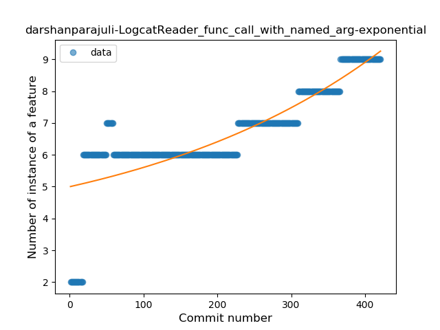
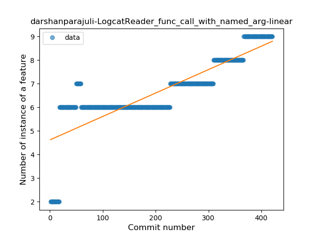
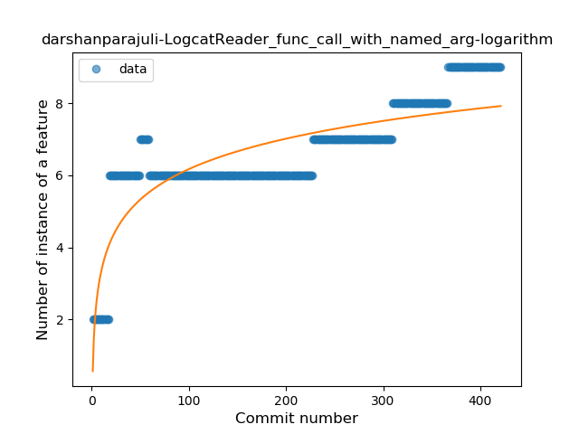
### <a name="data_class">Data Class</a>
----
#### Functions
* **Plateau Gradual Rise - Sigmoid:** 
    * **R_Squared:** 0.99038068
* **Sudden Rise - Exponential:** 
    * **R_Squared:** 0.91599761
* **Constant Rise - Linear:** 
    * **R_Squared:** 0.75037592
* **Sudden Rise Plateau - Logarithm:** 
    * **R_Squared:** 0.21825664

**Plots** :chart_with_upwards_trend:
-----

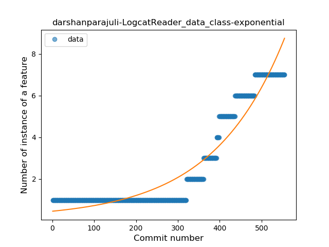
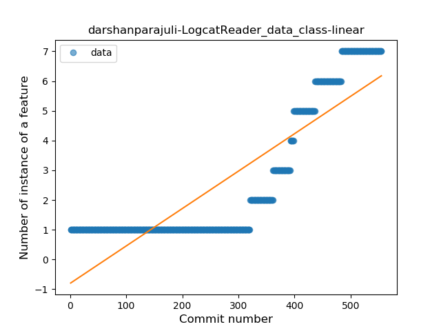
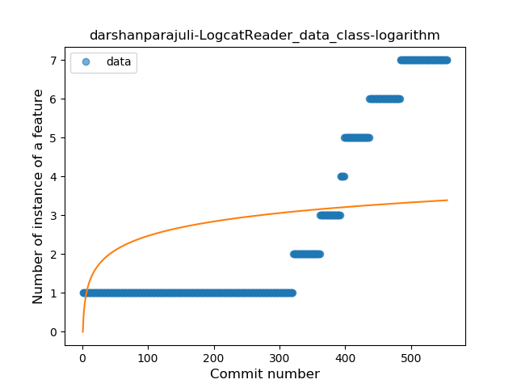
### <a name="extension_function">Extension Function</a>
----
#### Functions
* **Sudden Rise Plateau - Logarithm:** 
    * **R_Squared:** 0.62906878
* **Constant Rise - Linear:** 
    * **R_Squared:** 0.59134014

**Plots** :chart_with_upwards_trend:
-----

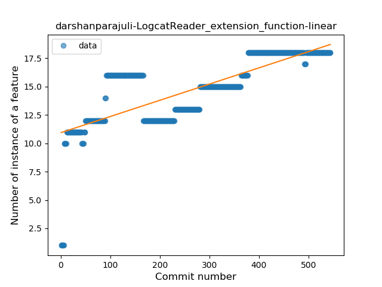
### <a name="destructuring_declaration">Destructuring Declaration</a>
----
#### Functions
* **Sudden Rise - Exponential:** 
    * **R_Squared:** 0.17552351
* **Constant Rise - Linear:** 
    * **R_Squared:** 0.14240874
* **Sudden Rise Plateau - Logarithm:** 
    * **R_Squared:** 0.06660222

**Plots** :chart_with_upwards_trend:
-----

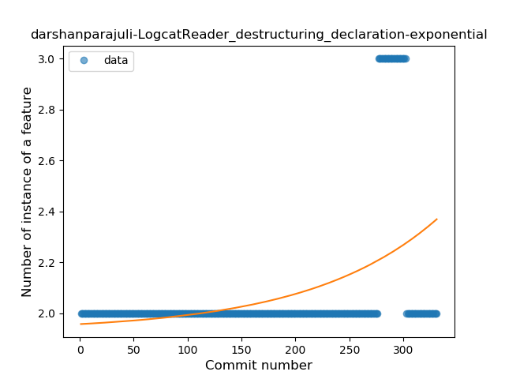

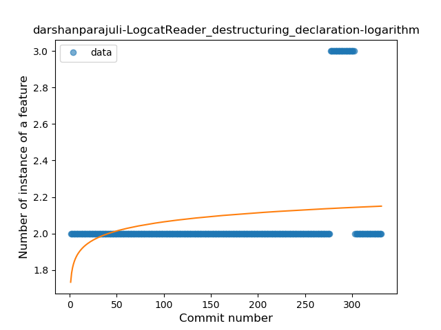
### <a name="inline_func">Inline Function</a>
----
#### Functions
* **Constant Decline - Linear:** 
    * **R_Squared:** 0.06309887
* **Sudden Rise Plateau - Logarithm:** 
    * **R_Squared:** 0.0

**Plots** :chart_with_upwards_trend:
-----

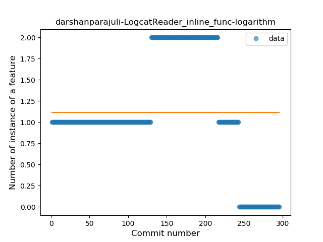
### <a name="overloaded_op">Overloaded Operator</a>
----
#### Functions
* **Plateau Gradual Rise - Sigmoid:** 
    * **R_Squared:** 0.95707419
* **Constant Rise - Linear:** 
    * **R_Squared:** 0.84037492
* **Sudden Rise Plateau - Logarithm:** 
    * **R_Squared:** 0.39224416

**Plots** :chart_with_upwards_trend:
-----

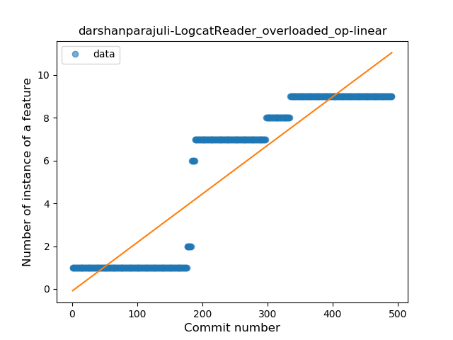

