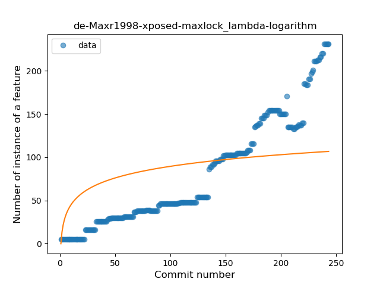
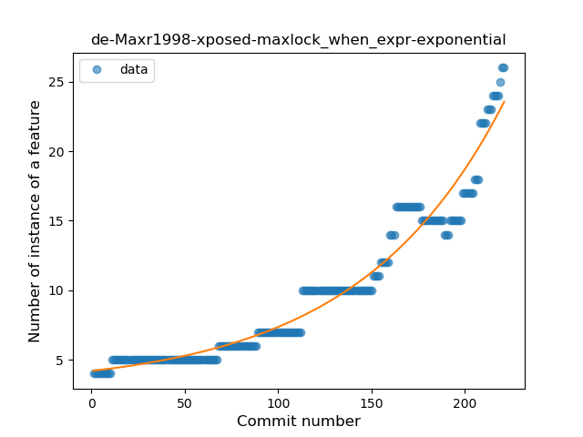
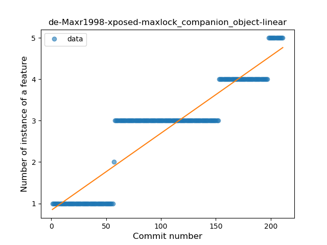
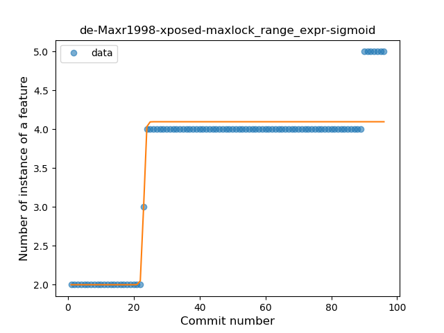
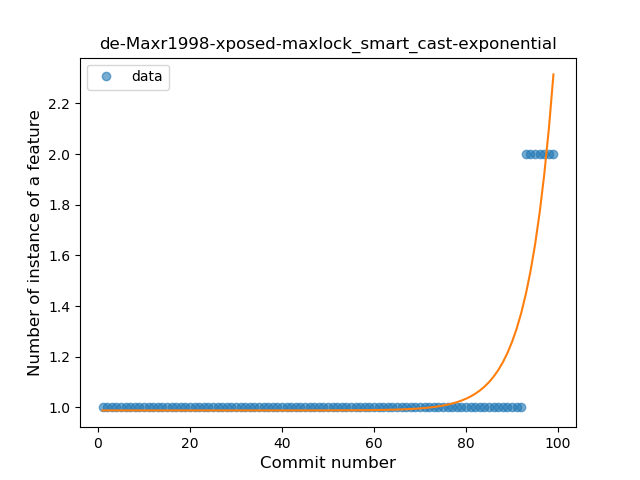
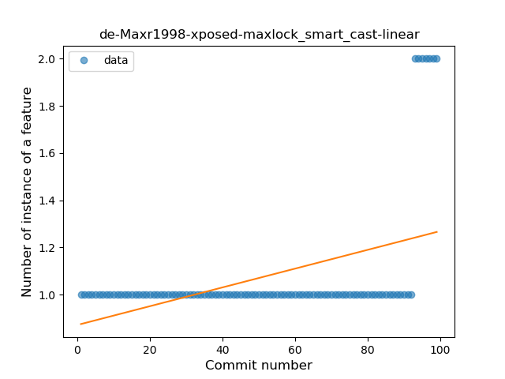
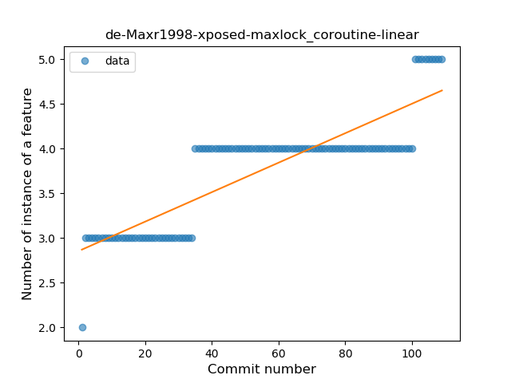

## de-Maxr1998-xposed-maxlock
----
#### Metrics provided by Detekt
* Number of lines of code 4930
* Number of Kotlin files: 45
* Cyclomatic complexity: 714
* Cyclomatic complexity by thousands of lines: 297 

----
**16** features analyzed

*	<a href="#type_inference">Type Inference</a> 
*	<a href="#lambda">Lambda</a> 
*	<a href="#safe_call">Safe Call</a> 
*	<a href="#when_expr">When expression</a> 
*	<a href="#unsafe_call">Unsafe Call</a> 
*	<a href="#companion_object">Companion Object</a> 
*	<a href="#string_template">String Template</a> 
*	<a href="#func_with_default_value">Function with Default Value</a> 
*	<a href="#singleton">Singleton</a> 
*	<a href="#range_expr">Range Expression</a> 
*	<a href="#smart_cast">Smart Cast</a> 
*	<a href="#extension_function">Extension Function</a> 
*	<a href="#property_delegation">Property Delegation</a> 
*	<a href="#inline_func">Inline Function</a> 
*	<a href="#overloaded_op">Overloaded Operator</a> 
*	<a href="#coroutine">Coroutine</a> 

### <a name="type_inference">Type Inference</a>
----
#### Functions
* **Sudden Rise - Exponential:** 
    * **R_Squared:** 0.95812671
* **Constant Rise - Linear:** 
    * **R_Squared:** 0.92900525
* **Plateau Sudden Rise - Binary Sigmoid:** 
    * **R_Squared:** 0.53351107
* **Sudden Rise Plateau - Logarithm:** 
    * **R_Squared:** 0.38324143

**Plots** :chart_with_upwards_trend:
-----

### <a name="lambda">Lambda</a>
----
#### Functions
* **Sudden Rise - Exponential:** 
    * **R_Squared:** 0.9607428
* **Constant Rise - Linear:** 
    * **R_Squared:** 0.90560522
* **Plateau Sudden Rise - Binary Sigmoid:** 
    * **R_Squared:** 0.38210183
* **Sudden Rise Plateau - Logarithm:** 
    * **R_Squared:** 0.36008004

**Plots** :chart_with_upwards_trend:
-----

### <a name="safe_call">Safe Call</a>
----
#### Functions
* **Constant Rise - Linear:** 
    * **R_Squared:** 0.97122294
* **Plateau Gradual Rise - Sigmoid:** 
    * **R_Squared:** 0.66691451
* **Sudden Rise Plateau - Logarithm:** 
    * **R_Squared:** 0.54741283

**Plots** :chart_with_upwards_trend:
-----

### <a name="when_expr">When expression</a>
----
#### Functions
* **Sudden Rise - Exponential:** 
    * **R_Squared:** 0.95194919
* **Constant Rise - Linear:** 
    * **R_Squared:** 0.84755017
* **Sudden Rise Plateau - Logarithm:** 
    * **R_Squared:** 0.40949819

**Plots** :chart_with_upwards_trend:
-----

### <a name="unsafe_call">Unsafe Call</a>
----
#### Functions
* **Constant Rise - Linear:** 
    * **R_Squared:** 0.77805083
* **Sudden Rise - Exponential:** 
    * **R_Squared:** 0.78571128
* **Sudden Rise Plateau - Logarithm:** 
    * **R_Squared:** 0.54321518

**Plots** :chart_with_upwards_trend:
-----

### <a name="companion_object">Companion Object</a>
----
#### Functions
* **Constant Rise - Linear:** 
    * **R_Squared:** 0.85423418
* **Sudden Rise Plateau - Logarithm:** 
    * **R_Squared:** 0.59321545

**Plots** :chart_with_upwards_trend:
-----

### <a name="string_template">String Template</a>
----
#### Functions
* **Constant Rise - Linear:** 
    * **R_Squared:** 0.87531742
* **Sudden Rise Plateau - Logarithm:** 
    * **R_Squared:** 0.81059178

**Plots** :chart_with_upwards_trend:
-----

### <a name="func_with_default_value">Function with Default Value</a>
----
#### Functions
* **Plateau Gradual Rise - Sigmoid:** 
    * **R_Squared:** 0.95239864
* **Constant Rise - Linear:** 
    * **R_Squared:** 0.73834139
* **Sudden Rise Plateau - Logarithm:** 
    * **R_Squared:** 0.43278201

**Plots** :chart_with_upwards_trend:
-----

### <a name="singleton">Singleton</a>
----
#### Functions
* **Plateau Gradual Rise - Sigmoid:** 
    * **R_Squared:** 0.95098158
* **Sudden Rise - Exponential:** 
    * **R_Squared:** 0.93684515
* **Constant Rise - Linear:** 
    * **R_Squared:** 0.77177118
* **Sudden Rise Plateau - Logarithm:** 
    * **R_Squared:** 0.28837872

**Plots** :chart_with_upwards_trend:
-----

### <a name="range_expr">Range Expression</a>
----
#### Functions
* **Plateau Gradual Rise - Sigmoid:** 
    * **R_Squared:** 0.92190038
* **Sudden Rise Plateau - Logarithm:** 
    * **R_Squared:** 0.70840277
* **Constant Rise - Linear:** 
    * **R_Squared:** 0.64696118

**Plots** :chart_with_upwards_trend:
-----

### <a name="smart_cast">Smart Cast</a>
----
#### Functions
* **Plateau Sudden Rise - Binary Sigmoid:** 
    * **R_Squared:** 1.0
* **Sudden Rise - Exponential:** 
    * **R_Squared:** 0.80456284
* **Constant Rise - Linear:** 
    * **R_Squared:** 0.19714286
* **Sudden Rise Plateau - Logarithm:** 
    * **R_Squared:** 0.07834972

**Plots** :chart_with_upwards_trend:
-----

### <a name="extension_function">Extension Function</a>
----
#### Functions
* **Sudden Rise - Exponential:** 
    * **R_Squared:** 0.8814051
* **Constant Rise - Linear:** 
    * **R_Squared:** 0.71107094
* **Sudden Rise Plateau - Logarithm:** 
    * **R_Squared:** 0.29385815

**Plots** :chart_with_upwards_trend:
-----

### <a name="property_delegation">Property Delegation</a>
----
#### Functions
* **Sudden Rise - Exponential:** 
    * **R_Squared:** 0.92107739
* **Constant Rise - Linear:** 
    * **R_Squared:** 0.81928393
* **Sudden Rise Plateau - Logarithm:** 
    * **R_Squared:** 0.46891339

**Plots** :chart_with_upwards_trend:
-----

### <a name="inline_func">Inline Function</a>
----
#### Functions
* **Plateau Gradual Rise - Sigmoid:** 
    * **R_Squared:** 0.96534791
* **Sudden Rise - Exponential:** 
    * **R_Squared:** 0.91287696
* **Constant Rise - Linear:** 
    * **R_Squared:** 0.49354033
* **Sudden Rise Plateau - Logarithm:** 
    * **R_Squared:** 0.17504655

**Plots** :chart_with_upwards_trend:
-----

### <a name="overloaded_op">Overloaded Operator</a>
----
#### Functions
* **Plateau Gradual Rise - Sigmoid:** 
    * **R_Squared:** 0.98328845
* **Sudden Rise - Exponential:** 
    * **R_Squared:** 0.81608368
* **Constant Rise - Linear:** 
    * **R_Squared:** 0.59405316
* **Sudden Rise Plateau - Logarithm:** 
    * **R_Squared:** 0.25386997

**Plots** :chart_with_upwards_trend:
-----

### <a name="coroutine">Coroutine</a>
----
#### Functions
* **Constant Rise - Linear:** 
    * **R_Squared:** 0.73693156
* **Sudden Rise Plateau - Logarithm:** 
    * **R_Squared:** 0.67119178

**Plots** :chart_with_upwards_trend:
-----

