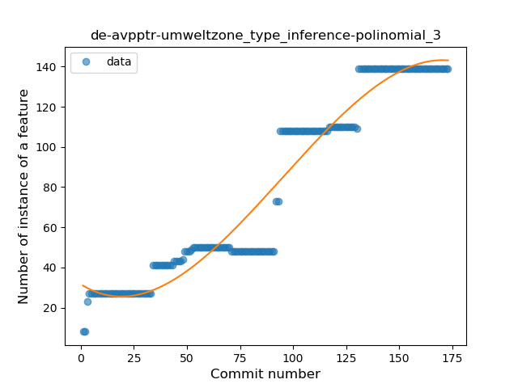
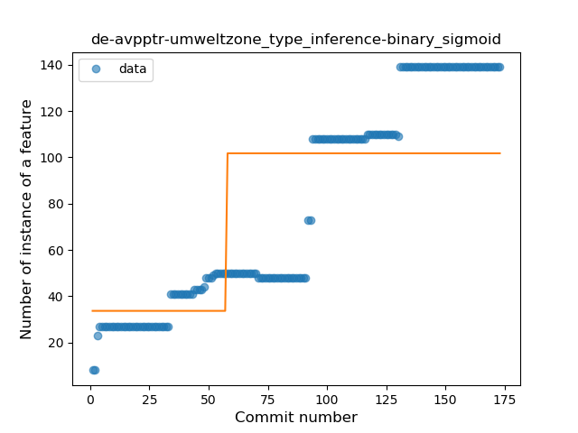
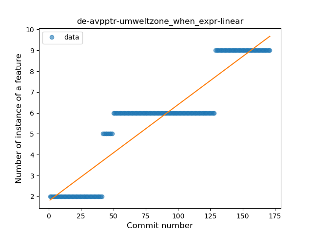
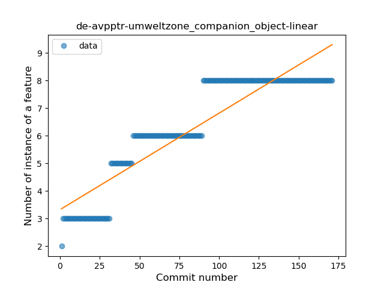
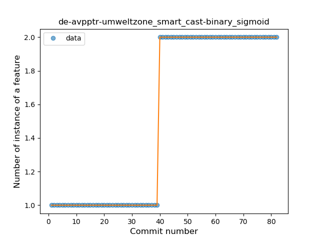
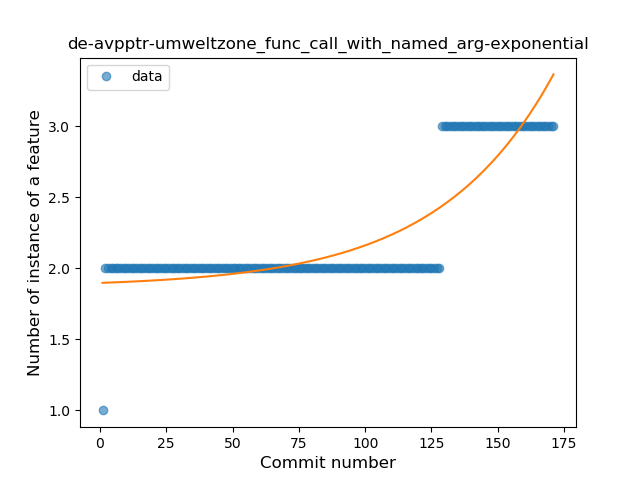

## de-avpptr-umweltzone
----
#### Metrics provided by Detekt
* Number of lines of code 2657
* Number of Kotlin files: 45
* Cyclomatic complexity: 216
* Cyclomatic complexity by thousands of lines: 199 

----
**14** features analyzed

*	<a href="#type_inference">Type Inference</a> 
*	<a href="#lambda">Lambda</a> 
*	<a href="#safe_call">Safe Call</a> 
*	<a href="#when_expr">When expression</a> 
*	<a href="#unsafe_call">Unsafe Call</a> 
*	<a href="#companion_object">Companion Object</a> 
*	<a href="#string_template">String Template</a> 
*	<a href="#singleton">Singleton</a> 
*	<a href="#smart_cast">Smart Cast</a> 
*	<a href="#data_class">Data Class</a> 
*	<a href="#func_call_with_named_arg">Function call with Named Argument</a> 
*	<a href="#extension_function">Extension Function</a> 
*	<a href="#property_delegation">Property Delegation</a> 
*	<a href="#sealed_class">Sealed Class</a> 

### <a name="type_inference">Type Inference</a>
----
#### Functions
* **Instability - Polinomial 3:** )
    * **R_Squared:** 0.93986175
* **Constant Rise - Linear:** 
    * **R_Squared:** 0.91121616
* **Sudden Rise - Exponential:** 
    * **R_Squared:** 0.91637024
* **Plateau Sudden Rise - Binary Sigmoid:** 
    * **R_Squared:** 0.51859583
* **Sudden Rise Plateau - Logarithm:** 
    * **R_Squared:** 0.4949113

**Plots** :chart_with_upwards_trend:
-----

### <a name="lambda">Lambda</a>
----
#### Functions
* **Plateau Gradual Rise - Sigmoid:** 
    * **R_Squared:** 0.9252273
* **Sudden Rise - Exponential:** 
    * **R_Squared:** 0.91125752
* **Constant Rise - Linear:** 
    * **R_Squared:** 0.86239085
* **Sudden Rise Plateau - Logarithm:** 
    * **R_Squared:** 0.43497254

**Plots** :chart_with_upwards_trend:
-----

### <a name="safe_call">Safe Call</a>
----
#### Functions
* **Sudden Rise - Exponential:** 
    * **R_Squared:** 0.11133041
* **Constant Rise - Linear:** 
    * **R_Squared:** 0.0349985
* **Sudden Rise Plateau - Logarithm:** 
    * **R_Squared:** -0.0

**Plots** :chart_with_upwards_trend:
-----

### <a name="when_expr">When expression</a>
----
#### Functions
* **Constant Rise - Linear:** 
    * **R_Squared:** 0.85409548
* **Sudden Rise Plateau - Logarithm:** 
    * **R_Squared:** 0.62212896

**Plots** :chart_with_upwards_trend:
-----

### <a name="unsafe_call">Unsafe Call</a>
----
#### Functions
* **Plateau Gradual Rise - Sigmoid:** 
    * **R_Squared:** 0.9558945
* **Constant Rise - Linear:** 
    * **R_Squared:** 0.81970252
* **Sudden Rise Plateau - Logarithm:** 
    * **R_Squared:** 0.66611297

**Plots** :chart_with_upwards_trend:
-----

### <a name="companion_object">Companion Object</a>
----
#### Functions
* **Constant Rise - Linear:** 
    * **R_Squared:** 0.83430129
* **Sudden Rise Plateau - Logarithm:** 
    * **R_Squared:** 0.80530287

**Plots** :chart_with_upwards_trend:
-----

### <a name="string_template">String Template</a>
----
#### Functions
* **Constant Rise - Linear:** 
    * **R_Squared:** 0.69338602
* **Sudden Rise Plateau - Logarithm:** 
    * **R_Squared:** 0.69109134

**Plots** :chart_with_upwards_trend:
-----

### <a name="singleton">Singleton</a>
----
#### Functions
* **Plateau Sudden Rise - Binary Sigmoid:** 
    * **R_Squared:** 0.99241195
* **Sudden Rise - Exponential:** 
    * **R_Squared:** 0.768643
* **Constant Rise - Linear:** 
    * **R_Squared:** 0.57337552
* **Sudden Rise Plateau - Logarithm:** 
    * **R_Squared:** 0.29471682

**Plots** :chart_with_upwards_trend:
-----

### <a name="smart_cast">Smart Cast</a>
----
#### Functions
* **Plateau Sudden Rise - Binary Sigmoid:** 
    * **R_Squared:** 1.0
* **Constant Rise - Linear:** 
    * **R_Squared:** 0.74832664
* **Sudden Rise Plateau - Logarithm:** 
    * **R_Squared:** 0.54983595

**Plots** :chart_with_upwards_trend:
-----

### <a name="data_class">Data Class</a>
----
#### Functions
* **Plateau Gradual Rise - Sigmoid:** 
    * **R_Squared:** 0.94987725
* **Constant Rise - Linear:** 
    * **R_Squared:** 0.91844443
* **Sudden Rise - Exponential:** 
    * **R_Squared:** 0.91891922
* **Sudden Rise Plateau - Logarithm:** 
    * **R_Squared:** 0.6023728

**Plots** :chart_with_upwards_trend:
-----

### <a name="func_call_with_named_arg">Function call with Named Argument</a>
----
#### Functions
* **Sudden Rise - Exponential:** 
    * **R_Squared:** 0.75613533
* **Constant Rise - Linear:** 
    * **R_Squared:** 0.57345595
* **Sudden Rise Plateau - Logarithm:** 
    * **R_Squared:** 0.31781304

**Plots** :chart_with_upwards_trend:
-----

### <a name="extension_function">Extension Function</a>
----
#### Functions
* **Constant Rise - Linear:** 
    * **R_Squared:** 0.91292376
* **Sudden Rise - Exponential:** 
    * **R_Squared:** 0.91525861
* **Sudden Rise Plateau - Logarithm:** 
    * **R_Squared:** 0.62266988
* **Plateau Sudden Rise - Binary Sigmoid:** 
    * **R_Squared:** 0.09107968

**Plots** :chart_with_upwards_trend:
-----

### <a name="property_delegation">Property Delegation</a>
----
#### Functions
* **Plateau Sudden Rise - Binary Sigmoid:** 
    * **R_Squared:** 1.0
* **Constant Rise - Linear:** 
    * **R_Squared:** 0.73203392
* **Sudden Rise Plateau - Logarithm:** 
    * **R_Squared:** 0.57933687

**Plots** :chart_with_upwards_trend:
-----

### <a name="sealed_class">Sealed Class</a>
----
#### Functions
* **Plateau Sudden Rise - Binary Sigmoid:** 
    * **R_Squared:** 1.0
* **Sudden Rise - Exponential:** 
    * **R_Squared:** 0.77004483
* **Constant Rise - Linear:** 
    * **R_Squared:** 0.56470588
* **Sudden Rise Plateau - Logarithm:** 
    * **R_Squared:** 0.26775106

**Plots** :chart_with_upwards_trend:
-----

