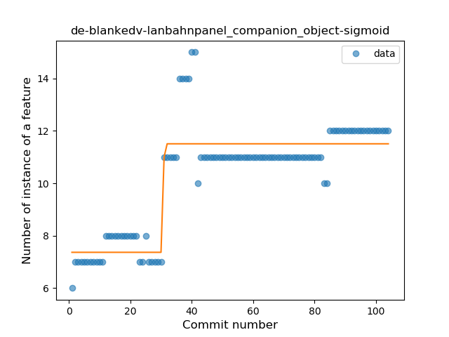
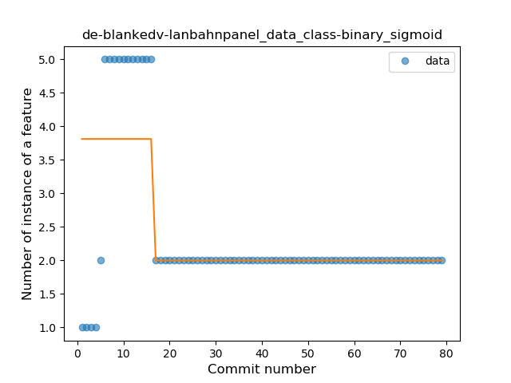

## de-blankedv-lanbahnpanel
----
#### Metrics provided by Detekt
* Number of lines of code 6947
* Number of Kotlin files: 36
* Cyclomatic complexity: 1198
* Cyclomatic complexity by thousands of lines: 330 

----
**13** features analyzed

*	<a href="#type_inference">Type Inference</a> 
*	<a href="#lambda">Lambda</a> 
*	<a href="#safe_call">Safe Call</a> 
*	<a href="#when_expr">When expression</a> 
*	<a href="#unsafe_call">Unsafe Call</a> 
*	<a href="#companion_object">Companion Object</a> 
*	<a href="#string_template">String Template</a> 
*	<a href="#func_with_default_value">Function with Default Value</a> 
*	<a href="#singleton">Singleton</a> 
*	<a href="#range_expr">Range Expression</a> 
*	<a href="#smart_cast">Smart Cast</a> 
*	<a href="#data_class">Data Class</a> 
*	<a href="#destructuring_declaration">Destructuring Declaration</a> 

### <a name="type_inference">Type Inference</a>
----
#### Functions
* **Sudden Rise Plateau - Logarithm:** 
    * **R_Squared:** 0.78191144
* **Constant Rise - Linear:** 
    * **R_Squared:** 0.63739025

**Plots** :chart_with_upwards_trend:
-----

### <a name="lambda">Lambda</a>
----
#### Functions
* **Instability - Polinomial 3:** )
    * **R_Squared:** 0.86889203
* **Sudden Rise Plateau - Logarithm:** 
    * **R_Squared:** 0.76859193
* **Constant Rise - Linear:** 
    * **R_Squared:** 0.59269375

**Plots** :chart_with_upwards_trend:
-----

### <a name="safe_call">Safe Call</a>
----
#### Functions
* **Constant Rise - Linear:** 
    * **R_Squared:** 0.72764125
* **Sudden Rise Plateau - Logarithm:** 
    * **R_Squared:** 0.71407382
* **Plateau Sudden Rise - Binary Sigmoid:** 
    * **R_Squared:** 0.2139971

**Plots** :chart_with_upwards_trend:
-----

### <a name="when_expr">When expression</a>
----
#### Functions
* **Plateau Gradual Rise - Sigmoid:** 
    * **R_Squared:** 0.95118342
* **Sudden Rise Plateau - Logarithm:** 
    * **R_Squared:** 0.77434856
* **Constant Rise - Linear:** 
    * **R_Squared:** 0.59956891

**Plots** :chart_with_upwards_trend:
-----

### <a name="unsafe_call">Unsafe Call</a>
----
#### Functions
* **Instability - Polinomial 3:** )
    * **R_Squared:** 0.65144086
* **Constant Rise - Linear:** 
    * **R_Squared:** 0.51502052
* **Sudden Rise Plateau - Logarithm:** 
    * **R_Squared:** 0.46349192

**Plots** :chart_with_upwards_trend:
-----

### <a name="companion_object">Companion Object</a>
----
#### Functions
* **Plateau Gradual Rise - Sigmoid:** 
    * **R_Squared:** 0.81797032
* **Sudden Rise Plateau - Logarithm:** 
    * **R_Squared:** 0.57873271
* **Constant Rise - Linear:** 
    * **R_Squared:** 0.50292687

**Plots** :chart_with_upwards_trend:
-----

### <a name="string_template">String Template</a>
----
#### Functions
* **Sudden Rise Plateau - Logarithm:** 
    * **R_Squared:** 0.54851165
* **Constant Rise - Linear:** 
    * **R_Squared:** 0.47827332

**Plots** :chart_with_upwards_trend:
-----

### <a name="func_with_default_value">Function with Default Value</a>
----
#### Functions
* **Plateau Gradual Rise - Sigmoid:** 
    * **R_Squared:** 0.95841447
* **Constant Rise - Linear:** 
    * **R_Squared:** 0.70050566
* **Sudden Rise Plateau - Logarithm:** 
    * **R_Squared:** 0.54448364

**Plots** :chart_with_upwards_trend:
-----

### <a name="singleton">Singleton</a>
----
#### Functions
* **Sudden Rise Plateau - Logarithm:** 
    * **R_Squared:** 0.0841426
* **Constant Rise - Linear:** 
    * **R_Squared:** 0.00160936

**Plots** :chart_with_upwards_trend:
-----

### <a name="range_expr">Range Expression</a>
----
#### Functions
* **Sudden Rise Plateau - Logarithm:** 
    * **R_Squared:** 0.25495682
* **Constant Rise - Linear:** 
    * **R_Squared:** 0.1872321

**Plots** :chart_with_upwards_trend:
-----

### <a name="smart_cast">Smart Cast</a>
----
#### Functions
* **Sudden Decline - Exponential:** 
    * **R_Squared:** 0.65613362
* **Constant Decline - Linear:** 
    * **R_Squared:** 0.60771097
* **Sudden Rise Plateau - Logarithm:** 
    * **R_Squared:** 0.0

**Plots** :chart_with_upwards_trend:
-----

### <a name="data_class">Data Class</a>
----
#### Functions
* **Plateau Sudden Decline - Binary Sigmoid:** 
    * **R_Squared:** 0.45387027
* **Sudden Decline - Exponential:** 
    * **R_Squared:** 0.19145455
* **Constant Decline - Linear:** 
    * **R_Squared:** 0.17165597
* **Sudden Rise Plateau - Logarithm:** 
    * **R_Squared:** -0.0

**Plots** :chart_with_upwards_trend:
-----

### <a name="destructuring_declaration">Destructuring Declaration</a>
----
#### Functions
* **Sudden Rise Plateau - Logarithm:** 
    * **R_Squared:** 0.16773545
* **Constant Rise - Linear:** 
    * **R_Squared:** 0.03333333

**Plots** :chart_with_upwards_trend:
-----

