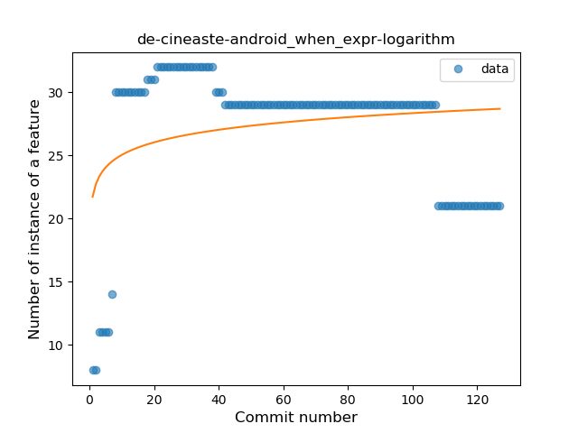
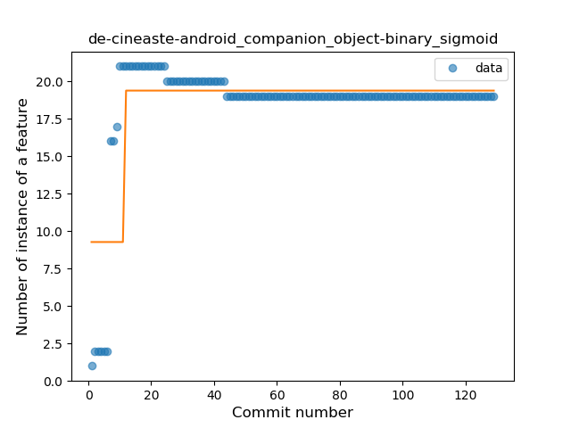
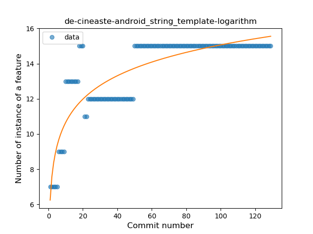
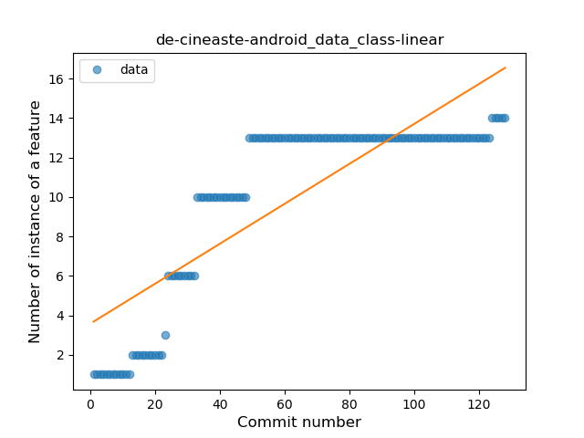

## de-cineaste-android
----
#### Metrics provided by Detekt
* Number of lines of code 8266
* Number of Kotlin files: 92
* Cyclomatic complexity: 1068
* Cyclomatic complexity by thousands of lines: 226 

----
**13** features analyzed

*	<a href="#type_inference">Type Inference</a> 
*	<a href="#lambda">Lambda</a> 
*	<a href="#safe_call">Safe Call</a> 
*	<a href="#when_expr">When expression</a> 
*	<a href="#unsafe_call">Unsafe Call</a> 
*	<a href="#companion_object">Companion Object</a> 
*	<a href="#string_template">String Template</a> 
*	<a href="#func_with_default_value">Function with Default Value</a> 
*	<a href="#singleton">Singleton</a> 
*	<a href="#range_expr">Range Expression</a> 
*	<a href="#data_class">Data Class</a> 
*	<a href="#func_call_with_named_arg">Function call with Named Argument</a> 
*	<a href="#coroutine">Coroutine</a> 

### <a name="type_inference">Type Inference</a>
----
#### Functions
* **Instability - Polinomial 3:** )
    * **R_Squared:** 0.73176071
* **Sudden Rise Plateau - Logarithm:** 
    * **R_Squared:** 0.58554663
* **Constant Rise - Linear:** 
    * **R_Squared:** 0.20479867

**Plots** :chart_with_upwards_trend:
-----

### <a name="lambda">Lambda</a>
----
#### Functions
* **Instability - Polinomial 3:** )
    * **R_Squared:** 0.95147823
* **Sudden Rise Plateau - Logarithm:** 
    * **R_Squared:** 0.89395471
* **Constant Rise - Linear:** 
    * **R_Squared:** 0.66004401
* **Plateau Sudden Rise - Binary Sigmoid:** 
    * **R_Squared:** 0.30304744

**Plots** :chart_with_upwards_trend:
-----

### <a name="safe_call">Safe Call</a>
----
#### Functions
* **Constant Rise - Linear:** 
    * **R_Squared:** 0.70616002
* **Sudden Rise Plateau - Logarithm:** 
    * **R_Squared:** 0.67743508
* **Plateau Sudden Rise - Binary Sigmoid:** 
    * **R_Squared:** 0.52625901

**Plots** :chart_with_upwards_trend:
-----

### <a name="when_expr">When expression</a>
----
#### Functions
* **Sudden Rise Plateau - Logarithm:** 
    * **R_Squared:** 0.06546265
* **Plateau Sudden Rise - Binary Sigmoid:** 
    * **R_Squared:** 0.04376703
* **Constant Decline - Linear:** 
    * **R_Squared:** 0.02067762

**Plots** :chart_with_upwards_trend:
-----

### <a name="unsafe_call">Unsafe Call</a>
----
#### Functions
* **Constant Decline - Linear:** 
    * **R_Squared:** 0.35783247
* **Sudden Decline - Exponential:** 
    * **R_Squared:** -0.0
* **Sudden Rise Plateau - Logarithm:** 
    * **R_Squared:** -0.0

**Plots** :chart_with_upwards_trend:
-----

### <a name="companion_object">Companion Object</a>
----
#### Functions
* **Plateau Sudden Rise - Binary Sigmoid:** 
    * **R_Squared:** 0.55873268
* **Sudden Rise Plateau - Logarithm:** 
    * **R_Squared:** 0.33382975
* **Constant Rise - Linear:** 
    * **R_Squared:** 0.0689761

**Plots** :chart_with_upwards_trend:
-----

### <a name="string_template">String Template</a>
----
#### Functions
* **Sudden Rise Plateau - Logarithm:** 
    * **R_Squared:** 0.75269223
* **Constant Rise - Linear:** 
    * **R_Squared:** 0.55414619

**Plots** :chart_with_upwards_trend:
-----

### <a name="func_with_default_value">Function with Default Value</a>
----
#### Functions
* **Plateau Gradual Rise - Sigmoid:** 
    * **R_Squared:** 0.98700458
* **Sudden Rise Plateau - Logarithm:** 
    * **R_Squared:** 0.68634567
* **Constant Rise - Linear:** 
    * **R_Squared:** 0.55289717

**Plots** :chart_with_upwards_trend:
-----

### <a name="singleton">Singleton</a>
----
#### Functions
* **Sudden Rise Plateau - Logarithm:** 
    * **R_Squared:** 0.77268697
* **Constant Rise - Linear:** 
    * **R_Squared:** 0.52078321

**Plots** :chart_with_upwards_trend:
-----

### <a name="range_expr">Range Expression</a>
----
#### Functions
* **Constant Decline - Linear:** 
    * **R_Squared:** 0.28232886
* **Sudden Decline - Exponential:** 
    * **R_Squared:** 0.28843081
* **Plateau Sudden Rise - Binary Sigmoid:** 
    * **R_Squared:** 0.08368684
* **Sudden Rise Plateau - Logarithm:** 
    * **R_Squared:** -0.0

**Plots** :chart_with_upwards_trend:
-----

### <a name="data_class">Data Class</a>
----
#### Functions
* **Constant Rise - Linear:** 
    * **R_Squared:** 0.70040292
* **Sudden Rise Plateau - Logarithm:** 
    * **R_Squared:** 0.70367937

**Plots** :chart_with_upwards_trend:
-----

### <a name="func_call_with_named_arg">Function call with Named Argument</a>
----
#### Functions
* **Plateau Sudden Rise - Binary Sigmoid:** 
    * **R_Squared:** 0.8402512
* **Constant Rise - Linear:** 
    * **R_Squared:** 0.6577999
* **Sudden Rise Plateau - Logarithm:** 
    * **R_Squared:** 0.63522834

**Plots** :chart_with_upwards_trend:
-----

### <a name="coroutine">Coroutine</a>
----
#### Functions
* **Instability - Polinomial 3:** )
    * **R_Squared:** 0.84404093
* **Constant Rise - Linear:** 
    * **R_Squared:** 0.73691703
* **Sudden Rise Plateau - Logarithm:** 
    * **R_Squared:** 0.50678338
* **Plateau Sudden Rise - Binary Sigmoid:** 
    * **R_Squared:** 0.03589345

**Plots** :chart_with_upwards_trend:
-----

