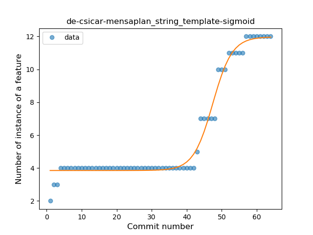

## de-csicar-mensaplan
----
#### Metrics provided by Detekt
* Number of lines of code 1642
* Number of Kotlin files: 18
* Cyclomatic complexity: 203
* Cyclomatic complexity by thousands of lines: 236 

----
**10** features analyzed

*	<a href="#type_inference">Type Inference</a> 
*	<a href="#lambda">Lambda</a> 
*	<a href="#safe_call">Safe Call</a> 
*	<a href="#when_expr">When expression</a> 
*	<a href="#unsafe_call">Unsafe Call</a> 
*	<a href="#companion_object">Companion Object</a> 
*	<a href="#string_template">String Template</a> 
*	<a href="#smart_cast">Smart Cast</a> 
*	<a href="#data_class">Data Class</a> 
*	<a href="#sealed_class">Sealed Class</a> 

### <a name="type_inference">Type Inference</a>
----
#### Functions
* **Sudden Rise - Exponential:** 
    * **R_Squared:** 0.84736982
* **Constant Rise - Linear:** 
    * **R_Squared:** 0.66809198
* **Sudden Rise Plateau - Logarithm:** 
    * **R_Squared:** 0.44290697

**Plots** :chart_with_upwards_trend:
-----

### <a name="lambda">Lambda</a>
----
#### Functions
* **Instability - Polinomial 3:** )
    * **R_Squared:** 0.76586406
* **Sudden Rise - Exponential:** 
    * **R_Squared:** 0.7284493
* **Constant Rise - Linear:** 
    * **R_Squared:** 0.50508832
* **Sudden Rise Plateau - Logarithm:** 
    * **R_Squared:** 0.27348376

**Plots** :chart_with_upwards_trend:
-----

### <a name="safe_call">Safe Call</a>
----
#### Functions
* **Sudden Rise Plateau - Logarithm:** 
    * **R_Squared:** 0.92702045
* **Constant Rise - Linear:** 
    * **R_Squared:** 0.80481185

**Plots** :chart_with_upwards_trend:
-----

### <a name="when_expr">When expression</a>
----
#### Functions
* **Instability - Polinomial 3:** )
    * **R_Squared:** 0.71128918
* **Plateau Gradual Rise - Sigmoid:** 
    * **R_Squared:** 0.37902713
* **Sudden Rise Plateau - Logarithm:** 
    * **R_Squared:** 0.08564375
* **Constant Rise - Linear:** 
    * **R_Squared:** 0.00746769

**Plots** :chart_with_upwards_trend:
-----

### <a name="unsafe_call">Unsafe Call</a>
----
#### Functions
* **Plateau Sudden Rise - Binary Sigmoid:** 
    * **R_Squared:** 1.0
* **Sudden Rise Plateau - Logarithm:** 
    * **R_Squared:** 0.62165212
* **Constant Rise - Linear:** 
    * **R_Squared:** 0.31963261

**Plots** :chart_with_upwards_trend:
-----

### <a name="companion_object">Companion Object</a>
----
#### Functions
* **Sudden Rise - Exponential:** 
    * **R_Squared:** 0.76533951
* **Constant Rise - Linear:** 
    * **R_Squared:** 0.61567207
* **Sudden Rise Plateau - Logarithm:** 
    * **R_Squared:** 0.41055376

**Plots** :chart_with_upwards_trend:
-----

### <a name="string_template">String Template</a>
----
#### Functions
* **Plateau Gradual Rise - Sigmoid:** 
    * **R_Squared:** 0.97967622
* **Sudden Rise - Exponential:** 
    * **R_Squared:** 0.89013887
* **Constant Rise - Linear:** 
    * **R_Squared:** 0.71165576
* **Sudden Rise Plateau - Logarithm:** 
    * **R_Squared:** 0.40094968

**Plots** :chart_with_upwards_trend:
-----

### <a name="smart_cast">Smart Cast</a>
----
#### Functions
* **Plateau Gradual Rise - Sigmoid:** 
    * **R_Squared:** 0.78251547
* **Sudden Rise - Exponential:** 
    * **R_Squared:** 0.76376461
* **Constant Rise - Linear:** 
    * **R_Squared:** 0.57214398
* **Sudden Rise Plateau - Logarithm:** 
    * **R_Squared:** 0.38182335

**Plots** :chart_with_upwards_trend:
-----

### <a name="data_class">Data Class</a>
----
#### Functions
* **Plateau Sudden Rise - Binary Sigmoid:** 
    * **R_Squared:** 1.0
* **Sudden Rise - Exponential:** 
    * **R_Squared:** 0.77188471
* **Constant Rise - Linear:** 
    * **R_Squared:** 0.5510907
* **Sudden Rise Plateau - Logarithm:** 
    * **R_Squared:** 0.27278917

**Plots** :chart_with_upwards_trend:
-----

### <a name="sealed_class">Sealed Class</a>
----
#### Functions
* **Plateau Sudden Rise - Binary Sigmoid:** 
    * **R_Squared:** 1.0
* **Sudden Rise Plateau - Logarithm:** 
    * **R_Squared:** 0.32225604
* **Constant Rise - Linear:** 
    * **R_Squared:** 0.08817451

**Plots** :chart_with_upwards_trend:
-----

