## de-devmil-muzei-bingimageofthedayartsource
----
#### Metrics provided by Detekt
* Number of lines of code 1815
* Number of Kotlin files: 22
* Cyclomatic complexity: 169
* Cyclomatic complexity by thousands of lines: 210 

----
**8** features analyzed

*	<a href="#type_inference">Type Inference</a> 
*	<a href="#lambda">Lambda</a> 
*	<a href="#safe_call">Safe Call</a> 
*	<a href="#unsafe_call">Unsafe Call</a> 
*	<a href="#companion_object">Companion Object</a> 
*	<a href="#string_template">String Template</a> 
*	<a href="#singleton">Singleton</a> 
*	<a href="#range_expr">Range Expression</a> 

### <a name="type_inference">Type Inference</a>
----
#### Functions
* **Instability - Polinomial 4:** 
    * **R_Squared:** 0.80089981
* **Instability - Polinomial 3:** )
    * **R_Squared:** 0.78971229
* **Sudden Rise Plateau - Logarithm:** 
    * **R_Squared:** 0.02944484
* **Constant Rise - Linear:** 
    * **R_Squared:** 0.00021235
* **Sudden Decline - Exponential:** 
    * **R_Squared:** 0.0

**Plots** :chart_with_upwards_trend:
-----

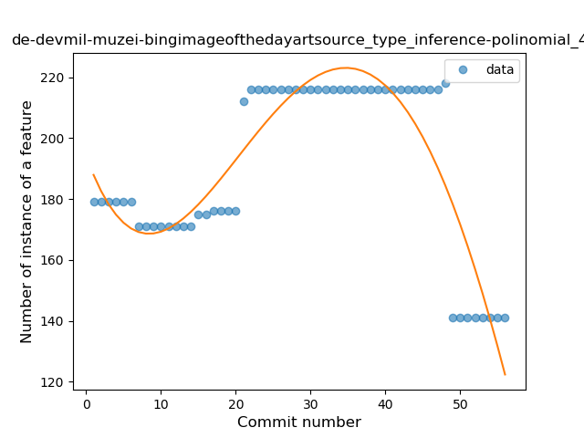
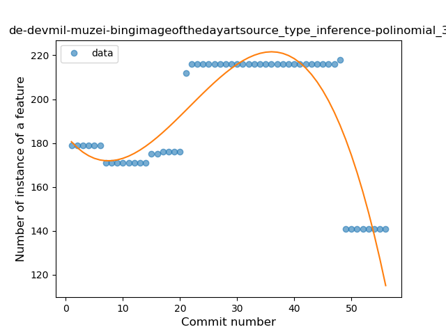
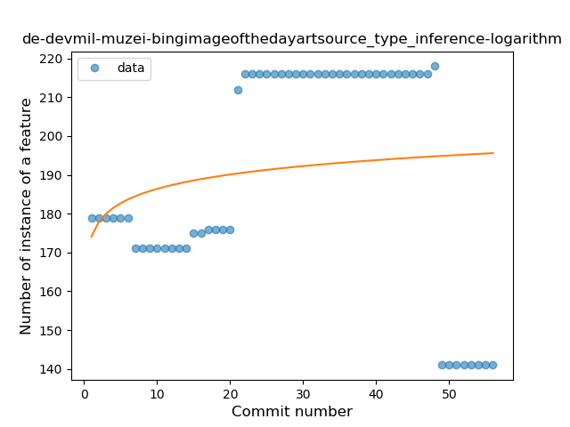
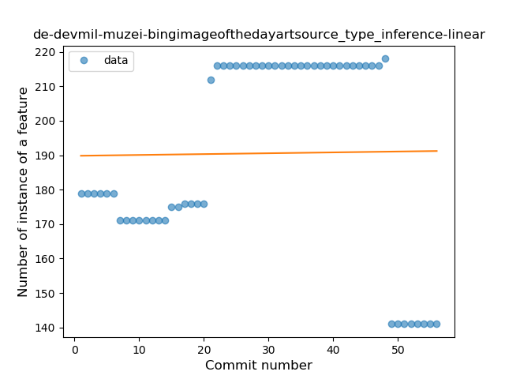
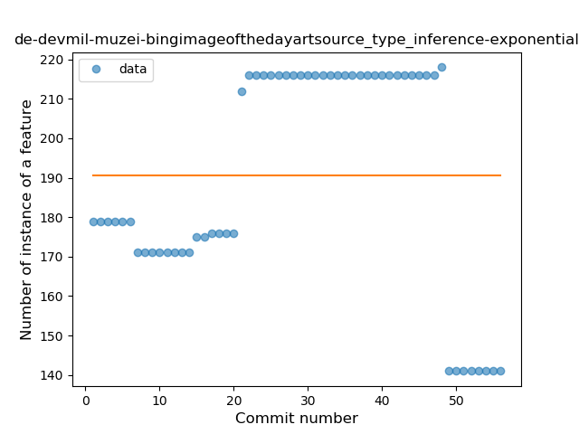
### <a name="lambda">Lambda</a>
----
#### Functions
* **Instability - Polinomial 3:** )
    * **R_Squared:** 0.81713505
* **Sudden Rise Plateau - Logarithm:** 
    * **R_Squared:** 0.48297858
* **Constant Rise - Linear:** 
    * **R_Squared:** 0.4201808

**Plots** :chart_with_upwards_trend:
-----

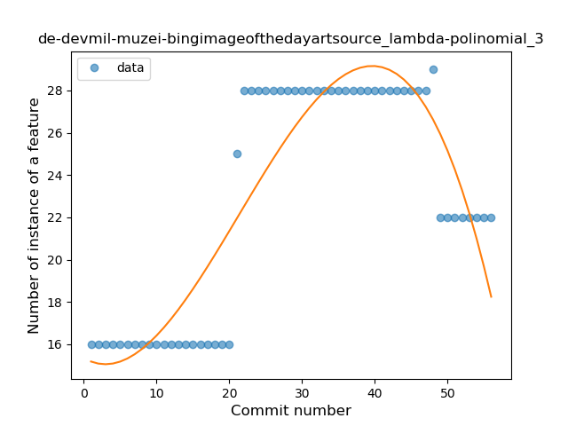
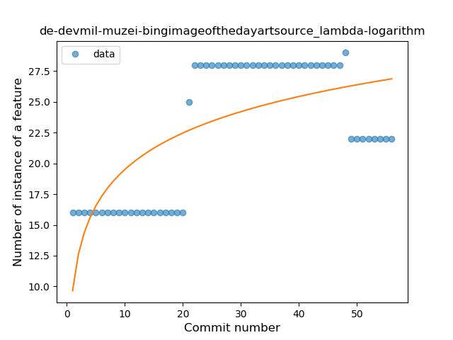
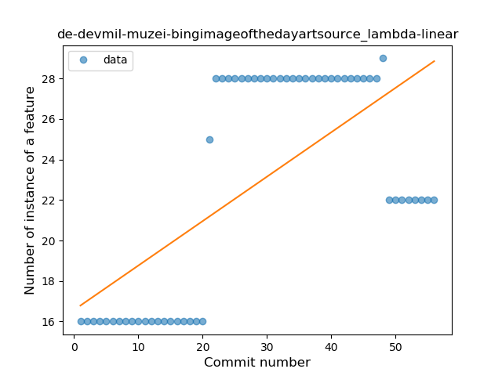
### <a name="safe_call">Safe Call</a>
----
#### Functions
* **Instability - Polinomial 3:** )
    * **R_Squared:** 0.79629849
* **Constant Rise - Linear:** 
    * **R_Squared:** 0.72979039
* **Sudden Rise Plateau - Logarithm:** 
    * **R_Squared:** 0.47967983

**Plots** :chart_with_upwards_trend:
-----

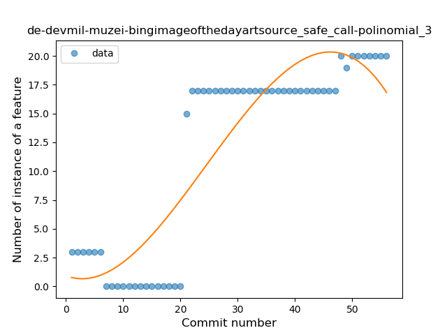
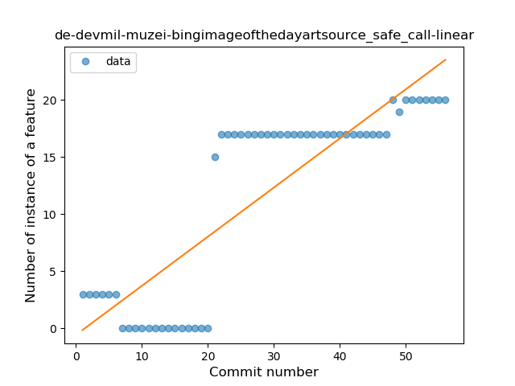
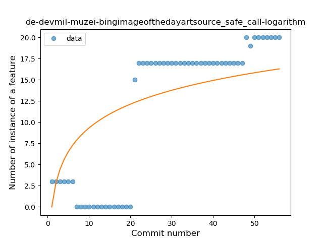
### <a name="unsafe_call">Unsafe Call</a>
----
#### Functions
* **Instability - Polinomial 3:** )
    * **R_Squared:** 0.80824608
* **Constant Decline - Linear:** 
    * **R_Squared:** 0.26343171
* **Sudden Rise Plateau - Logarithm:** 
    * **R_Squared:** -0.0

**Plots** :chart_with_upwards_trend:
-----

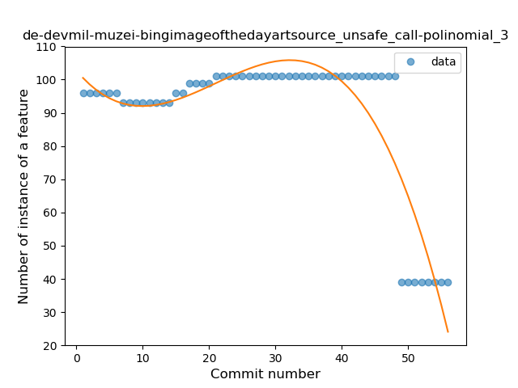
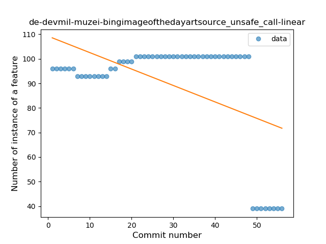
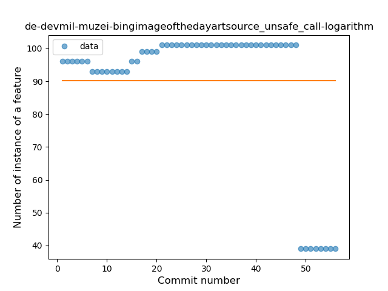
### <a name="companion_object">Companion Object</a>
----
#### Functions
* **Instability - Polinomial 3:** )
    * **R_Squared:** 0.77621305
* **Sudden Rise Plateau - Logarithm:** 
    * **R_Squared:** 0.03919814
* **Constant Rise - Linear:** 
    * **R_Squared:** 0.00487484

**Plots** :chart_with_upwards_trend:
-----

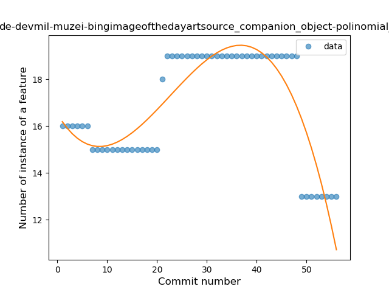
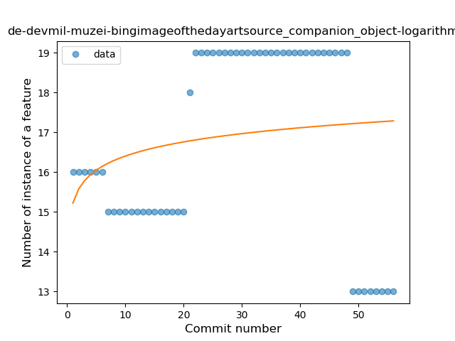
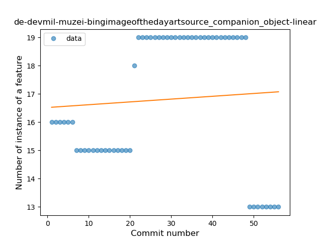
### <a name="string_template">String Template</a>
----
#### Functions
* **Plateau Gradual Rise - Sigmoid:** 
    * **R_Squared:** 0.98460545
* **Sudden Rise Plateau - Logarithm:** 
    * **R_Squared:** 0.68568005
* **Constant Rise - Linear:** 
    * **R_Squared:** 0.62470207

**Plots** :chart_with_upwards_trend:
-----

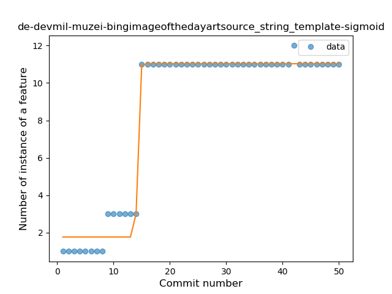
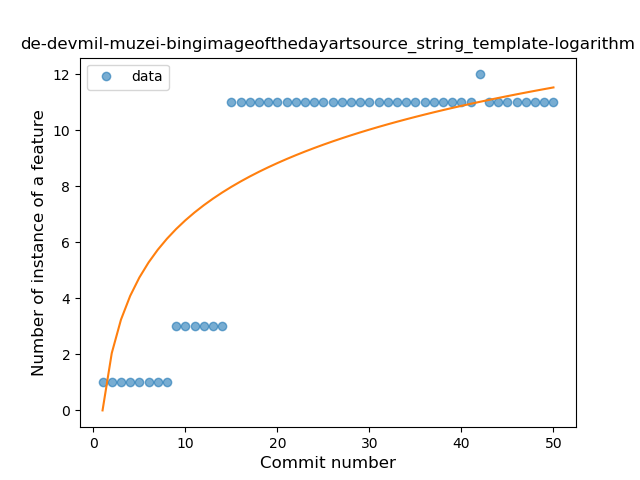
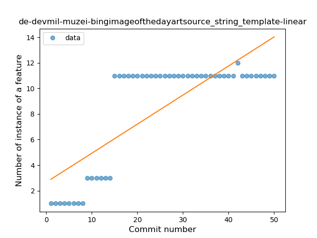
### <a name="singleton">Singleton</a>
----
#### Functions
* **Plateau Sudden Decline - Binary Sigmoid:** 
    * **R_Squared:** 1.0
* **Constant Decline - Linear:** 
    * **R_Squared:** 0.36746411
* **Sudden Rise Plateau - Logarithm:** 
    * **R_Squared:** 0.0

**Plots** :chart_with_upwards_trend:
-----

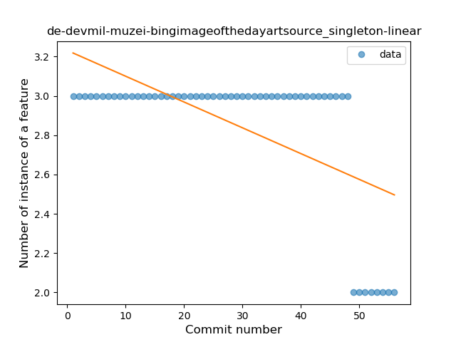
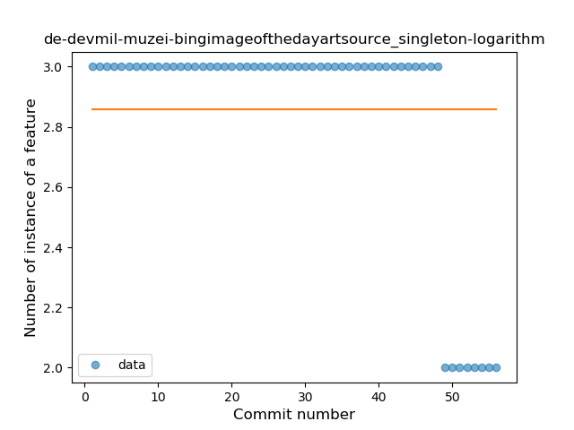
### <a name="range_expr">Range Expression</a>
----
#### Functions
* **Plateau Sudden Decline - Binary Sigmoid:** 
    * **R_Squared:** 1.0
* **Constant Decline - Linear:** 
    * **R_Squared:** 0.36746411
* **Sudden Rise Plateau - Logarithm:** 
    * **R_Squared:** -0.0

**Plots** :chart_with_upwards_trend:
-----

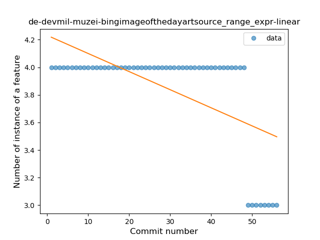
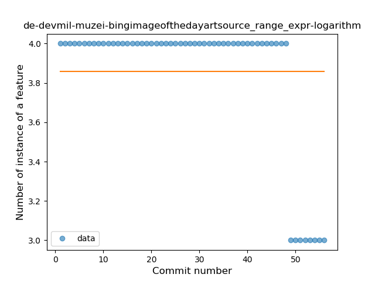
