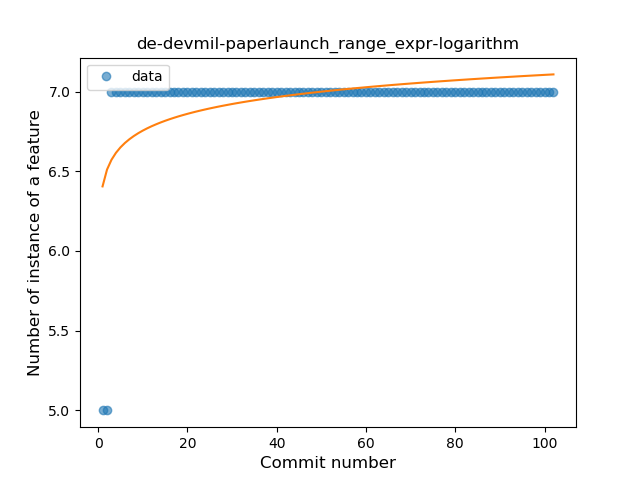

## de-devmil-paperlaunch
----
#### Metrics provided by Detekt
* Number of lines of code 7711
* Number of Kotlin files: 69
* Cyclomatic complexity: 863
* Cyclomatic complexity by thousands of lines: 210 

----
**9** features analyzed

*	<a href="#type_inference">Type Inference</a> 
*	<a href="#lambda">Lambda</a> 
*	<a href="#safe_call">Safe Call</a> 
*	<a href="#when_expr">When expression</a> 
*	<a href="#unsafe_call">Unsafe Call</a> 
*	<a href="#companion_object">Companion Object</a> 
*	<a href="#singleton">Singleton</a> 
*	<a href="#range_expr">Range Expression</a> 
*	<a href="#smart_cast">Smart Cast</a> 

### <a name="type_inference">Type Inference</a>
----
#### Functions
* **Sudden Rise Plateau - Logarithm:** 
    * **R_Squared:** 0.89594467
* **Constant Rise - Linear:** 
    * **R_Squared:** 0.88163389

**Plots** :chart_with_upwards_trend:
-----

### <a name="lambda">Lambda</a>
----
#### Functions
* **Instability - Polinomial 3:** )
    * **R_Squared:** 0.95398659
* **Constant Rise - Linear:** 
    * **R_Squared:** 0.88912426
* **Sudden Rise Plateau - Logarithm:** 
    * **R_Squared:** 0.7280552

**Plots** :chart_with_upwards_trend:
-----

### <a name="safe_call">Safe Call</a>
----
#### Functions
* **Instability - Polinomial 3:** )
    * **R_Squared:** 0.95411579
* **Constant Rise - Linear:** 
    * **R_Squared:** 0.87326205
* **Plateau Gradual Rise - Sigmoid:** 
    * **R_Squared:** 0.71631404
* **Sudden Rise Plateau - Logarithm:** 
    * **R_Squared:** 0.43026546

**Plots** :chart_with_upwards_trend:
-----

### <a name="when_expr">When expression</a>
----
#### Functions
* **Plateau Gradual Rise - Sigmoid:** 
    * **R_Squared:** 0.8252929
* **Sudden Rise Plateau - Logarithm:** 
    * **R_Squared:** 0.76484762
* **Constant Rise - Linear:** 
    * **R_Squared:** 0.53556858

**Plots** :chart_with_upwards_trend:
-----

### <a name="unsafe_call">Unsafe Call</a>
----
#### Functions
* **Instability - Polinomial 3:** )
    * **R_Squared:** 0.91317769
* **Constant Decline - Linear:** 
    * **R_Squared:** 0.78914745
* **Sudden Rise - Exponential:** 
    * **R_Squared:** -0.0
* **Sudden Rise Plateau - Logarithm:** 
    * **R_Squared:** 0.0

**Plots** :chart_with_upwards_trend:
-----

### <a name="companion_object">Companion Object</a>
----
#### Functions
* **Sudden Rise Plateau - Logarithm:** 
    * **R_Squared:** 0.64521201
* **Constant Rise - Linear:** 
    * **R_Squared:** 0.50635595

**Plots** :chart_with_upwards_trend:
-----

### <a name="singleton">Singleton</a>
----
#### Functions
* **Constant Rise - Linear:** 
    * **R_Squared:** 0.82349968
* **Sudden Rise Plateau - Logarithm:** 
    * **R_Squared:** 0.74223907
* **Plateau Sudden Rise - Binary Sigmoid:** 
    * **R_Squared:** 0.26556016

**Plots** :chart_with_upwards_trend:
-----

### <a name="range_expr">Range Expression</a>
----
#### Functions
* **Plateau Sudden Rise - Binary Sigmoid:** 
    * **R_Squared:** 1.0
* **Sudden Rise Plateau - Logarithm:** 
    * **R_Squared:** 0.25644255
* **Constant Rise - Linear:** 
    * **R_Squared:** 0.05767567

**Plots** :chart_with_upwards_trend:
-----

### <a name="smart_cast">Smart Cast</a>
----
#### Functions
* **Plateau Sudden Rise - Binary Sigmoid:** 
    * **R_Squared:** 0.92093211
* **Sudden Rise Plateau - Logarithm:** 
    * **R_Squared:** 0.35602999
* **Constant Rise - Linear:** 
    * **R_Squared:** 0.10350208

**Plots** :chart_with_upwards_trend:
-----

